# Chapter 02. 변수

## 변수(variable)

---

**변수**란?

단 하나의 값을 저장할 수 있는 메모리 공간

```java
int age;
[변수타입] [변수이름];
```

**변수 타입과 변수 이름**

변수 타입은 변수에 저장될 값의 타입을 말한다

변수 이름은 말 그대로 변수에게 이름을 붙인 것인데,
변수는 값을 저장할 수 있는 메모리 공간이라 했으니 '변수이름'이라고 하면 메모리 공간에 이름을 붙여준 것이라고 할 수 있다

**'변수를 선언하다'**

**변수를 선언한다는 것**은,
메모리에 '변수타입'에 따라 알맞은 크기의 저장공간을 확보하여 앞으로 그 공간을 '변수이름'을 통해 사용하겠다는 것이다

**변수의 초기화**

변수의 초기화란? 변수를 사용하기 전에 **제일 처음 값을 저장하는 것**

선언한 변수를 사용하려면, 사용하기 전에 반드시 초기화해줘야 한다

초기화를 안하면 컴파일 에러 : '*Variable 'a' might not have been initialized'*

```java
@Test
void test() {
    int a;
}
```

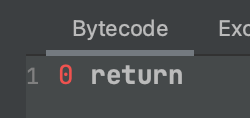

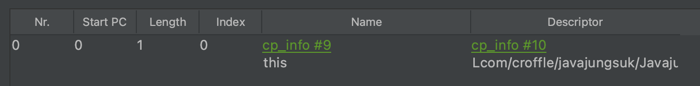

```java
@Test
void test() {
    int a = 777;
}
```

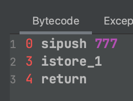

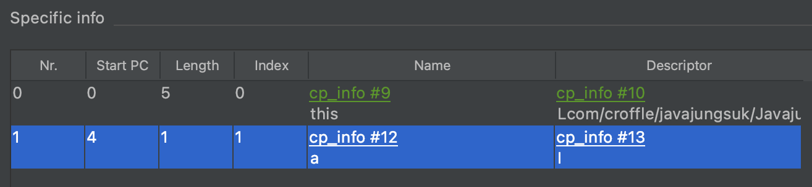

😲 *왜 반드시 초기화해줘야 하나요?*

메모리는 여러 프로그램이 공유하는 자원이다
(우리가 작성한 자바 프로그램도 쓰고, 다른 프로그램도 쓰고, 운영체제도 쓴다)

그렇기 때문에 이전에 다른 프로그램에 의해  쓰레기값이 저장되어있을 수도 있다

따라서, 사용 전에 반드시 초기화해줘야 한다

🤨 *변수 초기화 안해줘도 되던데?*

변수의 종류

- 클래스 변수
- 인스턴스 변수
- 지역변수

클래스/인스턴스 변수일 경우 자동 초기화

각 변수들은 저장공간에 차이가 있다

**Runtime Data Areas**

jvm이 프로그램을 수행하기 위해 os로부터 할당받는 메모리 공간

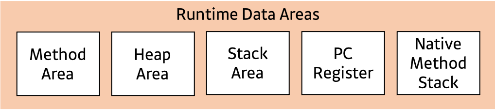

*Method Area* : 클래스 정보, 변수 정보, 메소드 정보, static 변수, 상수 정보 (모든 스레드가 공유)

이 영역의 데이터는 프로그램 시작~ 종료 시까지 메모리에 상주한다
장점 : 즉 프로그램이 종료될때까지 어디서든 사용 가능
단점 : 무분별하게 많이 사용하다 보면 메모리가 부족

- 클래스 정보
- 변수 정보 : 멤버변수 이름, 데이터 타입, 접근 제어자 등의 정보
- 메소드 정보 : 메서드 이름, 리턴타입, 매개변수, 접근제어자 등의 정보
- static 변수 : 모든 객체가 공유 할 수 있고, 객체 생성없이 접근 가능
- 상수 풀

    특정 클래스의 코드를 실행하는 데 필요한 상수가 포함되어 있다
    (컴파일러에 의해 생성됨)

    상수 풀에는 코드에서 참조하는 변수, 메서드, 인터페이스 및 클래스의 이름이다

    JVM은 이러한 코드를 사용하여 종속된 다른 클래스와 코드를 연결한다

    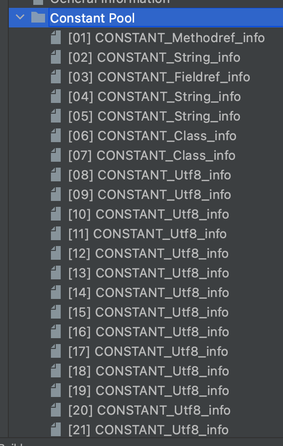

*Heap Area* : new로 생성된 인스턴스/객체가 저장됨. GC 이슈는 이 영역에서 일어남 (모든 스레드가 공유)

런타임에 동적으로 할당하여 사용하는 영역

이 영역에 생성된 객체와 배열은 스택 영역의 변수나 다른 객체의 필드에서 참조한다

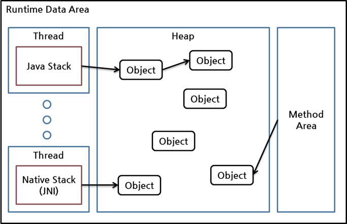

참조하는 변수나 필드가 없다면 의미 없는 객체가 되어 GC의 대상이 된다

*Stack Area* : 메소드 내에서 사용되는 값들이 저장됨. 매개변수/지역변수/리턴값

JVM은 스레드 생성 시 별도의 스택을 만든다
스택에 저장된 데이터는 해당 스레드에 사용할 수 있으며 나머지 스레드는 사용할 수 없다
따라서 local thread-safe하다고 말할 수 있다

또한 메소드가 호출될 때마다 각 프레임이 생성되고, 완료되면 지워진다 (프레임을 pop & push)

모든 메서드 호출을 완료하면 스택이 비어 JVM에 의해 제거된다

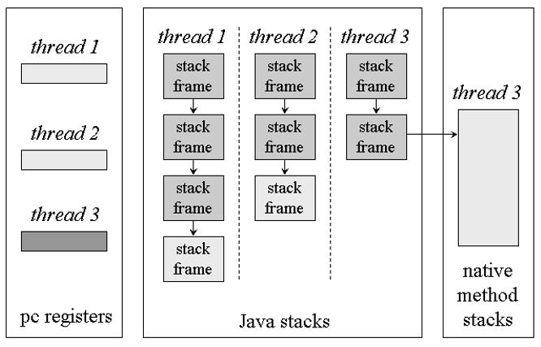

각 스택 프레임은 기본적으로 local variable array, operand stack, frame data 세 부분으로 구성된다

JVM은 메서드를 호출할 때 먼저 클래스 데이터를 확인해서 local variable array 및 operand stack에 필요한 크기를 결정하고,
호출된 메서드에 적합한 크기의 스택 프레임을 만들어서 스택에 푸시한다

local variable array

zero-based array
(배열의 각 슬롯은 4바이트 - long, double은 2개 슬롯을 차지함)

메소드의 모든 파라미터와 로컬 변수가 포함된다

매개 변수는 선언된 순서대로 먼저 local variable array에 배치된다

인스턴스 메소드의 경우, 첫 번째 인덱스에 this가 들어간다
(static 메소드의 경우는 바로 매개변수부터 시작)

operand stack

JVM은 operand stack을 작업 공간으로 사용한다 (중간 계산 결과를 저장한다고 할 수 있음)

operand stack은 local variable array와 비슷하게 배열로 구성된다
하지만 local variable array와 다르게, 인덱스를 사용하여 액세스하는 것이 아니라 operand stack에 값을 push하고 pop하는 방식으로 액세스한다

(예시)

```cpp
iload_0   // operand stack에 local variable array의 0번 값을 푸시한다
iload_1   // operand stack에 local variable array의 1번 값을 푸시한다
isub      // 두 개의 int를 꺼내서 substract하고 다시 operand stack에 푸시한다
istore_2  // 결과값을 pop해서 local variable array의 2번에 저장한다
```

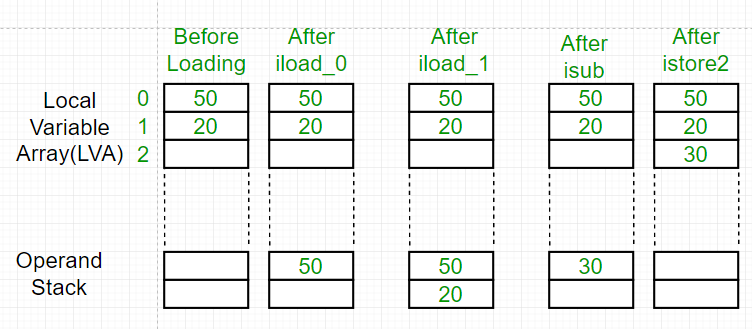

frame data

상수풀, 이전 스택 프레임에 대한 정보, 현재 메소드가 속한 클래스/객체에 대한 참조 등의 정보를 갖는다

*PC Register* : 현재 수행중인 JVM 명령의 주소값이 저장됨 (각 스레드별로 하나씩)

*Native Method Stack* : 다른 언어의 메소드 호출을 위해 할당되는 구역 (언어에 맞게 스택이 형성)

🧐 *왜 변수에 따라 초기화 지원이 달라질까?* **(오피셜 아님 주의)**

자바는 컴파일 단계에서 오류를 최대한 잡아내겠다는 정적 타이핑 언어

지역 변수의 경우 데이터의 흐름이 명확하다
스택에 올라가고 별도의 영역을 지니기 때문에 컴파일 시에 변수의 선언-흐름을 명확하게 알 수 있다

하지만 자바가 절차적인 프로그래밍이 아닌 객체지향 프로그래밍 언어인 이상, 클래스/인스턴스 변수의 데이터 흐름에 대한 검증이 매우 어렵다
또한 객체를 통해 값이 할당/사용되기 때문에 그 범위가 넓다

**초기화 생략**

변수의 종류에 따라 변수의 초기화를 생략할 수 있다

(클래스/인스턴스 변수)

**변수의 이름 규칙 (필수)**

- 대소문자가 구분된다
- 길이에 제한 없다
- 예약어를 못 쓴다
- 숫자로 시작 못한다
- '_' '&' 외의 특수문자 못 쓴다

예약어?
프로그래밍언어의 구문에 사용되는 단어
예약어는 클래스나 변수, 메소드 이름으로 사용할 수 없다

**변수의 이름 규칙 (권장)**

- 클래스명의 첫 글자는 대문자
- 여러 단어로 이루어졌다? 단어의 첫 글자를 대문자로
- 상수는 모두 대문자 (여러 단어로 이루어졌다? → '_'로 구분)

## 변수의 타입

---

**값**

- 문자 : 'A', '1', "ABC"
- 숫자
    - 정수 123,0, -100
    - 실수 3.14 -3.0 x 10^6

**자료형**

값의 종류에 따라 값이 저장될 공간의 크기와 저장 형식을 정의한 것

자료형의 두 종류

- 기본형
- 참조형

**기본형  (primitive type)**

계산을 위한 실제 값을 저장한다

종류 : 논리형, 문자형, 정수형, 실수형

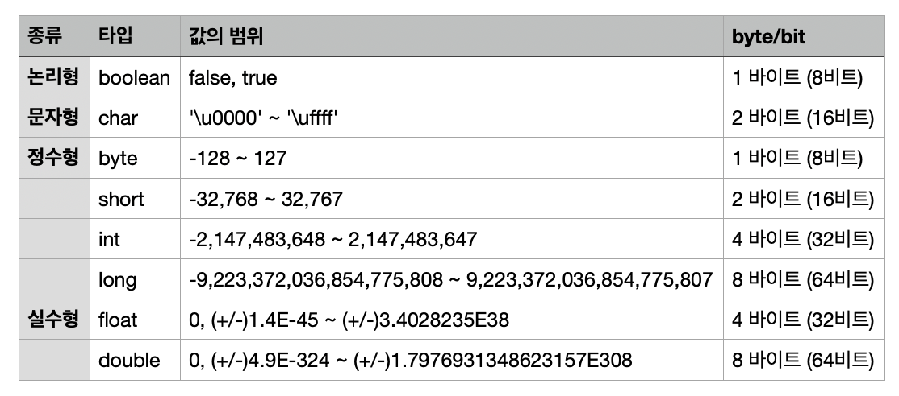

논리형

boolean밖에 없다

true/false

boolean은 다른 기본형과의 연산이 불가능하다
boolean을 제외한 나머지 기본형은 서로 연산과 변환이 가능하다

문자형

char 밖에 없다

문자형 char는 문자를 내부적으로 정수(유니코드)로 저장한다
따라서, 정수형과 별반 다르지 않다

정수형

byte, short, int, long 이렇게 네 가지 타입이 있다

타입마다 값의 범위가 다르므로 저장할 값의 범위에 맞는 타입을 선택해야 한다

일반적으로 int를 많이 사용한다

🤔 *왜 Int를 많이 사용하나요?*

CPU가 가장 효율적으로 처리할 수 있는 타입이기 때문

cpu가 int를 가장 효율적으로 처리하는 이유

JVM의 operand stack은 피연산자를 4byte단위로 저장한다

따라서 int자료형을 사용하면 바로 연산을 수행하지만, 4byte보다 작은 자료형이 오게되면 연산을 위해 4byte로 변환해서 연산을 수행한다

실수형

float, double 이렇게 두 가지 타입이 있다

실수형은 정수형과 저장형식이 다르다
같은 크기라도 훨씬 큰 값을 표현할 수 있지만, **오차가 발생할 수 있다**

따라서 '**정밀도**'가 중요하다 

float의 정밀도는 7, double은 15로 각각 7자리수, 15자리수를 오차없이 저장할 수 있다

**상수**

변수와 달리 한번 값을 저장하면 다른 값으로 변환할 수 없다

사용방법 : 키워드 final을 붙인다

```java
final int MAX_SPEED = 10;
```

~~상수는 반드시 선언과 동시에 초기화해야 한다~~

```java
final int MAX_SPEED;         ~~// 에러. 상수는 선언과 동시에 초기화해야 함~~
final int MAX_VALUE = 100;   // OK. 선언과 동시에 초기화했음
```

final 변수의 초기화는 변수 종류에 따라 초기화를 동시에 해주지 않아도 된다

변수 종류와 final 변수 초기화

**지역 변수**


**인스턴스 변수**


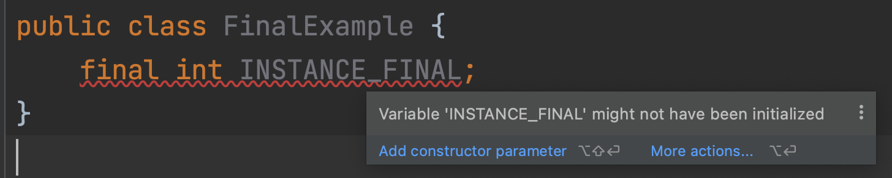

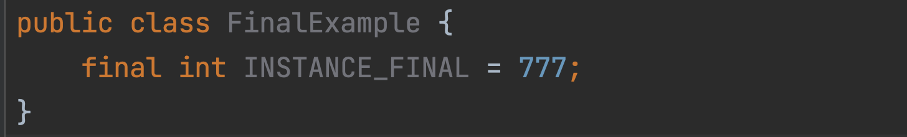

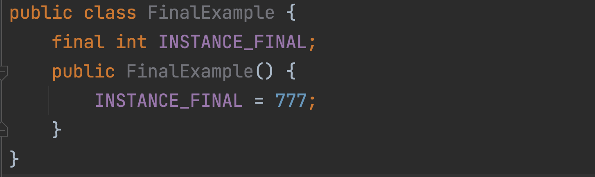

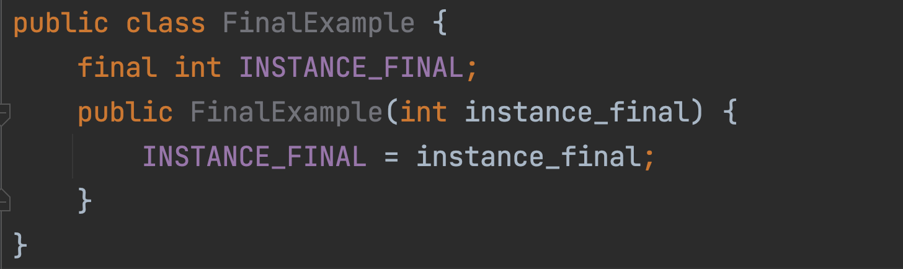

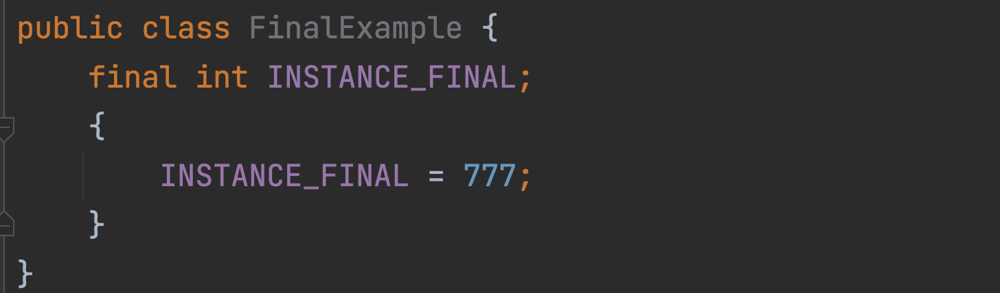

**클래스 변수**

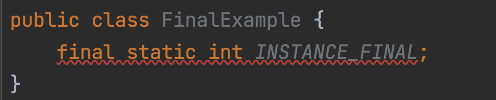

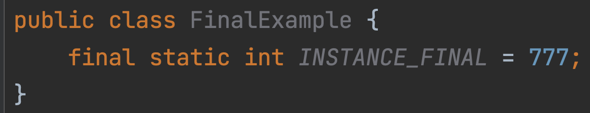

**리터럴**

값 (예시 : 12, 123, 3.14, 'A')

사실, 따지고 보면 '상수'라는 개념에 더 들어맞는 건 '리터럴'이다
(그런데 이미 '상수'라는 정의를 *'값을 한 번 저장하면 변경할 수 없는 저장공간'*으로 정의했기 때문에 다른 이름으로 부를 수밖에 없었다)

**리터럴에도 타입이 있다**

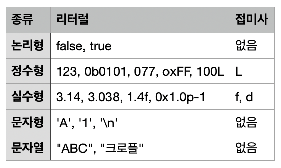

```java
boolean boo = true;
char ch = 'W';

byte by = 1;    // short와 byte는 별도의 리터럴이 존재하지 않음. int 리터럴 사용
short sh = 2;
int i = 3;
long l = 4L;

float fl = 3.14f;
double db = 5.18;

String leaf = "리프";
```

**리터럴 : 타입의 불일치**

타입이 달라도 저장을 허용한다! → **단, 저장범위가 넓은 타입에 대입할 때만**

```java
long l = 2021;      // int 리터럴이지만 long에 대입이 가능하다
double pi = 3.14f;  // float 리터럴이지만 double에 대입이 가능하다
```

```java
int i = 2021L;    // 에러. long 리터럴을 int에 대입이 불가하다
float pi = 3.14;  // 에러. double 리터럴을 float에 대입이 불가하다
```

리터럴의 값이 변수의 타입의 범위를 넘어서면 컴파일 에러가 발생한다

```java
short s = 30000;  // 가능. int 리터럴이지만 범위 내에 있기 때문에 short에 대입이 가능
short s2 = 40000; // 에러. short의 범위를 넘기 때문에 대입 불가
```

컴파일러의 리터럴 계산

```java
float fl = 3.14f;
double db = 3.14f;
double db2 = 3.14;
```

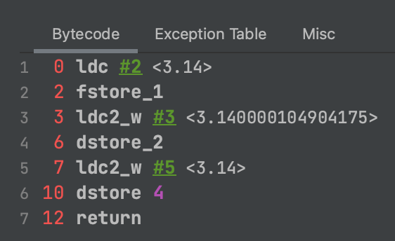

```java
int c = (int) 77L;
```

바이트 코드를 보면

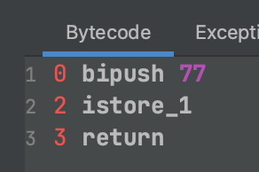

→ L을 붙였지만 int로 계산해줬다

만약 77L을 변수로 빼면?

```java
long l = 77L;
int c = (int) l;
```

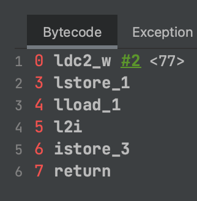

**변수 VS 상수 VS 리터럴**

변수 : 하나의 값을 저장하기 위한 공간

상수 : 하나의 값을 한번만 저장할 수 있는 공간

리터럴 : 값 (그 자체)

**참조형 (reference type)**

실제 값이 저장되어있는 메모리 주소를 값으로 갖는다

초기화하지 않으면 기본값은 null이다

따라서 참조변수는 null 또는 객체의 주소를 값으로 갖는다

**참조형의 종류**

기본형의 8가지 종류를 제외한 모든 것이 참조형이다

**참조변수 선언**

```java
클래스이름 변수이름;
```

**객체 생성**

```java
new 클래스이름(...);
```

new : 객체를 생성하는 연산자. new의 결과는 생성된 객체의 주소다

**저장 위치**

실제 객체는 힙 메모리에 저장되고, 그 힙 메모리의 주소를 값으로 갖는다

객체를 사용할 때마다 참조 변수에 저장된 객체의 주소로 접근한다

**GC**

스택 영역에 생성되는 변수는 메소드가 종료되면 바로 제거되지만, 힙 영역은 그렇지 않다

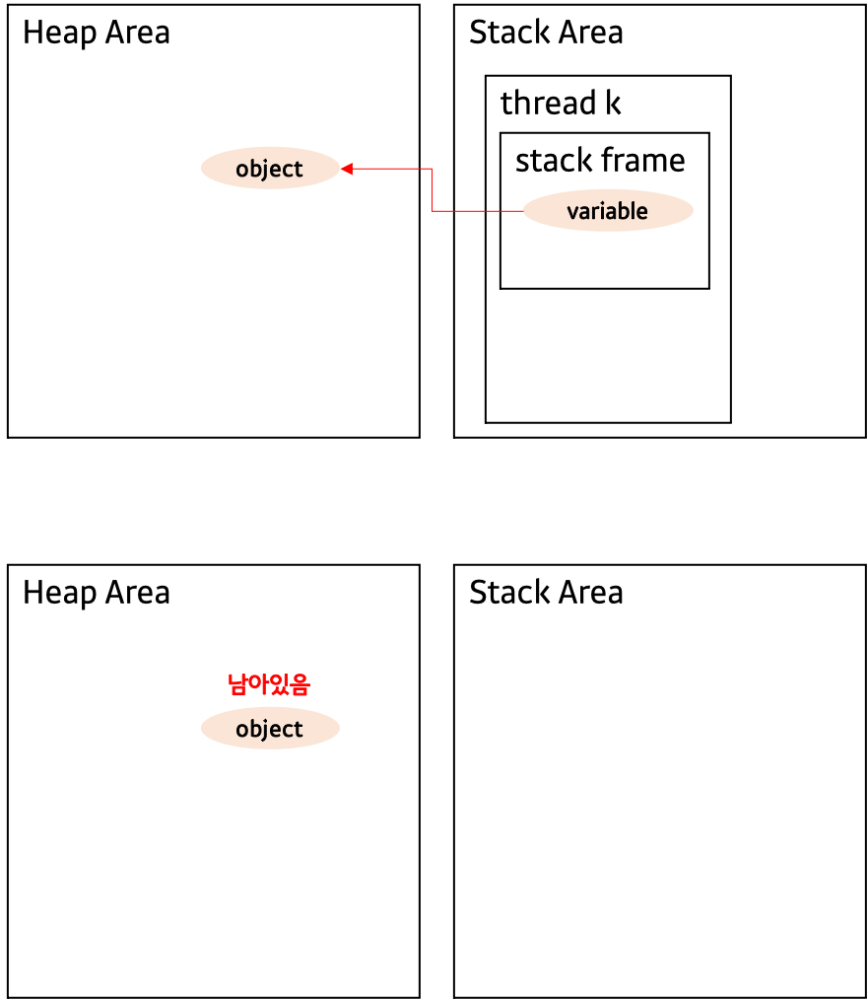

오직 gc에 의해서만 제거된다
우리 개발자가 직접 메모리를 해제하는 방법은 절대 없다!

gc : 메모리를 재사용하기 위해, 참조되지 않는 오브젝트를 제거해 가용 공간을 만드는 작업

# 진법

---

**컴퓨터는 0과 1밖에 모르는 바보 ㅠ ㅠ!**

전기가 흐르면 1, 흐르지 않으면 0 → 2진 체계!

따라서, 컴퓨터는 어떤 값이든 2진수로 바꾸어서 저장된다

```java
int age = 25;
```

25(10진법) → 11001(2진법)

따라서 00000000000000000000000000011001 이 저장된다 (int니까 4바이트=32비트)

**비트와 바이트**

1비트

컴퓨터가 값을 저장할 수 있는 최소단위

한 자리의 2진수

⇒ 따라서 n비트로 2^n개의 값을 표현할 수 있다

1바이트

8비트

데이터의 기본 단위

**10진수 → n진수**

10진수를 n진수로 변환하려면 타겟 값을 n으로 나누고 더이상 나눌 수 없을 때까지  나머지 값을 계속 적어나가면 계산이 가능하다

예시) 46을 2진수로 바꿔보자

2 / 46 = 23 ... **0**
2 / 23 = 11 ... **1**
2 / 11 = 5 ... **1**
2 / 5 = 2 ... **1**
2 / 2 = 1 ... **0**
2 / 1 = 0 ... **1**

⇒ 즉, 101110

**n진수 → 10진수**

각 자리 수에 n^{자리단위}를 곱해서 모두 더한다

예시) 101110을 10진수로 바꿔보자

1*(2^5) + 0*(2^4) + 1*(2^3) + 1*(2^2) + 1*(2^1) + 0*(2^0)
= 1*32 + 0*16 + 1*8 + 1*4 + 1*2 + 0*1
= 32 + 0 + 8 + 4 + 2 + 0
= 46

**10진 소수점수 → n진 소수점수**

10진 소수점수에 소수부가 0이 될 때까지 n을 계속 곱하여 모든 결과값들의 정수부만 합친다

예시) 0.625를 2진 소수점수로 바꿔보자

0.625 * 2 = 1.25
0.25 * 2 = 0.5
0.5 * 2 = 1.0

⇒ 즉, 0.101

n**진 소수점수 → 10진 소수점수**

각 자리수에 n^{자리단위}를 곱해서 모두 더한다

예시) 0.101를 10진 소수점수로 바꿔보자

1*(2^-1) + 0*(2^-2) + 1*(2^-3)
= 1*0.5 + 0*0.25 + 1*0.125
= 0.625

**음수 표현하기**

컴퓨터는 0과 1밖에 모른다고 했다

그렇다면 과연 음수를 어떻게 표현할까? → 첫 번째 비트에 부호를 표시한다


0000 → 0
0001 → 1
0010 → 2
0011 → 3
0100 → 4
0101 → 5
0110 → 6
0111 → 7

부호를 첫 번째 비트에 표시해보면

1000 → -0
1001 → -1
1010 → -2
1011 → -3
1100 → -4
1101 → -5
1110 → -6
1111 → -7

**⇒ X**

위와 같이 간단한 걸 기대했지만 실제로는 그렇지 않다

위와 같은 표기에는 2가지 문제가 있는데

1. 절대값 사이인 두 수를 더했을 때 0이 되지 않는다
(-3 + 3은 0이지만, 0011과 1001을 더하면 1100로 -4가 된다)
2. 0이 두 개 존재한다

그래서 실제로는 **2의 보수법**을 사용한다

**2의 보수법**

2의 보수 관계에 있는 두 2진수로 절대값이 같고 부호가 다른 두 10진수를 표현한 것
2의 보수 관계? 두 2진수를 더하면 자리 올림이 발생하고 0이 된다

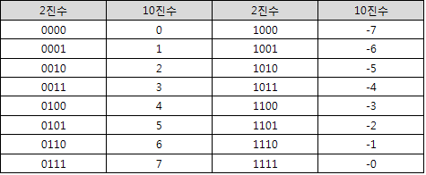

**2의 보수를 구해보자**

두 2진수를 더하면 자리 올림이 발생하고 0이 되는 수를 찾는다

0101 + ???? = (1)0000

???? = 1011

따라서 0101의 2의 보수이다

더 간단하게 구해보자

2의 보수는 1의 보수에 1을 더한 값이다

0101의 1의 보수 ⇒ 1010

1을 더한다 ⇒ 1011

🥲 *어차피 음수 안 쓸건데 양수 타입은 없나요?*

자바에 unsigned type이 없는 이유 **(오피셜 아님 주의)**

C 계열에서는 unsigned 라는 키워드를 사용해서 음수나 양수, 한쪽만 사용하게 될 경우 두 배 크기 영역까지 데이터 저장에 사용할 수 있다

하지만  JAVA 는 unsigned type을 지원하지 않아 그렇게 할 수가 없다.

왜 자바는 unsigned 타입을 지원하지 않는 걸까?

> *"C 개발자들에게 unsigned 에 대해 한번 물어보세요. unsigned 어떻게 되고, 연산이 어떻게 이루어지는지 제대로 이해하고 있는 개발자가 거의 없다는 걸 바로 알 수 있을 겁니다"* - 제임스 고슬링

공식적인 이유는 찾기가 어려우나, 적지 않은 개발자들이 signed 와 unsigned 연산으로 인한 다양한 버그에 시달렸다
(signed와 unsinged를 섞어 사용하면 버그가 발생하기 쉽다)

```cpp
{  
    int a1 = 0, a2 = -2;  
    unsigned int b = 1;  
    unsigned char c = 1;  
  
    cout << (a1-b) << endl;  // 예상 : -1, 실제 : 4294967295
    cout << (a2+b) << endl;  // 예상 : -1, 실제 : 4294967295
    cout << (a1-c) << endl;  // 예상 : -1, 실제 : -1
} 
```

따라서, 간결한 언어를 지양하는 자바에서는 signed, unsigned 로 구분해서 사용하는 방법을 아예 제외해 버린 걸로 추측된다.
(조금의 이득을 취하기위해 복잡해질 바에는..)

# 기본형 (primitive type)

---

**boolean**

둘중하나! true, false

default : false

두 가지 값만 표현하면 되기 때문에 실질적으로는 1bit만 필요하다
하지만 자바에서 데이터를 다루는 최소단위가 바이트기 때문에 boolean은 1바이트다

**char**

단 하나의 문자만 저장할 수 있다

사실은 정수(문자의 유니코드)가 저장된다
(왜냐면 컴퓨터는 숫자밖에 모르니까..)

문자 리터럴 대신에 유니코드로 직접 저장이 가능하다

```java
char ch = 'A';       // 문자 리터럴
char ch2 = 65;       // 문자 리터럴 대신 유니코드 직접 저장
char ch3 = '\t';     // 특수문자(탭)
char ch4 = '\\';     // 특수문자(역슬래시)
char ch5 = '\"';     // 특수문자(큰따옴표)
char ch6 = '\'';     // 특수문자(작은따옴표)
char ch7 = '\u0041'; // 특수문자(유니코드16진수)
```

**char의 값의 범위**

char는 2바이트로 16비트기 때문에 2진수로 표현하면 65536개의 값을 가질 수 있다

위에서 char는 사실상 정수가 저장된다고 했는데, 그럼 실제 값의 범위는 short처럼 -2^15 ~ 2^15-1일까?
→ **X!**

char는 음수를 나타낼 필요가 없기 때문에 0 ~ 2^16 -1 가 값의 범위가 된다
즉, short와 char는 데이터의 크기는 같지만, 들어가는 값의 범위는 다르다

**정수형**

종류 : byte, short, int, long

**정수형 타입 고르기**

*"byte, short보단 int를 쓰세요"*

😮 왜?

1. byte,short는 잘못된 결과를 얻기 쉽다

    byte와 short가 int보다 메모리를 더 적게 소비하지만, 너무 값이 작아 연산 시 값의 범위를 넘어 잘못된 결과를 얻기 쉽다

2. int가 연산 시에 더 효율적이다

    operand stack이 4byte단위로 저장하기 때문에

    크기가 4 byte보다 작은 자료형의 값을 계산할 대는 4byte로 변환해서 연산을 수행한다

    따라서 본래 4byte인 int가 더 효율적이다

**결론 : 기본적으로 int, int 범위를 넘어서는 수를 다뤄야 할 때는 long**

**오버플로우**

해당 타입이 표현할 수 있는 값의 범위를 넘어섬 (예 : 1111 + 0001 = 10000)

😫 그럼 에러가 발생하나요?

⇒ 아니. 다만 넘어선 값을 버려 ( 1111 + 0001 = 0000 )

**즉,** 에러는 발생하지 않으나 의도했던 값은 아니다

따라서, 오버플로우가 발생하지 않게 충분한 크기의 타입을 선택해야 한다

뺄셈의 경우에는 어떻게 될까?

0000 - 1 = ?

1이 하나 더 있었다고 가정하고 계산한다

(1)0000 - 1 = 1111

즉 정수형 타입은, 최대값에 1을 더하면 최소값이 되고, 최소값에 1을 빼면 최대값이 된다

최대값 + 1 ⇒ 최소값

최소값 - 1 ⇒ 최대값

**돌고 도네**

부호가 없는 경우

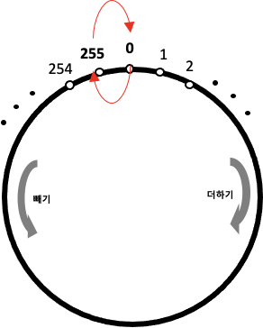

부호가 있는 경우

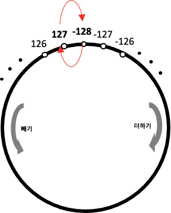

**실수형**

종류 : float, double

값의 범위

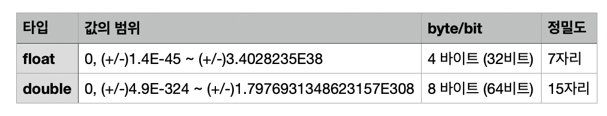

**저장 형식**

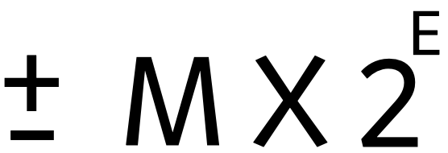
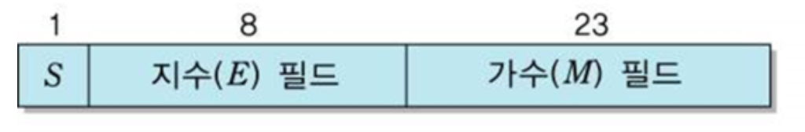

실수형은 부호, 지수, 가수 세 부분으로 이루어져 있다

1. 부호

    1bit이며, 정수형과 달리 2의 보수법을 사용하지 않기 때문에 실수의 부호를 싶다면 부호 비트만 바꿔주면 된다

2. 지수

    float의 경우 8bit, double의 경우 11bit이다

    부호있는 정수부이기 때문에 첫 번째 비트로 부호를 표현한다

    2^8개의 값을 저장할 수 있으므로 -128 ~ 127 이지만, 실수형의 경우 Non, Infinity를 표현하기 위해 실제로는 -126~127 이다

    실수형이 같은 크기임에도 불구하고 정수형보다 큰 범위의 값을 저장하는 것이 가능했던 이유가 바로 이것이다

3. 가수

    float의 경우 23bit, double의 경우 52bit다

    2진수의 23자리로는 10진수로 표현했을 때 약 7자리인데 이것이 바로 float의 정밀도가 7자리인 이유다

    double은 52자리로 10진수로 표현했을 때 약 15자리이다

실수형의 값의 범위를 보면 이처럼 표현이 가능한 범위가 떠있다


실수형은 얼마나 큰 값을 표현할 수 있는지도 중요하지만

얼마나 0에 가깝게 표현할수 있는가도 중요하다

**언더플로우**

실수형으로 표현할 수 없는 아주 작은 값이 되는 경우를 뜻한다

이 때, 값은 0이 된다

**오버플로우**

실수형에서 오버플로우가 발생하면 -> +-Infinity

**실수형의 오차**

실수형의 저장 형식으로 인해 같은 크기임에도 불구하고 정수형보다 더 큰 범위의 값을 저장할 수 있었다

하지만 반대로, 이러한 저장 형식으로 인해 오차가 발생한다는 특징이 있다                                              

오차가 발생하는 이유

1. 10진수로는 유한소수지만, 2진수로 변환하면 무한 소수가 되는 경우가 있다

    ⇒ 2진수로는 그 값을 정확하게 표현하지 못한다

2. 가수를 저장할 수 있는 자리수가 한정되어 있기 때문에 저장되지 못하고 버려지는 값들이 있다

    (정규화된 2진 실수는 float이면 23자리, double이면 52자리의 2진수만 저장할 수 있기 때문에 그 이후의 값들은 잘려나간다)

```java
float f = 9.1234567f;
double d = 9.1234567;
double d2 = 9.1234567890123456789012345678901234567890;

System.out.printf("f = %20.18f\n", f);
// f = 9.123456954956055000
// 실제 값과 오차가 있다 (하지만 7자리까지는 정확하다)

System.out.printf("d = %20.18f\n", d);
// d = 9.123456700000000000
// f와 대입한 값이 같음에도 정확하다

System.out.printf("d2 = %20.18f\n", d2);
// d2 = 9.123456789012346000
// 실제 값과 오차가 있다 (하지만 15자리까지는 정확하다)
```

정밀도를 고려하지 않고 사용했을 때의 문제점

```java
@Test
void test() {
    float a = 9.1234567f;
    assertEquals(a, 9.1234567);
}
```

**결과** : 테스트는 실패한다

```java
@Test
void test() {
		double a = 1.03;
		double b = 0.42;
		
		assertEquals(a, 1.03);      // 성공
		assertEquals(b, 0.42);      // 성공
		assertEquals(a - b, 0.61);  // 실패 0.6100000000000001
}
```

**결과** : 테스트는 실패한다 

이처럼 실수형은 오차가 발생할 가능성이 있기 때문에 '정밀도'에 집중해야 한다

**따라서, 정확한 값의 계산이 필요할 때는 실수형보다 정수형을 선택하는 것이 답일 수 있다**

**실수형 타입 고르기**

일반적으로 double을 많이 사용한다

이유는, 값의 범위가 넓기도 하지만 값을 더욱 정밀하게 표현할 수 있기 때문이다

# 형변환

---

**형변환**

서로 다른 타입간의 연산을 할 때, 연산을 수행하기 전에 타입을 일치시켜야만 하는데 이럴 때 형변환을 통해 타입을 일치시킬 수 있다

형변환(캐스팅) : 변수나 리터럴의 타입을 다른 타입으로 변환하는 것

**형변환 방법**

변수나 리터럴 앞에 변환하고자 하는 타입을 괄호와 함께 붙인다

```java
(타입) 피연산자
```

형변환 연산자는 그저 피연산자의 값을 읽어서 지정된 타입으로 형변환해서 결과를 반환할 뿐이다
⇒ 피연산자 변수 d는 형변환을 한다해도 아무런 변화가 없다

**정수형 사이의 형변환**

*작은 타입에서 → 큰 타입*

```java
byte b = 10;
int a = (int) b;
System.out.printf("a : %d, b : %d\n", a, b);
// a : 10, b : 10
```

*큰 타입에서 → 작은 타입*

값이 잘려나간다 (값 손실)

```java
int a = 10;
byte b = (byte) a;
System.out.printf("a : %d, b : %d\n", a, b);
// a : 10, b : 10

int a2 = 300;
byte b2 = (byte) a2;
System.out.printf("a2 : %d, b2 : %d\n", a2, b2);
// a2 : 300, **b2 : 44** **(값 손실)**
```

**실수형 사이에서 형변환**

*float → double*

지수는 float의 기저형인 127을 뺀 후 double의 기저인 1023을 더해서 변환하고,
가수는 float의 23자리를 채우고 남은 자리를 0으로 채운다

0 1000010 1111111111111111111111

0 10000000010 111111111111111111111100000000000000000000000000000

*double → float*

지수는 double의 기저인 1023을 뺀 후 float의 기저형인 127을 더해서 변환하고,
가수는 double의 52자리 중 23자리만 저장되는데 이 때 24번째 자리에서 반올림하며 24번째 자리 이후는 버려진다

0 10000000010 111111111111111111111010100110000110010001110001100

반올림 : 0 10000000010 111111111111111111111100000000000000000000000000000

0 10000000010 1111111111111111111111

형변환 시 float 타입의 범위를 넘어서면 +-Infinity 또는 0을 결과로 얻는다

```java
double d = 1.0e100;
float f = (float) d;
System.out.println(f);
// Infinity

double d2 = 1.0e-50;
float f2 = (float) d2;
System.out.println(f2);
// 0.0
```

**정수형과 실수형 사이의 형변환**

정수를 2진수로 변환한 다음 정규화를 거쳐 실수의 저장형식으로 저장된다

한가지 주의할 점 : 실수형의 정밀도의 제한으로 인한 오차가 발생할 수 있다

```cpp
int source = 912345678;
float toFloat = source;     // **9.1234566**E8
int result = (int) toFloat; // **912345664**
```

10진수로 8자리 이상의 값을 실수형으로 변환할 때는 float이 아닌 double로 형변환해야 오차를 방지할 수 있다

```cpp
int source = 912345678;
double toDouble = source; // 9.12345678E8
int result = (int) toDouble; // **912345678**
```

**실수형을 정수형으로 변환**

실수형의 소수점 이하 값은 버려진다 (반올림 발생하지 않음)

실수의 소수점을 버리고 남은 정수가 정수형의 저장범위를 넘는 경우에는, 오버플로우가 발생한다

**자동 형변환**

형변환을 하는 이유 : 서로 다른 두 타입을 일치시키기 위해서

편의상의 이유로 형변환을 생략할 수 있다
(그렇다고 진짜 생략되는 게 아니라 컴파일러가 형변환을 자동으로 추가해준다)

컴파일러의 자동형변환

```java
int i = 1234;
float f = i;
```

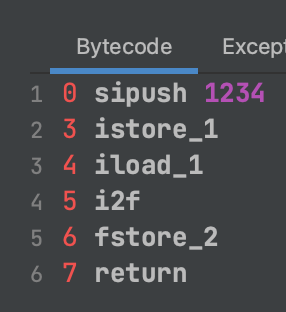

```java
float f = 1234;
```

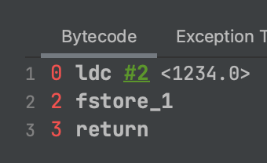

컴파일러는 어떤 판단 기준으로 타입을 일치시킬까?

> *기존의 값을 최대한 보존할 수 있는 타입으로 자동 형변환한다*

자동 형변환이 가능한 방향


반대 방향으로 변환은 반드시 형변환 연산자를 써줘야 한다

### 참고

- [https://lin-ing-link.tistory.com/117](https://lin-ing-link.tistory.com/117)
- [https://devlog-wjdrbs96.tistory.com/254](https://devlog-wjdrbs96.tistory.com/254)

지역변수와 클래스/인스턴스 변수.. 초기화 지원이 서로 다른 이유

- [https://www.slipp.net/questions/162](https://www.slipp.net/questions/162)

왜 Int를 써야 할까?

- [https://syundev.tistory.com/217](https://syundev.tistory.com/217)

Java Stack Area & local variable table

- [https://www.geeksforgeeks.org/java-virtual-machine-jvm-stack-area/](https://www.geeksforgeeks.org/java-virtual-machine-jvm-stack-area/)

상수풀

- [https://devlog-wjdrbs96.tistory.com/248](https://devlog-wjdrbs96.tistory.com/248)
- [https://www.baeldung.com/jvm-constant-pool](https://www.baeldung.com/jvm-constant-pool)

Runtime Data Areas

- [https://zoiworld.tistory.com/710](https://zoiworld.tistory.com/710)
- [https://inkim0927.tistory.com/100](https://inkim0927.tistory.com/100)