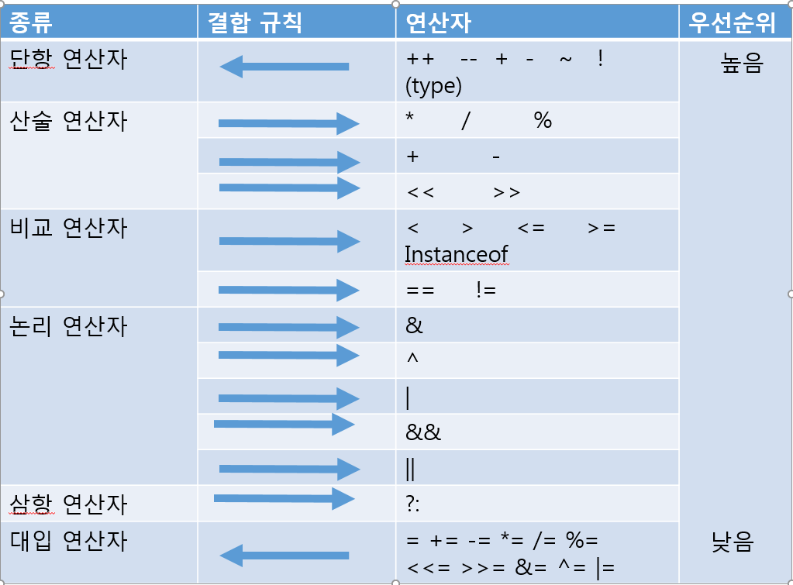
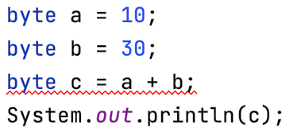
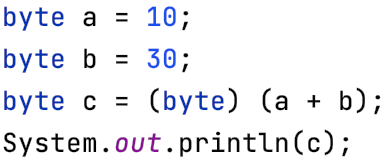
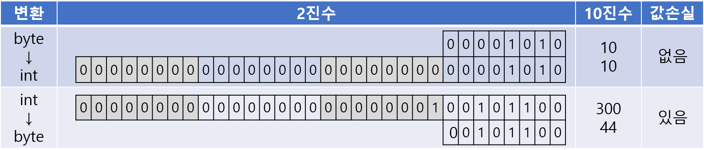
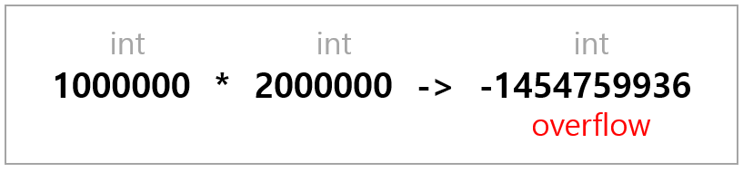
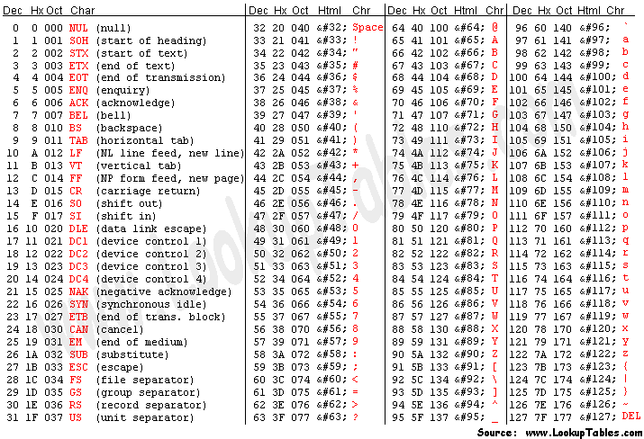
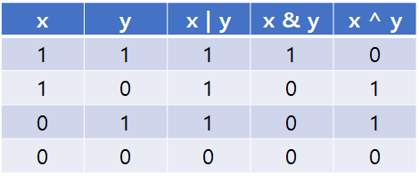
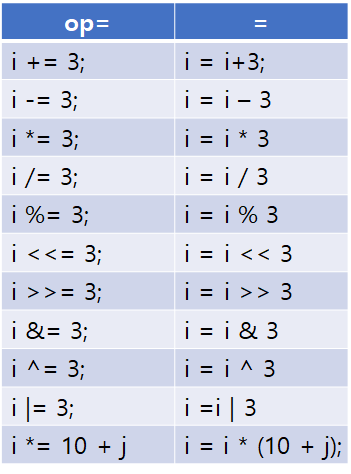

# Chapter 3. 연산자

## 1. 연산자

- 연산자: 연산을 수행하는 기호


### 1. 연산자와 피연산자

---

- 피연산자: 연산의 대상
- 연산자는 피연산자로 연산을 수행하고 나면 항상 결과값을 반환한다.

### 2. 식과 대입연산자

---

- 식: 연산자와 피연산자를 조합하여 계산하고자 하는 바를 표현한 것
- 식을 평가: 식을 계산하여 결과를 얻는 것

### 3. 연산자의 종류

---

- 산술 연산자: `+`, `-`, `*`, `/`, `%`, `<<`, `>>`
    - 사칙 연산(`+`, `-`, `*`, `/`)과 나머지 연산(`%`)
- 비교 연산자: `>`, `<`, `≥`, `≤`, `==`, `≠`
    - 크고 작음과 같고 다름을 비교
- 논리 연산자: `&&`, `||`, `!`, `&`, `|`, `^`, `~`
    - '그리고(AND)'와 '또는(OR)'으로 조건을 연결
- 대입 연산자: `=`
    - 우변의 값을 좌변에 저장
- 기타: `(type)`, `?:`, `instanceof`
    - 형변환 연산자, 삼항 연산자, instanceof 연산자

### 4. 연산자의 우선순위와 결합규칙

---

- 단항 연산자가 이항 연산자보다 우선순위가 높다.
    - ex> `-x + 3`
- `*`, `/`이 `+`, `-`보다 우선순위가 높다.
- 비교 연산자 보다 산술 연산자가 먼저 수행된다.
- 논리 연산자 보다 비교 연산자가 먼저 수행된다.
- 대입 연산자는 연산자 중에서 제일 우선순위가 낮다.
- 산술 연산자 중, `x << 2 + 1` 쉬프트 연산자는 덧셈 연산자보다 우선순위가 낮다.
- 비트 연산자는 비교 연산자 보다 우선순위가 낮으므로 비교연산 후에 비트 연산이 수행된다.
    - ex> `data & 0xFF == 0` → `data & (0xFF == 0)`
- 논리 연산자 중, AND(`&`, `&&`)가 OR(`|`, `||`)보다 우선순위가 높다.

- 연산자의 결합규칙: 하나의 식에 같은 우선순위의 연산자들이 여러 개 있는 경우

> 연산자의 우선순위

1. 산술 > 비교 > 논리 > 대입
2. 단항 > 이항 > 삼항
3. 단항 연산자와 대입 연산자를 제외한 모든 연산의 진행방향은 왼쪽에서 오른쪽

- 연산자의 우선순위와 결합규칙 표

    

### 5. 산술 변환(usual arithmetic conversion)

---

- (일반) 산술 변환: 연산 전에 피연산자 타입의 일치를 위해 자동 형변환되는 것
- 이항 연산에서만 아니라 단항 연산에서도 일어난다.

1. 두 피연산자의 타입을 같게 일치시킨다.(보다 큰 타입으로 일치)
    - ex> `float + int` → `float + float`
2. 피연산자의 타입이 int 보다 작은 타입이면 int 로 변환된다.
    - ex1> `byte + short` → `int + int`
    - ex2> `char + short` → `int + int`


## 2. 단항 연산자

### 1. 증감 연산자 ++ --

---

- 증감연산자: 피연산자에 저장된 값을 값이 참조되기 전/후에 1 증가 또는 감소시킨다.
- 식에 2번 이상 포함된 변수에 증감연산자를 사용하는 것은 피해야 한다.

### 2. 부호 연산자 + -

---

- 부호 연산자 `-`는 피연산자의 부호를 반대로 변경한 결과를 반환한다.
- boolean 형과 char 형을 제외한 기본형에만 사용할 수 있다.


## 3. 산술 연산자

### 1. 사칙 연산자 + - * /

---

- `*`, `/`, `%` 연산자가 `+`, `-` 연산자보다 우선순위가 높다.

- 자동 형변환 예제 코드
- 피연산자가 정수형인 경우 나누는 수로 0을 사용하면 에러가 발생한다.
- 피연산자가 int 형보다 작은 경우, 연산자는 피연산자들을 int 형으로 변환한 후 연산을 수행한다.

    

    

- 더 좁은 범위로 형변환을 하면 값의 손실이 발생할 수 있다.

    

    - int 형을 byte 형으로 변환하는경우 하위 8자리(1byte)만 보존하기에 그외에 값이 손실된다.
- 연산 전에 큰 자료형을 사용하여 오버플로우를 막아야 한다.

    ```java
    public static void main(String[] args) {
        int a = 1_000_000;
        int b = 2_000_000;

        long value = a * b;

        System.out.println(value);
    }
    ```

    - 실행 결과

        ```java
        -1454759936
        ```

    

    - 올바른 결과를 얻으려면 피연산자 중 하나를 long 으로 만들어야 한다.
- 같은 의미의 식이라도 연산의 순서에 따라 다른 결과를 얻을 수 있다.

    ```java
    public static void main(String[] args) {
        int a = 1000000;

        int result1 = a * a / a;
        int result2 = a / a * a;

        System.out.printf("%d * %d / %d = %d %n", a, a, a, result1);
        System.out.printf("%d / %d * %d = %d %n", a, a, a, result2);
    }
    ```

    - 실행 결과

        ```java
        1000000 * 1000000 / 1000000 = -727
        1000000 / 1000000 * 1000000 = 1000000
        ```

    - 먼저 곱하는 경우 int 의 범위를 넘어서기 때문

- 숫자와 영문자의 유니코드

    

- 리터럴간의 연산

    ```java
    char value = 'a' + 1;
    ```

    → 위 코드는 에러가 발생하지 않는다.  char형과 int형간의 연산이면 더 큰 범위인 int형으로 형변환되기에 에러가 발생해야 하지 않을까?

    이는 위 코드의 연산이 리터럴간의 연산이기 때문!

    상수 또는 리터럴 간의 연산은 실행 과정동안에 변하는 값이 아니라 컴파일 시에 계산해서 그 결과로 대체하는 것(코드를 보다 효율적으로 만든다)이기 때문에 컴파일 후에는 이미 `char value = 'b';` 가 되어있기 때문에 덧셈 연산이 수행되지 않는다.

    하지만, 수식에 변수를 통한 연산은 컴파일러가 미리 계산을 할 수 없기 때문에 명시적 형변환을 해줘야 에러가 발생하지 않는다.

    - ex> 또 다른 예, 반나절을 초(sec)로

        : `86400` == `60 * 60 * 12`

### 2. 나머지 연산자 %

---

- 나머지 연산자: 좌측의 피연산자를 우측 피연산자로 나누고 남은 나머지 값을 반환하는 연산자
- 결국 나눗셈을 수행하기에 나눗셈과 같이 나누는 수(우측 피연산자)로 0을 사용할 수 없다.

```java
int remainderValue = 10 % 3;
System.out.println(remainderValue);  // 1
```

- 그러나 나누는 수로 음수는 허용한다.

    ```java
    -10 % 8 = -2
    ```

    - 부호 무시하고 나머지 연산 후 왼쪽 피연산자의 부호를 붙여주면 된다.


## 4. 비교 연산자

### 1. 대소비교 연산자 < > ≤ ≥

---

- 대소비교 연산자: 두 피연산자의 값의 크기를 비교하는 연산자

### 2. 등가비교 연산자 == ≠

---

- 등가비교 연산자: 두 피연자의 값이 같은지 또는 다른지 비교하는 연산자 (연산 수행 전에 자동 형변환)
- `0.1 == 0.1f : false`
    - 정수형과 달리 실수형은 근사값으로 저장되므로 오차가 발생할 수 있다.


## 5. 논리 연산자

### 1. 논리연산자 && || !

---

- 논리 연산자: 둘 이상의 조건을 AND 나 OR 로 연결하여 하나의 식으로 표현할 수 있게 해준다.

    

- 효율적인 연산 (short circuit evaluation)
    - 좌측 피연산자가 true 이면 우측 피연산자의 값은 평가하지 않는다.
    - 참일 확률이 높은 피연산자를 연산자의 왼쪽에 놓아야 더 빠른 연산결과를 얻을 수 있다.

- 논리 부정 연산자 `!`
    - true / false 를 반대로 바꾼다.

### 2. 비트 연산자 & | ^ ~ << >>

---

- `|`(OR연산자): 피연산자 중 한 쪽의 값이 1이면, 1을 결과로 얻는다. 그 외에는 0을 얻는다.
    - 주로 특정 비트의 값을 변경할 때 사용한다.
- `&`(AND연산자): 피연산자 양 쪽이 모두 1일때만 1을 결과로 얻는다. 그외에는 0을 얻는다.
    - 주로 특정 비트의 값을 추출할 때 사용한다.
- `^`(XOR연산자): 피연산자의 값이 서로 다를때만 1을 결과로 얻는다. 그외에는 0을 얻는다.
    - 같은 값으로 두고 XOR 연산을 수행하면 원래값으로 돌아오기에 간단한 암호화에 사용한다.

- 비트 전환 연산자 `~`
    - 논리부정 연산자(`!`) 와 유사한 연산자, 피연산자를 2진수로 표현했을 때 0은 1로 1은 0으로 바꾼다.
    - 물론 해당 연산자도 피연산자가 정수형에만 사용하며 실수는 사용할 수 없다.

- 이러한 비트 전환연산자는 음수를 표현하기위해 사용되는데 음수를 표현할 수 없는 컴퓨터의 제한적인 상황을 1의 보수를 통해 해결한 것이다. 아래 과정을 통해 10진수의 10을 어떻게 음수로 표현하는지 비트 전환 연산자를 통해 살펴보자.
    - 2진수 10의 1의 보수

        [https://oopy.lazyrockets.com/api/v2/notion/image?src=https%3A%2F%2Fs3-us-west-2.amazonaws.com%2Fsecure.notion-static.com%2F25a1f5c9-6aa0-4af0-9b4b-d8b2270cfd47%2FUntitled.png&blockId=e158a74f-a65a-4d13-af1d-9f30d9c3379a](https://oopy.lazyrockets.com/api/v2/notion/image?src=https%3A%2F%2Fs3-us-west-2.amazonaws.com%2Fsecure.notion-static.com%2F25a1f5c9-6aa0-4af0-9b4b-d8b2270cfd47%2FUntitled.png&blockId=e158a74f-a65a-4d13-af1d-9f30d9c3379a)

        → 가장 왼쪽 비트는 부호비트(MSB)로 부호를 결정하는 비트이다.

    - 여기서 10진수 10을 비트전환 연산한 결과는 -11이고, 이 값은 10의 '1의 보수'이다.
    - 1의 보수에 1을 더하면 음수가되기에 -11에 1을 더하면 -10이되어 -11이 10의 '1의 보수'가 맞다는것이 확인 가능하다.

- 쉬프트 연산자 `<<` `>>`
    - `>>`(right SHIFT): 오른쪽으로 2진수로 표현한 각 자리를 이동한다.
        - 왼쪽 피연산자가 음수인 경우 빈자리를 1로 채운다.
        - 2^n 나눈 결과와 같다.
    - `<<`(left SHIFT): 왼쪽으로 "
        - 빈자리는 0으로 채워진다.
        - 2^n 곱한 결과와 같다.
    - `>>>`(unsigned right SHIFT) : 비트값을 오른쪽으로 이동한 이후 왼쪽 공간은 모두 0로 채움, C/C++ 에 없음
        - 부호를 신경쓰지 않는다.


## 6. 그 외의 연산자

### 1. 조건연산자 ?:

---

- 조건연산자: 3개의 피연산자를 필요로 하는 삼항 연산자. 오른쪽에서 왼쪽으로 결합규칙이 적용된다.
- Convention

    ```java
    alpha = (aLongBooleanExpression) ? beta : gamma;  
      
    alpha = (aLongBooleanExpression) ? beta
                                     : gamma;  
      
    alpha = (aLongBooleanExpression)
            ? beta 
            : gamma;
    ```

### 2. 대입 연산자 = op=

---

- 대입 연산자: 변수 같은 저장공간에 값 또는 수식의 연산결과를 저장하는데 사용된다.

- lvalue 와 rvalue
    - lvalue: 대입 연산자의 왼쪽 피연산자, 변수처럼 값을 변경할 수 있는 것이어야 한다.
    - ravlue: 오른쪽 피연산자, 식이나 상수 등이 모두 가능하다.

- 복합 대입 연산자

    


## 7. ETC

### 1. 화살표(->) 연산자

---

- 메서드를 하나의 식(expression)으로 표현한 것.
    - 기존의 메서드를 람다식(화살표 연산자)으로 표현하면 메서드의 이름과 반환값이 없어져서 익명함수(anonymous function)라고도 부르는데, 메서드를 하나의 인수로 취급할 수도 있어서, 유연한 프로그래밍을 가능하게 해준다.
    - 람다식은 `Java 8` 이후 나온 기술.

- 함수형 인터페이스(Functional Interface)
    - 추상메서드가 단 1개인 인터페이스로, 하나 이상의 메소드를 가지면 함수형 인터페이스가 아니다.
        - `static`과 `default method`는 추가적으로 구현이 가능하다.
    - 함수형 인터페이스로 사용할 인터페이스에는 `@FunctionalInterface`을 붙여주면 컴파일러에서 함수형 인터페이스를 확인해준다.

    ```java
    @FunctionalInterface
    public interface Calculator {
    	public int cal (int numA, int numB);
    }

    public static void main(String[] args){
    		Calculator calculator = new Calculator() {
            @Override
            public int cal(int numA, int numB) {
                return numA + numB;
            }
        };
    }
    ```

    - 이런 함수형 인터페이스를 람다식이 나오기 전에는 익명 내부 클래스를 만들어 사용했다.

### 2. **Java 13. switch operator**

---

- Preview 이기 때문에 `--enable-preview` 옵션을 줘야 사용 가능한 기능
- 기존의 swtich 문에 표현식을 사용할 수 있게 확장되었는데, 기존의 방법인 콜론 라벨(`:`) 을 통해 사용하는 것에서 추가적으로 화살표를 라벨(`→`)로 사용할 수 있게되면서 람다식(Lambda)을 사용할 수 있게 되었다.
- 그리고 full through가 없기 때문에 `break`를 쓰지 않아도 된다.

- Arrow label

    ```java
    static void howMany(int k) {
        switch (k) {
            case 1  -> System.out.println("one");
            case 2  -> System.out.println("two");
            default -> System.out.println("many");
        }
    }
    ```

    - 위 메소드를 아래와 같이 사용할 수 있다.

        ```java
        howMany(1);
        howMany(2);
        howMany(3);
        ```

    - 실행 결과

        ```java
        one
        two
        many
        ```

- switch expressions
    - switch가 확장되어 expression으로 사용할 수 있게 되었다.

    ```java
    static void howMany(int k) {
        System.out.println(
            switch (k) {
                case  1 -> "one"
                case  2 -> "two"
                default -> "many"
            }
        );
    }
    ```

    - 위 코드는 일반적으로 아래와 같이 변수할당을 해 사용할 수 있다는 말이다.

        ```java
        T result = switch (arg) {
            case L1 -> e1;
            case L2 -> e2;
            default -> e3;
        };
        ```

- Yielding a value
    - `yield` 키워드가 추가되었다. 새로운 `switch` 표현식에서는 full through 가 없고, `break`를 이용한 값 반환 방법이 없어지고, 그 대안으로 `yield`를 사용할 수 있게 되었다.

    ```java
    int j = switch (day) {
        case MONDAY  -> 0;
        case TUESDAY -> 1;
        default      -> {
            int k = day.toString().length();
            int result = f(k);
            yield result;
        }
    };
    ```

    - 더하여 `:` 을 이용한 기존의 switch 문에서도 사용이 가능하다.

        ```java
        int result = switch (s) {
            case "Foo": 
                yield 1;
            case "Bar":
                yield 2;
            default:
                System.out.println("Neither Foo nor Bar, hmmm...");
                yield 0;
        };
        ```


- [Notion link](https://mini-tuberose-65b.notion.site/Chapter-3-4e302e78ce004be8a3f83838177c6bb9)
