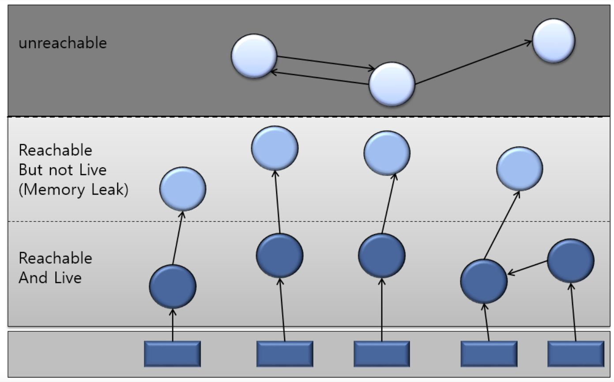
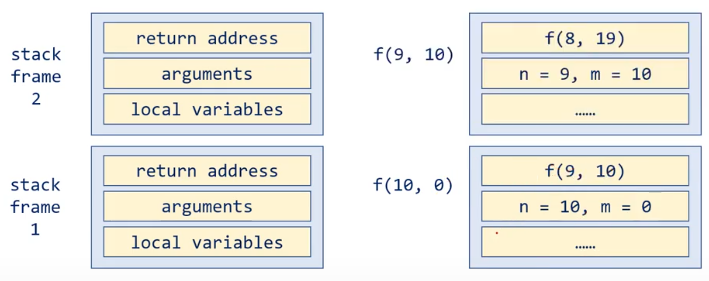

# Chapter 06. 객체지향 프로그래밍 1

# 객체지향언어

---

**객체지향이론**

- 실제 세계는 객체로 이루어져 있으며, 발생하는 모든 사건들은 객체들의 상호작용이다
- 실제 사물의 속성과 기능을 분석하여 데이터와 함수로 정의해서 실제 세계를 구현한다

**객체지향 언어**

- 객체지향이론을 프로그래밍 언어에 적용한 것
- 객체 지향 언어는 코드 간에 서로 관계를 맺어줌으로써 보다 유기적인 프로그램을 구성한다

**객체지향 언어의 주요 특징**

- 코드의 재사용성
- 유지보수 용이
- 높은 신뢰도의 프로그래밍

# 클래스와 객체

---

객체의 사전적 정의 : '실제로 존재하는 것'
(객체지향이론에서는 개념이나 논리도 무형적인 객체로 간주한다)

프로그래밍에서의 객체 : 클래스에 정의된 내용대로 메모리에 생성된 것

**인스턴스** : 클래스로부터 만들어진 객체

**인스턴스화** : 클래스로부터 객체를 만드는 과정

### 속성과 기능

객체는 속성과 기능의 집합이다
그리고 객체가 가지고 있는 속성과 기능을 그 객체의 멤버라고 한다

- 속성 : 멤버 변수 (특성, 필드, 상태)
- 기능 : 메소드, 함수 (행위)

### 생성과 사용

```java
Tv t;             // 메모리에 참조변수 t를 위한 공간이 마련된다
t = new Tv();     // 힙 공간에 인스턴스가 생성된다 (이 때, 멤버변수는 각 자료형에 해당하는 기본값으로 초기화된다)
                  // 생성된 객체의 주소값이 참조변수 t에 저장된다
t.channel = 7;    // 멤버변수에 값을 저장한다
t.channelDown();  // 메소드를 호출한다
```

→ 인스턴스는 참조변수를 통해서만 다룰 수 있다
(참조 변수의 타입은 인스턴스 타입과 일치해야 한다)

```java
Tv t1 = new Tv();
Tv t2 = new Tv();

t1.channel = 7;   // 1️⃣

t2 = t1;          // 2️⃣
```

1️⃣ 같은 클래스로부터 생성되었을지라도 각 인스턴스의 속성은 서로 다른 값을 가질 수 있다
      하지만, 메소드의 내용은 모두 인스턴스에 대해 동일하다

2️⃣ 자신을 참조하고 있는 참조 변수가 하나도 없는 인스턴스는 더 이상 사용되어질 수 없다
     가비지컬렉터에 의해서 자동적으로 메모리에서 제거될 것이다

***가비지컬렉터가 제거할 객체를 선정하는 방법***

Garbage Collection : Garbage를 모아 사용되지 않는 객체의 메모리를 해제한다



Root Set과 어떤 식으로든 Reference가 있다면 Reachable하다고 볼 수 있고, 이를 현재 사용하고 있는 객체로 간주한다

사용되지 않는 객체는 어떻게 판단할까? → Root Set 과의 관계로 판단한다

- Reachable
- Unreachable

**Reachable**

Root Set과 어떤 식으로든 참조가 있는 경우

Root Set?

- JVM Stack 내의 Local Variable 영역, Operand Stack에서의 참조
- JVM 메소드 영역의 constant pool에서의 참조
- 아직 메모리에 남아있는 Native 메소드로 넘겨진 객체에서의 참조(JNI에 의해 생성된 객체에 대한 참조)

**Unreachable**

Root Set으로부터 참조관계를 따졌을 때 그 어떤 참조도 없는 경우

GC의 대상이 된다

Reachable 객체는 사실 두 가지 부류로 나뉜다 → live, not-live
not-live한 Reachable 객체는 Memory Leak을 발생시킨다

**Memory Leak?**

- 힙에 더 이상 사용되지 않는 객체가 있지만 가비지컬렉터가 메모리에서 제거할 수 없어서 불필요하게 유지되는 상황을 메모리릭이라고 한다
- 메모리 릭는 시간이 지남에 따라 시스템 성능을 저하시킨다
(처리하지 않으면 애플리케이션은 결국 OutOfMemoryError를 뱉어낼 수 있다)

**Memory Leak의 대표적 원인**

1. ***static 변수의 과도한 사용***

static 변수는 응용프로그램이 종료될때까지 메모리에 상주한다

따라서, 무분별하게 static 변수를 사용하지 말아야 한다 (특히 컬렉션이나 크기가 큰 객체의 경우 더욱 조심)

```java
public class StaticTest {
    public **static** List<Double> list = new ArrayList<>();

    public void populateList() {
        for (int i = 0; i < 10000000; i++) {
            list.add(Math.random());
        }
    }

    public static void main(String[] args) {
        new StaticTest().populateList();
    }
}
```

2. ***닫히지 않는 리소스***

Connection을 맺거나 스트림을 사용할 때, 리소스를 close하지 않은 경우 메모리릭이 발생할 수 있다

따라서, 항상 finally 블록을 사용하여 리소스를 닫아야 한다
(자바 7 이후의 try-with-resources block을 통해 사용할 시소스를 선언해두고 자동으로 반환되도록 할 수 있다)

3. ***잘못된 equals(), hashCode() 구현***

HashSet 및 HashMap은 많은 작업에서 equals(), hashCode()를 사용한다
따라서, 올바르게 재정의하지 않으면 잠재적인 메모리 릭 문제의 원인이 될 수 있다

```java
@Test
public void test() {
    Map<Person, Integer> map = new HashMap<>();
    for (int i = 0; i < 100; i++) {
        map.put(new Person("jon"), 1);       **// 매번 새로운 키로 put된다**
    }
    Assertions.**assertFalse**(map.size() == 1);
}

**// equals, *hashCode*를 재정의하지 않았다**
class Person {
    public String name;

    public Person(String name) {
        this.name = name;
    }
}
```

4. ***외부 클래스를 참조하는 내부 클래스***

모든 non-static 내부 클래스는 외부 클래스에 대한 참조를 가지기 때문에, 내부 클래스가 gc가 되기 전까지는 외부 클래스도 해제되지 않는다

따라서, 내부 클래스가 외부 클래스의 참조할 필요가 없다면 static으로 바꾸는 것이 좋다

5. ***finalize()***

finalize() 메서드를 재정의하면 객체가 즉시 가비지로 수집되지 않는다

:

이 외에도 메모리 릭은 여러 가지 이유로 발생할 수 있다

### 클래스

**클래스란?**

- 데이터와 함수의 결합으로,
서로 관련된 변수들을 정의하고 이들에 대한 작업을 수행하는 함수들을 함께 정의한 것
- 예시 : 문자열과 문자열을 다루는데 필요한 함수들을 묶은 'String' 클래스

**비객체지향적인 코드 vs 객체지향적 코드**

3개의 시간을 다뤄야 한다고 해보자

비 객체지향적인 코드

```java
int hour1, hour2, hour3;
int minute1, minute2, minute3;
float second1, second2, second3;

// 또는..

int[] hour = new int[3];
int[] minute = new int[3];
float[] second = new float[3];
```

이제 시간과 관련된 제약조건을 추가해보자

1. 시, 분, 초는 모두 0보다 크거나 같아야 한다
2. 시의 범위는 0~23, 분과 초의 범위는 0~59이다

비객체지향적인 코드에서는 이러한 추가적인 조건들을 반영하기 어렵다
클래스를 이용해서 이러한 조건들을 코드에 쉽게 반영해보자

```java
Time t1 = new Time();
Time t2 = new Time();
Time t3 = new Time();

// 또는..

Time[] t = new Time[3];
t[0] = new Time();
t[1] = new Time();
t[2] = new Time();
```

```java
public class Time {
    private int hour;
    private int minute;
    private int second;

    public int getHour() {
        return hour;
    }

    public void setHour(int hour) {
        if (hour < 0 || hour > 23) return;
        this.hour = hour;
    }

    public int getMinute() {
        return minute;
    }

    public void setMinute(int minute) {
        if (minute < 0 || minute > 59) return;
        this.minute = minute;
    }

    public int getSecond() {
        return second;
    }

    public void setSecond(int second) {
        if (second < 0.0f || second > 59.99f) return;
        this.second = second;
    }
}
```

제어자를 이용해서 변수의 값을 직접 변경하지 못하게 했다
대신 메소드를 통해서 값을 변경하도록 작성했다
값을 변경할 때 지정된 값의 유효성을 조건문으로 점검한 다음에 유효한 값일 경우에만 변경한다

# 변수와 메소드

---

변수의 종류를 결정짓는 중요한 요소 : 변수의 위치

```java
class Variables {
		int iv;          // 인스턴스 변수
		static int cv;   // 클래스 변수
		void method() {
				int lv = 0;  // 지역 변수
		}
}
```

### 변수의 종류의 특징

**변수의 생성 시기**

- 클래스 변수 : 클래스가 메모리에 올라갈 때 생성된다
- 인스턴스 변수 : 인스턴스가 생성될 때 생성된다
- 지역 변수 : 변수 선언문이 수행되었을 때 생성된다

**클래스 변수 vs 인스턴스 변수**

- 클래스 변수는 메모리에 로딩될 때 생성되어서 프로그램이 종료될 때까지 유지된다
또한, 모든 인스턴스가 공통된 저장공간(변수)을 공유하게 된다
- 따라서, 만약 어떤 클래스의 모든 인스턴스들이 공통적인 값을 유지해야 하는 속성이라면? → 클래스 변수로 선언하고,
각 인스턴스마다 고유한 상태를 유지해야 하는 속성이라면? → 인스턴스 변수로 선언한다

### 메소드

메소드란? 특정 작업을 수행하는 일련의 문장들을 하나로 묶은 것

**메소드를 사용하면서 얻는 이점**

1. 재사용성이 높다
한번 만들어놓으면 몇번이고 호출할 수 있다
2. 중복된 코드를 제거할 수 있다
변경사항이 발생했을 때 해당 메소드만 수정하면 되므로 관리가 쉽고 오류의 발생가능성이 낮아진다
3. 프로그램을 구조화시킬 수 있다
프로그램의 전체 흐름이 한눈에 들어올 정도로 단순하게 구조화하는 것이 좋다
작업을 나눠서 여러 개의 메소드에 담아 프로그램의 구조를 단순화시킬 수 있다

**메소드의 구조**

메소드는 선언부와 구현부로 이뤄진다

- 선언부
    - '메소드 이름' + '매개변수의 선언' + '반환타입' 으로 구성된다
    - 작업을 수행하기 위해 어떤 값들을 필요로 하고
    작업의 결과로 어떤 타입의 값을 반환하는지에 대한 정보를 제공한다
    - 메소드 이름 : 동사인 경우가 많으며, 기능을 쉽게 알 수 있도록 짓는다
    매개변수 선언 : 메소드가 작업을 수행하는데 필요한 값들을 나열한다
    반환타입 : 작업 수행 결과의 타입을 적는다 (반환값이 없다면 void)
- 구현부
    - 메소드를 호출했을 때 수행될 문장들을 넣는다
    - 단 하나의 값만 반환할 수 있다
    - 반환값의 타입은 반환타입과 일치하거나, 적어도 형변환이 가능한 것으로 해야한다

### 메소드의 호출

**인자와 매개변수**

- 인자의 개수와 순서는 호출된 메소드에 선언된 매개변수와 일치해야 한다
- 인자의 타입은 매개변수의 타입과 일치하거나 자동형변환이 가능한 것으로 해야 한다

```java
double result = divide(**5L**, **3L**);
// 매개변수의 타입은 double이지만, long형인 5L과 3L을 사용해서 호출하는 것이 가능하다 (자동형변환)

:

double divide(**double** a, **double** b) { 
    return a / b;
}
```

**매개변수의 유효성 검사**

메소드의 구현부를 작성할 때 제일 먼저 해야 하는 일 : 매개변수의 값이 적절한지 확인하는 것

'😘 호출하는 쪽에서 알아서 적절하게 넘겨주겠지~' → **NOPE**!!

가능한 모든 경우의 수에 대해 고민하고 그에 대비한 코드를 작성해야 한다

***"오류는 가능한 한 빨리 잡아야 한다"***

오류를 발생한 즉시 잡지 못하면 해당 오류를 감지하기 어려워지고, 감지하더라도 오류의 발생 지점을 찾기 어려워진다

메소드 바디가 실행되기 전에 매개변수를 확인하여 잘못된 값이 넘어왔을 때 즉각적이고 깔끔한 방식으로 예외를 던저야 한다

매개변수 검사를 제대로 하지 못하면 메소드가 수행되는 중간에 모호한 예외를 던지며 실패할 수 있다
또는 (더 심각) 메소드가 잘 수행되지만 잘못된 결과를 반환한다

최악의 경우에 (완전완전 더 심각) 메소드는 문제없이 수행됐지만, 객체를 이상한 상태로 만들어 놓아 미래의 알 수 없는 시점에 메소드와 관련 없는 오류를 낸다
(메소드가 실패했더라도, 해당 객체는 메소드 호출 전 상태를 유지해야 함 - 실패 원자성)

### return

반환값의 유무에 관계없이 모든 메소드에는 return문이 있어야 한다

😡 전 반환값 없으면 return 안적어줬는데요

→ 반환타입이 void라면, 컴파일러가 메소드 마지막에 return을 자동으로 추가해준다

반환타입도 참조형이 될 수 있다
반환 타입이 참조형이라는 것은 메소드가 객체의 주소를 반환한다는 것이다

### 변수의 메모리 영역

**메소드 영역**

- 프로그램 실행 중에 어떤 클래스가 사용되면, jvm은 해당 클래스의 클래스파일을 읽어서 분석하여 클래스에 대한 정보를 메소드 영역에 저장한다
- 클래스 변수도 이 영역에 함께 생성된다

**힙**

- 인스턴스는 모두 이곳에 생성된다

**호출스택**

- 메소드의 작업에 필요한 메모리 공간을 제공한다
- 메소드가 호출되면 수행에 필요한 만큼의 메모리를 스택에 할당된다
이후 메소드가 작업을 마치면 할당받았던 메모리를 반환하고 스택에서 제거된다

### 기본형 매개변수와 참조형 매개변수

기본형 매개변수는 기본형 값이 복사되지만, 참조형 매개변수는 인스턴스의 주소가 복사된다
참조형 매개변수는 실제 값이 저장된 곳의 주소기 때문에 실제 값을 변경하는 것이 가능하다
→ 즉, 기본형 매개변수는 read-only, 참조형 매개변수는 (참조된 객체를) read & write 할수있다

```java
class Data {
    int x;
}

@Test
void test() {
    Data d = new Data();
    d.x = 10;

    change(d.x);
    Assertions.assertEquals(d.x, 10);
		// 기본형 매개변수는 복사본이 변경된 것이기 때문에, 원본에 아무런 영향을 미치지 못한다

    change(d);
    Assertions.assertEquals(d.x, 1000);
		// 참조형 매개변수는 실제 값을 변경하는 것이 가능하다
}

void change(int x) {
    x = 1000;
}

void change(Data data) {
    data.x = 1000;
}
```

### 재귀호출

재귀호출 : 메소드 자신을 다시 호출하는 것

재귀메소드 : 재귀호출하는 메소드

**무한반복문 vs 재귀호출**

재귀호출이 무한반복문보다 수행시간이 더 오래걸린다
왜냐하면, 재귀호출은 매개변수의 복사, 복귀할 주소 저장 등으로 인해 더 많은 작업이 필요하기 때문이다

💡 무한반복문으로 작성한 코드는 재귀호출과 달리 많은 수의 반복에도 StackOverflowError같은 메모리 부족문제를 겪지 않으며 속도도 더 빠르다

**StackOverflowError**

```java
int factorial(int n) {
    if (n == 1) return 1;
    return n * **factorial**(n - 1);
}
// -> 이 코드는 매개변수의 값 따라 StackOverflowError가 발생한다
```

n의 값이 0이거나 100,000같이 큰 수면 StackOverflowError가 발생한다

⇒ 따라서 재귀호출에는 매개변수의 유효성 검사가 필수다

🤔 *그럼 재귀호출을 왜써?*

- 알고리즘 자체가 재귀적인 표현이 더 자연스러운 경우, 무한반복문보다 더 단순한 구조로 코드를 작성할 수 있다
- 변수의 수를 줄일 수 있다
(여기서 말하는 변수의 수는 메모리를 줄인다는 의미가 아님. mutable state. 즉 변경이 가능한 상태를 줄인다는 의미)
→ 프로그램 오류가 발생할 수 있는 가능성을 줄일 수 있다

```java
// 반복문
int sum = 0;
for (int i = 0; i <= n; i++) {
    sum += i;
}
```

```java
// 재귀호출
int sum(final int n) {
    if (n == 1) return 1;
    return n + sum(n - 1);
}
```

메소드를 호출하면 메소드가 호출된 위치를 가리키는 주소 값이 저장되어야 한다
메소드가 재귀적으로 호출될 경우 메소드 안에서 메소드가 계속해서 호출되고 리턴된다
→ 호출 횟수가 많아지면 돌아갈 곳의 주소 값을 저장하고 있는 스택이 넘치거나 프로그램의 실행 속도가 느려진다

**꼬리재귀**

- 재귀 메소드를 원래 메소드의 꼬리 부분에서 호출하는 경우

```java
int f(int n, int m) {
		if (n == 1) return m;
		return f(n - 1, n + m);
}
```

- 호출 스택을 추가로 사용할 필요 없이 스택의 현재 영역을 재사용한다

    

- 나는 재귀호출을 했는데 그럼 누가 저런 식으로 바꿔주나? → 컴파일러가
- 컴파일러는 꼬리 재귀로 작성된 코드를 인식해서 반복문으로 바꿔준다
(컴파일 옵션으로 코드 최적화가 되도록 설정해줘야 한다)
- 꼬리 재귀는 메소드 호출 위치를 저장하지 않도록해서 스택이 넘치는 경우를 방지한다

결국, 꼬리 재귀는 반복문이다
→따라서, 재귀 호출에서 발생하는 스택 오버 플로우나 성능저하가 발생하지 않는다

C++, C#, Kotlin, Swift, Scala은 꼬리 재귀 최적화를 지원하며, JavaScript는 ES6 스펙에서 지원한다

하지만 **Java는** 꼬리 재귀 최적화를 **직접적으로 지원하지 않는다**

Java는 컴파일러 레벨에서 TCO를 직접 지원하지 않지만 JAVA 8에 람다 식과 함수형 인터페이스를 사용해서 꼬리재귀같은 컨셉을 적용해볼 수 있다

[https://blog.knoldus.com/tail-recursion-in-java-8/](https://blog.knoldus.com/tail-recursion-in-java-8/)

### 클래스 메소드 vs 인스턴스 메소드

클래스 메소드와 인스턴스 메소드.. 어떤 경우에 어떤 메소드로 정의해야 하는가?

**인스턴스 메소드로 정의해야 하는 경우**

- 인스턴스 변수와 관련된 작업을 할 경우
(작업을 수행하는데 인스턴스 변수를 필요로 하는 경우)

**클래스 메소드로 정의해야 하는 경우**

- 인스턴스와 관계가 없는 경우
(작업을 수행하는 데 인스턴스 변수나 인스턴스 메소드를 사용하지 않는 경우)

메소드 내에서 인스턴스 변수를 사용하지 않는다면, static을 붙이는 것을 고려한다
메소드 호출시간이 짧아지므로 성능이 향상된다
(static을 안 붙인 메소드는 실행 시에 호출되어야 할 메소드를 찾는 과정이 추가적으로 필요하다)

### 클래스 멤버와 인스턴스 멤버 간의 참조와 호출

인스턴스 멤버가 존재하는 시점에 클래스 멤버는 항상 존재한다
반대로, 클래스 멤버가 존재하는 시점에는 인스턴스 멤버가 존재하지 않을 수도 있다

따라서, 인스턴스 메소드는 인스턴스 멤버를 사용할 수 있지만, static 메소드는 인스턴스 멤버를 사용할 수 없다

클래스 멤버가 인스턴스 멤버를 참조해야 하는 경우라면?

→ 인스턴스 메소드로 작성했어야할 메소드를 클래스 메소드로 작성한 확률이 높다

# 오버로딩

---

오버로딩 : 한 클래스 내에 같은 이름의 메소드를 여러 개 정의하는 것

### 오버로딩의 조건

1. 메소드 이름이 같아야 한다
2. 매개변수의 개수 또는 타입이 달라야 한다

반환 타입은 오버로딩을 구현하는 데 아무런 영향을 주지 못한다

### 오버로딩의 장점

메소드도 변수처럼 단지 이름만으로 구별된다면, 한 클래스 내의 모든 메소드들을 이름이 달라야 한다

```java
void println()
void printlnBoolean(boolean x)
void printlnChar(char x);
:
:
```

오버로딩할 수 없다면, 근본적으로 같은 기능을 하는 메소드들일지라도 서로 다른 이름을 가져야 한다
→ 메소드를 작성하는 쪽에서는 이름을 짓기도 어렵고 메소드를 사용하는 쪽에서는 이름을 일일이 구분해서 기억해야 한다

오버로딩은

- 메소드의 이름만 보고도 쉽게 예측이 가능하다
'이 메소드들은 이름이 같으니 같은 기능을 하겠군'
- 메소드의 이름을 절약할 수 있다

***오버로딩 시, 어떤 메소드를 호출할지는 컴파일 타임에 정해진다***

```java
@Test
public void test() {
    **Collection**<String> set = new **HashSet**<>();
    Assertions.assertEquals(classify(set), "**컬렉션**");

    **HashSet**<Object> set2 = new **HashSet**<>();
    Assertions.assertEquals(classify(set2), "**셋**");

    **Collection**<BigInteger> list = new **ArrayList**<>();
    Assertions.assertEquals(classify(list), "**컬렉션**");

    **ArrayList**<BigInteger> list2 = new **ArrayList**<>();
    Assertions.assertEquals(classify(list2), "**리스트**");
}

public String classify(**Set**<?> set) {
    return "셋";
}

public String classify(**List**<?> list) {
    return "리스트";
}

public String classify(**Collection**<?> collection) {
    return "컬렉션";
}
```

> 테스트는 성공한다

오버로딩된 메소드는 어느 메소드를 호출할지 컴파일타임에 정해진다 (정적이다)
런타임 시의 타입은 호출할 메소드를 선택하는 데 영향을 주지 못한다

*"헷갈릴만한 코드는 작성하지 않는 것이 좋다!"*

매개변수 중 하나라도 '근본적으로 다르면' 혼란이 없다
(근본적으로 다르다? = 두 타입의 값을 서로 어느쪽으로든 형변환할 수 없다는 뜻)

오버로딩하지 말고 메소드명을 다르게 지어주는 길도 있다!

*"오버로딩을 허용한다고 해서 꼭 오버로딩을 활용하란 뜻은 아니다"*

### 가변인자와 오버로딩

**가변인자**

jdk 1.5부터 메소드의 매개변수 개수를 동적으로 지정해줄 수 있게 되었다

```java
public PrintStream printf(String format, **Object ...** args) {
    return format(format, args);
}
```

가변인자는 내부적으로 배열을 이용한다
따라서 배열을 넘기는 것이 가능하다

그럼 매개변수 타입을 배열로 하는 것과 어떤 차이가 있나요?
→ 가변인자는 메소드를 호출 할 때 인자를 아예 넘기지 않아도 된다

```java
printStream.printf("%s::%s");
printStream.printf("%s::%s", "a", "b");
printStream.printf("%s::%s", new String[]{"A", "B"});
```

**가변인자와 오버로딩**

```java
String concatenate(String delim, String... args) {
    return "";
}

String concatenate(String... args) {
    return "";
}
```

```java
concatenate("100", "200"); // 컴파일 에러
```

컴파일 에러

> Ambiguous method call. Both
concatenate(String, String...) in ...
and concatenate (String...) in ...

가변인자를 선언한 메소드를 오버로딩했을 때, 컴파일러가 메소드를 구분할 수 없는 경우가 발생할 수 있다
따라서, 가능하면 가변인자를 사용한 메소드는 오버로딩하지 않는 것이 좋다

# 생성자

---

생성자는 인스턴스 초기화 메소드이다

생성자의 조건

1. 생성자의 이름은 클래스 이름과 같다
2. 생성자는 리턴값이 없다

생성자도 오버로딩이 가능하다
따라서 하나의 클래스에 여러개의 생성자를 정의할 수 있다

생성자는 인스턴스를 생성해주는 메소드가 아니다
단순히 인스턴스 변수들의 초기화를 위한 특별한 메소드일 뿐,
실제 인스턴스의 생성은 연산자 new가 담당한다

```java
new Card();
```

### 인스턴스 생성의 과정

1. 연산자 new에 의해 힙에 인스턴스가 생성된다
2. 생성자가 호출되어 수행된다
3. 연산자 new의 결과로 주소가 반환된다

### 기본 생성자

사실 모든 클래스에는 반드시 하나 이상의 생성자가 정의되어 있어야 한다

😮 생성자 정의하지 않아도 인스턴스 생성했는데요?
클래스 내에 생성자가 하나도 없으면 컴파일러가 기본 생성자를 추가해서 컴파일한다

### 매개변수가 있는 생성자

생성자도 메소드처럼 매개변수를 선언해서 호출 시 값을 넘겨받아 인스턴스의 초기화 작업에 사용할 수 있다

인스턴스를 생성한 다음에 인스턴스 변수의 값을 변경하는 것보다 매개변수를 갖는 생성자를 사용하는 것이 코드를 간결하고 직관적으로 만든다

```java
Car c = new Car("white", "auto", 4);
```

### this(), this

생성자 간에도 서로 호출이 가능하다

단,

- 클래스 이름 대신 this를 사용하며,
- 다른 생성자를 호출할 때는 반드시 첫 줄에서만 호출해야 한다

다른 생성자를 첫 줄에서만 호출이 가능하도록 한 이유

- 생성자 내에서 초기화 작업 도중에 다른 생성자를 호출하게 되면, 호출된 다른 생성자 내에서도 멤버변수들의 값을 초기화할 수 있다
→ 다른 생성자를 호출하기 이전의 초기화 작업이 무의미해진다

```java
public class Car {
    String color;
    String gearType;
    int door;

    public Car() {
        this("white", "auto", 4);
    }

    public Car(String color) {
        this(color, "auto", 4);
    }

    public Car(String color, String gearType, int door) {
        this.color = color;
        this.gearType = gearType;
        this.door = door;
    }
}
```

**this vs this()**

- this : 인스턴스 자신을 가리키는 참조변수. 모든 인스턴스 메소드에 지역변수로 숨겨진 채 존재한다
- this() : 생성자. 다른 생성자를 호출할 때 사용한다

장점

- **Po**자유로움**wer**
클라이언트가 인스턴스를 생성하는 데 자유롭다
- 클래스 설계 시점에 별 고민없이 빨리 만들어진다

단점

- 인스턴스가 무분별하게, 일관성 없게 생성될 수 있다
- 클라이언트 : *"그래서 내가 뭘 써야하죠?"*
생성자가 여러 개 있을 때, 클라이언트에게 의미전달이 힘들다
**필요할 때마다, 로직보면서 어떻게 생성되는지 분석해야 한다

**정적 팩토리 메소드로 객체 생성하기**

static 메소드가 객체를 생성해서 반환한다
주로 생성자를 숨기고 인스턴스의 생성을 통제하는 데 사용된다

장점

- 이름을 갖기 때문에 클라이언트에게 의미가 잘 전달된다
- 인스턴스의 생성을 통제할 수 있다
- 넘어온 매개변수에 따라 여러 하위 타입의 객체를 반환할 수 있다

단점

- 상속 난감 (정적 팩토리 메소드밖에 제공되지 않을 때)

**빌더 패턴으로 객체 생성하기**

해당 객체를 한번에 빌드하는 빌더 클래스를 두고, 빌딩하는 방식으로 생성한다

장점

- 가독성이 좋다
- 한번에 완전한 객체를 생성하여 객체에 일관성을 보장할 수 있다

### 생성자를 이용한 인스턴스의 복사

```java
public class Car {
    String color;
    String gearType;
    int door;

    public Car(String color, String gearType, int door) {
        this.color = color;
        this.gearType = gearType;
        this.door = door;
    }

    ****public **Car(Car car) {**
        this(car.color, car.gearType, car.door);
    }

}
```

Object 클래스에 정의된 clone 메소드를 이용하면 간단히 인스턴스를 복사할 수 있다

***clone 메소드***

Cloneable 인터페이스 : 복제해도 되는 클래스임을 명시하는 용도의 '믹스인 인터페이스**'**
(클래스가 구현할 수 있는 타입. 믹스인을 구현한 클래스에 원래의 '주 타입' 외에도 특정 선택적 행위를 제공한다고 선언함)

- Cloneable 구현하여 clone 호출 : 객체의 필드들을 하나하나 복사한 객체 반환
- Cloneable 구현하지 않고 clone 호출 : CloneNotSupportedException

```java
public class Stack {

    private Object[] elements;

    @Override
    public Stack clone() {
        try {
            Stack result = (Stack) super.clone();
            result.elements = elements.clone();
            return result;
        } catch (CloneNotSupportedException e) {
            throw new AssertionError();
        }
    }

}
```

super.clone만 수행하면, 원본이나 복사본 둘중 하나라도 수정했을 경우 서로에게 영향을 미친다

따라서, elements도 deep하게 copy해야 한다

clone() 재정의하는 방법

- Cloneable을 구현하는 모든 클래스는 clone을 재정의해야 한다
- 접근 제한자는 public
- 반환타입은 자기 자신
- 가장 먼저 super.clone을 호출하고 나서, 필요한 필드를 적절히 수정한다
이 때, 깊은 구조까지 클론한다
보통 재귀이지만, StackOverflow를 조심한다
(기본 타입 필드, 불변 객체 참조만 갖는 클래스면 아무 필드도 수정할 필요가 없다)
- Cloneable 구현한 클래스를 확장할 때는 하위 클래스에서 Cloneable을 구현할지 선택하고, 
구현할 필요가 없다면 clone을 동작하지 않게 구현해놓고 하위클래스에서 재정의 못하게 한다

→ 복사 방법이 이것밖에 없나..?

이미 Cloneable을 구현한 클래스를 확장해야 한다면 위 방법들을 잘 지켜서 clone을 잘 작동하도록 해야하지만..
그렇지 않다면 생성자나 팩토리를 이용하는 것이 좋다

→ 복제 기능은 생성자나 팩토리를 이용하는게 최고다..

# 변수의 초기화

---

변수의 초기화 : 변수를 선언하고 처음으로 값을 저장하는 것

가능하면 선언과 동시에 적절한 값으로 초기화하는 것이 바람직하지만
멤버변수는 초기화를 하지 않아도 자동적으로 변수의 자료형에 맞는 기본값으로 초기화가 이루어진다

### **멤버 변수의 초기화 방법**

- 명시적 초기화
- 생성자
- 초기화 블록

**명시적 초기화**

변수를 선언과 동시에 초기화한다

여러 초기화 방법 중에 가장 우선시되어야 한다

```java
class Car {
		int door = 4;
		Engine e = new Engine();
}
```

보다 복잡한 초기화 작업이 필요할 때는 초기화 블록이나 생성자를 사용한다

**초기화 블록**

```java
class InitBlock {
		static { ... }   // 클래스 초기화 블록
		{ ... }          // 인스턴스 초기화 블록
}
```

- 클래스 초기화 블록
    - 클래스 변수의 초기화에 사용된다
    - 클래스가 메모리에 처음 로딩될 때 한번만 수행된다
- 인스턴스 초기화 블록
    - 인스턴스 변수의 초기화에 사용된다
    - 인스턴스를 생성할 때마다 수행된다
    - 생성자보다 먼저 수행된다

**초기화가 수행되는 시기와 순서**

클래스 변수

- 초기화 시점 : 클래스가 처음 로딩될 때 단 한번 초기화된다
- 초기화 순서 : 기본값 → 명시적 초기화 → 클래스 초기화 블록

인스턴스 변수

- 초기화 시점 : 인스턴스가 생성될 때마다
- 초기화 순서 : 기본값 → 명시적 초기화 → 인스턴스 초기화 블록 → 생성자

```java
class InitTest {
		static int cv = 1;        // 클래스변수의 명시적 초기화
		int iv = 1;               // 인스턴스변수의 명시적 초기화

		static {  sv = 2; }       // 클래스 초기화 블록

		{  iv = 2;  }             // 인스턴스 초기화 블록

		InitTest() {  iv = 3;  }  // 생성자

}
```

1. 클래스 변수의 기본값
cv : 0
2. 클래스 변수의 명시적 초기화
cv : 1
3. 클래스 초기화 블록
cv : 2
4. 인스턴스 변수의 기본값
cv : 2, iv : 0
5. 인스턴스 변수의 명시적 초기화
cv : 2, iv : 1
6. 인스턴스 변수의 초기화 블록
cv : 2, iv : 2
7. 생성자
cv : 2, iv : 3

**인스턴스 초기화 블록 VS 생성자**

인스턴스 변수의 초기화는 주로 생성자를 이용하고,
모든 생성자에서 공통으로 수행되어야 하는 코드를 넣을 때는 초기화 블록을 사용한다

```java
public class Car {
    static int count;
    int serialNo;
    String color;
    String gearType;

    Car() {
        **count++;
        serialNo = count;**
        color = "White";
        gearType = "Auto";
    }

    Car(String color, String gearType) {
        **count++;
        serialNo = count;**
        color = color;
        gearType = gearType;
    }
}
```

모든 생성자에서 공통으로 수행되는 코드를 초기화 블록으로 이동시킨다

```java
public class Car {
    static int count;
    int serialNo;
    String color;
    String gearType;

    **{
        count++;
        serialNo = count;
    }**

    Car() {
        color = "White";
        gearType = "Auto";
    }

    Car(String color, String gearType) {
        color = color;
        gearType = gearType;
    }
}
```

### Reference

가비지컬렉션-루트셋

- [https://dalsacoo-log.tistory.com/entry/Garbage-Collection](https://dalsacoo-log.tistory.com/entry/Garbage-Collection)


메모리릭

- [https://medium.com/@joongwon/jvm-garbage-collection-algorithms-3869b7b0aa6f](https://medium.com/@joongwon/jvm-garbage-collection-algorithms-3869b7b0aa6f)
- [https://velog.io/@youngerjesus/자바-Memory-Leaks](https://velog.io/@youngerjesus/%EC%9E%90%EB%B0%94-Memory-Leaks)
- [https://www.baeldung.com/java-memory-leaks](https://www.baeldung.com/java-memory-leaks)

반복문 vs 재귀함수

- [https://wonillism.tistory.com/17](https://wonillism.tistory.com/17)
- [https://velog.io/@gillog/Algorithm-재귀와-반복문](https://velog.io/@gillog/Algorithm-%EC%9E%AC%EA%B7%80%EC%99%80-%EB%B0%98%EB%B3%B5%EB%AC%B8)
- [https://blog.knoldus.com/tail-recursion-in-java-8/](https://blog.knoldus.com/tail-recursion-in-java-8/)

clone

- [https://kkimsangheon.github.io/2019/03/31/effective/](https://kkimsangheon.github.io/2019/03/31/effective/)