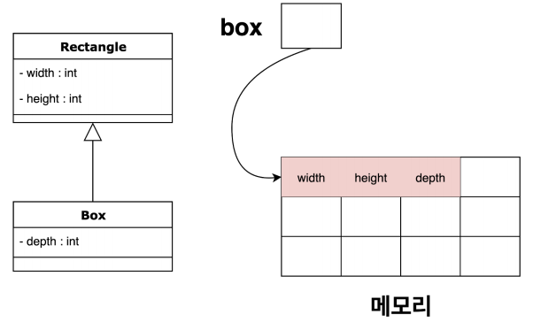

# Chapter 7. 객체지향 프로그래밍 2

## 1. 상속 (inheritance)

### 1. 상속의 정의와 장점

---

- 상속: 기존의 클래스를 재사용하여 새로운 클래스를 작성하는 것

    ```java
    class Jenny extends Developer {
        // ...
    }
    ```

    - 코드의 재사용성을 높이고 코드의 중복을 제거하여 프로그램의 생산성과 유지보수에 크게 기여한다.
    - 키워드 `extends` 사용

- 조상 클래스: 부모 클래스, 상위클래스, 기반(base) 클래스
- 자손 클래스: 자식 클래스, 하위클래스, 파생된(derived) 클래스

- 상속 시
    - 생성자와 초기화 블럭은 상속되지 않는다. 멤버만 상속된다.
    - 자손 클래스의 멤버 개수는 조상 클래스보다 항상 같거나 많다.
- 장점
    - 클래스간의 상속관계를 맺어주면 자손 클래스들의 공통적인 부분은 조상 클래스에서 관리하고
    - 자손클래스는 자신에 정의된 멤버들만 관리하면 되서, 각 클래스 코드가 적어져서 관리가 쉬워진다.

### 2. 클래스간의 관계 - 포함관계

---

- 또 다른 클래스 재사용 방법: 컴포지션
    - 클래스의 멤버변수로 다른 클래스 타입의 참조변수를 선언하는 것

    ```java
    class Jenny {
        Developer d = new Developer();
        // ...
    }
    ```

- 장점
    - 단위별로 여러 개의 클래스를 작성하고, 이 단위 클래스들을 포함관계로 재사용하면 보다 간결하고 손쉽게 클래스를 작성할 수 있다.
    - 작성된 단위 클래스들은 다른 클래스를 작성하는데 재사용될 수 있다.

### 3. 클래스간의 관계 결정하기

---

- is-a: ~은 ~이다 → 상속
- has-a: ~은 ~를 가지고 있다 → 컴포지션

- 상속과 컴포지션의 차이: 메모리
    - 상속: 개체 생성 시, 메모리가 하나의 덩어리(초기화를 한 번만 하므로)

        

    - 컴포지션: 개체 생성 시, 메모리가 여러 덩어리

        

    [상속 vs 컴포지션.pdf](./images/%EC%83%81%EC%86%8D_vs_%EC%BB%B4%ED%8F%AC%EC%A7%80%EC%85%98.pdf)

    - 메모리 상의 차이는 실행 성능에 영향을 미친다. 개체가 여러 메모리로 나뉘어져 있으면 속도가 느려짐
    - 이유: cpu는 메모리로부터 데이터를 받아와 연산한다.
        - 상속 모델로 만든 개체: 개체가 한 번에 캐시 메모리에 들어갈 가능성이 높음

            → 메모리 할당/해제가 딱 한 번씩

        - 컴포지션 모델로 만든 개체: 개체 내 부품 수 만큼 캐시 메모리로 로딩할 가능성이 높음

            → 한 번 + 부품 수 만큼씩

        - 프로그래밍 언어에 따라 새로운 메모리를 할당하고 해제하는 것에 있어 특히 느린 것이 있다.(9p)
- → 결론: 성능이 중요한 경우에는 상속을 사용하는 것이 낫다.
    - 일반적인 경우에는 상식적으로 생각하자.
    - has-a 와 is-a 관계에 충실하자 (다만, 본인이 아는 정도에 따라서 상속/컴포지션이 나뉠 수 있다)

- `toString()`
    - 인스턴스의 정보를 문자열로 반환할 목적으로 정의된 것
    - 참조변수를 출력하면, 참조변수가 가리키고 있는 인스턴스에 `toString()`을 호출하여 그 결과를 화면에 출력한다.

### 4. 단일 상속 (single inheritance)

---

- 자바에서는 단일 상속만을 허용한다.

    ```java
    class 자식클래스명 extends 부모클래스명1, 부모클래스명2 {}  //불가능
    ```

### 5. Object클래스 - 모든 클래스의 조상

---

- Object 클래스: 모든 클래스 상속계층도의 최상위에 있는 조상클래스
    - 컴파일러는 상속받지 않는 모든 클래스들은 자동적으로 Object 클래스로부터 상속받게 한다.
    - `toString()`, `equals()`같은 모든 인스턴스가 가져야 할 기본적인 11개의 메서드가 정의되어 있다.


## 2. 오버라이딩(overriding)

### 1. 오버라이딩이란?

---

- 오버라이딩: 조상 클래스로부터 상속받은 메서드의 내용을 변경하는 것

    ```java
    public class Developer {
         public void develop() {
               System.out.println("직장인 개발자.. 돈 버는 중!");
         }
    }

    public class Jenny extends Developer {
         //메소드 오버라이딩 - Developer 를 상속받았으나 함수를 재정의
         public void develop() {
               System.out.println("소프트웨어 장인이 되고 싶다!");
         }
    }

    public class Test{
          public static void main(String[] args){
                 Jenny jenny = new Jenny();
                 jenny.develop();         // 소프트웨어 장인이 되고 싶다! 출력 
          }
    }
    ```

### 2. 오버라이딩의 조건

---

- 자손 클래스에서 오버라이딩하는 메서드는 조상 클래스의 메서드와
    - 이름이 같아야 한다.
    - 매개변수가 같아야 한다.
    - 반환타입이 같아야 한다.
        - JDK 1.5 부터 '공변 반환타입'이 추가되어, 반환타입을 자손 클래스의 타입으로 변경하는 것은 가능하도록 조건이 완화되었다.
- → 선언부가 서로 일치해야 한다.
    1. 접근 제어자는 조상 클래스의 메서드보다 좁은 범위로 변경할 수 없다.
    2. 조상 클래스의 메서드보다 많은 수(큰 범위)의 예외를 선언할 수 없다.

- 조상 클래스에 정의된 static 메서드를 자손 클래스에서 같은 이름의 static 메서드로 정의가능?
    - 그렇다. 하지만 각 클래스에 별개의 static 메서드를 정의한 것일 뿐 오버라이딩이 아님.
    - static 멤버들은 자신이 정의된 클래스에 묶여있다고 생각하자!

### 3. 오버로딩 vs 오버라이딩

---

- 오버로딩: 기존에 없는 새로운 메서드를 정의하는 것 (new)

    ```java
    public class Jenny {
         public void develop() {
               System.out.println("개발중");
         }

         public void develop(int passion) {
               System.out.println("개발중.. 소프트웨어 장인 열정지수: " + a);
         }
    }
    ```

- 오버라이딩: 상속받은 메서드의 내용을 변경하는 것 (change, modify)

### 4. super

---

- `super`: 자식 클래스에서 부모 클래스로부터 상속받은 멤버를 참조하는데 사용하는 참조변수
    - 부모의 멤버와 자식의 멤버를 구별하는데 사용된다는 점을 제외하고는 `super`와 `this`는 비슷하다.
    - 인스턴스메서드에는 자신이 속한 인스턴스의 주소가 지역변수로 저장되는데, 이것이 참조변수인 `this`, `super`값이 된다.
        - 모든 인스턴스 메소드에는 `this`, `super` 참조 변수가 숨겨진 지역 변수로 존재
    - static 메서드는 인스턴스와 관련이 없기 때문에 `this`, `super`는 static 메서드에서는 사용할 수 없다.

    ```java
    public class Parent {
        int num = 10;
    	
        public void print() {
    		    System.out.println("부모");
    	}
    }

    class Child extends Parent {
        int num = 20;
    	
        public void print() {
    		    System.out.println("자식");
        		System.out.println(num);       // Child 클래스의 멤버변수
    		    System.out.println(this.num);  // Child 클래스의 멤버변수
        		System.out.println(super.num); // Parent 클래스의 멤버변수
    		    super.print();                 // Parent 클래스의 멤버메서드 print()
        }
    }
    ```

### 5. super() -  조상 클래스의 생성자

---

- `super()`: 부모클래스의 생성자를 호출하는데 사용한다.
- Object 클래스를 제외한 모든 클래스의 생성자 첫 줄에 생성자, `this()`, `super()` 중 하나를 호출해야 한다. (생략시 컴파일러가 자동으로 `super();`를 생성자의 첫 줄에 삽입한다)

- 메소드 디스패치: 어떤 메소드를 호출할 지 결정하여 실제로 실행시키는 과정. 자바는 런타임 시 객체를 생성하고, 컴파일 시에는 생성할 객체 타입에 대한 정보만 보유
    - 메소드 디스패치의 종류: 정적 메소드 디스패치, 동적 메소드 디스패치, 더블 디스패치 세 가지가 존재한다.
    - 정적 메소드 디스패치(Static Method Dispatch)
        - 스태틱 메소드 디스패치는 구현 클래스를 통해 컴파일 시점에서 컴파일러가 어떤 메소드를 호출할지 명확하게 알고 있는 경우
        - 컴파일 시 생성된 바이트 코드에도 정보가 남아있다.
        - 대표적으로, 메소드를 오버로딩(Overloading)하면 매개변수 타입과 개수에 따라 어떤 메소드를 호출할지 알 수 있는 경우(메소드 시그니처 변경)
        - 상위 클래스가 있더라도 하위 클래스(구현 클래스)로 선언을 하고 하위 클래스의 인스턴스를 생성

        ```java
        public class Animal {
            public String method() { . . . }
        }
        ```

        ```java
        // 예시 1
        public static void main(String[] args) {
            // 스태틱 메소드 디스패치
            Animal animal = new Animal();
            System.out.println(animal.method());
        }

        // 예시 2
        public class Example {
            private Animal animal;

            public Example(Animal animal) {
                this.animal = animal;
            }

            public void print() {
                // 스태틱 메소드 디스패치
                System.out.println(animal.method());
            }
        }
        ```

    - 동적 메소드 디스패치(Dynamic Method Dispatch)
        - 다이나믹 메소드 디스패치는 인터페이스나 추상 클래스에 정의된 추상 메소드를 호출하는 경우, 호출되는 메소드가 런타임 시 동적으로 결정되는 것
        - 인터페이스 또는 추상 클래스로 선언하고 구현/상속 받은 하위 클래스의 인스턴스를 생성
        - 어떤 메소드를 실행하는지 컴파일 시점에 모름. 추상클래스의 메소드를 호출하는 것만 알고 있음.
        - 컴파일러가 알고 있는 타입에 대한 정보를 토대로 런타임 시 해당 타입의 객체를 생성하고 메소드를 호출

        ```java
        public interface Animal {
            String method();
        }

        public class Dog implements Animal {

            @Override
            public String method() { . . . }

            public void bark() { . . . }
        }

        public class Cat implements Animal {

            @Override
            public String method() { . . . }

            public void meow() { . . . }
        }
        ```

        ```java
        // 예시 1
        public static void main(String[] args) {
            // 다이나믹 메소드 디스패치
            Animal animal = new Dog();
            System.out.println(animal.method());
        }

        // 예시 2
        public class Example {
            private Animal animal;

            public Example(Animal animal) {
                this.animal = animal;
            }

            public void print() {
                // 다이나믹 메소드 디스패치
                System.out.println(animal.method());
            }
        }
        ```

        - 자주 사용하는 컬렉션 타입에도 다이나믹 메소드 디스패치 사용

            ```java
            public static void main(String[] args) {
                // 다이나믹 메소드 디스패치
                List<String> list = new ArrayList();
                list.add("123");
            }
            ```

        - 자바는 메소드 호출 시, 호출한 객체를 매개 변수에 묵시적으로 함께 전달(위 코드에서는 `ArrayList` 전달)하기 때문에 메소드 내부에서 `this`를 통해 호출 객체 참조가 가능

        → 이는 다이나믹 메소드 디스패치의 근거

    - 더블 디스패치(Double Dispatch)
        - Dynamic Dispatch를 두 번 하는 것
        - 디자인 패턴 중 방문자 패턴 (Visitor Pattern) 과 밀접한 관계
        - 예시: SNS, Post
            - 1. 구현체에 따라 로직이 다르지 않은 경우

                ```java
                interface Post {
                    void postOn(SNS sns);
                }
                class Text implements Post {
                    public void postOn(SNS sns) {
                        // text -> sns
                    }
                }
                class Picture implements Post {
                    public void postOn(SNS sns) {
                        // picture -> sns
                    }
                }
                ```

                ```java
                interface SNS {};
                class Facebook implements SNS {

                }
                class Twitter implements SNS {

                }
                ```

                ```java
                public static void main(String[] args) {
                    List<Post> posts = Arrays.asList(new Text(), new Picture());
                    List<SNS> sns = Arrays.asList(new Facebook(), new Twitter());

                    posts.forEach(p -> sns.forEach(s -> p.postOn(s)));
                }
                ```

                - SNS의 구현체에 따라 로직이 달라지는 경우를 고려하지 않음
            - 2. SNS의 구현체에 따라 로직이 다른 경우 (분기문 사용)

                ```java
                interface Post {
                    void postOn(SNS sns);
                }
                class Text implements Post {
                    public void postOn(SNS sns) {
                        if(sns instanceof Facebook) {
                            // text -> facebook
                        } else if(sns instanceof Twitter) {
                            // text -> twitter
                        } else {
                            throw new IllegalArgumentException();
                        }
                    }
                }
                class Picture implements Post {
                    public void postOn(SNS sns) {
                         if(sns instanceof Facebook) {
                            // picture -> facebook
                        } else if(sns instanceof Twitter) {
                            // picture -> twitter
                        } else {
                            throw new IllegalArgumentException();
                        }
                    }
                }
                ```

                ```java
                interface SNS {};
                class Facebook implements SNS {

                }
                class Twitter implements SNS {

                }
                ```

                - SNS의 새로운 구현체가 생기면 분기문을 추가해야 함
                - 만약 실수로 분기문을 추가하지 않으면 의도치 않게 exception 발생
            - 3. SNS의 구현체에 따라 로직이 다른 경우 (메소드 오버로딩 사용. static dispatch) → 오류 발생

                ```java
                interface Post {
                    void postOn(SNS sns);
                }
                class Text implements Post {
                    public void postOn(Facebook facebook) {
                        // text -> facebook
                    }

                    public void postOn(Twitter twitter) {
                        // text -> twitter
                    }
                }
                class Picture implements Post {
                    public void postOn(Facebook facebook) {
                        // picture -> facebook
                    }

                    public void postOn(Twitter twitter) {
                        // picture -> twitter
                    }
                }

                ```

                ```java
                interface SNS {};
                class Facebook implements SNS {

                }
                class Twitter implements SNS {

                }
                ```

                - 이전 코드와 달리 메소드 오버로딩을 사용해 분기문을 제거함
                - 하지만 다음 코드 중  `s -> p.postOn(s)` 컴파일 시점에 에러 발생

                ```java
                public static void main(String[] args) {
                    List<Post> posts = Arrays.asList(new Text(), new Picture());
                    List<SNS> sns = Arrays.asList(new Facebook(), new Twitter());

                    posts.forEach(p -> sns.forEach(s -> p.postOn(s)));
                }
                ```

                - 메소드 오버로딩은 static dispatch 이므로 컴파일 시점에 어떤 클래스의 메소드를 수행할지 알아야 함
                - 하지만 `s`는 SNS라는 interface 타입이기 때문에 어떤 구현체(Facebook, Twitter 등)의 타입인지 컴파일러가 알 수 없음
            - **Double Dispatch 예시**

                ```java
                interface Post {
                    void postOn(SNS sns);
                }

                class Text implements Post {
                    public void postOn(SNS sns) {
                        **sns.post(this);**
                    }
                }

                class Picture implements Post {
                    public void postOn(SNS sns) {
                        **sns.post(this);**
                    }
                }
                ```

                ```java
                interface SNS {
                    void post(Text text);
                    void post(Picture picture);
                }

                class Facebook implements SNS {
                    public void post(Text text) {
                        // text -> facebook
                    }
                    public void post(Picture picture) {
                        // picture -> facebook
                    }
                }

                class Twitter implements SNS {
                    public void post(Text text) {
                        // text -> twitter
                    }
                    public void post(Picture picture) {
                        // picture -> twitter
                    }
                }
                ```

                ```java
                public static void main(String[] args) {
                    List<Post> posts = Arrays.asList(new Text(), new Picture());
                    List<SNS> sns = Arrays.asList(new Facebook(), new Twitter());

                    posts.forEach(p -> sns.forEach(s -> p.postOn(s)));
                }
                ```

                - 한 단계 더 거친 것 같지만, 분기문을 사용하지 않고 dynamic dispatch 를 두 번 사용
                - Post 중 어떤 구현체의 `postOn()`을 실행할지 → dynamic dispatch 한 번 사용
                - postOn 메소드 내부에서 SNS 중 어떤 구현체의 post 메소드를 실행할지 → dynamic dispatch 한 번 사용
                - 새로운 구현체가 생기는 경우에는 다음과 같이 구현체에 대한 코드만 작성하면 됨
                    - 구현체를 새로 추가하는 것이 자유로움
                    - 기존에 의존하던 코드에 직접적으로 영향을 주지 않는다.

                    ```java
                    class Instagram implements SNS {
                        public void post(Text text) {
                            // text -> instagram
                        }
                        public void post(Picture picture) {
                            // picture -> instagram
                        }
                    }
                    ```

            - Visitor 패턴으로 예를 들면, SNS가 `visitor` 역할을 하고 Post의 메소드 `postOn()`이 `accept()` 역할
                - Post는 SNS 타입의 어떤 구현체가 들어오는지 관심 없고, `postOn()`(accept) 를 제공
                - SNS의 구현체(visistor)의 `post()`(visit) 를 통해 실제 로직을 실행할 수 있음
                - SNS의 구현체가 새로 추가되어도 Post 에는 영향을 미치지 않음
                - Post의 구현체가 추가된다면? 어쩔 수 없이 SNS에 Post의 구현체를 처리하는 메소드를 다 추가해 줘야 함. SNS의 구현체에 따라 로직이 다르지 않고 모두 공통 로직을 사용한다면 SNS를 `abstract` class로 작성해서 사용해도 됨.
        - 예시: 쇼핑몰 별 상품가격
            - element
                - `visit()` 호출 시 어떤 item(Book or Fruit)의 메소드를 호출할지 결정하는 다이나믹 메소드 디스패치 1번 발생

                ```java
                public interface ItemElement {
                    int accept(ShoppingCartVisitor visitor);
                }

                public class Book implements ItemElement {
                    private int price;
                    private String isbn;

                    public Book(int price, String isbn) {
                        this.price = price;
                        this.isbn = isbn;
                    }

                    public int getPrice() {
                        return this.price;
                    }

                    @Override
                    public int accept(ShoppingCartVisitor visitor) {
                        return visitor.visit(this);
                    }
                }

                public class Fruit implements ItemElement {
                    private String name;
                    private int pricePerKg;
                    private int weight;

                    public Fruit(String name, int pricePerKg, int weight) {
                        this.name = name;
                        this.pricePerKg = pricePerKg;
                        this.weight = weight;
                    }

                    public int getPricePerKg() {
                        return pricePerKg;
                    }

                    public int getWeight() {
                        return weigth;
                    }

                    @Override
                    public int accept(ShoppingCartVisitor visitor) {
                        return visitor.visit(this);
                    }
                }
                ```

            - visitor
                - 각 item마다 조건문으로 분기처리를 하지 않고, 다이나믹 디스패치를 활용할 수 있도록 따로 구현
                - visitor가 추가될 경우, `ShoppingCartVisitor`의 구현 클래스만 추가

                ```java
                public interface ShoppingCartVisitor {
                    int visit(Book book);
                    int visit(Fruit fruit);
                }

                public class SsgDotCom implements ShoppingCartVisitor {
                    @Override
                    public int visit(Book book) {
                        int price = book.getPrice();
                        if (price > 50) {
                            price -= 5;
                        }
                        return price;
                    }

                    @Override
                    public int visit(Fruit fruit) {
                        return fruit.getPricePerKg() * fruit.getWeight();
                    }
                }

                public class GsShop implements ShoppingCartVisitor {
                    @Override
                    public int visit(Book book) {
                        return book.getPrice();
                    }

                    @Override
                    public int visit(Fruit fruit) {
                        int price = fruit.getPricePerKg() * fruit.getWeight();
                        return price - price * (5 / 100);
                    }
                }
                ```

            - client
                - 분기처리 없이 다이나믹 메소드 디스패치를 통해 기능 수행 가능
                - `accept()` 호출 시 어떤 visitor(`SsgDotCom` or `GsShop`)의 메소드를 호출할지 결정하는 다이나믹 메소드 디스패치 1번 발생
                - 상단 `ItemElement` 구현 클래스에서 다이나믹 메소드 디스패치 1번 발생했으므로 **총 2번 발생**

                ```java
                public class ShoppingCartClient {
                    public static void main(String[] args) {
                        List<ShoppingCartVisitor> visitors = Arrays.asList(new SsgDotCom(), new GsShop());
                        List<ItemElement> items = Arrays.asList(
                            new Book(20, "1234"),
                            new Book(100, "5678"),
                            new Fruit(10, 2, "Banana"),
                            new Fruit(5, 5, "Apple")
                        );

                        items.forEach(item -> visitors.forEach(visitor -> item.accept(visitor)));
                    }
                }
                ```

        - 장단점
            - 장점
                - 로직이 변경되어도 모든 item 구현 클래스를 수정하지 않고, visitor 구현 클래스만 수정함으로써 변경 가능
                - 새로운 item 이 필요하면, 추가할 item 구현 클래스를 선언하고 visitor 인터페이스에 메소드 정의만 추가하여 기존 item 은 수정 불필요
            - 단점
                - 설계 시 `visit()`의 반환타입을 알고 있어야하며 그렇지 않으면 인터페이스와 모든 구현체 변경 필요
                - visitor 구현체가 많아질수록 확장성 감소

- 방문자 패턴 (Visitor Pattern)
    - 일반적으로 OOP는 객체가 스스로 행위를 수행하게 하지만, 경우에 따라(ex. 확장성 고려, OCP 위배) 객체의 행위 수행을 외부 클래스에 위임
    - 이 때 사용하는 디자인 패턴 종류는 전략 패턴, 커맨드 패턴, 방문자 패턴
    - 전략 패턴 (Strategy Pattern): 하나의 객체가 여러 동작을 하게 하는 패턴 (1:N)
    - 커맨드 패턴 (Command Pattern): 하나의 객체가 하나의 동작(+보조 동작)을 하게 하는 패턴 (1:1)
    - 방문자 패턴 (Visitor Pattern): 여러 객체에 대해 각 객체의 동작들을 지정하는 패턴 (N:N)
    - 방문자 패턴의 UML 다이어그램

        

    - Visitor Proxy Pattern (hibernate): polimorphic query

        ```java
        List<SNS> sns = repository.findSNS();
        ```

        - 이 List 요소들을 `instanceof`로 타입을 체크하면 실패한다.
        - JPA 에서 각각의 요소들은 프록시 구조로 반환되기 때문에 타입은 SNS 타입이기 때문.
        - 따라서, 이 때는 반드시 visitor 패턴을 사용해야 함.


## 3. package 와  import

### 1. 패키지(package)

---

- 패키지: 클래스의 묶음
    - 서로 관련된 클래스들끼리 그룹 단위로 묶어 놓음으로써 클래스를 효율적으로 관리할 수 있다.
    - 같은 이름의 클래스 일지라도 서로 다른 패키지에 존재하는 것이 가능하다.
- 클래스가 물리적으로 하나의 클래스파일(.class)인 것 같이 패키지는 물리적으로 하나의 디렉토리이다.

- 하나의 소스파일에는 첫 번째 문장으로 단 한 번의 패키지 선언만을 허용한다.
- 모든 클래스는 반드시 하나의 패키지에 속해야 한다.
- 패키지는 점(`.`)을 구분자로 하여 계층구조로 구성할 수 있다.

    

    - 클래스의 전체 이름은 패키지명 + 클래스명 (FQCN, Fully Qualified Class Name)
- 패키지는 물리적으로 클래스 파일(`.class`)을 포함하는 하나의 디렉토리이다.

### 2. 패키지의 선언

---

```java
package 패키지명;
```

- 패키지 선언문은 반드시 소스파일에서 주석과 공백을 제외한 첫 번째 문장이어야 한다.
- 한 소스파일에 단 한번만 선언될 수 있다.

- 선언 규칙
    - 패키지명은 소문자로 하는 것이 원칙이다.
    - 숫자로 시작하면 안되고, `_`와 `$`를 제외한 특수문자 사용 불가능
    - `java`로 시작하는 패키지명은 자바 표준 API 에서만 사용 가능하기 때문에 불가능
    - 대규모 프로젝트의 경우 패키지명이 중복되지 않도록 회사 도메인 이름 + 마지막은 프로젝트명

        ```java
        com.jenny.projectname
        org.apache.projectname
        ```

- 이름없는 패키지(unnamed package)
    - 소스파일을 작성할 때 패키지를 선언하지 않고도 문제가 없었던 이유는 자바에서 기본적으로 제공하는 이름없는 패키지 덕분!
    - 소스파일에 자신이 속할 패키지를 지정하지 않은 클래스는 자동적으로 '이름없는 패키지'에 속하게 된다.
        - 패키지를 지정하지 않는 모든 클래스들은 같은 패키지에 속하는 셈
        - 기본적으로 패키지에 포함되지 않은 클래스 파일에 대해 클래스패스로 설정해준다.
- 패키지 선언이 포함된 클래스 컴파일
    - 패키지 선언이 포함된 클래스를 정상적으로 컴파일 하려면 `-d` 옵션 사용 필요
    - 옵션 미사용 시 패키지 미생성
    - 기존에 존재하지 않던 디렉토리 이더라도, 컴파일러가 패키지의 계층구조에 맞게 새로 디렉토리를 생성하고 컴파일된 클래스파일(`.class`)을 디렉토리 하위에 놓는다.

    ```java
    javac ClassName.java                # 패키지 폴더 미생성하고 .class 파일 생성
    javac -d . ClassName.java           # 현재 위치에 패키지 폴더 생성 후 생성된 가장 하위 경로에 .class 파일 생성
    javac -d ..\bin ClassName.java      # 현재 폴더와 같은 뎁스 위치에 패키지 폴더 생성 후 생성된 가장 하위 경로에 .class 파일 생성
    javac -d C:\Temp\bin ClassName.java # 입력한 절대경로에 패키지 폴더 생성 후 생성된 가장 하위 경로에 .class 파일 생성
    ```

    - 패키지가 있는 클래스를 실행하려면 생성한 바이트코드가 있는 폴더가 아닌 패키지가 시작하는 최상위 폴더에서 `java` 명령어로 실행 (패키지는 클래스명의 일부이기 때문에)
    - IDE 사용 시, 컴파일하면 IDE가 알아서 지정된 경로에 패키지 포함 클래스파일 생성

- 클래스패스
    - 클래스를 찾기 위한 경로
    - JVM이 프로그램을 실행하기 위해 클래스파일(`.class`)을 찾는 기준이 되는 경로
    - `.java`로 끝나는 소스 코드 파일을 컴파일하면 `.class`로 끝나는 바이트코드가 생성되고, JVM은 이 바이트코드 명령을 실행하여 프로그램 실행
    - 클래스패스는 `.class` 파일이 포함된 디렉토리와 파일을 콜론(`:`)으로 구분한 목록이며, 자바 실행 명령 시(`java` 또는 `jre`) 클래스패스에 지정된 경로를 모두 탐색해서 특정 클래스에 대한 코드가 포함된 `.class` 파일 검색
        - MacOS 클래스패스 설정
            - 터미널에서 `vi /etc/profile` 입력해서 `CLASSPATH=. . .` 입력
            - 콜론(`:`)으로 구분
        - Windows
            - 시스템 환경변수 설정 창에서 설정
            - 세미콜론(`;`)으로 구분
        - 단, IDE 사용 시 툴이 알아서 클래스패스를 추가해주기 때문에 환경변수 직접 지정할 필요 없음
- 클래스패스를 지정하는 두 가지 방법
    - CLASSPATH 환경변수 설정
    - 자바 실행 명령 시 `-classpath` 옵션 사용

### 3. import문

---

- import문으로 사용하고자 하는 클래스의 패키지를 미리 명시해주면 소스코드에 사용되는 클래스이름에서 패키지명은 생략할 수 있다.

    ```java
    import com.hankook.Tire;

    Tire tire = new Tire();
    ```

    - `com.hankook.Tire tire = new com.hankook.Tire();`와 같다.

### 4. import문의 선언

---

- 패키지명.`*`: 패키지에 속하는 모든 클래스

- 클래스이름을 지정해주는 대신 '`*`'을 사용하면, 컴파일러는 해당 패키지에서 일치하는 클래스이름을 찾아야 하는 수고를 더 해야 할 것이다.
    - 그러나 실행 시 성능상의 차이는 전혀 없다.
- import문에서 클래스 이름 대신 '`*`'을 사용하는 것이 하위 패키지의 클래스까지 포함하는 것은 아니다.
    - `import java.util.*;`, `import java.text.*;`
    - 위의 2개를 다음과 같이`import java.*;` 할 수는 없다.
- 같은 패키지 내의 클래스들은 import문을 지정하지 않고도 패키지명을 생략할 수 있다.

- 빌트-인 패키지(Built-in Package)
    - System 과 String 같은 `java.lang` 패키지의 클래스들은 패키지명 없이 사용할 수 있다.
    - 모든 소스파일에는 묵시적으로 `import java.lang.*;`이 선언되어 있기 때문이다.
    - `java.lang` 패키지는 매우 빈번히 사용되는 중요한 클래스들이 속한 패키지이기 때문에!

### 5. static import문

---

- static import문을 사용하면 static멤버를 호출할 때 클래스 이름을 생략할 수 있다.


## 4. 제어자(modifier)

### 1. 제어자란?

---

- 제어자: 클래스, 변수 또는 메서드의 선언부에 함께 사용되어 부가적인 의미를 부여한다.
    - 접근제어자: 한 번에 하나만 선택해서 사용할 수 있다.
        - `private`, `(default)`, `protected`, `public`
    - 그 외
        - `static`, `final`, `abstract`, `native`, `transient`, `synchronized`, `volatile`, `strictfp`

### 2. static - 클래스의, 공통적인

---

- static: 클래스의, 공통적인 의미를 가지고 있다.
    - 사용될 수 있는 곳: 멤버변수, 메서드, 초기화 블럭
        - 멤버변수
            - 모든 인스턴스에 공통적으로 사용되는 클래스변수가 된다.
            - 클래스변수는 인스턴스를 생성하지 않고도 사용 가능하다.
            - 클래스가 메모리에 로드될 때 생성된다.
        - 메서드
            - 인스턴스를 생성하지 않고도 호출이 가능한 static 메서드가 된다.
            - static 메서드 내에서는 인스턴스 멤버들을 직접 사용할 수 없다.

- Method Area 의 static 변수는 GC 되나?
    - 이런 글이 많다.. 진실은 무엇? 😢

        

    - 정적 변수는 클래스가 JVM 에 로드되는 동안 유지된다. 사용된 클래스 로더가 가비지 수집되는 경우 클래스가 언로드되고 정적 변수가 가비지 수집된다.

        [https://docs.oracle.com/javase/specs/jls/se8/html/jls-12.html#jls-12.7](https://docs.oracle.com/javase/specs/jls/se8/html/jls-12.html#jls-12.7)

        - 정의된 클래스 로더를 회수할 수 있으면 이에 대한 라이브 참조가 있을 수 없다.
        - 생각해보면 단순히 클래스의 인스턴스가 없다고 해서 클래스가 가비지 수집될 수는 없다. 일부 클래스는 정적 변수와 메서드만 있으므로 인스턴스를 만들 순 없다.
        - 클래스는 처음 참조될 때 로드되고 클래스 로더가 가비지 수집되는 경우에만 언로드된다.

### 3. final - 마지막의, 변경될 수 없는

---

- final: 마지막의, 변경될 수 없는
    - 사용될 수 있는 곳: 클래스, 메서드, 멤버변수, 지역변수
        - 클래스
            - 변경될 수 없는 클래스, 확장될 수 없는 클래스가 된다.
            - 그래서 final 로 지정된 클래스는 다른 클래스의 조상이 될 수 없다.
        - 메서드
            - 변경될 수 없는 메서드, final 로 지정된 메서드는 오버라이딩을 통해 재정의 될 수 없다.
        - 멤버변수, 지역변수
            - 변수 앞에 final 이 붙으면, 값을 변경할 수 없는 상수가 된다.

- 생성자를 이용한 final 멤버 변수의 초기화
    - 인스턴스 변수의 경우 생성자에서 초기화 되도록 할 수 있다.
    - 인스턴스를 생성할 때 final 이 붙은 멤버변수를 초기화하는데 필요한 값을 생성자의 매개변수로부터 제공받는 방법

### 4. abstract - 추상의, 미완성의

---

- abstract: 미완성의 의미를 가지고 있다. 메서드의 선언부만 작성하고 실제 수행내용은 구현하지 않은 추상 메서드를 선언하는데 사용된다.
    - 사용될 수 있는 곳: 클래스, 메서드
        - 클래스
            - 클래스 내에 추상 메서드가 선언되어 있음을 의미한다.
        - 메서드
            - 선언부만 작성하고 구현부는 작성하지 않은 추상 메서드임을 알린다.
    - 추상 클래스는 인스턴스를 생성할 수 없다.
    - 장점: 다른 클래스가 이 클래스를 상속받아 일부 메서드만 오버라이딩해도 된다.

### 5. 접근 제어자(access modifier)

---

- 접근 제어자: 멤버, 클래스에 사용되어 해당 멤버 또는 클래스를 외부에서 접근하지 못하도록 제한한다.

    

    - 사용될 수 있는 곳: 클래스, 메서드, 멤버변수
        - 클래스: `public`, `(default)`
        - 메서드, 멤버변수: `public`, `protected`, `(default)`, `private`

- 클래스나 멤버에 접근 제어자를 사용하는 이유 (접근 제어자를 이용한 캡슐화)
    - 객체지향개념의 캡슐화: 클래스 내부에 선언된 데이터를 보호하기 위해서
    - 클래스 내에서만 사용되는, 내부 작업용 임시 멤버변수나 부분작업을 처리하기 위한 메서드 등의 멤버들을 클래스 내부에 감추기 위해서

- 하나의 소스파일(`.java`)에는 `public` 클래스가 단 하나만 존재할 수 있으며, 소스파일의 이름은 반드시 `public` 클래스 이름과 같아야 한다.

- 생성자의 접근 제어자: 사용할 수 있는 인스턴스 개수를 제한할 수 있다.
    - 생성자에 접근 제어자 `private`를 사용함으로써 인스턴스의 생성을 제한할 수 있다.
        - 다른 클래스의 조상이 될 수 없다.
        - 클래스에 `final` 을 추가하여 상속할 수 없는 클래스라는 것을 알리는 것이 좋다.
    - 인스턴스를 생성해서 반환해주는 `public static` 메서드를 제공함으로써 외부에서 이 클래스의 인스턴스를 사용하도록 할 수 있다.

### 6. 제어자(modifier)의 조합

---

- 클래스: `public`, `(default)`, `final`, `abstract`
- 메서드: 모든 접근 제어자, `final`, `abstract`, `static`
- 멤버변수: 모든 접근 제어자, `final`, `static`
- 지역변수: `final`

- 제어자 조합 시 주의사항
    1. 메서드에 `static` 과 `abstract` 를 함께 사용할 수 없다.
    2. 클래스에 `abstract` 와 `final` 을 동시에 사용할 수 없다.
    3. `abstract` 메서드의 접근 제어자가 `private` 일 수 없다.
    4. 메서드에 `private` 과 `final` 을 같이 사용할 필요는 없다.


## 5. 다형성(polymorphism)

### 1. 다형성이란?

---

- 객체지향개념에서 다형성: 여러 가지 형태를 가질 수 있는 능력
- 자바에서 다형성: 한 타입의 참조변수로 여러 타입의 객체를 참조할 수 있도록 함
    - 조상클래스 타입 참조변수로 자손클래스의 인스턴스를 참조할 수 있도록 하였다.
    - 둘 다 같은 타입의 인스턴스여도 참조변수 타입에 따라 사용할 수 있는 멤버 개수가 달라진다.
    - 참조변수가 사용할 수 있는 멤버의 개수는 인스턴스의 멤버 개수보다 같거나 적어야 한다.

- 조상타입 참조변수로 자손타입 인스턴스를 참조할 수 있다.
    - 하지만 자손타입 참조변수로 조상타입의 인스턴스를 참조할 수는 없다.

### 2. 참조변수의 형변환

---

- 서로 상속관계에 있는 클래스 사이에서 참조변수는 형변환이 가능하다.

    ```java
    public static void main(String[] args) {
        //01. upcasting       
        Birds b = new Birds();    //birds 객체생성
        System.out.println(b);    //객체 확인, 결과 : Bird 입니다

        Animal a = b;             //birds를 Animal타입으로 upcasting (자동형변환)
        System.out.println(a);    //결과 : Bird 입니다

        //02. downcasting
        Birds b2 = (Birds) a;     //upcasting한 a를 다시 birds로 downcasting
        System.out.println(b2);   //downcasting은 명시적형변환이 필요하다.
                                  //결과 : Bird 입니다
                                      
        //03. downcasting 실패하는 경우
        if(b2 instanceof Eagle) {    //b2가 Eagle의 인스턴스인지 확인하는 코드
            Eagle e = (Eagle) b2;    //b2를 Eagle로 downcasting (명시적형변환)
            System.out.println(e);
        } else {
            System.out.println("다운캐스팅 불가");  //결과 : "다운캐스팅 불가"
        }
    }
    ```

    - 자손타입 → 조상타입 (Up-casting): 형변환 생략가능
        - 참조변수가 다룰 수 있는 멤버의 개수가 실제 인스턴스가 갖고 있는 멤버의 개수보다 적을 것이 분명하므로, 형변환을 생략할 수 있도록 한 것이다.
    - 조상타입 → 자손타입 (Down-casting): 형변환 생략불가
        - 자손 타입으로 형변환은 생략할 수 없으며, `instanceof` 연산자로 확인 후 변환해야 안전하다.
- 형변환: 참조변수의 타입을 변환하는 것, 인스턴스를 변환하는 것이 아니다.
    - 참조하고 있는 인스턴스에서 사용할 수 있는 멤버의 범위(개수)를 조절하는 것 뿐이다.

### 3. instanceof연산자

---

- instanceof연산자: 참조변수가 참조하고 있는 인스턴스의 실제 타입을 알아보기 위해 사용

    ```java
    public void method(Developer d) {
        if (d instanceof Worker) {
            Worker bw = (Worker) d;
            bw.onlyEarnMoney();
        }
    }
    ```

    - 참조변수가 검사한 타입으로 형변환이 가능하다는 것
    - 조상타입의 instanceof 연산에도 true

### 4. 참조변수와 인스턴스의 연결

---

- 메서드의 경우 조상 클래스 메서드를 자손 클래스에서 오버라이딩한 경우에도 참조변수 타입에 관계없이 항상 실제 인스턴스의 메서드(오버라이딩된)가 호출되지만, 멤버변수의 경우 참조변수의 타입에 따라 달라진다.
- static 메서드는 static 변수처럼 참조변수의 타입에 영향을 받는다.
    - 참조변수 타입 영향을 받지 않는 것은 인스턴스 메서드 뿐
    - static 메서드는 반드시 참조변수가 아닌 `클래스이름.메서드()`로 호출해야 한다.

### 5. 매개변수의 다형성

---

- 매개변수의 다형성을 적용하면 하나의 메서드로 간단히 처리할 수 있다.

    ```java
    void buy(**Product p**) {
        money = money - **p.price**;
        bonusPoint = bonusPoint + **p.bonusPoint**;
    }
    ```

### 6. 여러 종류의 객체를 배열로 다루기

---

- 조상타입의 참조변수 배열을 사용하면, 공통의 조상을 가진 서로 다른 종류의 객체를 배열로 묶어서 다룰 수 있다.


## 6. 추상클래스(abstract class)

### 1. 추상클래스란?

---

- 클래스가 설계도이면, 추상클래스는 미완성 설계도이다.
- 추상메서드가 없는 완성된 클래스라 할지라도 추상클래스로 지정되면 클래스의 인스턴스를 생성할 수 없다.

### 2. 추상메서드(abstract method)

---

- 추상메서드: 선언부만 작성하고 구현부는 작성하지 않은 채로 남겨둔 것

    ```java
    public abstract class Developer {
        public abstract void develop();  // abstract 리턴타입 메서드이름();
    }
    ```

- 만일 조상으로부터 상속받은 추상메서드 중 하나라도 구현하지 않는다면, 자손클래스 역시 추상클래스로 지정해줘야 한다.

### 3. 추상클래스의 작성

---

- 상속: 자손 클래스를 만드는데 조상 클래스를 사용하는 것
- 추상화: 기존 클래스의 공통부분을 뽑아내서 조상 클래스를 만드는 것

- 메서드도 상속받을 수 있지만, `abstract`를 붙여서 추상메서드로 선언하는 이유는 자손 클래스에서 추상메서드를 반드시 구현하도록 강요하기 위해서다.


## 7. 인터페이스(interface)

### 1. 인터페이스란?

---

- 인터페이스: 일종의 추상클래스. 추상메서드를 갖지만 추상클래스보다 추상화 정도가 높아서 몸통을 갖춘 일반 메서드나 멤버변수를 구성원으로 가질 수 없다.
    - 오직 추상메서드와 상수만을 멤버로 가질 수 있으며, 그 외의 다른 어떠한 요소도 허용하지 않는다.
    - 추상클래스가 미완성 설계도이면, 인터페이스는 기본 설계도.

### 2. 인터페이스의 작성

---

- 인터페이스는 `.class` 파일로 컴파일 되기 때문에 물리적 형태는 클래스와 동일, 키워드 `class` 대신 `interface` 를 사용한다.

    ```java
    (public) interface 인터페이스명 {
        // 상수
        (public static final) 타입 상수명 = 값;

        // 추상 메소드
        (public abstract) 타입 메소드명(매개변수, ...);

        // 디폴트 메소드
        default 타입 메소드명(매개변수, ...) {
            . . .
        }

        // 정적 메소드
        static 타입 메소드명(매개변수, ...) {
            . . .
        }
    }
    ```

    - 접근제어자로 `public`, `default`를 사용할 수 있다.
    - 모든 멤버변수는 `public static final` 이며, 이를 생략할 수 있다.
        - 상수는 인터페이스에 고정된 값으로 런타임 시 데이터 변경이 불가능하며, static 블록으로 초기화할 수 없기 때문에 선언 시 반드시 초기값 대입해줘야 한다.
    - 모든 메서드는 `public abstract` 이며, 이를 생략할 수 있다.
    - (JDK 1.8부터) static 메서드와 디폴트 메서드, 이것들은 생략 불가
- 생략된 제어자는 컴파일 시에 컴파일러가 자동적으로 추가해준다.
- 객체로 생성할 수 없기 때문에 생성자를 가질 수 없음

### 3. 인터페이스의 상속

---

- 인터페이스는 인터페이스로부터만 상속받을 수 있으며, 클래스와는 달리 다중상속이 가능하다.

    [http://manifesto.softwarecraftsmanship.org/](http://manifesto.softwarecraftsmanship.org/)

    ```java
    public interface Developer {
        void develop();
    }

    public interface Professional {
        void study();
    }

    public interface SWCraftsman extends Developer, Professional {
    }
    ```

### 4. 인터페이스의 구현

---

- 인터페이스는 구현함을 뜻하는 `implements` 키워드 사용

    ```java
    public class 클래스이름 implements 인터페이스이름 {
        // 인터페이스에 정의한 추상 메소드 구현 (오버라이딩)
    }
    ```

    - 인터페이스 메서드 중 일부만 구현한다면, `abstract` 붙여서 추상클래스로 선언해야 한다.

        ```java
        public abstract class Cr0ffle implements SWCraftsman {
            @Override
            public void develop() {
                System.out.println("단순히 변화에 대응하는 것이 아닌, 꾸준히 가치를 더하는 중");
            }
            @Override
            public void study() {
                System.out.println("well-crafted 소프트웨어를 만들기 위한 기술 수련중");
            }
        }
        ```

- 오버라이딩 할 땐 조상 메서드보다 넓은 범위의 접근 제어자를 지정해야 한다.
    - 인터페이스 메서드는 사실 `public abstract` 가 생략된 것

→ 구현시 접근 제어자는 반드시 `public` 으로 해야한다.

### 5. 인터페이스를 이용한 다중상속

---

- 만일 2개의 클래스로부터 상속을 받아야 할 상황이라면
    - 두 조상클래스 중 비중이 높은 쪽을 상속받고, 다른 한쪽은 클래스 내부에 멤버로 포함
    - 또는, 어느 한쪽의 필요한 부분을 뽑아서 인터페이스로 만든 다음 구현

    ```java
    public class Worker {
        protected int money;

        public void work() { money++; }
    }

    public class Developer {
        protected int code;

        public void develop() { code++; }
    }
    ```

    ```java
    public interface IDeveloper {
        public void develop();
    }
    ```

    ```java
    public WorkerDeveloper extends Worker implements IDeveloper {
        Developer d = new Developer();

        public void develop() {
            d.develop();
        }
    }
    ```

→ Developer 클래스를 WorkerDeveloper 에 포함시키는 것만으로도 충분하지만, 인터페이스를 이용하면 다형적 특성을 이용할 수 있다.

### 6. 인터페이스를 이용한 다형성

---

- 인터페이스 타입으로 형변환도 가능하다.(자동 형변환)

    ```java
    IDeveloper id = (IDeveloper) new RandomDeveloper();
    // or
    IDeveloper id = new RandomDeveloper();
    ```

- 메서드 매개변수의 타입으로 사용될 수 있다.
- 리턴타입이 인터페이스라는 것은 메서드가 해당 인터페이스를 구현한 클래스의 인스턴스를 반환한다는 것이다.

### 7. 인터페이스의 장점

---

- 개발시간을 단축시킬 수 있다.
    - 인터페이스가 작성되면, 이를 사용한 코딩이 가능하다. 메서드를 호출하는 쪽에서는 메서드 선언부만 알면 되기 때문이다.
    - 다른 한 쪽에서는 인터페이스를 구현하는 클래스를 작성하게 하면, 인터페이스를 구현하는 클래스가 작성될 때까지 기다리지 않고도 양쪽에서 동시 개발을 진행할 수 있다.
- 표준화가 가능하다.
    - 프로젝트에 사용되는 기본 틀을 인터페이스로 작성한 다음, 개발자들이 구현하게 함으로써 보다 일관되고 정형화된 프로그램 개발이 가능하다.
- 서로 관계없는 클래스들에게 관계를 맺어줄 수 있다.
    - 서로 상속관계에 있지도 않고, 같은 조상클래스를 가지고 있지 않은, 아무 관계도 없는 클래스들에 한 인터페이스를 구현하게 함으로써 관계를 맺어줄 수 있다.
- 독립적인 프로그래밍이 가능하다.
    - 인터페이스를 이용하면 클래스 선언과 구현을 분리시킬 수 있기 때문에 실제구현에 독립적인 코딩이 가능하다.
    - 클래스와 클래스간 직접적인 관계를 인터페이스를 이용한 간접 관계로 변경하면, 한 클래스의 변경이 관련된 다른 클래스에 영향을 미치지 않는, 독립적인 프로그래밍이 가능하다.

### 8. 인터페이스의 이해

---

- 클래스를 사용하는 쪽(User)과 제공하는 쪽(Provider)이 있다.
- 메서드를 사용(호출)하는 쪽(User)에서는 사용하려는 메서드(Provider)의 선언부만 알면 된다.

- 클래스A(User)는 클래스B(Provider)의 인스턴스를 생성하고 메서드를 호출하는 예시

    ```java
    A(User) → B(Provider)  =>  A(User) → Interface( B(Provider) )
    ```

    - 클래스A 가 클래스B 를 직접 호출하지 않고 인터페이스를 매개체로 해서 클래스A 가 인터페이스를 통해서 클래스B 의 메서드에 접근하도록 하면,
    - 클래스B 에 변경사항이 생기거나 클래스B 와 같은 기능의 다른 클래스로 대체되어도 클래스A 는 영향을 받지 않도록 하는 것이 가능하다.
    - `Thread(Runnable target)` 이 이런 방식으로 되어있다.
        - `Runnable`인터페이스의 `run()` 호출
- 제3의 클래스를 통해서 제공받을 수도 있다. JDBC 의 `DriverManager` 클래스가 이런 방식
    - 인스턴스를 직접 생성하지 않고, `getInstance()`를 통해 제공받는다.(399p)

### 9. 디폴트 메서드와 static메서드

---

- 자바8 부터 디폴트 메서드와 static 메서드도 추가할 수 있게 되었다.
- static 메서드
    - 인스턴스와 관계 없는 독립적인 메서드이기 때문에 추가하지 못할 이유가 없었지만, 모든 메서드는 추상 메서드여야 한다는 규칙 때문에 추가가 늦어짐
        - Collection 인터페이스와 Collections 클래스가 나눠진 이유
    - 접근 제어자가 항상 `public`, 생략할 수 있다.

- 디폴트 메서드
    - 키워드 `default`를 붙이고 일반 메서드처럼 몸통이 있어야 한다.
    - 추상 메서드의 기본적인 구현을 제공하는 메서드
    - 추상 메서드가 아니기 때문에 디폴트 메서드가 추가되어도 해당 인터페이스를 구현한 클래스를 변경하지 않아도 된다.
    - 접근 제어자가 항상 `public`, 생략할 수 있다.

- 디폴트 메서드가 충돌할 경우
    - 여러 인터페이스의 디폴트 메서드 간 충돌
        - 인터페이스를 구현한 클래스에서 디폴트 메서드를 오버라이딩해야 한다.
    - 디폴트 메서드 vs 조상 클래스의 메서드
        - 조상 클래스의 메서드가 상속되고, 디폴트 메서드는 무시된다.
    - 외우기 귀찮으면, 필요한 쪽 메서드와 같은 내용으로 오버라이딩 하자.


## 8. 내부 클래스(inner class)

### 1. 내부 클래스란?

---

- 내부 클래스: 클래스 내에 선언된 클래스
    - 클래스에 다른 클래스를 선언하는 이유: 두 클래스가 서로 긴밀한 관계에 있기 때문

- 내부 클래스의 장점
    - 내부 클래스에서 외부 클래스의 멤버들을 쉽게 접근할 수 있다.
    - 코드의 복잡성을 줄일 수 있다.(캡슐화)

### 2. 내부 클래스의 종류와 특징

---

- 인스턴스 클래스 (instance class)
    - 외부 클래스의 멤버변수 선언위치에 선언, 인스턴스 멤버처럼 다루어진다.
    - 주로 외부 클래스의 인스턴스 멤버들과 관련된 작업에 사용될 목적으로 선언된다.
- 스태틱 클래스 (static class)
    - 외부 클래스의 멤버변수 선언위치에 선언, static 멤버처럼 다루어진다.
    - 주로 외부클래스의 static멤버, 특히 static 메서드에서 사용될 목적으로 선언된다.
- 지역 클래스 (local class)
    - 외부 클래스의 메서드나 초기화블럭 안에 선언, 선언된 영역 내부에서만 사용될 수 있다.
- 익명 클래스 (anonymous class)
    - 클래스의 선언과 객체의 생성을 동시에하는 이름없는 클래스(일회용)

### 3. 내부 클래스의 선언

---

- 내부 클래스의 선언위치가 변수의 선언위치와 동일하다.

```java
public class Outer {
    int iv = 0;
    static int cv = 0;
   
    void myMethod() {
        int lv = 0;
  }
}
```

```java
public class Outer {
    // Instance 클래스
    class InstanceInner {}
    // static 클래스
    static class StaticInner {}
   
    void myMethod() {
        // local 클래스
        class LocalInner {}
    }
}
```

- 컴파일 시 생성되는 클래스파일: `외부 클래스명$내부 클래스명.class`
    - Outer.class
    - Outer$InstanceInner.class
    - Outer$StaticInner.class
    - Outer$1LocalInner.class
        - 지역내부 클래스는 같은 이름이 존재할 수 있어, 앞에 숫자가 붙는다.

### 4. 내부 클래스의 제어자와 접근성

---

- 내부 클래스: 클래스이기 때문에 `abstract` 나 `final` 같은 제어자를 사용할 수 있을 뿐 아니라, 멤버변수들처럼 `private`, `protected`류 접근제어자도 사용 가능하다.

    ```java
    public class InnerEx2 {
        **class InstanceInner { }**
        **static class StaticInner { }**
       
        InstanceInner iv = new InstanceInner(); // 인스턴스멤버 간에는 서로 직접 접근이 가능하다.
        static StaticInner cv = new StaticInner(); // static 멤버 간에는 서로 직접 접근이 가능하다.
       
        static void staticMethod() {
    //    InstanceInner obj1 = new InstanceInner(); static 멤버는 인스턴스멤버에 직접 접근할 수 없다.
            StaticInner obj2 = new StaticInner();

            // 굳이 접근하려면 아래와 같이 객체를 생성해야한다.
            InnerTest outer = new InnerTest(); // 인스턴스클래스는 외부 클래스를 먼저 생성해야만 생성할 수 있다.
            InstanceInner obj1 = outer.new InstanceInner();
        }

        void instanceMethod() {
            InstanceInner obj1 = new InstanceInner();
            StaticInner obj2 = new StaticInner(); // 인스턴스메서드에서는 인스턴스멤버와 static 멤버 모두 접근 가능하다.
    //    LocalInner lv = new LocalInner(); 메서드 내에 지역적으로 선언된 내부클래스는 외부에서 접근할 수 없다.
        }
       
        void myMethod() {
            class LocalInner { }
            LocalInner lv = new LocalInner();
        }
    }
    ```

    ```java
    public class InnerEx3 {
        private int outerIv = 0;
        static int outerCv = 0;
       
        class InstanceInner {
            int iiv = outerIv; // 외부클래스의 private 멤버도 접근가능하다.
            int iiv2 = outerCv;
        }
       
        static class StaticInner {
    //    int siv = outerIv; 스태틱클래스는 외부클래스의 인스턴스 멤버에 접근할 수 없다.
            static int scv = outerCv;
        }
       
        void myMethod() {
            int lv = 0;
            **final** int Lv = 0;
         
            class LocalInner {
                int liv = outerIv;
                int liv2 = outerCv;
    //      int liv3 = lv; 외부클래스의 지역변수는 final이 붙은 변수(상수)만 접근가능하다.
                int liv4 = Lv;
            }
        }
    }
    ```

- `final` 이 붙은 변수는 상수이기 때문에 어떤 경우라도 `static` 을 붙이는 것이 가능하다.
    - `final` 과 `static` 이 동시에 붙은 변수는 상수이므로 모든 내부 클래스에서 정의 가능하다.
- 내부 클래스 중 static 클래스만 `static` 멤버를 정의할 수 있다.
- 지역 클래스는 외부 클래스의 인스턴스멤버와 static 멤버를 모두 사용할 수 있다.
    - 지역 클래스가 포함된 메서드에 정의된 `final` 지역변수도 접근 가능
        - 메서드가 수행을 마쳐서 지역변수가 소멸된 시점에도, 지역 클래스의 인스턴스가 소멸된 지역변수를 참조하려는 경우가 발생할 수 있기 때문
        - JDK 1.8 부터 지역 클래스에서 접근하는 지역 변수 앞에 `final`을 생략할 수 있게 바뀌었다.
            - 컴파일러가 자동으로 붙여준다.
            - 해당 변수 값이 바뀌는 경우 컴파일 에러 발생

- 내부 클래스와 외부 클래스 변수명 같을 때

    ```java
    public class Outer {
        int value = 10;        // Outer.this.value
       
        class Inner {
            int value = 20;   // this.value

            void method1() {
                int value = 30;
                System.out.println("value: " + value);
                System.out.println("this.value: " + this.value);
                System.out.println("Outer.this.value: " + Outer.this.value);
            }
        }
    }
    ```

### 5. 익명 클래스(annonymous class)

---

- 익명 클래스: 다른 내부 클래스들과는 달리 이름이 없다.
    - 클래스의 선언과 객체 생성을 동시에 하기 때문에 단 한 번만 사용될 수 있고 오직 하나의 객체만을 생성할 수 있는 일회용 클래스다.
    - 이름이 없어 생성자도 가질 수 없다.
    - 단 하나의 클래스나 인터페이스만 상속/구현할 수 있다.

        ```java
        new 조상클래스이름() { // 멤버 선언 }
        // 또는
        new 구현인터페이스이름() { // 멤버 선언 }
        ```

        - 조상클래스 이름이나 구현 인터페이스 이름을 사용해서 정의하기 때문에 클래스 상속 + 인터페이스를 구현하거나 둘 이상의 인터페이스를 구현할 수 없다.

- 익명 클래스의 사용 예

    ```java
    public class InnerEx6 {
       
        Object iv = new Object() {
            void method() {
            }
        };
       
        static Object cv = new Object() {
            void method() {
            }
        };
       
        void myMethod() {
            Object lv = new Object() {
                void method() {
                }
            };
        }
    }
    ```

    - 컴파일 시 생성되는 클래스파일: `외부 클래스명$숫자.class`
        - InnerEx6.class
        - InnerEx6$1.class
        - InnerEx6$2.class
        - InnerEx6$3.class

- 참고
    - [https://github.com/mongzza/java-study/blob/main/study/6주차.md](https://github.com/mongzza/java-study/blob/main/study/6%EC%A3%BC%EC%B0%A8.md)
    - [https://dbbymoon.tistory.com/9](https://dbbymoon.tistory.com/9)


- [Notion link](https://jennyuni.notion.site/Chapter-7-2-5853b3701730473684d609a4a47a31a7)
