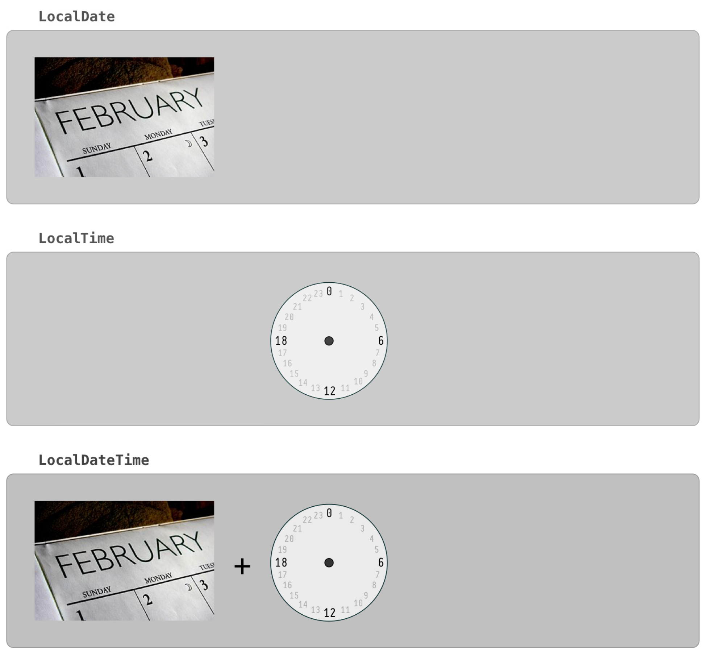
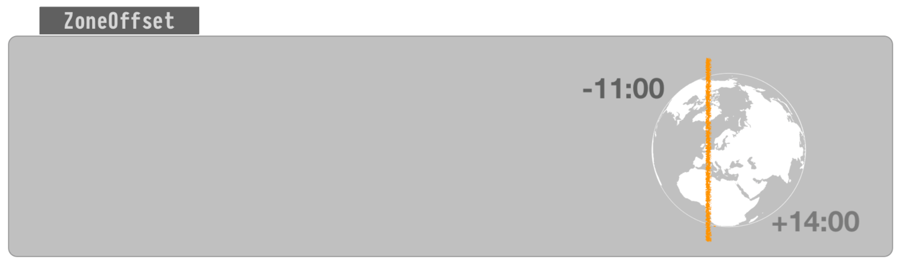
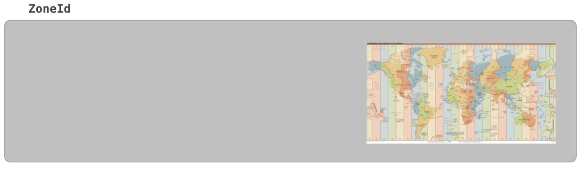
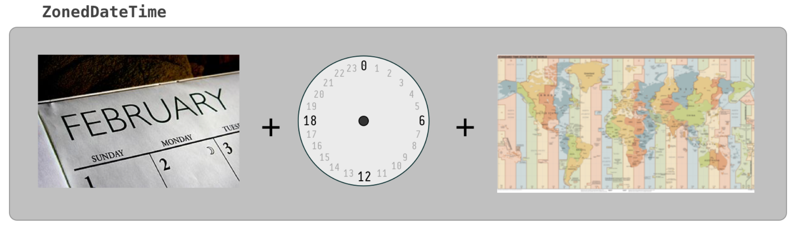
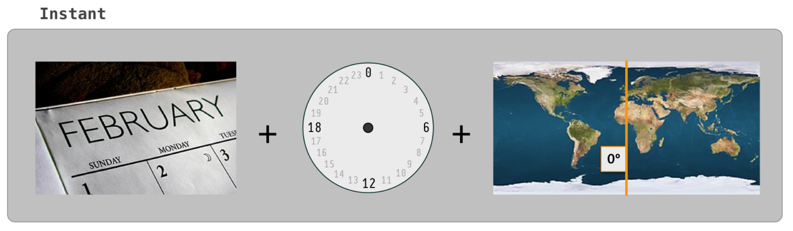
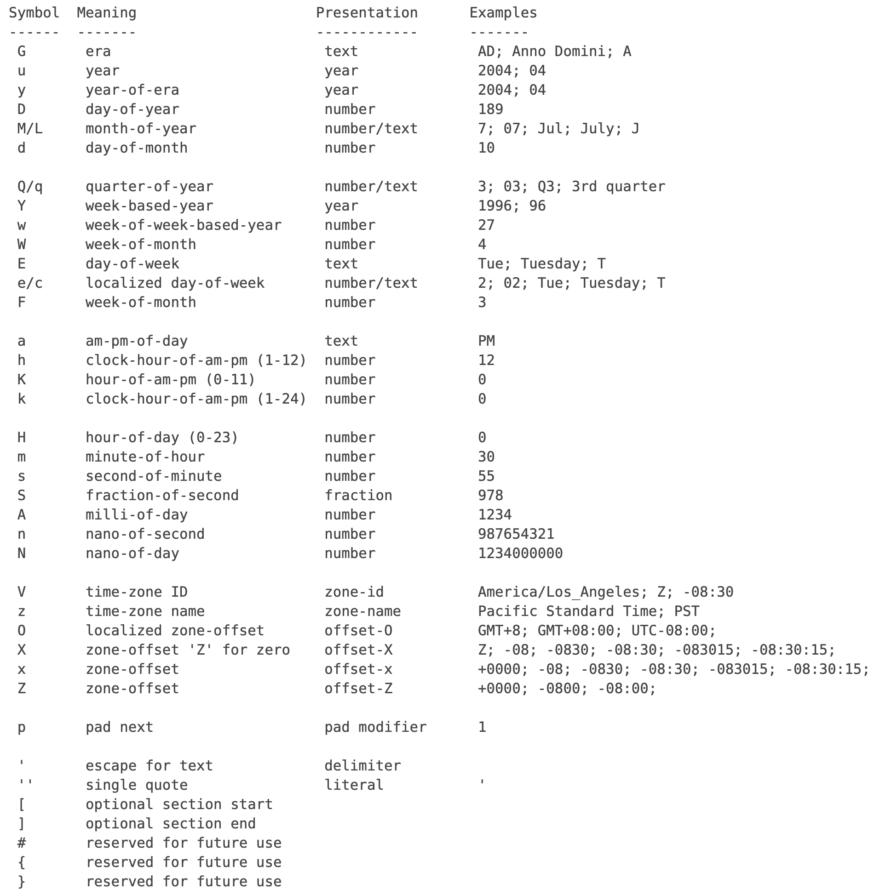

# Chapter 10. 날짜와 시간 & 형식화

# 날짜와 시간

---

### **Date**

- jdk 1.0 부터 제공되어온 클래스
- 기능이 많이 부족하다
- 대부분의 생성자와 메소드가 deprecated되었다

### **Calendar**

- jdk 1.1 부터 제공되었다
- 추상 클래스
- 직접 객체를 생성할 수 없다
- getInstance 메소드를 통해 인스턴스를 생성하는데 시스템의 국가와 지역설정으로 적절한 하위타입을 반환한다

### Calendar의 문제점

- **Mutable**하다
    - Calendar 객체나 Date 객체가 여러 객체에 공유되면, 값 변경에 의해 타 객체에 영향을 미칠 수 있다
- 많은 int 상수가 존재하며, 혼란을 유발한다
    - Calendar에는 많은 int 상수가 존재하며, int 상수 필드로 날짜 연산을 수행한다
    - 엉뚱한 상수가 들어가도 컴파일 시점에 확인할 방법이 없다 - void set(**int field**, int value)
- 중복된 이름의 상속관계
    - java.util.Date와 java.sql.Date
- 월 지정 방식이 헷갈린다
    - Month의 범위는 1-12가 아닌 0-11이다
- 오류에 둔감한 시간대 ID지정
    - 시간대의 ID를 'Asia/Seoul'대신 'Seoul/Asia'로 잘못 지정하면 GMT로 설정된다

> *좋은 API는 오용하기 어려워야 하고, 문서가 없어도 쉽게 사용할 수 있어야 한다.*

**기존의 날짜, 시간 API를 대체하는 라이브러리들**

위 문제점들로 인해 jdk의 날짜, 시간 api를 대체하는 라이브러리가 많이 나와있다

- joda-time
- time and money code library
- calendarDate
- date4j

**joda-time**

Joda-Time은 기본 JDK를 대체하는 날짜와 시간 API 중 가장 널리 쓰인다.

- 불변 객체이다
- LocalDate, DateTime 등으로 지역 시간과 시간대가 지정된 시간을 구분된다
- LocalDate와 LocalTime으로 날짜와 시간을 별도의 클래스로 구분할 수도 있다
- 단위별 날짜 연산 메서드를 지원한다
(plusDays, plusMinutes, plusSeconds 등)
- 월의 int 값과 명칭이 일치한다. 1월은 int 값 1이다
- Duration, Period, Interval 등으로 역할을 분담한 클래스로 구현했다
- 그레고리력과 율리우스력뿐만 아니라 불교, 이슬람교, 콥트교회, 에티오피아의 달력까지도 지원한다
- Spring 프레임워크에서도 Joda-Time을 기본으로 지원한다
(클래스 패스에 Joda-Time이 포함되어 있으면 이 라이브러리의 객체를 변화하는 Converter 구현체를 자동으로 등록해준다)
- Hibernate 프레임워크에서도 Joda-Time을 쓸 수 있다. Joda-time-hibernate 모듈을 이용하면 데이터베이스에 저장된 TIMESTAMPE 같은 타입을 Date 클래스와 같은 JDK의 기본 클래스대신 Joda-Time의 클래스로 매핑할 수 있다
([http://www.joda.org/joda-time-hibernate](http://www.joda.org/joda-time-hibernate))

jdk 8에는 JSR-310이라는 표준 명세로 날짜와 시간에 대한 새로운 API가 추가되었다
(Joda-Time에 가장 많은 영향을 받았고, 그 밖에 Time and Money 라이브러리나 ICU 등 여러 오픈소스 라이브러리를 참고했다고 한다)

# 형식화 클래스

---

데이터를 다양한 형식으로 표현하고, 반대로 어떤 형식의 문자열을 데이터로 쉽게 변환한다

**포맷팅하는 방법**

1. 원하는 출력형식의 패턴을 작성한다
2. 인스턴스를 생성한다
3. 출력하고자 하는 데이터를 매개변수로 format 메소드를 호출한다

**파싱하는 방법**

1. 데이터의 형식의 패턴을 작성한다
2. 인스턴스를 생성한다
3. 파싱하고자 하는 데이터를 매개변수로 parse 메소드를 호출한다

### DecimalFormat

- 숫자를 형식화 함

```java
// 포맷팅
final String pattern = "#.#E0";
final DecimalFormat format = new DecimalFormat(pattern);
final String result = format.format(1234567.89);

// 파싱
final String pattern = "#.#E0";
final DecimalFormat format = new DecimalFormat(pattern);
final Number number = format.parse("1.2E6");
double d = number.doubleValue();
```

### SimpleDateFormat

- 날짜를 형식화함
- 날짜 형식 중 Date 타입을 다루는 클래스이다
- Calendar의 경우 Date로 변환해서 사용해야 한다
- parse의 경우 지정된 형식와 입력된 형식이 일치하지 않는 경우에는 예외가 발생하기 때문에 적절한 예외처리가 필요하다

```java
// 포맷팅
final String pattern = "yyyy-MM-dd";
final SimpleDateFormat format = new SimpleDateFormat(pattern);
final String formattedDate = format.format(date);

// 파싱
final String pattern = "yyyy-MM-dd";
final SimpleDateFormat format = new SimpleDateFormat(pattern);
final Date parsedDated = format.parse(formattedDate);
```

### ChoiceFormat

- 특정 범위에 속하는 값을 문자열로 변환해준다

```java
// 배열로 범위 지정
double[] limits = {60, 70, 80, 90};
String[] grades = {"D", "C", "B", "A"};
int[] scores = {100, 98, 88, 70, 52, 69, 70};
final ChoiceFormat form = new ChoiceFormat(limits, grades);
for (int i = 0; i < scores.length; i++) {
    System.out.println(scores[i] + " : " + form.format(scores[i]));
}

// 패턴으로 범위 지정
String pattern = "60#D|70#C|80<B|90#A";
int[] scores = {100, 98, 88, 70, 52, 69, 70};
final ChoiceFormat form = new ChoiceFormat(pattern);
for (int i = 0; i < scores.length; i++) {
    System.out.println(scores[i] + " : " + form.format(scores[i]));
}
```

### MessageFormat

- 데이터가 들어갈 자리를 마련해놓은 양식을 미리 작성하고, 프로그램을 이용해서 다수의 데이터를 같은 양식으로 출력할 때 사용한다
- {숫자}로 표시된 부분이 데이터가 출력될 자리이다
- 순차적일 필요가 없으며 여러번 반복해서 사용할 수도 있다

# java.time 패키지

---

Date와 Calendar의 단점을 해소하기 위해 java.time 패키지가 추가되었다

가장 큰 특징 : Immutable

- java.time 패키지
- java.time.chrono 패키지
- java.time.format 패키지
- java.time.temporal 패키지
- java.time.zone 패키지

**java.time**

날짜와 시간을 다루는데 필요한 핵심 클래스들을 제공

- Instant
- Duration
- Period
- LocalDate
- LocalTime
- LocalDateTime
- ZonedDateTime
- OffsetDateTime

**java.time.chrono**

표준(iso)가 아닌 달력 시스템을 위한 클래스들을 제공

- ChronoLocalDate
- ChronoLocalDateTime
- ChronoZonedDateTime
- HijrahDate
- JapaneseDate
- ThaiBuddhistDate
- :

**java.time.format**

날짜와 시간을 파싱하고, 형식화하기 위한 클래스들을 제공

- DateTimeFormatter

**java.time.temporal**

날짜와 시간의 필드와 단위를 위한 클래스들을 제공

- Temporal
- TemporalAccessor
- TemporalAdjuster
- TemporalAdjusters
- TemporalAmount

**java.time.zone**

- 시간대와 관련된 클래스들을 제공

### LocalTime, LocalDate, LocalDateTime, ZonedDateTime

java.time 패키지에서는 날짜와 시간을 별도의 클래스로 분리하였다

- LocalTime, LocalDate
- LocalDateTime (LocalTime + LocalDate)
- ZonedDateTime (LocalDateTime + 시간대)

날짜와 시간을 표현하기 위한 클래스들은 모두 Temporal, TemporalAccessor, TemporalAdjuster 인터페이스를 구현하고 있다


TemporalAccessor

- 시간 관련 객체에 대한 read-only 액세스를 정의한 인터페이스이다
- 이 인터페이스는 응용프로그램 코드 레벨에서 사용해서는 널리 사용해서는 안 되는 프레임워크 레벨의 인터페이스다
(응용 프로그램은 LocalDate와 같은 구체적인 유형을 사용해야 함)

Temporal

- TemporalAccessor의 하위 인터페이스
- 시간 객체에 대한 조정 및 조작도 지원

TemporalAdjuster

- 조정기
- 함수형인터페이스
- 시간적 객체를 수정하기 위한 명세
- 전략 패턴에 따라 서로 다른 접근법을 허용하면서 조정 프로세스를 외부화하기 위해 존재한다

LocalDate 멤버 변수들 (인스턴스 변수)

```java
private final int year;
private final short month;
private final short day;
```

LocalTime 멤버 변수들 (인스턴스 변수)

```java
private final byte hour;
private final byte minute;
private final byte second;
private final int nano;
```

LocalDateTime 멤버 변수들 (인스턴스 변수)

```java
private final LocalDate date;
private final LocalTime time;
```

⇒ LocalDate와 LocalTime을 합쳐 LocalDateTime을 만들 수 있고, LocalDateTime을 LocalDate 또는 LocalTime으로 변환할 수 있다 (실제로 toLocalDate하면 date 필드를 반환한다)

ZonedDateTime 멤버 변수들 (인스턴스 변수)

```java
private final LocalDateTime dateTime;
private final ZoneOffset offset;
private final ZoneId zone;
```

⇒ LocalDateTime와 ZoneId 혹은 ZoneOffset으로 ZonedDateTime을 만들 수 있고, ZonedDateTime을 LocalDateTime 으로 변환할 수 있다 (실제로 toLocalDateTime하면 dateTime 필드를 반환한다)

**특정 필드의 값을 가져오기**

- get(), getLong()
- get에 사용할 수 있는 필드의 목록 : ChronoField
- 날짜/시간 타입에 이용할 수 없는 유형(ChronoField)이 있다

```java
final LocalDate today = LocalDate.now();
final int year = today.get(ChronoField.YEAR);
final int day = today.get(ChronoField.DAY_OF_MONTH);
final int month = today.get(ChronoField.MONTH_OF_YEAR);

final LocalDate today = LocalDate.now();
final int year = today.getYear();
final int monthValue = today.getMonthValue();
final Month month = today.getMonth();
final int dayOfMonth = today.getDayOfMonth();
final int dayOfYear = today.getDayOfYear();
final DayOfWeek dayOfWeek = today.getDayOfWeek();

final LocalTime now = LocalTime.now();
final int hour = now.getHour();
final int minute = now.getMinute();
final int second = now.getSecond();
final int nano = now.getNano();
```

**필드의 값 변경하기**

- with(), plus(), minus()

```java
// with
LocalDate with(TemporalField field, long newValue);

LocalDate withYear(int year);
LocalDate withMonth(int month);
:

// plus
LocalDate plus(long amountToAdd, TemporalUnit unit)

LocalDate plusYears(long yearsToAdd)
LocalDate plusMonths(long monthsToAdd)
:
```

**날짜와 시간 비교**

- isAfter(), isBefore(), isEqual()
- equals vs isEqual

```java
final LocalDate kDate = LocalDate.of(1999, 12, 31);
final JapaneseDate jDate = JapaneseDate.of(1999, 12, 31);
Assertions.assertFalse(kDate.equals(jDate));
Assertions.assertTrue(kDate.isEqual(jDate)); // 모든 필드가 일치해야 하는 equals와 달리 오직 날짜만 비교한다
```

객체 생성하는 방법 : now(), of()

(of는 여러가지 버전이 제공된다)

실제로 now는 Instant 인스턴스를 생성하여 계산됨

```java
final LocalTime localTime = LocalTime.now();
final LocalDate localDate = LocalDate.now();
final LocalDateTime localDateTime = LocalDateTime.now();
final ZonedDateTime zonedDateTime = ZonedDateTime.now();
```

**Period와 Duration**

Duration와 Period 모두 TemporalAmount 인터페이스를 구현하고 있다

- Period : 두 날짜 간의 차이를 표현
- Duration : 시간의 차이를 표현

    

TemporalAmount

- 시간의 양을 위한 베이스 인터페이스
- 이 인터페이스는 프레임워크 레벨의 인터페이스로, 응용프로그램 코드에서 널리 사용해서는 말아야 한다
- 응용 프로그램은 Period 및 Duration과 같은 구체적인 유형의 인스턴스를 만들고 전달해야 한다

**TemporalUnit**

날짜와 시간의 단위를 저장해놓은 인터페이스

enum ChronoUnit이 이 TemporalUnit 인터페이스를 구현했다

**TemporalField**

년, 월, 일 등 날짜와 시간의 필드를 정의해놓은 인터페이스

enum ChronoField이 이 TemporalField 인터페이스를 구현했다

### Instant

Epoch time(1970년 1월 1일 0시 0분 0초)으로부터 경과된 시간을 나노초 단위로 표현한 것이다

생성방법 : now(), ofEpochSecond(), ofEpochMilli()

저장된 값을 가져올 때 : .getEpochSecond(), .getNano()

(Instant는 시간을 초 단위와 나노초 단위로 나누어 저장한다)

Instant는 항상 UTC를 기준으로 한다 (따라서 LocalTime과 차이가 있을 수 있다)

시간대를 고려해야 한다면 OffsetDateTime/ZonedDateTime을 사용하는 것이 더 날 수 있다

### ZonedDateTime

**Time Zone (시간대)**

- 표준 시간이 같은 지역을 묶어서 Time Zone 규칙 집합을 정의한다

**ZoneId**

- 지역 ID는 '지역/도시' 형식으로 이뤄지며 IANA Time Zone Database에서 제공하는 지역 집합 정보를 사용한다
- ZoneId 객체를 얻은 다음에 LocalDate, LocalDateTime, Instant를 이용해서 ZonedDateTime 인스턴스로 반환할 수 있다
- ZoneId의 getRules()를 이용해서 해당 시간대의 규정을 획득할 수 있다
- 기존에는 TimeZone 클래스로 시간대를 다뤘지만, java.time 패키지에서는 ZoneId라는 클래스를 사용한다
- ZoneId는 일광 절약시간을 자동적으로 처리해준다

**ZoneOffset**

UTC로부터 얼마나 떨어져있는지를 표현한다

**OffsetDateTime**

ZonedDateTime은 ZoneId로 구역을 표현하는데, ZoneId가 아닌 ZoneOffset을 사용하는 것이 OffsetDateTime이다

ZoneId는 일광절약시간처럼 시간대에 관련된 규칙을 포함하고 있지만, ZoneOffset은 시간대를 시간의 차이로만 구분한다

**LocalDate VS LocalTime VS LocalDateTime VS ZonedDateTime VS Instant VS OffsetDateTime VS ZoneId VS ZoneOffset**








### TemporalAdjusters

자주 쓰일만한 날짜 계산들을 대신 해주는 메소드를 정의해놓은 클래스

메소드 목록 : [https://docs.oracle.com/javase/8/docs/api/java/time/temporal/TemporalAdjusters.html](https://docs.oracle.com/javase/8/docs/api/java/time/temporal/TemporalAdjusters.html)

필요하다면 자주 사용되는 날짜 계산을 해주는 메소드를 직접 만들수도 있다

LocalDate의 with()는 다음과 같이 정의되어있으며 TemporalAdjuster 인터페이스를 구현한 클래스의 객체를 매개변수로 제공해야 한다
→ 따라서 TemporalAdjuster 인터페이스를 구현하기만 하면 된다

### Period, Duration

**between()**

날짜끼리의 차이, 시간끼리의 차이를 구할 수 있다

```java
final Period period = Period.between(date1, date2);
final Duration between = Duration.between(time1, time2);
```

Duration에는 Chrono.SECONDS와 Chrono.NANOS밖에 사용할 수 없다

왜 HOUR와 MINUTE는 못쓰는걸까..?

⇒ 왜냐면 java spec이 그러하니까..!

Duration : 다른 단위로 변환

- to로 시작
- 특정 단위로 변환한 결과를 반환한다

**기타 메소드**

until() : between과 거의 같지만, 인스턴스 메소드다

of() : Period와 Duration에게도 of가 있다

with() : 특정 필드의 값을 변경한다

multipliedBy/dividedBy  : 매개변수만큼 곱하거나 나눈다. 나누는 것은 Duration만 할 수 있다

isNegative/isZero : 음수인지, 0인지 확인한다

negate/abs : 부호를 반대로 변경하거나, 부호를 없앤다

normalized : 월의 값이 12를 넘지 않도록 변경해준다

### 파싱과 포맷

관련 패키지 : java.time.format

이 클래스에는 자주 쓰이는 다양한 형식들을 기본적으로 정의하고 있지만, 형식이 필요하다면 직접 정의해서 사용할 수 있다



**format()**

날짜와 시간의 형식화에는 위와 같이 format이 사용된다

이 메소드는 DateTimeFormatter 뿐 아니라 LcaolDate나 LocalTime같은 클래스에도 있기 때문에 상황에 따라 편한 쪽을 선택하면 된다

DateTimeFormatter에 상수로 정의된 형식들의 목록

**출력형식 직접 정의하기**

출력 형식을 직접 작성할 수 있다
https://meet.google.com/fjn-irma-fho

문자열을 날짜와 시간으로 파싱하기

parse : 문자열을 날짜 또는 시간으로 변환한다

날짜와 시간을 표현하는데 사용되는 클래스에는 이 메소드가 거의 다 포함되어있다

대표적으로 많이 쓰이는 parse 메소드는

```java
public static LocalDateTime parse(CharSequence text);
public static LocalDateTime parse(CharSequence text, DateTimeFormatter formatter);
```

(자주 사용되는 기본적인 형식의 문자열은 형식화 상수를 사용하지 않아도 파싱이 가능하다)

```java
System.out.println(LocalDate.parse("2021-01-23"));
System.out.println(LocalTime.parse("11:11:11"));
System.out.println(LocalDateTime.parse("2021-01-23T11:11:11"));

final DateTimeFormatter pattern = DateTimeFormatter.ofPattern("yyyy-MM-dd HH:mm:ss");
System.out.println(LocalDateTime.parse("2021-01-23 07:07:07", pattern));
```

Reference

Date와 Calendar 클래스

- [https://sujl95.tistory.com/2](https://sujl95.tistory.com/2)
- [https://sujl95.tistory.com/3](https://sujl95.tistory.com/3)
- [https://hamait.tistory.com/205](https://hamait.tistory.com/205)

JDK의 기본 날짜 클래스의 문제점

- [https://d2.naver.com/helloworld/645609](https://d2.naver.com/helloworld/645609)

Import vs LocalDateTime

- [https://stackoverflow.com/questions/32437550/whats-the-difference-between-instant-and-localdatetime/32443004](https://stackoverflow.com/questions/32437550/whats-the-difference-between-instant-and-localdatetime/32443004)

왜 Duration에는 get(ChronoUnit.MINUTES/HOURS)를 지원하지 않냐

- [https://stackoverflow.com/questions/24491243/why-cant-i-get-a-duration-in-minutes-or-hours-in-java-time](https://stackoverflow.com/questions/24491243/why-cant-i-get-a-duration-in-minutes-or-hours-in-java-time)