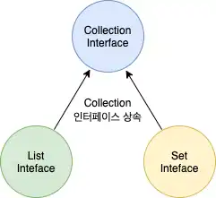

# Chapter 11. 컬렉션 프레임웍

> ‘데이터 그룹을 다루고 표현하기 위한 단일화된 구조’ - Java API문서

> JDK1.2 이전까지는 Vector, Hashtable, Properties와 같은 컬렉션 클래스들을 각자의 방식으로 처리

## 1. 컬렉션 프레임웍의 핵심 인터페이스

---

- 컬렉션 프레임워크에서는 각 컬렉션을 다루는 데 필요한 기능을 가진 3개의 인터페이스를 정의했다.
- 인터페이스 `List`와 `Set`의 공통된 부분을 다시 뽑아서 새로운 인터페이스인 `Collection`을 추가로 정의했다.



- `List`
    - 순서가 있는 데이터의 집합. 데이터의 중복을 허용한다.
    - 구현클래스 : `ArrayList`, `LinkedList`, `Stack`, `Vector` 등
- `Set`
    - 순서를 유지하지 않는 데이터의 집합. 데이터의 중복을 허용하지 않는다.
    - 구현클래스 : `HashSet`, `TreeSet` 등
- `Map`
    - 키(`key`)와 값(`value`)으로 쌍(`pair`)으로 이루어진 데이터의 집합. 순서는 유지되지 않으며, 키는 중복을 허용하지 않고, 값은 중복을 허용한다.

- 컬렉션 클래스들 명명 특징
    - 구현한 인터페이스 이름이 클래스의 이름에 포함
    - `Vector`, `Stack`, `Hashable`, `Properties`와 같은 클래스들은 컬렉션 프레임웍이 만들어지기 이전부터 존재하던 것이기 때문에 컬렉션 프레임웍의 명명법을 따르지 않음
    - `Vector`나 `Hashable`과 같은 기존의 컬렉션 클래스들은 가능하면 사용하지 않는 것이 좋음
    - 대신 새로 추가된 `ArrayList`와 `HashMap` 사용 권장

### Collection 인터페이스

---

- `List`와 `Set`의 조상으로, 컬렉션 클래스에 저장된 데이터를 읽고, 추가하고 삭제하는 등 컬렉션을 다루는데 가장 기본적인 메서드들을 정의


### List 인터페이스

---

- 중복을 허용하면서 저장순서가 유지되는 컬렉션을 구현하는데 사용


### Set 인터페이스

---

- 중복을 허용하지 않고 저장순서가 유지되지 않는 컬렉션 클래스를 구현하는데 사용


### Map 인터페이스

---

- 키(`key`)와 값(`value`)을 하나의 쌍으로 묶어서 저장
- 키는 중복될 수 없지만 값은 중복을 허용
    - 값(`value`)은 중복을 허용하기 때문에 `Collection`타입으로 반환하고 키(`key`)는 중복을 허용하지 않기 때문에 `Set`타입으로 반환
- 중복된 키와 값을 저장하면 기존의 값은 없어지고 마지막에 저장된 값이 남음


### Map.Entry인터페이스

---

- `Map`에 저장되는 key-value쌍을 다루기 위해서 `Map` 인터페이스의 내부 인터페이스로 인터페이스 안에 인터페이스를 정의

    ```java
    public interface Map {
      ...
      interface Entry {
        Object getKey();
        Object getValue();
        ...
      }
    }
    ```

- `Map`인터페이스를 구현하는 클래스는 `Map.Entry`인터페이스도 함께 구현해야 한다.


## 2. ArrayList

---

- 가장 많이 사용되는 컬렉션 클래스
- 데이터의 저장순서가 유지되고 중복을 허용
- 기존의 `Vector`와 구현 원리, 기능적 측면에서 동일하지만 가능하면 `Vector`보다는 `ArrayList`를 사용
- `Object`배열을 이용해서 데이터를 저장하는데 배열에 저장 공간이 없으면(기본 크기 10) 보다 큰 새로운 배열을 생성해서 기존의 배열에 저장된 내용을 새 배열로 복사한 다음에 저장

    ```java
    public class ArrayList extends abstractList implements List, RandomAccess, Cloneable, java.io.Serializable {
      ...
      transient Object[] elementData;  // Object 배열
      ...
    }
    ```

- 생성자 및 메서드

    

- `ArrayList` 생성 시, 실제 저장할 개수보다 약간 여유있는 크기로 하는 것이 좋다. 생성할 때 지정한 크기보다 더 많은 객체를 저장하면 자동적으로 크기가 늘어나기는 하지만 이 과정에서 처리시간이 많이 소요되기 때문이다.
- `ArrayList`나 `Vector` 같이 배열을 이용한 자료구조는 데이터를 읽어오고 저장하는 데는 효율이 좋지만,
- 용량을 변경해야할 때는 새로운 배열을 생성한 후 기존의 배열로부터 새로 생성된 배열로 데이터를 복사해야하기 때문에 상당히 효율이 떨어진다는 단점이 있다.
    - 그래서 처음에 인스턴스를 생성할 때, 저장할 데이터의 개수를 잘 고려하여 충분한 용량의 인스턴스를 생성하는 것이 좋다.

- `List`인터페이스 중 `remove`의 경우 이해하기 어려울 수도 있기 때문에 단계별로 설명한다.
    1. 삭제할 데이터의 아래에 있는 데이터를 한 칸씩 위로 복사해서 삭제할 데이터를 덮어쓴다.

        ```java
        System.arraycopy(data, 3, data, 2, 2)
        // data[3]에서 data[2]로 2개의 데이터를 복사하라는 의미
        ```

    2. 데이터가 모두 한 칸씩 위로 이동하였으므로 마지막 데이터는 `null`로 변경해야 한다.

        ```java
        data[size-1] = null;
        ```

    3. 데이터가 삭제되어 데이터의 개수가 줄었으므로 size의 값을 1 감소시킨다.

        ```java
        size--;
        ```

> 배열에 객체를 순차적으로 저장할 때와 객체를 마지막에 저장된 것부터 삭제하면 `System.arraycopy()`를 호출하지 않기 때문에 작업시간이 짧지만, 배열의 중간에 위치한 객체를 추가하거나 삭제하는 경우 `System.arraycopy()`를 호출해서 다른 데이터의 위치를 이동시켜줘야 하기 때문에 다루는 데이터의 개수가 많을수록 작업시간이 오래 걸린다는 것이다.

## 3. LinkedList

---

- 배열의 장점
    - 가장 기본적인 형태의 자료구조로, 구조가 간단하며 사용하기 쉽다.
    - 데이터를 읽어오는 데 걸리는 시간(접근 시간, access time)이 가장 빠르다.
- 배열의 단점
    - 크기를 변경할 수 없다.
        - 크기를 변경할 수 없으므로 새로운 배열을 생성해서 데이터를 복사하는 작업이 필요하다.
        - 실행속도를 향상시키기 위해서는 충분히 큰 크기의 배열을 생성해야 하므로 메모리가 낭비된다.
    - 비순차적인 데이터의 추가 또는 삭제에 시간이 많이 걸린다.
        - 차례대로 데이터를 추가하고 마지막에서부터 데이터를 삭제하는 것은 빠르지만,
        - 배열의 중간에 데이터를 추가하려면, 빈자리를 만들기 위해 다른 데이터들을 복사해서 이동해야 한다.

→ 배열의 단점을 보완하기 위해 `LinkedList`는 불연속적으로 존재하는 데이터를 서로 연결(link)한 형태로 구성되어 있다.

### LinkedList

---


- `LinkedList`의 각 요소(node)들은 자신과 연결된 다음 요소에 대한 참조(주소값)와 데이터로 구성되어 있다.

    ```java
    class Node {
      Node next;  // 다음 요소의 주소를 저장
      Object obj; // 데이터를 저장
    }
    ```

- 삭제
    - 삭제하고자 하는 요소의 이전 요소가 삭제하고자 하는 요소의 다음 요소를 참조하도록 변경한다.
    - 단 하나의 참조만 변경하면 되므로 처리 속도가 매우 빠르다.

    

- 추가
    - 새로운 요소를 생성한 후 추가하고자 하는 위치의 이전 요소의 참조를 새로운 요소에 대한 참조로 변경해주고, 새로운 요소가 그 다음 요소를 참조하도록 변경한다.
    - 처리 속도가 매우 빠르다.

    

→ 접근성: 이동 방향이 단방향이기 때문에 다음 요소에 대한 접근은 쉽지만, 이전 요소에 대한 접근이 어렵다.

- 생성자 및 메서드

    

### Doubly LinkedList

---

- 이중 연결 리스트, `LinkedList`의 접근성을 보완한 것
- 참조변수를 하나 더 추가하여 이전 요소에 대한 참조가 가능하도록 했을 뿐, 그 외는 `LinkedList`와 동일하다.
- 접근과 이동이 쉽기 때문에 `LinkedList`보다 많이 사용된다.


```java
class Node {
  Node next;      // 다음 요소의 주소를 저장
  Node previous;  // 이전 요소의 주소를 저장
  Object obj;     // 데이터를 저장
}
```

### Doubly Circular LinkedList

---

- 이중 원형 연결 리스트, `Doubly LinkedList`보다 접근성을 향상 시킨 것
- 단순히 `Doubly LinkedList`의 첫 번째 요소와 마지막 요소를 서로 연결시켰다.
- 실제로 `LinkedList` 클래스는 이름과 달리, 낮은 접근성(accessability)을 높이기 위해 `Doubly Circular LinkedList`로 구현했다.


- ArrayList vs.LinkedList
    - 순차적으로 추가/삭제 (ArrayList의 크기가 충분한 경우)

        작업 속도 :  ArrayList > LinkedList

        만일 ArrayList의 크기가 충분하지 않으면 LinkedList가 더 빠를 수 있다.

    - 중간 데이터를 추가/삭제 (데이터가 많을 경우)

        작업 속도 :  ArrayList < LinkedList

        데이터의 개수가 적다면 어느 것을 사용해도 큰 차이가 없다.

- ArrayList & LinkedList (조합)

    : 처음에 작업하기 전에 데이터를 저장할 때 `ArrayList`를 사용한 후, 작업할 때 `LinkedList`로 데이터를 옮겨서 작업하여 효율을 높일 수 있다.

    ```java
    /*처음 순차적으로 저장할 때 ArrayList 이용*/
    ArrayList arraylist = new ArrayList(1000000);

    for(int i=0; i<1000000;i++){
    	arraylist.add(i+"");
    }

    /*중간에 데이터를 넣는 작업을 할 때는 LinkedList로 옮겨서 작업하면
    보다 높은 효율을 얻을 수 있다.*/
    LinkedList linkedList = new LinkedList(arraylist);

    for(int i=0; i<1000;i++) {
    	linkedList.add(500,"X");
    }
    ```

## 4. Stack 과 Queue

---

### Stack

---

- 마지막에 저장한 데이터를 가장 먼저 꺼내게 되는 LIFO 구조

    ```java
    public class Stack<E> extends Vector<E> {
        public Stack() {
        }

        public E push(E item) {
            addElement(item);

            return item;
        }

        public synchronized E pop() {
            E obj;
            int len = size();

            obj = peek();
            removeElementAt(len - 1); // 마지막 요소 삭제. 배열의 index가 0부터 시작하므로 1을 뺀다.

            return obj;
        }

        public synchronized E peek() {
            int len = size();

            if (len == 0)
                throw new EmptyStackException(); 
            return elementAt(len - 1); // 마지막 요소 반환. 배열의 index가 0부터 시작하므로 1을 뺀다.
        }

        public boolean empty() {
            return size() == 0;
        }

        public synchronized int search(Object o) {
            int i = lastIndexOf(o); // 끝에서부터 객체를 찾아 저장된 위치(배열의 index)를 반환한다.

            if (i >= 0) {
                return size() - i;  // Stack은 맨 위에 저장된 객체의 index를 1로 정의한다.
            }
            return -1;              // 해당 객체를 찾지 못하면 -1 반환.
        }

        private static final long serialVersionUID = 1224463164541339165L;
    }
    ```

- `ArrayList`로 구현하는 것이 적합하다.
    - 순차적으로 데이터를 추가하고 삭제하기 때문이다.
- 활용 : undo/redo, 웹브라우저의 뒤로가기/앞으로가기, 메소드 호출

    ```java
    import java.util.Stack;

    public class Test {
        public static Stack<Integer> back = new Stack<>();
        public static Stack<Integer> forward = new Stack<>();

        public static void main(String[] args) {
            goIndex(0);
            goIndex(1);
            goIndex(2);
            status();

            goBack();
            status();

            goBack();
            status();

            goForward();
            status();
        }

        public static void goIndex(int index) {
            back.push(index);
            if (!forward.empty()) {
                forward.clear();
            }
        }

        public static void goForward() {
            if (!forward.empty()) {
                back.push(forward.pop());
            }
        }

        public static void goBack() {
            if (!back.empty()) {
                forward.push(back.pop());
            }
        }

        public static void status() {
            System.out.println("back : " + back);
            System.out.println("forward : " + forward);
            System.out.println("now index : " + back.peek());
        }
    }
    ```

    - 결과

        ```java
        back : [0, 1, 2]
        forward : []
        now index : 2

        back : [0, 1]
        forward : [2]
        now index : 1

        back : [0]
        forward : [2, 1]
        now index : 0

        back : [0, 1]
        forward : [2]
        now index : 1
        ```


### Queue

---

- 처음에 저장한 데이터를 가장 먼저 꺼내게 되는 FIFO 구조
- 데이터의 추가/삭제가 쉬운 `LinkedList`로 구현하는 것이 적합하다.
    - 데이터를 꺼낼 때마다 빈 공간을 채우기 위해 데이터의 복사가 발생하므로 비효율적이다.
- 활용: 대기 목록, 버퍼(buffer), 리눅스의 history 명령, 프로그램 최근 사용 목록


- 참고로 `Stack`은 클래스, `Queue`는 인터페이스
    - Stack vs Queue

        ```java
        import java.util.LinkedList;
        import java.util.Queue;
        import java.util.Stack;

        public class StackAndQueue {
            public static void main(String[] args) {
                Stack stack = new Stack();
                Queue queue = new LinkedList(); // Queue인터페이스 구현체인 LinkedList

                stack.push("0");
                stack.push("1");
                stack.push("2");

                queue.offer("0");
                queue.offer("1");
                queue.offer("2");

                System.out.println("=========Stack=========");
                while (!stack.empty()) {
                    System.out.println(stack.pop());
                }

                System.out.println("=========Queue=========");
                while (!queue.isEmpty()) {
                    System.out.println(queue.poll());
                }
            }
        }
        ```

        - 결과

            ```java
            =========Stack=========
            2
            1
            0
            =========Queue=========
            0
            1
            2
            ```

    - Queue 인터페이스를 구현한 클래스들이 있어서 이 들 중의 하나를 선택해서 사용하면 된다.

        

### PriorityQueue

---

- `Queue` 인터페이스의 구현체 중 하나
- 저장공간으로 배열을 사용하며, 각 요소를 힙(heap)의 형태로 저장한다.
    - 이진 트리의 한 종류, 가장 큰 값이나 가장 작은 값을 빠르게 찾을 수 있다.
- 저장 순서와 관계없이 우선순위가 높은 것부터 꺼낸다.
- `null`을 저장하면 `NullPointerException`이 발생한다.
- 우선순위 `priority`
    - 객체: 각 객체의 크기를 비교할 수 있는 방법을 제공해야 한다.
    - 숫자: 작을수록 높다. Number의 자손들은 자체적으로 숫자를 비교하는 방법을 정의하고 있다.

        `input [1, 2, 5, 3, 4]`

        `output [1, 2, 3, 4, 5]`

    ```java
    Queue<Integer> qu = new PriorityQueue<>();
    qu.offer(1);                           // qu.offer(new Integer(1)); 오토박싱
    ```

### Deque

---

- Double-Ended Queue, 큐와 달리 양쪽 끝에 추가/삭제가 가능하다.
- 구현체 : `ArrayDeque`, `LinkedList` 등
- 스택과 큐를 하나로 합쳐놓은 것과 같다.

    

## 5. Iterator, ListIterator, Enumeration

---

- `Iterator`, `ListIterator`, `Enumeration`은 모두 컬렉션에 저장된 요소를 접근하는데 사용되는 인터페이스
- `Enumeration`은 `Iterator`의 구버전이며, `ListIterator`는 `Iterator`의 기능을 향상시킨 것이다.

### Iterator

---

- 컬렉션 프레임워크에서는 컬렉션에 저장된 요소들을 읽어오는 방법을 표준화하였다.
- 컬렉션에 저장된 각 요소에 접근하는 기능을 가진 `Iterator`인터페이스를 정의
- `Collection`인터페이스에는 `Iterator`(Iterator를 구현한 클래스의 인스턴스)를 반환하는 `iterator()`를 정의하고 있다.
    - List나 Set 인터페이스를 구현하는 컬렉션마다 각 컬렉션의 특징에 알맞게 작성되어 있다.

    ```java
    public interface Iterator {
      boolean hasNext();
      Object next();
      void remove();
    }

    public interface Collection {
      // Collection 인터페이스에 Iterator를 반환하는 iterator() 메소드 정의
      public Iterator iterator();
      ...
    }
    ```

- 단방향으로 이동 → 재사용 X. 마지막 요소에 다다르면 더 이상 사용할 수 없다.


- 사용
    - List, Set 인터페이스를 구현한 컬렉션 클래스
        - 컬렉션 클래스에 대해 `iterator()`를 호출하여 `Iterator`를 얻는다.
    - Map 인터페이스를 구현한 컬렉션 클래스
        - 키와 값을 각각 따로 `Set`의 형태로 얻어온 후 `Set` 인스턴스의 `iterator()`를 호출해서 얻는다.

        ```java
        Map<String, Integer> map = new HashMap<>();

        Iterator<String> it1 = map.keySet().iterator();
        Iterator<Entry<String, Integer>> it2 = map.entrySet().iterator();
        ```

    - 주로 while문을 사용해서 컬렉션 클래스의 요소들을 읽어온다.

        ```java
        List<String> list = new ArrayList<>();
        Iterator<String> it = list.iterator();

        while (it.hasNext()) {
            System.out.println(it.next());
        }
        ```

- 재사용성
    - 공통 인터페이스를 정의해서 표준을 정의하고 구현 → 코드의 일관성을 유지하여 재사용성을 극대화했다.

    ```java
    List<String> list = new ArrayList<>();
    list = new LinkedList<>();
    ```

    - `List` 인터페이스를 구현한 다른 클래스로 바꿔야할 때 선언문만 변경하면 된다.
    - 참조변수의 타입이 `List`이므로 `List`에 정의되지 않은 메서드는 사용되지 않았을 것이 확실하기 때문
    - 따라서 `List`에 없고 특정 클래스에만 있는 메서드를 사용하는 게 아니라면, `List` 타입의 참조변수로 선언하는 것이 좋다.

### Enumeration

---

- `Iterator`의 구버전
- 컬렉션 프레임웍이 만들어지기 이전에 사용하던 것, 이전 버전으로 작성된 소스와의 호환을 위해 남겨졌다. 가능하면 `Enumeration` 대신 `Iterator` 사용을 권장하고 있다.
- `Iterator`와 메서드 이름만 다를 뿐 기능은 같다.


### ListIterator

---

- `Iterator`에 이전 방향으로의 접근 기능을 추가한 것
- 양방향 이동 → 각 요소간의 이동이 자유롭다.
- `List` 인터페이스를 구현한 컬렉션에서만 사용 가능하다.

    ```java
    //list 생성 
    List list = new ArrayList();

    //list에 1,2추가
    list.add(1);
    list.add(2);

    //collection class인 List의 listIterator()를 호출해서 ListIterator를 구현한 개체를 얻는다.  
    ListIterator lit = list.listIterator();

    //다음 요소의 유무 확인 
    while(lit.hasNext()){
        //다음요소를 읽는다. 
        System.out.println(lit.next());
        
        //다른 객체로 대체
        lit.set("a");
    }

    //이전 요소의 유무 확인 
    while(lit.hasPrevious()){
        //이전요소를 읽는다. 
        System.out.println(lit.previous());
    }
    ```

    - 결과

        ```java
        1
        2
        a
        a
        ```


- 선택적 기능
    - 반드시 구현하지 않아도 된다.
    - 구현하지 않을 경우, 예외를 던져서 구현되지 않은 기능이라는 것을 메서드를 호출하는 쪽에 알리는 것이 좋다.

## 6. Arrays

---

- `Arrays`클래스에는 배열을 다루는데 유용한 메서드가 정의되어 있다.
- 같은 기능의 static 메서드가 배열의 타입만 다르게 오버로딩되어 있다.
- 배열의 복사 - copyOf(), copyOfRange()
    - `copyOf()`: 배열 전체를 복사한다.

        ```java
        int[] arr = { 0, 1, 2, 3, 4 };
        int[] arr1 = Arrays.copyOf(arr, arr.length); // [0, 1, 2, 3, 4]
        int[] arr2 = Arrays.copyOf(arr, 3);          // [0, 1, 2]
        ```

    - `copyOfRange()`: 배열의 일부를 복사해서 새로운 배열을 만들어 반환한다. 지정된 범위의 끝은 포함되지 않는다.

        ```java
        int[] arr = { 0, 1, 2, 3, 4 };
        System.out.println(arr);               // [I@15db9742

        arr = Arrays.copyOfRange(arr, 1, 3);   // [1, 2]
        System.out.println(arr);               // [I@6d06d69c
        ```

- 배열 채우기 - fill(), setAll()
    - `fill()`: 배열의 모든 요소를 지정된 값으로 채운다.

        ```java
        int[] arr = new int[5];
        Arrays.fill(arr, 9);
        System.out.println(Arrays.toString(arr));  // 9, 9, 9, 9, 9
        ```

    - `setAll()`: 배열을 채우는데 사용할 람다식 또는 함수형 인터페이스를 구현한 객체를 매개변수로 받는다.

        ```java
        int[] arr = new int[5];
        Arrays.setAll(arr, i -> (int) ((Math.random() * 5) + 1)); // [5, 3, 1, 1, 3]
        ```

- 배열의 정렬과 검색 - sort(), binarySearch()
    - `sort()`: 배열을 정렬한다.

        ```java
        int[] arr = { 1, 5, 9, 2, 4 };
        Arrays.sort(arr);                // [1, 2, 4, 5, 9]
        ```

    - `binarySearch()`: 배열에 저장된 요소를 검색하여 그 위치를 반환한다.
        - 배열이 정렬된 상태에 사용해야 올바른 결과를 얻을 수 있다.
        - 검색하는 값과 일치하는 요소가 여러 개일 경우 어떤 것의 위치가 반환될지 알 수 없다.

        ```java
        int[] arr = { 1, 5, 9, 2, 4 };
        int index = Arrays.binarySearch(arr, 9);    // 2

        Arrays.sort(arr);                           // [1, 2, 4, 5, 9]
        index = Arrays.binarySearch(arr, 9);        // 4
        ```

- 문자열의 비교와 출력 - equals(), toString()
    - `equals()`: 두 배열에 저장된 모든 요소를 비교하여 같으면 `true`를 반환한다.
        - 1차원 배열에만 사용 가능하다.
        - 다차원 배열의 비교는 `deepEquals()`를 사용한다.

        ```java
        int[][] arr2D = { { 1, 1 }, { 1, 2 } };
        int[][] arr2D2 = { { 1, 1 }, { 1, 2 } };

        System.out.println(Arrays.equals(arr2D, arr2D2) + "");     // false
        System.out.println(Arrays.deepEquals(arr2D, arr2D2) + ""); // true
        ```

    - `toString()`: 배열의 모든 요소를 문자열로 편하게 출력할 수 있다.
        - 1차원 배열에만 사용 가능하다.
        - 다차원 배열에는 `deepToString()`을 사용한다.

        ```java
        int[] arr = { 1, 2, 4, 5, 9 };
        int[][] arr2D = { { 1, 1 }, { 1, 2 } };

        System.out.println(Arrays.toString(arr));          // [1, 2, 4, 5, 9]
        System.out.println(Arrays.deepToString(arr2D));    // [[1, 1], [1, 2]]
        ```

- 배열을 List로 변환 - asList(Object... a)

    ```java
    List list = Arrays.asList(new Integer[] { 1, 3, 5, 7, 9 }); // [1, 3, 5, 7, 9]
    // == List<Integer> list = Arrays.asList(1, 3, 5, 7, 9);
    ```

    - 배열을 `List`에 담아서 반환한다.
        - 반환된 `List`는 크기를 변경할 수 없다. → 추가/삭제 불가능
        - 저장된 내용은 변경 가능하다.
    - 크기를 변경할 수 있는 `List`가 필요한 경우 다음과 같이 한다.

        ```java
        List<Integer> copy = new ArrayList<>(list);
        // == List<Integer> copy = new ArrayList<>(Arrays.asList(1, 3, 5, 7, 9));
        ```

- parallelXXX(), spliterator(), stream()
    - 람다와 스트림과 관련된 메서드
    - `parallelXXX()`: parallel로 시작하는 이름의 메서드들. 여러 쓰레드가 작업을 나누어 처리하도록 하여 보다 빠른 결과를 얻을 수 있다.
    - `spliterator()`: 하나의 작업을 여러 쓰레드가 처리할 수 있게 여러 작업으로 나누는 `Spliterator`를 반환한다.
    - `stream()`: 컬렉션을 스트림으로 변환한다.

## 7. Comparator와 Comparable

---

- 컬렉션을 정렬하는 데 필요한 메서드를 정의하고 있는 인터페이스
- `Comparable`을 구현한 클래스는 정렬이 가능하다.

### java.util.Comparator<T>

---

- 기본 정렬 기준 외에 다른 기준으로 정렬하고 싶을 때 사용한다.

```java
public interface Comparator<T> {
    int compare(T o1, T o2);
    ...
}
```

- 구현할 때 `equals()`를 오버라이딩할 필요가 있을 수 있다.

### java.lang.Comparable<T>

---

- 기본 정렬 기준을 구현하는 데 사용한다.

```java
public interface Comparable<T>{
    public int compareTo(T o);
}
```

- `compareTo()`: 두 객체를 비교한다.
    - 같으면 0, 비교하는 값보다 작으면 음수, 크면 양수를 반환하도록 구현해야 한다.
- 구현 클래스들은 기본적으로 오름차순으로 정렬되어 있다.
- 내림차순이나 다른 기준에 의해서 정렬되도록 하고 싶을 때는 `Comparator`를 구현해서 정렬 기준을 제공할 수 있다.
- 예시: Integer 클래스

    ```java
    public final class Integer extends Number implements Comparable<Integer> {
        ...
        public int compareTo(Integer anotherInteger) {
            return compare(this.value, anotherInteger.value);
        }

        public static int compare(int x, int y) {
            // 비교하는 값이 크면 -1, 같으면 0, 작으면 1을 반환
            return (x < y) ? -1 : ((x == y) ? 0 : 1);
        }
    }
    ```

- `Arrays.sort()`: 배열을 정렬할 때, `Comparator`를 지정해주지 않으면 저장하는 객체에 구현된 내용에 따라 정렬된다.

    ```java
    public static void sort(Object[] a) // 객체 배열에 저장된 객체가 구현한 Comparable에 의한 정렬
    public static <T> void sort(T[] a, Comparator<? super T> c) // 지정한 Comparator에 의한 정렬
    ```

- `String`의 Comparable 구현은 문자열이 사전 순으로 정렬되도록 작성되어 있다.
    - 문자열의 오름차순 정렬은 공백, 대문자, 소문자 순으로, 문자의 유니코드의 순서가 작은 값에서부터 큰 값으로 정렬된다.
    - 대소문자 구분없이 정렬: 제공하는 상수 `Comparator` 사용

        ```java
        public static final Comparator<String> CASE_INSENSITIVE_ORDER = new CaseInsensitiveComparator();
        ```

        ```java
        Arrays.sort(strArr, String.CASE_INSENSITIVE_ORDER);
        ```

    - 내림차순 정렬: `String`에 구현된 `compareTo()` 결과에 -1을 곱하거나 `c2.compareTo(c1)`한다.

        ```java
        public class Test implements Comparator {
            @Override
            public int compare(Object o1, Object o2) {
                if (o1 instanceof Comparable && o2 instanceof Comparable) {
                    Comparable c1 = (Comparable) o1;
                    Comparable c2 = (Comparable) o2;
                    return c1.compareTo(c2) * -1;
                }
                return -1;
            }
        }
        ```

## 8. HashSet

---

- `Set` 인터페이스를 구현한 가장 대표적인 컬렉션
- 내부적으로 `HashMap`을 이용해서 만들어졌으며, 해싱(hashing)을 이용해서 구현했다.
- 중복된 요소를 저장하지 않는다.
- 자체적인 저장방식에 따라 순서를 결정한다. 저장 순서를 유지하고자 한다면 `LinkedHashSet`을 사용해야 한다.

    ```java
    Object[] objArr = { "0", new Integer(0), "1", "1", "2", "3", "3", "3" };
    Set set = new HashSet();

    for (int i = 0; i < objArr.length; i++) {
        set.add(objArr[i]);
    }

    System.out.println(set); // [0, 1, 0, 3, 2]
    ```

    - `"0"`과 `new Integer(0)`은 서로 다른 객체이므로 중복으로 간주되지 않는다.
- 생성자 및 메서드

    

- load factor
    - 컬렉션 클래스에 저장공간이 가득 차기 전에 미리 용량을 확보하기 위한 것
    - 값을 0.8로 지정하면, 저장 공간의 80%가 채워져 있을 때 용량이 두 배로 늘어난다. default: 0.75
- `add()`: 새로운 요소를 추가하기 전에, 기존에 저장된 요소와 같은 것인지 판별하기 위하여 추가하려는 요소의 `equals()`와 `hashCode()`를 호출한다.
    - HashSet에 요소를 추가할 때는 `add()` 또는 `addAll()` 메서드를 사용한다.
    - 만약 이미 저장되어있는 요소와 중복된 요소를 추가하려고 하는 경우, 이 메서드들은 `false`를 반환함으로써 추가에 실패했다는 것을 알린다.
- 같은 인스턴스인지 체크하는 `equals()`, `hashCode()`

    ```java
    import java.util.HashSet;
    import java.util.Objects;

    public class Main {

        public static void main(String[] args) {
            HashSet set = new HashSet();

            set.add("abc");
            set.add("abc");
            set.add(new Test("maria", 10));
            set.add(new Test("maria", 10));

            System.out.println(set.toString()); // [abc, maria : 10]
        }
    }

    class Test {
        String name;
        int age;

        Test(String name, int age) {
            this.name = name;
            this.age = age;
        }

        @Override
        public boolean equals(Object obj) {
            if (obj instanceof Test) {
                Test tmp = (Test) obj;
                return name.equals(tmp.name) && age == tmp.age;
            }
            return false;
        }

        @Override
        public int hashCode() {
            return Objects.hash(name, age); // public static int hash(Object... values)
        }

        @Override
        public String toString() {
            return name + " : " + age;
        }
    }
    ```

    - `equals()`: 서로 같으면 `true`를 반환하도록 오버라이딩
    - `hashCode()`: JDK1.8부터 추가된 `java.util.Objects` 클래스의 `hash()`를 이용해서 작성
- `hashCode()`의 조건
    1. 실행중인 어플리케이션 내의 동일한 객체에 대해서 여러번 `hashCode()`를 호출해도 동일한 값을 반환해야 한다. 하지만, 실행시마다 동일한 int값을 반환할 필요는 없다.

        ```java
        Test t = new Test("maria", 10);

        int hc0 = t.hashCode();  // -1081307243
        int hc1 = t.hashCode();  // -1081307243

        t.age = 20;
        int hc2 = t.hashCode();  // -1081307233
        ```

    2. equals 메서드를 이용한 비교에 의해 `true`를 얻은 두 객체에 대해 각각 `hashCode()`를 호출해서 얻은 결과는 반드시 같아야한다.

        ```java
        Test t0 = new Test("maria", 10);
        Test t1 = new Test("maria", 10);

        System.out.println(t0.equals(t1));  // true

        int hc0 = t0.hashCode();            // -1081307243
        int hc1 = t1.hashCode();            // -1081307243
        ```

    3. `equals()` 메서드를 호출했을 때 `false`를 반환하는 두 객체는 `hashCode()` 호출에 대해 같은 값을 반환하는 경우가 있어도 괜찮지만, 해싱을 사용하는 컬렉션의 성능을 향상시키기 위해서는 다른 int값을 반환하는 것이 좋다.

        > 두 객체에 대해 `equals()` 메서드를 호출한 결과가 `true`이면, 두 객체의 해시코드는 반드시 같아야하지만,
        두 객체의 해시코드가 같다고 해서 `equals()` 메서드의 호출결과가 반드시 `true`인 것은 아니다.

        - HashSet 의 `add()`

            ```java
            public boolean add(E e) {
                return map.put(e, PRESENT)==null;
            }
            ```

            - HashMap 의 `put()` 호출

                ```java
                public V put(K key, V value) {
                    return putVal(hash(key), key, value, false, true);
                }
                ```

            - putVal 메소드

                ```java
                final V putVal(int hash, K key, V value, boolean onlyIfAbsent,
                                   boolean evict) {
                    Node<K,V>[] tab; Node<K,V> p; int n, i;
                    if ((tab = table) == null || (n = tab.length) == 0)
                        n = (tab = resize()).length;
                    if ((p = tab[i = (n - 1) & hash]) == null)
                        tab[i] = newNode(hash, key, value, null);
                    else {
                        Node<K,V> e; K k;
                        if (p.hash == hash &&
                            ((k = p.key) == key || (key != null && key.equals(k))))
                            e = p;
                        else if (p instanceof TreeNode)
                            e = ((TreeNode<K,V>)p).putTreeVal(this, tab, hash, key, value);
                        else {
                            for (int binCount = 0; ; ++binCount) {
                                if ((e = p.next) == null) {
                                    p.next = newNode(hash, key, value, null);
                                    if (binCount >= TREEIFY_THRESHOLD - 1) // -1 for 1st
                                        treeifyBin(tab, hash);
                                    break;
                                }
                                if (e.hash == hash &&
                                    ((k = e.key) == key || (key != null && key.equals(k))))
                                    break;
                                p = e;
                            }
                        }
                        if (e != null) { // existing mapping for key
                            V oldValue = e.value;
                            if (!onlyIfAbsent || oldValue == null)
                                e.value = value;
                            afterNodeAccess(e);
                            return oldValue;
                        }
                    }
                    ++modCount;
                    if (++size > threshold)
                        resize();
                    afterNodeInsertion(evict);
                    return null;
                }
                ```

## 9. TreeSet

---

- 이진 검색 트리 형태로 데이터를 저장하는 컬렉션 클래스이다.
- `TreeSet`은 이처럼 정렬된 상태를 유지하기 때문에 단일값 검색, 범위검색이 매우 빠르다.
- 이진 검색 트리의 성능을 향상시킨 `레드-블랙 트리(Red-Black tree)`로 구현되어 있다.
- `Set`인터페이스를 구현했으므로 중복된 데이터의 저장을 허용하지 않으며, 정렬된 위치에 저장하므로 저장순서를 유지하지도 않는다.
- 생성자 및 메서드

    

- `subSet()`: 범위 검색, 끝 범위를 포함하지 않는다.
    - 대소문자가 섞여 있으면 의도한 것과 다른 결과를 얻을 수 있으므로 가능하면 대/소문자로 통일해서 저장하는 것이 좋다.

    ```java
    import java.util.TreeSet;

    public class Main {
        public static void main(String[] args) {
            TreeSet<String> set = new TreeSet<>();
            String from = "b";
            String to = "d";

            set.add("abs");
            set.add("alien");
            set.add("battle");
            set.add("cat");
            set.add("Cat");
            set.add("design");
            set.add("dance");
            set.add("dZ");
            set.add("dzz");
            set.add("elevator");
            set.add("event");
            set.add("family");
            set.add("flower");

            System.out.println(set); // [Cat, abs, alien, battle, cat, dZ, dance, design, dzz, elevator, event, family, flower]
            System.out.println(set.subSet(from, to)); // [battle, cat]
            System.out.println(set.subSet(from, to + "zzzzz")); // [battle, cat, dZ, dance, design, dzz]
        }
    }
    ```

    - 대소문자가 섞여 있어야 하거나, 다른 방식으로 정렬해야 할 경우 `Comparator`를 이용한다.
    - 문자열의 경우, 정렬순서는 문자의 코드값이 기준이 된다. `공백 < 숫자 < 대문자 < 소문자`
- `headSet()`/`tailSet()`
    - 저장된 객체 중 지정된 기준 값보다 작은/큰 값의 객체들을 반환한다.

    ```java
    import java.util.TreeSet;

    public class Main {
        public static void main(String[] args) {
            TreeSet<Integer> set = new TreeSet<>();
            int score[] = { 15, 27, 49, 60, 88, 91, 73 };

            for (int i = 0; i < score.length; i++) {
                set.add(new Integer(score[i]));
            }

            System.out.println(set.headSet(50)); // [15, 27, 49]
            System.out.println(set.tailSet(50)); // [60, 73, 88, 91]
        }
    }
    ```

- 컴퓨터는 알아서 값을 비교하지 못한다.
    - `TreeSet`은 데이터를 정렬된 상태로 저장한다.
    - `TreeSet`을 생성할 때 `Comparator`를 지정해주지 않으면 저장하는 객체에 구현된 정렬방식에 따라 정렬하여 저장하게 되고, `Comparator`를 지정해주면 지정된 정렬방식에 따라 정렬하여 저장한다.

    ```java
    public static void main(String[] args) {
      TreeSet set = new TreeSet(new Comparator() {
         public int compare(Object o1, Object o2) {
           if(o1 instanceof Student && o2 instanceof Student) {
               Student s1 = (Student)o1;
               Student s2 = (Student)o2;
               return (int)(s1.getAverage() - s2.getAverage());
           }
           return -1;
         }
      });
    }
    ```

### 이진 검색 트리(Binary Search Tree)

---

- 정렬, 검색, 범위 검색(Range Search)에 높은 성능을 보이는 자료 구조
- 이진검색트리는 `왼쪽 노드의 값 < 부모 노드의 값 < 오른쪽 노드`의 값 순서로 저장하는 이진트리이다.
    - 왼쪽 노드 - 부모 노드 - 오른쪽 노드 순으로 읽어오면 오름차순으로 정렬된 순서를 얻을 수 있다.

    

- 데이터를 순차적으로 저장하는 것이 아니라서 데이터 추가/삭제에 시간이 걸린다.

### 레드-블랙 트리(Red-Black tree)

---

- 자가 균형 이진 탐색 트리(self-balancing binary search tree)로써, 대표적으로 연관배열(associative array) 등을 구현하는데 쓰이는 자료구조이다.
    - 연관배열: 키에 대한 해시 값을 사용하여 값을 저장, 조회하며, 키-값 쌍의 개수에 따라 동적으로 크기가 증가하는 배열, 대표적으로 Map, Dictionary, Symbol Table 등

        ```java
        public class 8ccce55530bc3477c678dd9921b60f3e.gifHashtable<K,V> extends Dictionary<K,V>  
            implements Map<K,V>, Cloneable, java.io.Serializable {

        public class 928b3cc3fe40d69cd06cbe7f5f3767f8.gifHashMap<K,V> extends AbstractMap<K,V>  
            implements Map<K,V>, Cloneable, Serializable {
        ```

        - associative array를 지칭하기 위하여 `HashTable`에서는 `Dictionary`라는 이름을 사용하고, `HashMap`에서는 그 명칭이 그대로 말하듯이 `Map`이라는 용어를 사용하고 있다.
- 레드-블랙 트리는 복잡한 자료구조이지만, 실 사용에서 효율적이고 최악의 경우에도 상당히 우수한 실행 시간을 보인다.
    - 트리에 n개의 원소가 있을때 Θ(log n)의 시간복잡도로 삽입, 삭제, 검색을 할 수 있다.
    - 아래 조건들을 만족하게 되면, 레드-블랙 트리는 가장 중요한 특성을 나타내게 된다.
        - 루트 노드부터 가장 먼 경로까지의 거리가, 가장 가까운 경로까지의 거리의 두 배보다 항상 작다.
        - 다시 말해 레드-블랙 트리는 개략적으로 균형이 잡혀있다.
        - 따라서, 삽입, 삭제, 검색 시 최악의 경우(worst-case)에서의 시간복잡도가 트리의 높이(깊이)에 따라 결정되기 때문에 보통의 이진검색 트리에 비해 효율적이다.
- 이진 검색 트리의 모든 노드에 레드-블랙 특성에 맞게 레드 또는 블랙의 색상을 칠한다.
    - Restructuring과 Recoloring 도 존재한다.
    - 참고: [https://goodgid.github.io/Red-Black-Tree-Algorithm/](https://goodgid.github.io/Red-Black-Tree-Algorithm/)
- 레드-블랙 특성

    

    1. Root Property: 루트는 블랙이다.
    2. External Property: 모든 리프(NIL)는 블랙이다.
    3. Internal Property: 노드가 레드이면 그 노드의 자식은 반드시 블랙이다.
    4. Depth Property: 루트 노드에서 임의의 리프 노드에 이르는 경로에서 만나는 블랙 노드의 수는 모두 같다. 모든 리프노드에서 Black Depth는 같다.
- 그림 설명

    위의 그림은 이진검색트리를 레드블랙트리로 만든 한 예다. 루트 노드는 블랙으로 칠이 되어 특성 1번을 만족한다. 임의의 노드에서 자식이 없는 쪽은 모두 NIL 리프를 붙이고, 모든 NIL 노드는 블랙으로 칠하여 특성 2번을 만족한다. 임의의 노드가 레드이면 그 자식은 반드시 블랙이라는 특성 3번을 만족한다. 루트에서 모든 리프 노드에 이르는 경로상에서 만나는 블랙 노드의 수는 항상 3개로 똑같아, 특성 4번을 만족한다.

## 10. HashMap과 Hashtable

---

- 해싱을 구현한 컬렉션 클래스는 `HashSet`, `HashMap`, `HashTable`이 있는데,
- 컬렉션 프레임웍이 도입되면서 `HashTable`이 `HashMap`으로 대체되었다.
- `HashTable`은 호환성을 위해 남겨두고 있는 것이기 때문에, `HashMap`을 사용할 것을 권장한다.
    - `HashMap`은 보조 해시 함수를 사용하기 때문에 보조 해시 함수를 사용하지 않는 `HashTable`에 비하여 해시 충돌이 덜 발생할 수 있어 상대으로 성능상 이점이 있다.
- 추가적으로 `Hashtable`은 key, value로 `null`을 허용하지 않지만, HashMap은 `null`을 허용한다. 그래서 `HashMap`에서는 `map.put(null,null)`과 같이 할 수 있다.

### HashMap

---

- `Map` 인터페이스를 구현했으므로 Key, Value를 하나의 데이터(Entry)로 저장한다.
- 해싱기법을 사용하기 때문에, 많은 양의 데이터를 검색하는 데 뛰어난 성능을 보인다.
- 키와 값
    - 키와 값을 모두 `Object` 형태로 저장하기 때문에 어떤 객체도 저장할 수 있다.
    - 따라서 하나의 키에 다시 복수의 데이터를 저장할 수 있다.(`HashMap`의 값으로 `HashMap`을 저장)
    - 키는 주로 String을 대문자/소문자로 통일해서 사용하곤 한다.
        - 키(key): 저장된 값을 찾는 데 사용한다. 컬렉션 내의 키 중에서 유일해야 한다.
        - 값(value): 키와 달리 데이터의 중복을 허용한다.
- 데이터의 무결성 Consistency
    - 키와 값은 서로 관련된 값이기 때문에 각각의 배열로 선언하지 않고 하나의 클래스로 정의해서 하나의 배열로 다룬다.
    - `Entry`라는 내부 클래스를 정의하고, 다시 `Entry` 타입의 배열을 선언하고 있다.

    ```java
    public class HashMap<K,V> extends AbstractMap<K,V> implements Map<K,V>, Cloneable, Serializable {
        transient HashMapEntry<K,V>[] table = (HashMapEntry<K,V>[]) EMPTY_TABLE;
        ...

        static class HashMapEntry<K,V> implements Map.Entry<K,V> {
            final K key;
            V value;
            ...
        }
    }
    ```

    - 비객체지향적인 코드

        ```java
        Object[] key;
        Object[] value;
        ```

    - 객체지향적인 코드

        ```java
        Entry[] table;
        class Entry{
            Object key;
            Object value;
        }
        ```

- 생성자 및 메서드

    

### 해싱과 해시함수

---

- 해싱: 해시함수를 이용해서 데이터를 해시테이블에 저장하고 검색하는 기법을 말한다.
- 해시함수: 넘겨받은 데이터에 대해 고유한 숫자값을 만드는 알고리즘을 구현한 메서드
    - 간단히 말하자면 데이터를 키로 변환한다.
    - 반환값을 해시값, 해시 코드, 또는 간단하게 해시라고 한다.
    - `Boolean`같이 서로 구별되는 객체의 종류가 적거나, `Integer`, `Long`, `Double` 같은 `Number` 객체는 객체가 나타내려는 값 자체를 해시 값으로 사용할 수 있기 때문에 완전한 해시 함수 대상으로 삼을 수 있다. 하지만 `String`이나 POJO(plain old java object)에 대하여 완전한 해시 함수를 제작하는 것은 사실상 불가능하다.
        - `HashMap`은 기본적으로 각 객체의 `hashCode()` 메서드가 반환하는 값을 사용하는 데, 결과 자료형은 `int`다. 32비트 정수 자료형으로는 완전한 자료 해시 함수를 만들 수 없다.
        - 논리적으로 생성 가능한 객체의 수가 2^32보다 많을 수 있기 때문이며, 또한 모든 `HashMap` 객체에서 O(1) 을 보장하기 위해 랜덤 접근이 가능하게 하려면 원소가 2^32인 배열을 모든 `HashMap`이 가지고 있어야 하기 때문이다.
    - 암호화: 해시를 분석했을 때 해시 함수를 알아낼 수 없도록 해야 한다.
    - 충돌 위험성 최소화: 서로 다른 데이터에 대해 동일한 해시를 만들지 않도록 해야 한다.
- 해시(Hash)
    - 특정 데이터가 저장되는 고유한 위치(Index) → 추가/삭제 시 데이터의 이동이 없다.
    - 내부적으로 배열(Hash Table)을 이용하여 데이터를 저장 → 검색 속도가 빠르다.
        - 해시 테이블(Hash Map): 해시 함수가 해시를 생성할 때 참조하는 배열
    - 데이터가 저장되어 있는 곳을 알려 준다.
- 충돌(Collision)
    - 저장하려는 해시 == 기존 해시
    - 데이터를 저장할 때 해시 테이블에 이미 다른 데이터가 있을 경우 → 데이터 저장 불가능
    - 해시 충돌이 발생하더라도 키-값 쌍 데이터를 잘 저장하고 조회할 수 있게 하는 방식, 대표 2가지

        

        - 개방 주소법(Open Addressing)
            - 배열만을 사용한다.
            - 해시 버킷(bucket, 저장 공간)이 겹치면 다른 버킷에 데이터를 저장한다.
            - 이 때 다른 버킷과도 겹치면 버킷이 겹치지 않을 때까지 옆으로 계속 이동해야 하기 때문에 충돌이 많이 일어날 경우 심각한 성능 저하가 발생할 수 있다.
                - 데이터를 저장/조회할 해시 버킷을 찾을 때에는 Linear Probing, Quadratic Probing 등의 방법을 사용한다.
                - 선형 탐색(Linear Probing): 비어있는 버킷을 찾을 때까지 순차적으로 탐색한다
                - 제곱 탐색(Quadratic Probing): 제곱만큼 건너뛴 버킷에 데이터를 저장한다.
                - 이중 해시(Double Hashing Probing): 해시 충돌 시 다른 해시 함수를 이용해 새로운 해시를 할당 받는다.
        - 분리 연결법(Seperate Chaining) → `HashMap`에서 사용하는 방식은 Separate Channing이다
            - 배열과 `LinkedList`를 조합하여 사용한다.
                - 각 배열의 인자는 인덱스가 같은 해시 버킷을 연결한 `LinkedList`의 첫 부분(head)이다.
            - 해시 테이블의 버킷마다 `LinkedList`를 하나씩 저장하여 충돌이 발생한 데이터는 `Node`로 추가한다.
            - 데이터 검색 시 해시 테이블의 index를 찾은 후, 셀에 연결된 `LinkedList`를 순차적으로 탐색하여 찾으려는 해시와 저장된 `Node`의 해시를 비교한다.
        - 둘 모두 Worst Case O(M) 이다.
            - 하지만 Open Addressing 은 연속된 공간에 데이터를 저장하기 때문에 Separate Chaining에 비하여 캐시 효율이 높다.
            - 따라서 데이터 개수가 충분히 적다면 Open Addressing 이 Separate Chaining 보다 더 성능이 좋다.
            - 하지만 배열의 크기가 커질수록(M 값이 커질수록) 캐시 효율이라는 Open Addressing 의 장점은 사라진다. 배열의 크기가 커지면, L1, L2 캐시 적중률(hit ratio)이 낮아지기 때문이다.
- 해싱 알고리즘(Hashing Algorithm): 중복된 해시코드를 반환하는 경우를 최소화시킨다.
    - `HashMap`과 같이 해싱을 구현한 컬렉션 클래스에서는 Object 클래스에 정의된 `hashCode()`가 객체의 주소를 이용하는 알고리즘으로 해시코드를 만들어내기 때문에 모든 객체에 대해 `hashCode()`를 호출한 결과가 서로 겹치지 않는다.
    - 단, `String` 클래스의 경우 `hashCode()`를 오버라이딩 했기 때문에 같은 내용의 문자열은 같은 해시코드를 얻는다.
        - `String` 객체에 대한 해시 함수 수행 시간은 문자열 길이에 비례한다.
            - JDK 1.1 `String` 해시 함수: 모든 문자에 대한 해시 함수를 계산하는 게 아니라, 문자열 길이가 16을 넘으면 최소 하나의 문자를 건너가며 해시 함수를 계산했다.

                ```java
                public int hashCode() {  
                    int hash = 0;
                     int skip = Math.max(1, length() / 8);
                     for (int i = 0; i < length(): i+= skip) 
                           hash = s[i] + (37 * hash);
                    return hash;
                }
                ```

                - 웹상의 URL은 길이가 수십 글자에 이르면서 앞 부분은 동일하게 구성되는 경우가 많다.
                - 이 경우 서로 다른 URL의 해시 값이 같아지는 빈도가 매우 높아질 수 있다는 문제가 있다.
                - 따라서 이런 방식은 곧 폐기되었고, Horner's method를 구현한 방식을 현재의 Java 8까지도 계속 사용하고 있다.
            - 이후 `String` 클래스 해시 함수: Horner's method를 구현한 것

                ```java
                public int hashCode() {  
                    int h = hash;
                    if (h == 0 && value.length > 0) {
                        char val[] = value;

                        for (int i = 0; i < value.length; i++) {
                            h = 31 * h + val[i];
                        }
                        hash = h;
                    }
                    return h;
                }
                ```

                - Horner's method는 다항식을 계산하기 쉽도록 단항식으로 이루어진 식으로 표현하는 것이다.

                

                - 이렇게 단항식을 재귀적으로 사용하여 다항식 연산을 표현할 수 있다.
            - `String` 객체 해시 함수에서 31을 사용하는 이유
                - 31이 소수이며, 어떤 수에 31을 곱하는 것은 빠르게 계산할 수 있기 때문이다.
                - 31N=32N-N인데 32는 2^5이니, 어떤 수에 대한 32를 곱한 값은 shift 연산으로 쉽게 구현할 수 있다.
                - 따라서 N에 31을 곱한 값은, (N << 5) – N과 같다.
                - 31을 곱하는 연산은 이렇게 최적화된 머신 코드로 생성할 수 있기 때문에, `String` 클래스에서 해시 값을 계산할 때에는 31을 승수로 사용한다.

        → `String` 클래스의 `hashCode()` 메서드에서 31을 승수로 사용하는 이유는 성능 향상 도모를 위한 것이다.

    - 완전 해싱(Perfect Hashing)
        - 서로 다른 키값이 해싱에 의해 주소값(해시)을 할당 받을 때, 해시가 절대로 겹치지 않는다.
        - 일대일 대응 이외에는 존재하지 않는 방식
    - 정형 해싱(Conventional Hashing)
        - 데이터를 저장할 배열의 크기를 미리 지정해두는 방식
        - 필요한 만큼의 메모리를 미리 측정하여 할당 받아 둔다.
        - 메모리의 범위를 넘어설 경우 다시 메모리 크기를 잡고 해싱해야 하는 단점이 있다.
    - 동적 해싱(Dynamic Hashing): 동적으로 메모리의 크기를 변화시킨다.
- 보조 해시 함수(supplement hash function)
    - `index = X.hashCode() % M`을 계산할 때 사용하는 M 값은 소수일 때 index 값 분포가 가장 균등할 수 있다. 그러나 M 값이 소수가 아니기 때문에 별도의 보조 해시 함수를 이용하여 index 값 분포가 가급적 균등할 수 있도록 해야 한다.
    - 보조 해시 함수의 목적은 '키'의 해시 값을 변형하여, 해시 충돌 가능성을 줄이는 것이다.
    - JDK 1.4에 처음 등장했다. Java 5 ~ Java 7은 같은 방식의 보조 해시 함수를 사용하고, Java 8부터는 다시 새로운 방식의 보조 해시 함수를 사용하고 있다.
    - Java 7 보조 해시 함수

        ```java
        final int hash(Object k) {  
            // Java 7부터는 JRE를 실행할 때, 데이터 개수가 일정 이상이면
            // String 객체에 대해서 JVM에서 제공하는 별도의 옵션으로
            // 해시 함수를 사용하도록 할 수 있다.
            // 만약 이 옵션을 사용하지 않으면 hashSeed의 값은 0이다.
            int h = hashSeed;
            if (0 != h && k instanceof String) {
                return sun.misc.Hashing.stringHash32((String) k);
            }
            h ^= k.hashCode();
            // 해시 버킷의 개수가 2a이기 때문에 해시 값의 a비트 값만을 
            // 해시 버킷의 인덱스로 사용한다. 따라서 상위 비트의 값이 
            // 해시 버킷의 인덱스 값을 결정할 때 반영될 수 있도록
            // shift 연산과 XOR 연산을 사용하여, 원래의 해시 값이 a비트 내에서 
            // 최대한 값이 겹치지 않고 구별되게 한다.
            h ^= (h >>> 20) ^ (h >>> 12);
            return h ^ (h >>> 7) ^ (h >>> 4);
        }
        ```

    - Java 8 보조 해시 함수
        - Java 7보다 훨씬 더 단순한 형태의 보조 해시 함수를 사용한다.
        - 상위 16비트 값을 XOR 연산하는 매우 단순한 형태의 보조 해시 함수를 사용한다.
            - Java 8에서는 해시 충돌이 많이 발생하면 `LinkedList` 대신 트리를 사용하므로 해시 충돌 시 발생할 수 있는 성능 문제가 완화되었기 때문이다.
            - 최근의 해시 함수는 균등 분포가 잘 되게 만들어지는 경향이 많아, Java 7까지 사용했던 보조 해시 함수의 효과가 크지 않기 때문이다.

        ```java
        static final int hash(Object key) {
            int h;
            return (key == null) ? 0 : (h = key.hashCode()) ^ (h >>> 16);
        }
        ```

- 해싱에서 사용하는 자료구조

    

    - (1) 검색하고자 하는 값의 키로 해시 함수를 호출한다.
    - (2) 해시 함수의 계산 결과(해시코드)로 해당 값이 저장되어 있는 배열 요소를 찾는다.
    - (3) 링크드 리스트에서 검색한 키와 일치하는 데이터를 찾는다.
        - 링크드 리스트는 검색에 불리한 자료구조이다. 크기가 커질수록 검색속도가 떨어지게 된다.

        > 배열의 n번째 요소의 주소 = 배열의 시작주소 + type의 size * n

- Java 2~7 의 `HashMap` 의 Separate Chaining
    - Separate Chaining 구현 코드는 조금씩 다르지만, 구현 알고리즘 자체는 같다.
    - 만약 객체의 해시 함수 값이 균등 분포(uniform distribution) 상태라고 할 때, `get()` 메서드 호출에 대한 기댓값은

        

    - 해시 버킷 관련 구현

        ```java
        // transient로 선언된 이유는 직렬화(serializ)할 때 전체, table 배열 자체를 직렬화하는 것보다
        // 키-값 쌍을 차례로 기록하는 것이 더 효율적이기 때문이다.
        transient Entry<K,V>[] table = (Entry<K,V>[]) EMPTY_TABLE;  

        static class Entry<K,V> implements Map.Entry<K,V> {  
            final K key;
            V value;
            Entry<K,V> next;
            int hash;

        		Entry(int h, K k, V v, Entry<K,V> n) {  
                value = v;
                next = n;
                key = k;
                hash = h;
            }

            public final K getKey() { … }
        		public final V getValue() { …}  
            public final V setValue(V newValue) { … }
            public final boolean equals(Object o) { … }
            public final int hashCode() {…}
            public final String toString() { …}

        		void recordAccess(HashMap<K,V> m) {… }

        		void recordRemoval(HashMap<K,V> m) {…}  
        }
        ```

    - `put()` 메소드

        ```java
        public V put(K key, V value) {
            if (table == EMPTY_TABLE) {
                inflateTable(threshold); // table 배열 생성
            }

            // HashMap에서는 null을 키로 사용할 수 있다.
            if (key == null) return putForNullKey(value);

            // value.hashCode() 메서드를 사용하는 것이 아니라, 보조 해시 함수를 이용하여
            // 변형된 해시 함수를 사용한다. "보조 해시 함수" 단락에서 설명한다.
            int hash = hash(key);

            // i 값이 해시 버킷의 인덱스이다.
            // indexFor() 메서드는 hash % table.length와 같은 의도의 메서드다.
            int i = indexFor(hash, table.length);

            // 해시 버킷에 있는 링크드 리스트를 순회한다.
            // 만약 같은 키가 이미 저장되어 있다면 교체한다.
            for (Entry<K,V> e = table[i]; e != null; e = e.next) {
                Object k;
                if (e.hash == hash && ((k = e.key) == key || key.equals(k))) {
                    V oldValue = e.value;
                    e.value = value;
                    e.recordAccess(this);
                    return oldValue;
                }
            }

            // 삽입, 삭제 등으로 이 HashMap 객체가 몇 번이나 변경(modification)되었는지
            // 관리하기 위한 코드다.
            // ConcurrentModificationException를 발생시켜야 하는지 판단할 때 사용한다.
            modCount++;

            // 아직 해당 키-값 쌍 데이터가 삽입된 적이 없다면 새로 Entry를 생성한다. 
            addEntry(hash, key, value, i);
            return null;
        }
        ```

- Java 8 의 `HashMap` 의 Separate Chaining
    - 만약 객체의 해시 함수 값이 균등 분포(uniform distribution) 상태라고 할 때, `get()` 메서드 호출에 대한 기댓값은 더 나아졌다.

        

    - 데이터의 개수가 많아지면, `LinkedList` 대신 트리를 사용하기 때문이다.
        - 데이터의 개수가 많아지면, 위의 차이는 무시할 수 없다.
        - 게다가 실제 해시 값은 균등 분포가 아닐뿐더러, 설사 균등 분포를 따른다고 하더라도 birthday problem이 설명하듯 일부 해시 버킷 몇 개에 데이터가 집중될 수 있다.
        - 그래서 데이터의 개수가 일정 이상일 때에는 트리를 사용하는 것이 성능상 이점이 있다.
    - `LinkedList`를 사용할 것인가 트리를 사용할 것인가에 대한 기준은 하나의 해시 버킷에 할당된 키-값 쌍의 개수이다.
        - 상수 형태로 기준을 정하고 있다. 하나의 해시 버킷에 8개의 키-값 쌍이 모이면 `LinkedList`를 트리로 변경한다.
        - 만약 해당 버킷에 있는 데이터를 삭제하여 개수가 6개에 이르면 다시 `LinkedList`로 변경한다.

        ```java
        static final int TREEIFY_THRESHOLD = 8;

        static final int UNTREEIFY_THRESHOLD = 6;
        ```

        - 트리는 `LinkedList`보다 메모리 사용량이 많고, 데이터의 개수가 적을 때 트리와 `LinkedList`의 Worst Case 수행시간 차이 비교는 의미가 없기 때문이다.
        - 8과 6으로 2 이상의 차이를 둔 것은, 만약 차이가 1이라면 어떤 한 키-값 쌍이 반복되어 삽입/삭제되는 경우 불필요하게 트리와 `LinkedList`를 변경하는 일이 반복되어 성능 저하가 발생할 수 있기 때문이다.
    - Java 8 `HashMap`에서는 `Entry` 클래스 대신 `Node` 클래스를 사용한다. `Node` 클래스 자체는 사실상 Java 7의 `Entry` 클래스와 내용이 같지만, `LinkedList` 대신 트리를 사용할 수 있도록 하위 클래스인 `TreeNode`가 있다는 것이 Java 7 `HashMap`과 다르다.
        - 이때 사용하는 트리는 `Red-Black Tree`인데, Java Collections Framework의 `TreeMap`과 구현이 거의 같다.
        - 트리 순회 시 사용하는 대소 판단 기준은 해시 함수 값이다.
        - 해시 값을 대소 판단 기준으로 사용하면 Total Ordering에 문제가 생기는데, Java 8 `HashMap`에서는 이를 `tieBreakOrder()` 메서드로 해결한다.
    - Node 클래스

        ```java
        transient Node<K,V>[] table;

        static class Node<K,V> implements Map.Entry<K,V> {  
          // 클래스 이름은 다르지만, Java 7의 Entry 클래스와 구현 내용은 같다. 
        }

        // LinkedHashMap.Entry는 HashMap.Node를 상속한 클래스다.
        // 따라서 TreeNode 객체를 table 배열에 저장할 수 있다.
        static final class TreeNode<K,V> extends LinkedHashMap.Entry<K,V> {
            TreeNode<K,V> parent;  
            TreeNode<K,V> left;
            TreeNode<K,V> right;
            TreeNode<K,V> prev;   

            // Red Black Tree에서 노드는 Red이거나 Black이다.
            boolean red;

            TreeNode(int hash, K key, V val, Node<K,V> next) {
                super(hash, key, val, next);
            }

            final TreeNode<K,V> root() {
            // Tree 노드의 root를 반환한다. 
            }

            static <K,V> void moveRootToFront(Node<K,V>[] tab, TreeNode<K,V> root) {
            // 해시 버킷에 트리를 저장할 때에는, root 노드에 가장 먼저 접근해야 한다.
            }

            // 순회하며 트리 노드 조회 
            final TreeNode<K,V> find(int h, Object k, Class<?> kc) {}
            final TreeNode<K,V> getTreeNode(int h, Object k) {}

            static int tieBreakOrder(Object a, Object b) {
             // TreeNode에서 어떤 두 키의comparator 값이 같다면 서로 동등하게 취급된다.
             // 그런데 어떤 두 개의 키의 hash 값이 서로 같아도 이 둘은 서로 동등하지 
             // 않을 수 있다. 따라서 어떤 두 개의 키에 대한 해시 함수 값이 같을 경우, 
             // 임의로 대소 관계를 지정할 필요가 있는 경우가 있다. 
            }

            final void treeify(Node<K,V>[] tab) {
              // 링크드 리스트를 트리로 변환한다.
            }

            final Node<K,V> untreeify(HashMap<K,V> map) {
              // 트리를 링크드 리스트로 변환한다.
            }

            // 다음 두 개 메서드의 역할은 메서드 이름만 읽어도 알 수 있다.
            final TreeNode<K,V> putTreeVal(HashMap<K,V> map, Node<K,V>[] tab, int h, K k, V v) {}
            final void removeTreeNode(HashMap<K,V> map, Node<K,V>[] tab, boolean movable) {}

            // Red Black 구성 규칙에 따라 균형을 유지하기 위한 것이다.
            final void split (…)
            static <K,V> TreeNode<K,V> rotateLeft(…)
            static <K,V> TreeNode<K,V> rotateRight(…)
            static <K,V> TreeNode<K,V> balanceInsertion(…)
            static <K,V> TreeNode<K,V> balanceDeletion(…)

            static <K,V> boolean checkInvariants(TreeNode<K,V> t) {
            // Tree가 규칙에 맞게 잘 생성된 것인지 판단하는 메서드다.
            }
        }
        ```

- 웹 애플리케이션 서버의 경우의 `HashMap`
    - `HTTP Request`가 생성될 때마다, 여러 개의 `HashMap`이 생성된다.
    - 수 많은 `HashMap` 객체가 1초도 안 되는 시간에 생성되고 또 GC(garbage collection) 대상이 된다.
    - 컴퓨터 메모리 크기가 보편적으로 증가하게 됨에 따라, 메모리 중심적인 애플리케이션 제작도 늘었다.
    - 따라서 갈수록 `HashMap`에 더 많은 데이터를 저장하고 있다고 할 수 있다.

### 참고 - UUID

---

- UUID (Universally Unique Identifier): 유일 무이한 식별 번호
    - Open Software Foundation (OSF)에서 제정한 표준이다. 소프트웨어를 구현할 때에 사용하기 위한 목적이다.
    - 몇 가지 정해진 알고리즘(각 프로그래밍 언어별로 UUID를 만들어 내는 라이브러리가 이미 있다)에 의해서, UUID를 만들어 낸다.
        - 액션스크립트, 아파치 Solr, C, C++, Cache 오브젝트스크립트, CakePHP, 코코아/카본 (OS X)/ 코드기어 라드 스튜디오 (델파이/C++빌더), 코드퓨전, 커먼 LISP, CouchDB, D, 에펠, Erlang, 파이어버드 서버, 프리 파스칼&라자루스 IDE, 하스켈, Haxe, Java, JavaScript, KohanaPHP, Lasso, Lua, OS X, MySQL, .Net 프레임워크, OCaml, Oracle DB, Perl, PHP, PostgreSQL, 프로그레스 오픈에지 ABL, Python, 레볼루션/RunRev, 루비, SAP 비즈니스오브젝트 데이터 서비스, SQL 서버, Tcl, 유닉스, Openstack
    - 각 응용프로그램 내에서 만들어진 UUID는 유일무이하다고 가정하면 된다. (중복되는 UUID가 생성될 수도 있으나, 그 가능성은 대단히 희박하다)
- UUID는 16byte(128bit) 숫자이다. (32개의 16진수로 표시가능)
    - 따라서 최대로 생성이 가능한 UUID 갯수는 2^128 = 256^16 또는 약 3.4 × 10^38 이다.
    - 100억 년 동안, 매 1 nano second마다, 10^12 개의 UUID를 만들어 내면, 최대로 생성 가능한 UUID 갯수를 모두 만들어 낼 수 있다.
- UUID의 표준적인(canonical) 표시 방법
    - 32개의 hexadigit과 4개의 하이픈(-)로 표시를 하는 것이다.
    - 4바이트-2바이트-2바이트-2바이트-6바이트 (ex> 550e8400-e29b-41d4-a716-446655440000)
- UUID를 생성하는 실제 구현 알고리즘
    - version 1 (datetime + MAC address) : UUID를 생성시키는 컴퓨터의 MAC 어드레스와 시간 정보를 가지고 UUID를 만들어 낸다.
        - 단점은, 어느 컴퓨터가 언제 UUID를 생성시켰는지의 정보가 남기 때문에, 보안에 문제가 있다.
    - version 2 (datetime + mac + DCE 보안)
    - version 3 (namespace + MD5 hash): URL로 부터 MD5를 이용해서 만들어 내는 방법이다.
    - version 4 (Random): Random Number를 이용하는 방법이다.
    - version 5 (namespace + SHA-1 hash): [SHA](http://en.wikipedia.org/wiki/SHA)-1 hashing을 이용하는 방법이다.

## 11. TreeMap

---

- 이진검색트리의 형태로 key, value 데이터를 저장한다.
- 검색의 경우 `HashMap`이 `TreeMap`보다 뛰어나지만, 범위검색이나 정렬이 필요한 경우 `TreeMap`을 사용한다.
    - 이진검색트리를 사용하기 때문에 검색과 정렬에 적합한 컬렉션 클래스이다.
    - TreeMap은 key 값들에 대한 정렬이 이루어지기 때문이다.

    

    ```java
    import java.util.NavigableMap;
    import java.util.NavigableSet;
    import java.util.TreeMap;

    public class Test {
        public static void main(String[] args) {
            TreeMap<Integer, String> tm = new TreeMap<>();

            // populating tree map
            tm.put(6, "six");
            tm.put(2, "two");
            tm.put(4, "four");
            tm.put(3, "three");
            tm.put(1, "one");
            tm.put(5, "five");
            NavigableSet ns = tm.descendingKeySet();
            NavigableMap nm = tm.descendingMap();

            System.out.println(ns); // [6, 5, 4, 3, 2, 1]
            System.out.println(nm); // {6=six, 5=five, 4=four, 3=three, 2=two, 1=one}
        }
    }
    ```

- 생성자 및 메서드

## 12. Properties

---

- `HashMap`의 구버전인 `Hashtable`을 상속받아 구현한 것이다.
- 보다 단순화된 컬렉션 클래스이다.
    - `Hashtable(Object, Object)`
    - `Properties(String, String)`
- 주로 애플리케이션의 환경설정과 관련된 속성(property)을 저장하는데 사용되며, 데이터를 파일로부터 읽고 쓰는 편리한 기능을 제공한다.

    ```java
    import java.io.File;
    import java.io.FileInputStream;
    import java.io.FileOutputStream;
    import java.io.IOException;
    import java.util.Enumeration;
    import java.util.Properties;
    import java.util.Scanner;

    public class Main {
        static File file = new File("C:\\work\\Test.properties"); // property File

        public static void main(String[] args) {
            Scanner input = new Scanner(System.in);

            String key = input.nextLine(); // name
            String value = input.nextLine(); // love

            writeProperty(key, value);
            readProperty(key);

            defaultExample();
            SystemProperty();
        }

        public static void writeProperty(String key, String value) {
            FileOutputStream fos = null;
            try {
                // Nonexistent File → Create
                if (!file.exists()) {
                    file.createNewFile();
                    print("Create New File"); // Create New File
                }

                fos = new FileOutputStream(file);

                // Save Property data
                Properties pr = new Properties();
                pr.setProperty(key, value);
                pr.store(fos, "Property Test");

                print("Write"); // Write
            } catch (IOException e) {
                e.printStackTrace();
            }
        }

        public static void readProperty(String key) {
            if (!file.exists()) {
                print("Nonexistent File");
            }

            try {
                // Read Property Data
                Properties pr = new Properties();
                pr.load(new FileInputStream(file));
                String data = pr.getProperty(key, "does not exist");

                print(data); // love
                print("Read"); // Read
                print(pr + ""); // {name=love}
            } catch (IOException e) {
                e.printStackTrace();
            }
        }

        public static void defaultExample() {
            Properties pr = new Properties();

            pr.setProperty("timeout", "30");
            pr.setProperty("language", "kr");
            pr.setProperty("size", "10");
            pr.setProperty("capacity", "10");

            Enumeration<?> e = pr.propertyNames();
            while (e.hasMoreElements()) {
                String element = (String) e.nextElement();
                print(element + " = " + pr.getProperty(element));
            }
            /*
             * capacity = 10 size = 10 timeout = 30 language = kr
             */
            pr.setProperty("size", "20");
            print("size = " + pr.getProperty("size")); // size = 20
            print("capacity = " + pr.getProperty("capacity", "0")); // capacity = 10
            print("loadFactor = " + pr.getProperty("loadFactor", "0.75")); // loadFactor = 0.75

            print(pr + ""); // {capacity=10, size=20, timeout=30, language=kr}
        }

        public static void SystemProperty() {
            Properties sysPr = System.getProperties();
            print("java.version : " + sysPr.getProperty("java.version")); // java.version : 1.8.0_131
            print("user.language : " + sysPr.getProperty("user.language")); // user.language : ko
        }

        public static void print(String str) {
            System.out.println(str);
        }
    }
    ```

    - 결과

        ```java
        -- Test.properties --
        #Property Test
        #Fri Oct 20 23:50:51 KST 2017
        name=love
        ```

    - `Object setProperty(String key, String value)`
        - 단순히 `Hashtable`의 `put`메서드를 호출할 뿐이다.
        - `setProperty()`는 기존에 같은 키로 저장된 값이 있는 경우 그 값을 `Object`타입으로 반환하며, 그렇지 않을 때는 `null`을 반환한다.
    - `Stirng getProperty(String key)`

        `Stirng getProperty(String key, String defaultValue)`

        - `Properties`에 저장된 값을 읽어오는 역할을 하는데, 읽어오려는 키가 존재하지 않으면 지정된 기본값을 반환한다.
- 생성자 및 메서드

    

## 13. Collections

---

- `Collections`는 컬렉션과 관련된 메서드를 제공한다.
    - `Collection`은 인터페이스이고, `Collections`는 클래스이다.
- `fill()`, `copy()`, `sort()`, `binarySearch()`등의 `Arrays`와 동일한 메서드가 있으며, 같은 기능을 한다.

### 컬렉션의 동기화

---

- 멀티 쓰레드(Multi-Thread) 프로그래밍에서는 하나의 객체를 여러 쓰레드가 동시에 접근할 수 있기 때문에 데이터의 일관성을 유지하기 위해서 공유되는 객체를 동기화한다.
- `Vector`, `Hashtable` 등의 구 버전(JDK1.2 이전) 클래스
    - 자체적으로 동기화 처리가 되어 있다.
    - 멀티 쓰레드 프로그래밍이 아닌 경우에는 불필요한 기능이 되어 성능을 떨어트린다.
- `ArrayList`, `HashMap`과 같은 컬렉션
    - 필요한 경우에만 `java.util.Collections` 클래스의 동기화 메서드를 이용하여 동기화 처리
- 동기화 메서드

    ```java
    static Collection synchronizedCollection(Collection c)
    static List synchronizedList(List list)
    static <K, V> Map<K, V> synchronizedMap(Map<K, V> m)
    static Set synchronizedSet(Set s)
    static <K, V> SortedMap<K, V> synchronizedSortedMap(SortedMap<K, V> m)
    static SortedSet synchronizedSortedSet(SortedSet s)
    ```

    - 예시

        ```java
        ArrayList<Integer> list = new ArrayList<>();
        list.add(1);
        list.add(2);
        list.add(3);
        List<Integer> syncList = Collections.synchronizedList(list);
        ```

- Concurrent Collections

    

    

    

    - Java 1.5 버전부터 등장한 `java.util.concurrent` 패키지는 다양한 동시성 기능을 제공한다.
        - [Java 1.5 API Docs](https://docs.oracle.com/javase/1.5.0/docs/api/java/util/concurrent/package-summary.html): `ConcurrentHashMap`, `CopyOnWriteArrayList`, `CopyOnWriteArraySet`
        - [Java 6 API Docs](https://docs.oracle.com/javase/6/docs/api/java/util/concurrent/package-summary.html): `ConcurrentHashMap`, `ConcurrentSkipListMap`, `ConcurrentSkipListSet`, `CopyOnWriteArrayList`, `CopyOnWriteArraySet`
            - `Segment` 클래스는 `ReentrantLock`의 역할을 잠금으로 상속하여 각 세그먼트에 대한 스레드 안전 보장을 제공한다.
            - `Segment`는 해시 테이블의 여러 버킷을 유지하며, 각 버킷은 `HashEntry`의 연결 목록입니다.
            - 자바 7 이하는 `Segment` array 구조이다.
        - Java 8 API Docs: `ConcurrentHashMap`, `ConcurrentSkipListMap`, `ConcurrentSkipListSet`, `CopyOnWriteArrayList`, `CopyOnWriteArraySet`
            - 1. `ConcurrentHashMap`에 추가된 `newKeySet()`메서드를 사용하여 `ConcurrentHashSet`을 만들 수 있다.
                - `CopyOnWriteArraySet`의 경우 스레드세이프 하긴 하지만, 대규모 thread-safe Set 에 적합하지 않다. 보통, 작은 사이즈의 Set 으로 읽기 전용 작업이 쓰기 작업보다 훨씬 많은 애플리케이션에만 사용된다.
                - 8 이전에도 있던 `keySet()`결과의 경우, view일 뿐이므로 갱신 작업시 `UnsupportedOperationException` 발생하였는데, `newKeySet()`은 갱신 작업도 가능해졌다.

                ```java
                ConcurrentHashMap<String, Integer> certificationCosts = new ConcurrentHashMap<>();
                Set<String> concurrentHashSet = certificationCosts.newKeySet();
                concurrentHashSet.add("jenny"); //OK
                concurrentHashSet.contains("jenny"); //OK
                concurrentHashSet.remove("jenny"); //OK
                ```

                - 참고로 `HashSet`도 내부적으로 동일한 값을 가진 `HashMap`을 사용한다.
            - 2. `ConcurrentHashMap`에 추가된 `keySet(V mappedValue)`메서드를 사용하여 `ConcurrentHashSet`을 만들 수 있다.

                ```java
                ConcurrentHashMap<String, Integer> certificationCosts = new ConcurrentHashMap<>();
                Set<String> concurrentHashSet = certificationCosts.keySet(246); 
                concurrentHashSet.add("Spring enterprise"); //OK
                ```

            - ReentrantLock 가 아닌, 동기화 및 CAS(Compare and Swap)로, 그리고 `LinkedList` ↔  `Tree` 변환으로 성능이 향상되었다.
                - CAS, volatile: [https://applefarm.tistory.com/100](https://applefarm.tistory.com/100)
        - [명글](https://github.com/CL0610/Java-concurrency/blob/master/14.%E5%B9%B6%E5%8F%91%E5%AE%B9%E5%99%A8%E4%B9%8BConcurrentHashMap(JDK%201.8%E7%89%88%E6%9C%AC)/%E5%B9%B6%E5%8F%91%E5%AE%B9%E5%99%A8%E4%B9%8BConcurrentHashMap(JDK%201.8%E7%89%88%E6%9C%AC).md)의 요약
            - JDK 6, 7의 `ConcurrentHashmap`은 주로 `Segment`를 사용하여 잠금 단위를 줄이고, 여러 `Segment`로 분할합니다. 세그먼트를 넣을 때 잠그고 가져올 때 잠그지 않아야 한다.
                - `volatile`을 사용하여 가시성을 확보한다.
                    - CPU 캐시가 아닌 메인 메모리에서 값을 참조함
            - 원할 때 전체 상황을 계산하기 위해(예: 크기) 먼저 `modcount`를 여러 번 계산하여 이러한 몇 번의 시도동안 수정 작업을 수행한 다른 스레드가 있는지 확인한다. 그렇지 않은 경우 크기를 직접 반환 → 계산을 위해 모든 세그먼트를 잠가야한다.
            - 1.8 이전에는 `put`으로 노드를 찾을 때, 먼저 특정 세그먼트를 찾은 다음 세그먼트에서 특정 버킷을 찾는다.
            - 1.8에서 세그먼트 대신, `Node[]` tail array의 각 버킷을 직접 대상으로 하여 잠금 세분성을 더욱 줄였다. 그리고 지퍼의 성능이 너무 길어지는 것을 방지하기 위해 연결 리스트의 길이가 8보다 클 때 레드-블랙 트리 디자인을 채택했다.
                - 세그먼트를 사용하는 대신 노드가 사용되며, 노드는 잠금 단위를 줄이기 위해 잠긴다.
                - MOVED 상태가 설계되었다.

                    

                    - 스레드 2가 크기 조정 프로세스에 여전히 데이터를 넣을 때 스레드 2가 크기 조정을 돕는다.
                - 세 가지 CAS 작업은 노드의 일부 작업의 원자성을 보장하기 위해 사용되며, 이 방법이 잠금을 대체한다.
                - `sizeCtl`의 다른 값은 다른 의미를 나타내며, 제어 역할을 한다.
                - `ReentrantLock` 대신 동기화 사용
        - [명글2](https://kkewwei.github.io/elasticsearch_learning/2017/11/05/ConcurrentHashMap-put%E8%BF%87%E7%A8%8B%E4%BB%8B%E7%BB%8D/): `ForwardingNode`,
    - synchronized 류 컬렉션보다 성능이 더 좋다.
        - 이유는 바로 동기화 블록 범위(Scope)
        - Lock striping: `ConcurrentHashMap`은 동기화를 진행하는 경우, `Map` 전체에 락(Lock)을 걸지 않고 여러 조각으로 나누어서 각 부분마다 별도의 락을 가지는 형태로 구현되어 있기 때문
            - `Segment` 클래스는 자바 7 이하의 호환성을 위하여 직렬화할 때만 최소한의 형태로 인스턴스화되는, 사용되지 않는 클래스이다.
            - cf> Lock splitting: 멤버변수(`Object`) 별 서로 다른 락을 사용하기 때문에 불필요한 락 획득을 위한 대기 시간을 없앨 수 있다. [http://egloos.zum.com/Agbird/v/4849046](http://egloos.zum.com/Agbird/v/4849046)
        - `ConcurrentHashMap` 생성자에는 `initialCapacity`, `loadFactor`, `concurrencyLevel` 세 개의 튜닝 인자가 있는데, 이 중 `concurrencyLevel`이 바로 이 세그먼트를 나누는 갯수
            - 이는 클래스가 내부적으로 생성한 샤드 수를 직접 지정한다. 샤드 수는 일반적으로 볼 수 있는 동시 writer 스레드 수와 같아야 한다. (default 는 16)
        - `ConcurrentHashMap`의 경우 `entrySet()`, `keySet()`, `values()`가 모두 일종의 view 컬렉션을 반환하기 때문에, 순환 도중에 다른 쓰레드가 `ConcurrentHashMap` 객체의 데이터를 삽입/삭제하더라도 `ConcurrentModificationException`이 발생하지 않는다.

            

            

        - 측정 실험

            ```java
            package com.smartfoodnet.invoiceservice;

            import java.util.Collections;
            import java.util.HashMap;
            import java.util.Hashtable;
            import java.util.Map;
            import java.util.concurrent.*;
            import java.util.stream.IntStream;

            /**
             * Hashtable, SynchronizedMap, ConcurrentHashMap, ConcurrentSkipListMap 의 성능테스트 (at Java 11)
             */
            class ConcurrentCollections {
                private final static int MAX_THREAD_POOL_SIZE = 5;
                private final static int MAX_TEST_COUNT = 5;
                private final static int MAX_OPERATE_COUNT = 100000;

                public static Map<String, Integer> testHashtable = null;
                public static Map<String, Integer> testSyncMap = null;
                public static Map<String, Integer> testConcMap = null;
                public static Map<String, Integer> testCslMap = null;

                public static void collectionPerformTest() throws InterruptedException {
                    testHashtable = new Hashtable<>();
                    runSomethingTest(testHashtable);

                    testSyncMap = Collections.synchronizedMap(new HashMap<>());
                    runSomethingTest(testSyncMap);

                    testConcMap = new ConcurrentHashMap<>();
                    runSomethingTest(testConcMap);

                    testCslMap = new ConcurrentSkipListMap<>();
                    runSomethingTest(testCslMap);
                }

                public static void runSomethingTest(final Map<String, Integer> testTarget) throws InterruptedException {
                    System.out.println("Target Class : " + testTarget.getClass());
                    long testAverageTime = 0L;

                    for (int testCount = 0; testCount < MAX_TEST_COUNT; testCount++) {
                        long testStartTime = System.nanoTime(); // 카운트 시작
                        ExecutorService testExecutor = Executors.newFixedThreadPool(MAX_THREAD_POOL_SIZE);

                        // rangeClosed 는 마지막 값을 포함하여 Looping
                        IntStream.range(0, MAX_THREAD_POOL_SIZE).forEach(count -> testExecutor.execute(() -> {
                            // random value를 put하는 액션 수행
                            for (int opCount = 0; opCount < MAX_OPERATE_COUNT; opCount++) {
                                Integer randomValue = (int) Math.ceil(Math.random() * MAX_OPERATE_COUNT);
                                testTarget.put(String.valueOf(randomValue), randomValue);
                            }
                        }));

                        // 수행 종료. 이미 수행중인 것은 마저 진행하지만 새 작업은 허용하지 않는다.
                        testExecutor.shutdown();

                        // shutdown 이후에 모든 작업이 종료되기까지 대기한다.
                        testExecutor.awaitTermination(Long.MAX_VALUE, TimeUnit.DAYS);
                        long testEndTime = System.nanoTime(); // 카운트 끝

                        long testTotalTime = (testEndTime - testStartTime) / 1000000L;
                        testAverageTime += testTotalTime;
                        System.out.println(testTarget.getClass() + "'s Test " + (testCount + 1) + ": " + testTotalTime);
                    }
                    System.out.println(testTarget.getClass() + "'s average time is " + testAverageTime + "\n");
                }

                public static void main(String[] args) throws InterruptedException {
                    collectionPerformTest();
                }
            }
            ```

            - 결과

                ```java
                Target Class : class java.util.Hashtable
                class java.util.Hashtable's Test 1: 326
                class java.util.Hashtable's Test 2: 178
                class java.util.Hashtable's Test 3: 161
                class java.util.Hashtable's Test 4: 154
                class java.util.Hashtable's Test 5: 180
                class java.util.Hashtable's average time is 999

                Target Class : class java.util.concurrent.ConcurrentHashMap
                class java.util.concurrent.ConcurrentHashMap's Test 1: 129
                class java.util.concurrent.ConcurrentHashMap's Test 2: 94
                class java.util.concurrent.ConcurrentHashMap's Test 3: 84
                class java.util.concurrent.ConcurrentHashMap's Test 4: 77
                class java.util.concurrent.ConcurrentHashMap's Test 5: 74
                class java.util.concurrent.ConcurrentHashMap's average time is 458

                Target Class : class java.util.Collections$SynchronizedMap
                class java.util.Collections$SynchronizedMap's Test 1: 186
                class java.util.Collections$SynchronizedMap's Test 2: 183
                class java.util.Collections$SynchronizedMap's Test 3: 198
                class java.util.Collections$SynchronizedMap's Test 4: 135
                class java.util.Collections$SynchronizedMap's Test 5: 135
                class java.util.Collections$SynchronizedMap's average time is 837

                Target Class : class java.util.concurrent.ConcurrentSkipListMap
                class java.util.concurrent.ConcurrentSkipListMap's Test 1: 200
                class java.util.concurrent.ConcurrentSkipListMap's Test 2: 145
                class java.util.concurrent.ConcurrentSkipListMap's Test 3: 158
                class java.util.concurrent.ConcurrentSkipListMap's Test 4: 146
                class java.util.concurrent.ConcurrentSkipListMap's Test 5: 126
                class java.util.concurrent.ConcurrentSkipListMap's average time is 775
                ```

    - 검색 작업(`get` 포함)은 Lock이 이루어지지 않으며, 갱신 작업(`put` 및 `remove` 포함)과 동시에 수행 될 수 있다.
        - 검색 method가 실행되는 시점에 가장 최근에 완료된 갱신 작업의 결과를 반영한다.
    - `put()` (→ 자바 8이상)

        ```java
        public V put(K key, V value) {
            return putVal(key, value, false);
        }

        /** Implementation for put and putIfAbsent */
        final V putVal(K key, V value, boolean onlyIfAbsent) {
            if (key == null || value == null) throw new NullPointerException();
            int hash = spread(key.hashCode());
            int binCount = 0;
            
            // 빈 버킷에 노드를 삽입하는 경우 lock을 사용하지 않고 Compare and Swap을 이용해 새로운 노드를 해시 버킷에 삽입한다.
            for (Node<K,V>[] tab = table;;) {
                Node<K,V> f; int n, i, fh;

                if (tab == null || (n = tab.length) == 0)
                    tab = initTable();
                    // 1) 새로운 노드가 들어갈 배열의 인덱스가 비어있는 경우
                    // 새로운 노드를 삽입하기 위해, 해당 버킷을 가져와 비어있는지 확인한다.
                else if ((f = tabAt(tab, i = (n - 1) & hash)) == null) {
                // 비어있다면 다시 Node를 담고있는 volatile 변수에 접근하여 Node와 기댓값을 비교하여 같으면
                // 새로운 노드를 생성하고 아니면 다시 for문으로 돌아간다.
                // 여러 쓰레드에서 쓰기 작업을 할 수 있기 때문에 CAS알고리즘으로 한번더 안전장치를 거친다.
                    if (casTabAt(tab, i, null, new Node<K,V>(hash, key, value, null)))
                        break; // no lock when adding to empty bin
                }
                else if ((fh = f.hash) == MOVED)
                    tab = helpTransfer(tab, f);
                else {
                    V oldVal = null;
                    
                    // 이미 노드가 존재하는 경우는 노드가 존재하는 버킷 객체를 이용해 하나의 스레드만 접근할 수 있도록 한다.
                    // 서로 다른 스레드가 같은 해시 버킷에 접근할 때만 해당 블록이 잠기게 된다.
                    // synchorinzed 안의 로직은 HashMap과 비슷한 로직이다. 동일한 키면 노드를 새로 바꾸고
                    // 해시충돌인 경우 Seperate Chaning에 추가 하거나 TreeNode에 추가하고,
                    // TREEFITY_THRESHOLD값에 따라 링크드리스트를 트리로 바꾼다. 
                    synchronized (f) {
                        if (tabAt(tab, i) == f) {
                            if (fh >= 0) {
                                binCount = 1;
                                for (Node<K,V> e = f;; ++binCount) {
                                    K ek;
                                    
                                    // 새로운 노드로 교체된다.
                                    if (e.hash == hash &&
                                        ((ek = e.key) == key ||
                                         (ek != null && key.equals(ek)))) {
                                        oldVal = e.val;
                                        if (!onlyIfAbsent)
                                            e.val = value;
                                        break;
                                    }
                                    
                                    Node<K,V> pred = e;
                                    
                                    // Seperate Chaining에 추가된다.
                                    if ((e = e.next) == null) {
                                        pred.next = new Node<K,V>(hash, key, value, null);
                                        break;
                                    }
                                }
                            }
                            
                            // 트리에 추가한다. 
                            else if (f instanceof TreeBin) {
                                Node<K,V> p;
                                binCount = 2;
                                if ((p = ((TreeBin<K,V>)f).putTreeVal(hash, key,
                                                               value)) != null) {
                                    oldVal = p.val;
                                    if (!onlyIfAbsent)
                                        p.val = value;
                                }
                            }
                        }
                    }
                    if (binCount != 0) {
                        if (binCount >= TREEIFY_THRESHOLD)
                            treeifyBin(tab, i);
                        if (oldVal != null)
                            return oldVal;
                        break;
                    }
                }
            }
            addCount(1L, binCount);
            return null;
        }
        ```

    - 주의사항
        - 남용하다 보면 수백만 개의 `ConcurrentHashMap$Segment`, `ConcurrentHashMap$HashEntry[]`, `ReentLock$NonfairSync` 개체가 있을 것이다.
            - 5000명의 사용자 각각에 대해 단일 `ConcurrentHashMap` 인스턴스를 생성하면, 값을 추가하기도 전에 위의 개체 240,000개가 할당된다.
            - 시스템에 심각한 메모리 및 GC 로드를 야기할 수 있다.
            - BEST PRACTICE 사용법

                ```java
                ConcurrentHashMap<String, MyClass> m = new ConcurrentHashMap<String, MyClass>(8, 0.9f, 1);
                ```

                - 위에서는 `HashEntry[]` 테이블에 `initialCapacity 8`을 할당하는 단일 샤드 세그먼트만 내부적으로 생성된다 → 재할당 전에 적절한 수의 값을 추가할 수 있다
                - `loadFactor 0.9`는 적절한 밀도의 packing 을 보장한다.
                - 단일 샤드는 전체 읽기 이점을 제공하며, 동시성이 매우 높지 않으면 불필요한 메모리 로드의 위험 없이 쓰기 처리량이 충분하다.

            → default ConcurrentHashMap parameters should be the exception, not the rule!

### 변경불가 컬렉션 만들기

---

- 멀티 쓰레드 프로그래밍할 때 여러 쓰레드가 하나의 컬렉션을 공유하면서 데이터가 손상되는 것을 방지한다.
- 컬렉션에 저장된 데이터를 보호하기 위해 컬렉션을 읽기 전용으로 만든다.

    ```java
    static Collection unmodifiableCollection(Collection<? extends T> c)
    static List unmodifiableList(List<? extends T> list)
    static Set unmodifiableSet(Set<? extends T> s)
    static <K, V> Map<K, V> unmodifiableMap(Map<? extends K, ? extends V> m)
    static NavigableSet unmodifiableNavigableSet(Set s)
    static SortedSet unmodifiableSortedSet(SortedSet s)
    static NavigableMap unmodifiableNavigableMap(Map m)
    static <K, V> SortedMap<K, V> unmodifiableSortedMap(SortedMap<K, ? extends V> m)
    ```

### 싱글톤 컬렉션 만들기

---

- 'singleton'으로 시작하는 메서드.

    ```java
    static Set singleton(T o)
    static List singletonList(T o)
    static <K, V> Map<K, V> singletonMap(K key, V value)
    ```

- 인스턴스를 `new` 연산자가 아닌 메서드를 통해서만 생성하게 해서 생성할 수 있는 인스턴스의 개수를 제한하는 방법과 같은 기능을 제공한다.
- 반환된 컬렉션은 변경할 수 없다.

### 참고 - 불변 리스트

---


- 성능

    ```java
    **Benchmark                               Mode   Cnt     Score    Error   Units**
    collectionsSingletonList               thrpt     5   154.848 ± 16.030  ops/us
    listOf                                 thrpt     5   147.524 ± 10.477  ops/us
    arraysAsList                           thrpt     5    90.731 ±  2.655  ops/us
    streamAndCollectToList                 thrpt     5     4.481 ±  0.459  ops/us
    streamAndCollectToUnmodifiableList     thrpt     5     4.235 ±  0.081  ops/us
    collectionsSingletonList                avgt     5     0.006 ±  0.001   us/op
    listOf                                  avgt     5     0.007 ±  0.001   us/op
    arraysAsList                            avgt     5     0.011 ±  0.001   us/op
    streamAndCollectToList                  avgt     5     0.217 ±  0.004   us/op
    streamAndCollectToUnmodifiableList      avgt     5     0.241 ±  0.036   us/op

    ```

- `List.of()`
    - 자바 9부터 사용 가능
    - 완전 불변 리스트이다. 값 변경 불가
    - `add`, `set`, `remove` 에 대해서 모두 `UnsupportedOerationException` 발생
        - `UnsupportedOerationException` 은 `RuntimeException` 을 상속하는 unchecked 예외이다.
    - `null`을 허용하지 않는다.
    - 내부적으로 내부 구현에 따라 다르다. 반환된 인스턴스는 참조가 같을 수 있지만 이것이 보장되지 않으므로 신뢰할 수 없다.

        ```java
        asList1 == asList2; // false
        listOf1 == listOf2; // true or false
        ```

- `Arrays.asList()`
    - 값 변경 가능(`set` 허용) → 절반만 불변
    - 소유한 배열의 고정된 사이즈의 목록을 반환
    - 구조적 변경(`add`, `remove` 에 대해서만) 시 `UnsupportedOperationException` 발생
    - 배열의 요소가 한 개여도 `Collections.singletonList()`보다 사이즈가 크다.
    - `null`을 허용한다.
- `Collections.singletonList()`
    - 완전 불변 리스트이다. 값 변경 불가
    - size가 1로 고정됨 (지정된 단일 객체를 가르키는 주소값을 가지기 때문)
    - 값 및 구조적 변경 시 `UnsupportedOperationException` 발생
    - `List.of()`보다 빠르고, 메모리를 적게 차지한다.
    - `null`을 허용한다.
- `Collections.unmodifiableList()`
    - `List.of` 처럼 완전 불변 리스트이다. 값 변경 불가
    - 하지만 특정 list 의 수정 불가능한 view 를 제공해주는 것 (엄밀히는 immutable list 반환이 아님)

        ```java
        List<String> srcList = Arrays.asList("사과", "망고", "바나나");
        var fruits = new ArrayList<>(srcList);

        var unmodifiableList = Collections.unmodifiableList(fruits);     
        fruits.set(0, "수박");

        var modFruit = unmodifiableList.get(0);
        System.out.println(modFruit); // prints 수박
        ```

        - unmodifiableList는 원래의 객체를 가르키고 있는, 수정이 불가한 `Collection`일 뿐

    → 원래의 객체가 수정되면 unmodifiableList가 보여주는 값도 따라서 바뀐다.

    - `null`을 허용한다.
- `List.copyOf()`
    - 자바 10부터 사용 가능
    - `Collections.unmodifiableList()`와 달리 정말 immutable 한 list 를 만들 수 있다.
- `list.stream().collect(Collectors.toUnmodifiableList());`
    - 자바 10부터 사용 가능
    - `Collections.unmodifiableList()`와 달리 정말 immutable 한 list 를 만들 수 있다.

### 한 종류의 객체만 저장하는 컬렉션 만들기

---

- 컬렉션에 지정된 종류의 객체만 저장할 수 있도록 제한할 때 사용한다.

    ```java
    static Collection checkedCollection(Collection c, Class type)
    static List checkedList(List list, Class type)
    static Set checkedSet(Set s, Class type)
    static <K, V> Map<K, V> checkedMap(Map<K, V> m, Class keyType, Class valueType)
    static Queue checkedQueue(Queue queue, Class type)
    static NavigableSet checkedNavigableSet(NavigableSet queue, Class type)
    static SortedSet checkedSortedSet(SortedSet s, Class type)
    static NavigableMap checkedNavigableMap(NavigableMap m, Class keyType, Class valueType)
    static <K, V> SortedMap<K, V> checkedSortedMap(SortedMap<K, V> m, Class keyType, Class valueType)
    ```

- JDK1.5 이전(지네릭스 도입 전)에 작성된 코드를 사용할 때 사용된다.
- 사용하는 방법

    ```java
    ArrayList<Integer> list = new ArrayList<>();
    List<Integer> checkList = Collections.checkedList(list, Integer.class);
    checkList.add("abs");        // error
    checkList.add(1);
    ```

### 그 외 메서드

---

- 그 외 메서드 예제

    ```java
    import java.util.ArrayList;
    import java.util.Collections;
    import java.util.Enumeration;
    import java.util.List;

    public class Main {
        public static void main(String[] args) {
            List<Integer> list = new ArrayList<>();

            print(list + ""); // []

            Collections.addAll(list, 1, 2, 3, 4, 5);
            print(list + ""); // [1, 2, 3, 4, 5]

            print(Collections.binarySearch(list, 2) + ""); // 1

            Collections.rotate(list, 3);
            print(list + ""); // [3, 4, 5, 1, 2]

            Collections.swap(list, 0, 2);
            print(list + ""); // [5, 4, 3, 1, 2]

            Collections.shuffle(list);
            print(list + ""); // [1, 2, 5, 4, 3]

            Collections.sort(list);
            print(list + ""); // [1, 2, 3, 4, 5]

            Collections.sort(list, Collections.reverseOrder()); // == Collections.reverse(list);
            print(list + ""); // [5, 4, 3, 2, 1]

            Collections.reverse(list);
            print(list + ""); // [1, 2, 3, 4, 5]

            Collections.replaceAll(list, 3, 1);
            print(list + ""); // [1, 2, 1, 4, 5]

            Enumeration<Integer> e = Collections.enumeration(list);
            print(new ArrayList(Collections.list(e)) + ""); // [1, 2, 1, 4, 5]

            List<Integer> newList = Collections.nCopies(list.size(), 2);
            print(newList + ""); // [2, 2, 2, 2, 2]

            print(Collections.disjoint(list, newList) + ""); // false. 공통 요소가 없으면 true

            Collections.copy(list, newList);
            print(list + ""); // [2, 2, 2, 2, 2]

            Collections.fill(list, 8);
            print(list + ""); // [8, 8, 8, 8, 8]
        }

        public static void print(String str) {
            System.out.println(str);
        }
    }
    ```

## 14. 컬렉션 클래스 정리 & 요약

---


- 참고
    - [https://dico.me/java/articles/123/ko](https://dico.me/java/articles/123/ko)
    - [https://im-yeobi.io/posts/java/book/standard-of-java/ch12-collection-framework/](https://im-yeobi.io/posts/java/book/standard-of-java/ch12-collection-framework/)
    - [https://rebeccacho.gitbooks.io/java-study-group/content/chapter11.html](https://rebeccacho.gitbooks.io/java-study-group/content/chapter11.html)
    - [https://velog.io/@cocodori/Map-TreeMap](https://velog.io/@cocodori/Map-TreeMap)
    - Concurrent collection
        - Concurrent collections classes: [http://egloos.zum.com/Agbird/v/4849046](http://egloos.zum.com/Agbird/v/4849046)
        - ConcurrentHashMap 을 잘못쓰는 경우: [https://ria101.wordpress.com/2011/12/12/concurrenthashmap-avoid-a-common-misuse/](https://ria101.wordpress.com/2011/12/12/concurrenthashmap-avoid-a-common-misuse/)
        - 명글: [https://github.com/CL0610/Java-concurrency/blob/master/14.并发容器之ConcurrentHashMap(JDK 1.8版本)/并发容器之ConcurrentHashMap(JDK 1.8版本).md](https://github.com/CL0610/Java-concurrency/blob/master/14.%E5%B9%B6%E5%8F%91%E5%AE%B9%E5%99%A8%E4%B9%8BConcurrentHashMap(JDK%201.8%E7%89%88%E6%9C%AC)/%E5%B9%B6%E5%8F%91%E5%AE%B9%E5%99%A8%E4%B9%8BConcurrentHashMap(JDK%201.8%E7%89%88%E6%9C%AC).md)
        - 명글2: [https://kkewwei.github.io/elasticsearch_learning/2017/11/05/ConcurrentHashMap-put过程介绍/](https://kkewwei.github.io/elasticsearch_learning/2017/11/05/ConcurrentHashMap-put%E8%BF%87%E7%A8%8B%E4%BB%8B%E7%BB%8D/)
        - 자바 8, `ConcurrentHashMap` → `ConcurrentHashSet`: [https://javarevisited.blogspot.com/2017/08/how-to-create-thread-safe-concurrent-hashset-in-java-8.html#axzz74emT1EEi](https://javarevisited.blogspot.com/2017/08/how-to-create-thread-safe-concurrent-hashset-in-java-8.html#axzz74emT1EEi)
        - 테스트: [https://madplay.github.io/post/java-collection-synchronize](https://madplay.github.io/post/java-collection-synchronize)
        - `put()`: [https://applefarm.tistory.com/100](https://applefarm.tistory.com/100)
        - 비교 그림: [https://doorisopen.github.io/developers-library/Java/2020-07-08-java-hashmap-and-thread-safe](https://doorisopen.github.io/developers-library/Java/2020-07-08-java-hashmap-and-thread-safe)
        - 자바 8 ConcurrentHashMap: [https://programmer.group/concurrent-hashmap-source-detailed-analysis-jdk-1.8.html](https://programmer.group/concurrent-hashmap-source-detailed-analysis-jdk-1.8.html)
    - 불변 리스트
        - [https://alkhwa-113.tistory.com/entry/Listof-vs-ArraysasList-vs-CollectionsunmodifiableList](https://alkhwa-113.tistory.com/entry/Listof-vs-ArraysasList-vs-CollectionsunmodifiableList)
        - [https://levelup.gitconnected.com/hows-whens-and-whys-of-java-list-constructors-d622011573e0](https://levelup.gitconnected.com/hows-whens-and-whys-of-java-list-constructors-d622011573e0)
        - [https://dzone.com/articles/singleton-list-showdown-collectionssingletonlist-v](https://dzone.com/articles/singleton-list-showdown-collectionssingletonlist-v)
    - 레드-블랙 트리: [https://zeddios.tistory.com/237](https://zeddios.tistory.com/237)
    - HashMap: [https://d2.naver.com/helloworld/831311](https://d2.naver.com/helloworld/831311)
    - UUID
        - [https://nhj12311.tistory.com/328](https://nhj12311.tistory.com/328)
        - [https://www.baeldung.com/java-uuid](https://www.baeldung.com/java-uuid)


- [Notion link](https://jennyuni.notion.site/Chapter-11-9052903e163b4d5ab4928d7ffa407338)
