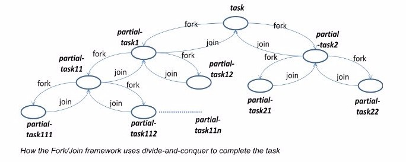
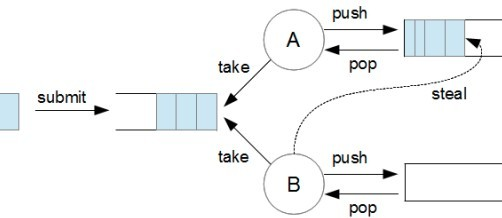

# Chapter 14. 람다와 스트림

# 람다식

---

자바는 람다식으로 인해 객체지향 언어인 동시에 함수형 언어가 되었다

🤔 함수형 언어?

함수형 프로그래밍에서 함수랑 '수학의 함수'와 같다

**참조 투명성을 지킨다**

- 인수가 같다면 함수를 반복적으로 호출했을 때 늘 같은 결과가 반환된다
- `Random.nextInt`는 이런 규칙을 지키지 않는 대표적인 예
- 참조 투명성은 비싼 작업이나 오랜 시간이 걸리는 연산을 캐싱하여, 다시 계산하지 않고 저장하는 최적화 기능도 제공할 수 있다

**부작용이 없어야 한다**

- 부작용이란 함수 내에 포함되지 못한 기능을 말한다
    - 자료구조를 고치거나 필드에 값을 할당함
    - 예외가 발생함
    - I/O 동작 수행
- 자신을 포함하는 클래스의 상태, 다른 객체의 상태를 바꾸지 않고 return문을 통해서만 자신의 결과를 반환하는 메소드를 말한다

**자바에서의 '함수형'이란?**

- 실질적으로 자바로는 완벽한 순수 함수형 프로그래밍을 구현하기 어렵다
- 자바에서는 '순수 함수형'이 아니라 '함수형 프로그램'을 구현한다
- 실제 부작용은 있지만 호출자가 전혀 알아차리지 못하게 함으로써 함수형을 달성한다

**함수의 예외**

- 함수형이라면, 어떤 예외도 일으키지 말아야한다
- 하지만, 비정상적인 입력값이라면, 자바에서는 예외를 던지는 것이 자연스럽다
- 예외를 사용하지 않고 비정상적 입력값에 대응하고 싶다면 Optional<T>을 사용할 수도 있다
- 하지만 모든 코드가 Optional을 사용하도록 반드시 고쳐야 하는 것은 아니다
- 함수형 프로그래밍과 순수 함수형 프로그래밍의 장단점을 실용적으로 고려해서 판단한다

자바는 객체지향적 프로그래밍과 함수형 프로그래밍 형식을 혼합한다

모든 것을 객체로 간주하여, 객체의 필드를 갱신하고, 메소드를 호출하고, 관련 객체를 갱신하는 방식의 객체지향과,
참조적 투명성을 중시하여 변화를 허용하지 않는 함수형의 양상이 같이 드러난다
(예를 들면, Iterator로 자료구조를 탐색하면서 함수형 방식으로 자료구조에 들어있는 값의 합계를 계산한다)

자바같은 언어에서는 '수학적인 함수'냐 아니냐가 곧, 메소드와 함수를 구분하는 핵심이다

### 람다식이란?

- 메소드를 하나의 '식'으로 표현한 것이다
- 익명 함수라고도 한다
(메소드를 람다식으로 표현하면 메소드의 이름과 반환값이 없어지므로)
- 람다식은 식 자체만으로 메소드의 역할을 대신할 수 있다
메소드와 달리, 우리가 클래스를 새로 만들 필요도 객체도 생성하지 않아도 호출할 수 있다
- 메소드를 변수처럼 다루는 것이 가능하다
    - 메소드의 매개변수로 전달되어지는 것이 가능하다
    - 메소드의 결과로 반환될 수도 있다

람다식에 선언된 매개변수의 타입은 추론이 가능한 경우 생략할 수 있다 (대부분 생략 가능)

따라서 람다식에 반환타입이 없어도 된다 (추론이 가능)

### 함수형 인터페이스

- 람다식은 실제로 익명 객체이기 때문에 익명 객체를 람다식으로 대체하는 것이 가능하다
- 함수형 인터페이스는 오직 하나의 메소드가 정의되어 있어야 한다
(static 메소드와 default 메소드는 상관없다)
- 함수형 인터페이스로 람다식을 참조한다
(람다식을 매개변수로 넘기는 것이 가능하고, 반환하는 것도 가능하다)
- 람다식의 타입과 함수형 인터페이스의 타입이 반드시 일치해야 하는 것은 아니다
시그니처와 반환타입이 같다면 형변환이 가능하다
- @FunctionalInterface 어노테이션을 붙이면 컴파일러가 함수형 인터페이스를 올바르게 정의하였는지 확인해준다

```java
@FunctionalInterface
interface MyFunction {
    int max(int a, int b);
}

final MyFunction anonymousObject = new MyFunction() {
    @Override
    public int max(int a, int b) {
        return a > b ? a : b;
    }
};

// 메소드의 시그니처와 반환값이 일치해야 한다
final MyFunction lambda = (a, b) -> a > b ? a : b;
```

- 컴파일러가 람다식의 타입을 정의하는 방식 : 외부클래스이름$$Lambda$번호/번호
- 람다식 내에서 참조하는 지역변수는 final이 붙지 않아도 상수로 간주된다

```java
int val = 20;
final MyFunction runnable = () -> {
    val = 30; // 컴파일 에러
    // Variable used in lambda expression should be final or effectively final
    System.out.println(val);
};
runnable.test();
```

**람다식과 final**

- 람다식은 외부 block에 있는 변수에 접근할 수 있다
- 외부에 있는 변수가 지역변수라면, final 혹은 effectively final인 경우에만 접근이 가능하다

**effectively final이란?**

- 초기화 이후에 한번도 값이 변경되지 않은 경우
- final 키워드가 붙어있지 않았지만 final 효과가 나는 경우

```java
class LambdaTest {

    int instanceValue = 1;
    static int staticValue = 1;

    @Test
    void run() {
        int localValue = 1;

				// 지역변수, 인스턴스변수, 클래스 변수 모두 값 변경
        instanceValue = 2;
        staticValue = 2;
        localValue = 2;

        Runnable localCapturing = () -> System.out.println(localValue);        **// 컴파일 에러**
        Runnable instanceCapturing = () -> System.out.println(instanceValue);  // 문제 없음
        Runnable staticCapturing = () -> System.out.println(staticValue);      // 문제 없음
    }
}
```

왜 외부 지역변수가 final or effectively final해야 할까?

**local capturing lambda**

특징 1. 람다식에서 사용되는 외부 지역 변수는 복사본이다

왜 외부 지역변수를 그대로 사용하지 못하고 복사본을 사용할까?

- 지역 변수는 스택 영역에 생성되기 때문에 지역변수가 선언된 block이 끝나면 스택에서 제거된다
- 람다식이 리턴되어, 추후에 람다식이 수행되게 되면, 변수를 참조할 수가 없다 (이미 스택에서 제거되었으므로)
- 따라서 외부 지역변수를 직접 참조하지 않고 복사본을 전달받는다

특징 2. final 혹은 effectively final인 지역변수만 사용할 수 있다

왜 final or effectively final이어야 할까?

- 외부 지역변수를 다루는 스레드와 람다식이 수행되는 스레드가 서로 다를 수 있다
- 외부 지역 변수의 값이 변경이 될 수 있다면, 람다식이 수행되는 스레드의 값이 가장 최신 값으로 복사되었는지 확신할 수가 없다
매번 다른 결과가 도출될 수 있으며 예측할 수 없다
- 즉, 외부 지역 변수는 전달되는 복사본이 변경되지 않은 최신값임을 보장해야 한다
- 따라서 외부 지역변수는 final 혹은 effectively final이어야 한다

특징 3. 복사된 지역변수 값은 람다식 내부에서 변경할 수 없다

- 외부 지역 변수를 final 로 다루기로 했기 때문에, 복사된 지역변수를 final로 다루는 것이 맞다

**따라서, 람다식에서는 외부 지역변수를 사용할 때 final 혹은 effectively final이어야 한다**

### java.util.function 패키지

자주 쓰이는 형식의 메소드를 함수형 인터페이스로 미리 정의해놓았다

- `java.lang.Runnable` : void run()
- `Supplier<T>` : T get()
- `Consumer<T>` : void accept(T t)
- `Function<T, R>` : R apply(T t)
- `Predicate<T>` : boolean test(T t)
- `BiConsumer<T, U>` : void accept(T t, U u)
- `BiPredicate<T, U>` : boolean test(T t, U u)
- `BiFunction<T,U,R>` : R apply(T t, U u)
- `UnaryOperator<T>` : T apply(T t)
- `BinaryOperator<T>` : T apply(T t1, T t2)

**기본형을 위한 함수형 인터페이스**

- 기본형 대신 래퍼클래스를 사용하는 것은 비효율적이다
- 보다 효율적으로 처리할 수 있도록 기본형을 사용하는 함수형 인터페이스들이 제공된다
    - `DoubleToIntFunction` : int applyAsInt(double d)
    - `ToIntFunction<T>` int applyAsInt(T value)
    - `IntFunction<R>` : R apply(int i)
    - `ObjIntConsumer<T>` : void accept(T t, int value)

**컬렉션 프레임워크의 함수형 인터페이스 사용**

- 컬렉션 프레임워크 인터페이스에 함수형 인터페이스를 사용하는 다수의 디폴트 메소드가 추가되었다

```java
**// --------- *Collection 인터페이스 ----------***
**// 조건에 맞는 요소를 삭제한다**
boolean removeIf(Predicate<? super E> filter)

**// --------- *List 인터페이스 ----------***
**// 모든 요소를 변환하여 대체한다**
void replaceAll(UnaryOperator<E> operator)

**// --------- *Iterable 인터페이스 ----------***
**// 모든 요소에 작업을 수행한다**
void forEach(Consumer<? super T> action)

// **--------- *Map 인터페이스 ----------***
**// 지정된 키의 값에 작업을 수행한다**
V compute(K key, BiFunction<? super K, ? super V, ? extends V> remappingFunction)
**// 키가 없으면 작업 후 추가**
V computeIfAbsent(K key, Function<? super K, ? extends V> mappingFunction)
**// 키가 있으면, 작업 수행**
V computeIfPresent(K key, BiFunction<? super K, ? super V, ? extends V> remappingFunction)
**// 모든 요소에 병합작업을 수행**
V merge(K key, V value, BiFunction<? super V, ? super V, ? extends V> remappingFunction)
**// 모든 요소에 작업을 수행**
void forEach(BiConsumer<? super K, ? super V> action)
**// 모든 요소에 치환작업을 수행**
void replaceAll(BiFunction<? super K, ? super V, ? extends V> function)
```

### 함수의 합성과 결합

- 수학에서는 두 함수를 합성해서 새로운 함수를 만들어낼 수 있다
- 람다식도 마찬가지로 두 람다식을 합성하여 새로운 람다식을 만들 수 있다

`Function`

```java
@FunctionalInterface
public interface Function<T, R> {

    R apply(T t);

		// **함수를 합성**
    default <V> Function<V, R> compose(Function<? super V, ? extends T> before) {
        Objects.requireNonNull(before);
        return (V v) -> apply(before.apply(v));
    }

		// **함수를 합성**
    default <V> Function<T, V> andThen(Function<? super R, ? extends V> after) {
        Objects.requireNonNull(after);
        return (T t) -> after.apply(apply(t));
    }

		// **항등함수**
    static <T> Function<T, T> identity() {
        return t -> t;
    }

}
```

`Predicate`

```java
@FunctionalInterface
public interface Predicate<T> {

    boolean test(T t);

		// **함수의 결합**
    default Predicate<T> and(Predicate<? super T> other) {
        Objects.requireNonNull(other);
        return (t) -> test(t) && other.test(t);
    }

		// **함수의 결합**
    default Predicate<T> or(Predicate<? super T> other) {
        Objects.requireNonNull(other);
        return (t) -> test(t) || other.test(t);
    }

		// **함수의 부정 연산**
    default Predicate<T> negate() {
        return (t) -> !test(t);
    }

		// **비교 연산**
    static <T> Predicate<T> isEqual(Object targetRef) {
        return (null == targetRef)
                ? Objects::isNull
                : object -> targetRef.equals(object);
    }
}
```

### 메소드 참조

메소드 참조를 하면 더 간결하게 코드를 작성할 수 있다

```java
Function<String, Integer> f = **(String s) -> Integer.parseInt(s)**;

// 람다식의 일부가 생략되었지만, 컴파일러는 생략된 부분을 추론할 수 있다
Function<String, Integer> f2 = **Integer::parseInt**;

// 생성자도 메소드 참조할 수 있다
Supplier<MyClass> supplier = MyClass::new;
Function<Integer, int[]> supplier2 = int[]::new;
```

### **모나드**

- 모나드는 '개념'
- 값을 담는 컨테이너의 일종이다
- Functor 기반이며, Monad laws를 만족한다
- 제네릭을 지원하는 정적 타이핑 언어에서는 대부분 지원이된다

**Functor**

```java
interface Functor<T> {
    <R> Functor<R> map(Function<T,R> f);
}
```

- 유일한 연산 map
- 인자로 함수를 받는다
- 인자로 받는 함수는 컨테이너 혹은 박스에 담긴 값을 변형한다
- map은 그 결과를 다시 새로운 펑터로 포장한다 (Functor<T>는 항상 불변형의 컨테이너이다)
- map은 원래의 객체를 절대 변경하지 않는다
- 대신 인자 함수로 변형한 결과값을 완전히 새로운 펑터 객체에 감싸서 반환한다
- 펑터는 여러 자료 구조를 추상화하여 내부 구현을 감추고, 일관되고 사용하기 쉬운 API를 제공한다

**모나드의 세가지 컴포넌트**

- type constructor : 모나딕 타입을 생성하는 기능
- unit : 값을 모나드로 래핑하는 함수
- bind : 모나딕 값에 연산을 연결

**모나드의 세가지 법칙**

- left identity
- right identity
- associativity

**left identity**

- $bind(unit(x), f) ≡ f(x)$
- 새 모나드를 만들어 함수에 바인딩하면, 결과는 값에 함수를 적용한 것과 같아야 한다

```java
Optional.of(value)
		.flatMap(F)
		.equals(F.apply(value))
```

**right identity**

- $bind(m, unit) ≡ m$
- 새 모나드를 만드는 함수를 모나드에 바인딩하면, 결과는 새 모나드를 생성한 것과 같아야 한다

```java
Optional.of(value)
		.flatMap(Optional::of)
		.equals(Optional.of(value))
```

**associativity**

- $bind(bind(m, f), g) ≡ bind(m$, x ⇒ bind(f(x), g))
- 바인딩 순서는 중요하지 않다
체인에서 함수가 어떻게 중첩되는지는 중요하지 않다

```java
Optional<B> leftSide = Optional.of(value)
													.flatMap(F)
													.flatMap(G);
Optional<B> rightSide = Optional.of(value)
													.flatMap(F.apply(value).flatMap(G));

leftSide.equals(rightSide)
```

### Optional<T>

T 타입의 객체를 감싸는 래퍼 클래스

```java
public final class Optional<T> {
		:
    private final T value;
		:
}
```

**객체 생성하기**

- `empty`
    - null로 초기화한다
    - ofNullable(null)로도 가능하지만, empty가 바람직하다
- `of`, `ofNullable`  : of는 매개변수가 null이면 NPE가 발생한다

```java
public final class Optional<T> {

    private static final Optional<?> EMPTY = new Optional<>();
    private final T value;

    private Optional() { this.value = null; }
    private Optional(T value) { this.value = Objects.requireNonNull(value); }

    public static <T> Optional<T> empty() { return (Optional<T>) EMPTY; }
    public static <T> Optional<T> of(T value) { return new Optional<>(value); }
    public static <T> Optional<T> ofNullable(T value) { return value == null ? empty() : of(value); }
		:
}
```

**조건 검사**

- `filter` : 조건에 맞지 않으면 `empty` 로 변환한다

```java
public final class Optional<T> {
		:
    public Optional<T> filter(Predicate<? super T> predicate) {
        Objects.requireNonNull(predicate);
        if (!isPresent()) return this;
        else return predicate.test(value) ? this : empty();
    }
		:
}
```

**값 변환하기**

- `map` : 값을 변환한다
- `flatMap` : Optional로 감싸져있는 값을 변환한다

```java
public final class Optional<T> {
		:
    public <U> Optional<U> map(Function<? super T, ? extends U> mapper) {
        Objects.requireNonNull(mapper);
        if (!isPresent()) return empty();
        else return Optional.ofNullable(mapper.apply(value));
    }

    public <U> Optional<U> flatMap(Function<? super T, Optional<U>> mapper) {
        Objects.requireNonNull(mapper);
        if (!isPresent()) return empty();
        else return Objects.requireNonNull(mapper.apply(value));
    }
		:
}
```

**값 가져오기**

- `isPresent` : 값이 있는지 여부를 반환한다
- `get` : 값이 null이면 NoSuchElementException이 발생한다
- `orElse` : 값이 없으면 매개변수를 반환한다
- `orElseGet` : 값이 없으면 매개변수 함수를 수행하여 반환한다
- `orElseThrow` : 값이 없으면 지정된 예외를 발생시킨다

```java
public final class Optional<T> {
		:
    public boolean isPresent() { return value != null; }

    public T get() {
        if (value == null) throw new NoSuchElementException("No value present");
        return value;
    }
    public T orElse(T other) { return value != null ? value : other; }
    public T orElseGet(Supplier<? extends T> other) { return value != null ? value : other.get(); }
    public <X extends Throwable> T orElseThrow(Supplier<? extends X> exceptionSupplier) throws X {
        if (value != null) return value;
        else throw exceptionSupplier.get();
    }
		:
}
```

**기본형을 위한 Optional**

- int를 위한 `OptionalInt`
- long을 위한 `OptionalLong`
- double을 위한 `OptionalDouble`

Optional 주의사항

- [https://dzone.com/articles/using-optional-correctly-is-not-optional](https://dzone.com/articles/using-optional-correctly-is-not-optional)

# **스트림**

---

요소 스트림에 대해 functional-style의 연산을 지원하는 클래스 (예를 들면 컬렉션의 맵리듀스 변환)

### **인터페이스**

- BaseStream : 스트림을 위한 베이스 인터페이스
- Collector : input 요소를 mutable한 컨테이너에 누적하는 reduction 연산 (모든 입력 요소가 처리되고 나면, 최종적으로 누적된 결과가 mutable한 컨테이너로 표현된다)
- Stream : 요소의 순차 및 병렬 집계 연산을 지원하는 시퀀스
Stream.Builder : 스트림을 위한 빌더
- IntStream : 기본형 int를 위한 Stream
IntStream.Builder
- LongStream : 기본형 long을 위한 Stream
LongStream.Builder
- DoubleStream : 기본형 double을 위한 Stream
DoubleStream.Builder

### 클래스

- Collectors : 다양한 reduction 연산을 구현한 Collector 구현체들 (컬렉션의 요소를 누적하거나, 요약하거나..)
- StreamSupport : 스트림 생성과 조작을 위한 Low-level의 Utility method들

java.util.stream의 핵심은 **stream!**

스트림은 컬렉션과 다르다!

### **스트림의 특징**

**No storage**

- 스트림은 요소를 저장하는 데이터 구조가 아니다
- 대신에, data structure, 배열, generator 함수, I/O 채널같은 소스의 요소들을 연산 파이프라인을 통해서 전달한다

**Functional in nature**

- 스트림에 대한 연산은 결과를 생성하지만, 데이터 소스를 변경하지는 않는다
(데이터를 읽기만 할 뿐, 데이터 소스를 변경하지 않는다)
- 만약, 컬렉션에서 얻은 Stream을 필터링하면 소스 컬렉션에서 요소를 제거하는 것이 아니라, 필터링된 새 Stream이 생성된다

**Laziness-seeking**

- 스트림 연산이 lazy하게 구현되어있다
- 스트림 연산은 중간 연산과 최종 연산으로 나뉜다
- 중간 연산은 항상 lazy하다
- 따라서 필터링/매핑/중복제거 같은 연산이 최적화될 수 있다
(예를 들면, 3개의 연속적 모음이 있는 첫 번째 문자열 찾기)

**Possibly unbounded**

- 컬렉션의 크기는 한정되어있지만, 스트림은 그렇지 않다
- limit(n) 또는 findFirst() 같은 연산을 사용하면 무한 스트림에 대한 계산을 유한시간 내에 완료할 수 있다

**Consumable**

- 스트림은 한번만 사용할 수 있다 (일회용)
- 소스의 동일한 요소로 다시 연산하려면 새 스트림을 생성해야 한다
(한번 소비되면, 다시 사용할 수 없다)

### 스트림을 생성하는 방식

- 컬렉션에 stream(), parallelStream()
- Arrays.stream(배열)
- 스트림 클래스들의 정적 팩토리 메소드를 사용
    - Stream.of(배열)
    - InsTream.range(int, int)
    - Stream.iterate(Object, UnaryOperator)
    - :

### 스트림 연산과 파이프라인

- 스트림 연산은 중간 연산과 최종 연산으로 구분되며, 중간 연산과 최종 연산이 결합되어 스트림 파이프라인을 형성한다
- 중간 연산은 새 스트림을 반환한다
- 중간 연산은 항상 lazy하다
(filter와 같은 중간 작업을 실행하는 것은 실제로 필터링을 수행하는 것이 아니라, 순회할 때 주어진 predicate와 일치하는 초기 스트림의 요소를 포함하는 새 스트림을 생성한다
- 파이프라인 소스의 순회는 최종 연산이 실행될 때까지 시작되지 않는다
- 최종 연산은 스트림을 순회하며, 결과 또는 side-effect을 생성한다
- 최종 연산이 수행되면 스트림 파이프라인 소비되므로, 더이상 사용할 수 없다
(동일한 데이터소스를 다시 탐색해야 한다면, 데이터 소스로 돌아가서 새 스트림을 가져와야 한다)
- 거의 모든 경우에 최종 연산은 즉시 연산되며, 데이터 소스 탐색과 파이프라인 처리를 완료하여 반환되지만, iterator()와 spliterator()는 다르다
- 이들은 escape hatch로 제공된다

**escape hatch**
iterator()나 spliterator()를 사용하면 Iterator 또는 Spliterator가 반환되지만 파이프라인은 여전히 "열려" 있다
요소가 Iterator를 통해 요청될 때 처리된다
스트림에 대한 작업은 요소를 요청한 경우에만 실행되기 때문에, 이러한 방식으로 스트림 처리가 지연된다

- 스트림을 lazy하게 처리하면 상당한 효율을 얻는다
    - flat-map-sum같은 파이프라인은 데이터에 대한 single pass로 합칠 수 있다
    - 또한 필요하지 않다면, 모든 데이터를 검사하지 않아도 된다
- 중간 연산은 stateless와 stateful 연산으로 나뉜다
    - filter, map같은 stateless 작업은 새 요소를 처리할 때 이전에 본 요소의 상태를 유지하지 않는다
    - 각 요소는 다른 요소에 대한 연산과 독립적으로 처리할 수 있다
    - distinct, sort같은 stateful 작업은 새 요소를 처리할 때 이전에 본 요소의 상태와 통합될 수 있다
- stateful 연산은 결과를 생성하기 전에 전체 요소를 처리해야 할 수도 있다
    - 결과적으로 parallel 연산에서는,
    stateful 중간 연산을 포함하는 파이프라인은 데이터에 대해 여러번 전달해야 하거나 비용이 큰 데이터 버퍼링해야 할수도 있다
    - stateless 중간 연산을 포함하는 파이프라인은 최소한의 데이터 버퍼링으로 순차/병렬 여부에 관계없이 단일 패스로 처리될 수 있다
- 일부 연산은 shrot-circuit 연산으로 처리될 수 있다
    - 무한 입력에 유한 스트림을 생성할 수 있다면, 중간 연산은 short-circuit 연산이 된다
- Parallelism
    - 스트림은 개별 요소에 대하여, 명령형이 아닌 집계 연산의 파이프라인을 제공함으로써 병렬 실행을 용이하게 한다
    - 모든 스트림 작업은 직렬 또는 병렬로 실행할 수 있다
    - 기본적으로는 병렬 처리가 명시적으로 요청되지 않는 한, 직렬 스트림을 생성한다
    - 최종 연산이 수행될 때, 스트림 파이프라인이 호출된 스트림의 방향에 따라서 순차적 또는 병렬로 실행된다
- Non-interference
    - ArrayList와 같은 non-thread-safe 컬렉션을 포함한 다양한 데이터 소스에 대해 병렬 집계 작업을 실행할 수 있다
    - 이는 스트림 파이프라인을 실행하는 동안 데이터 소스와의 interference를 방지할 수 있는 경우에만 가능하다
    - 데이터 소스에서 간섭을 방지한다는 것은 스트림 파이프라인을 실행하는 동안 데이터 소스가 전혀 수정되지 않도록 하는 것을 의미한다
    - 주목할 것은 동시 수정을 처리하도록 설계된 concurrenct collection 소스 스트림이다
    - concurrent 스트림 소스는 spliterator가 CONCURRENT 하다는 특징이다
    - 따라서 소스가 concurrent하지 않을 수 있는 스트림 파이프라인의 동작 매개변수는 스트림의 데이터 소스를 수정해서는 안된다
    - 동작 매개변수는 스트림의 데이터 소스를 수정하거나 수정하게 만드는 경우, 데이터 소스를 방해한다고 한다
    - '비간섭'은 병렬 파이프라인 뿐 아니라 모든 파이프라인에 적용된다
    - 스트림 소스가 동시성이 아닌 경우, 스트림 파이프라인을 실행하는 동안 스트림의 데이터 소스를 수정하면, 예외, 오류가 발생할 수 있다
    - 올바르게 작동하는 스트림 소스의 경우, 최종 연산이 시작되기 전에 소스를 수정할 수 있으며, 수정 사항은 해당 요소에 반영된다

        ```
        List<String> l = new ArrayList(Arrays.asList("one", "two"));
             Stream<String> sl = l.stream();
             l.add("three");
             String s = sl.collect(joining(" "));
        ```

### Stateless behaviors

스트림 연산에 대한 동작 매개변수가 stateful한 경우, 스트림 파이프라인 결과가 정확하지 않은 결과를 가져올 수 있다

```java
Set<Object> seen = Collections.synchronizedSet(new HashSet<>());
stream.parallel().map(seen::add)...;
// seen에 따라 결과가 달라질 수 있다
```

→ 매핑 작업이 병렬로 수행되면 스레드 스케줄링 차이로 인해 동일한 입력에 대한 결과가 실행마다 다를 수 있다

stateless 람다식의 경우 결과는 항상 동일하다

또한 매개변수에서 mutable한 상태에 접근하는 것은 안전하지 않고 성능 면에서 좋지 않을 수 있다
(해당 상태에 대한 액세스를 동기화하지 않으면 안전하지 않고, 해당 상태에 대해 액세스를 동기화하면 성능이 안좋아질 수 있다)

가장 좋은 방법은 stateful을 피하여 작업을 완전히 스트리밍하는 것
일반적으로는 stateful을 피하기 위해 스트림 파이프라인을 재구성한다

### 스트림의 **중간 연산**

- 중복 제거 `distinct`
- 조건에 부합하는 요소만 추출 `filter(Predicate<T>)`
- 요소 잘라내기 `limit(long maxSize)`
- 요소 건너뛰기 `skip(long n)`
- 요소에 작업 수행 `peek(Consumer<T>)`
- 요소 정렬
    - `sorted()`
    - `sorted(Comparator<T>)`
- 요소 변환
    - `map(Function<T,R>)`
    - `mapToDouble(ToDoubleFunction<T>)`
    - `mapToInt(ToIntFunction<T>)`
    - `mapToLong(ToLongFunction<T>)`
- 요소 변환
    - `flatMap(Function<T,Stream<R>>)`
    - `flatMapToDouble(Function<T,DoubleStream>)`
    - `flatMapToInt(Function<T,IntStream>)`
    - `flatMapToLong(Function<T,LongStream>)`

`**distinct**`

- 고유한 요소로 구성된 스트림을 반환한다
- Object.equals(Object)
- 첫 번째로 나타나는 요소가 선택된다
- stateful한 중간 연산이다
- 정렬된 스트림일 경우, 요소가 선택되는 것이 안정적이나, 비정렬된 스트림일 경우 안정성이 보장되지 않는다
- 병렬 pipeline에서 distinct에 대한 안정성을 유지하는 것은 비용이 많이 든다 (작업이 상당한 버퍼링)
그리고 사실상 안정성이 필요하지 않은 경우가 많다

    - 비정렬된 스트림 소스를 사용하거나 BaseStream.unordered()로 순서 제약을 제거하면 병렬 파이프라인에서 훨씬 효율적이다
    - 만약 순서가 중요하면서, 병렬 파이프라인에서 distinct()를 사용하여 성능이 저하된다면, BaseStream.sequential()을 사용해서 순차 실행으로 전환할 수 있다
- [https://stackoverflow.com/questions/53645037/will-parallel-stream-work-fine-with-distinct-operation](https://stackoverflow.com/questions/53645037/will-parallel-stream-work-fine-with-distinct-operation)

`**filter**`

- 주어진 predicate와 일치하는 스트림이 요소로 구성된 스트림을 리턴한다

`**limit**`

- 길이가 매개변수보다 길지 않도록 자른다
- short-circuit stateful 중간 연산이다
- limit()은 순차 스트림 파이프라인에서 가벼운 연산이지만, limit(n)은 n개의 요소뿐만 아니라 첫 번째 n개를 반환하도록 제한되어 있기 때문에 특히 maxSize의 큰 값에 대해 ordered 병렬 파이프라인에서 상당히 비용이 많이 들 수 있다
- `distinct`와 마찬가지로..
    - 비정렬된 스트림 소스를 사용하거나 BaseStream.unordered()로 순서 제약을 제거하면 병렬 파이프라인에서 훨씬 효율적이다
    - 만약 순서가 중요하면서, 병렬 파이프라인에서 limit()를 사용하여 성능이 저하된다면, BaseStream.sequential()을 사용해서 순차 실행으로 전환할 수 있다

`**skip**`

- 스트림의 처음 n개 요소를 버린 후, 이 스트림의 나머지 요소로 구성된 스트림을 반환한다
- 이 스트림에 n개 미만의 요소가 포함되어 있으면 빈 스트림이 반환됩니다.
- stateful 중간 연산이다
- `limit`과 마찬가지로..
- `skip()`은 순차 스트림 파이프라인에서 가벼운 연산이지만, `skip(n)`은 n개의 요소뿐만 아니라 처음 n개의 요소도 건너뛰도록 제한되어 있기 때문에 특히 n의 큰 값에 대해 정렬된 병렬 파이프라인에서 상당한 작업이 될 수 있다
- `distinct`와 마찬가지로..
    - 비정렬된 스트림 소스를 사용하거나 BaseStream.unordered()로 순서 제약을 제거하면 병렬 파이프라인에서 훨씬 효율적이다
    - 만약 순서가 중요하면서, 병렬 파이프라인에서 skip()를 사용하여 성능이 저하된다면, BaseStream.sequential()을 사용해서 순차 실행으로 전환할 수 있다

`**peek**`

- 요소가 소비될 때 각 요소에 대해 제공된 작업을 추가로 수행한다
- stateless 중간 연산이다
- 병렬 스트림 파이프라인의 경우, 연산은 시간과 스레드에 관계없이 호출되는데, 만약 연산이 공유되고있는 상태를 수정한다면, 동기화가 필요하다
- 주로 디버깅을 지원하기 위해 존재한다

`**sorted**`

- 제공된 Comparator에 따라 정렬된 이 스트림의 요소로 구성된 스트림을 반환한다
- 제공된 Comparator가 없다면 nature order로 정렬하여 반환한다
- 요소가 Comparable이 아니면, 최종 연산이 수행될 때 ClassCastException이 throw될 수 있다
- 정렬된 스트림의 경우 정렬이 안정적이지만, 순서가 지정되지 않은 스트림의 경우 안정성이 보장되지 않는다
- stateful한 중간 연산이다

`**map**`

- 주어진 함수를 이 스트림의 요소에 적용한 결과로 구성된 스트림을 반환한다
- stateless 중간 연산이다

`**flatMap**`

- 각 요소를 매핑된 스트림(제공된 매핑 기능을 각 요소에 적용하여 생성됨)으로 대체한 결과로 구성된 스트림을 반환한다
- 매핑된 각 스트림은 콘텐츠가 이 스트림에 배치된 후 닫힌다
(매핑된 스트림이 null이면 대신 빈 스트림이 사용된다)
- 스트림의 요소에 일대다 변환을 적용한 다음, 결과 요소를 새 스트림으로 병합한다
- stateless 중간 연산이다

### 스트림의 최종 연산

- 각 요소에 지정된 작업 수행한다
    - `void forEach(Consumer<? super T>)`
    - `void forEachOrdered(Consumer<? super T)`
- 요소의 개수를 반환한다
    - `long count()`
- 최대/최소값을 반환한다
    - `Optional<T> max(Comparator<? super T> comparator>`
    - `Optional<T> min(Comparator<? super T> comparator>`
- 요소를 하나 반환한다
    - `Optional<T> findAny()`
    - `Optional<T> findFirst()`
- 주어진 조건을 모든 요소가 만족하는지 여부를 반환한다
    - `boolean allMatch(Predicate<T>)`
    - `boolean noneMatch(Predicate<T>)`
    - `boolean anyMatch(Predicate<T>)`
- 모든 요소를 배열로 반환한다
    - `Object[] toArray()`
    - `A[] toArray(IntFunction<A[]>)`
- 리듀싱하면서 계산한다
    - `Optional<T> reduce(BinaryOperator<T>)`
    - `T reduce(T identity, BinaryOperator<T>)`
    - `U reduce(U identity, BiFunction<U,T, U>, BinaryOperator<U>)`
- 요소를 수집한다
    - `R collect(Collector<T,A,R>)`
    - `R collect(Supplier<R> BiConsumer<R,T>, BiConsumer<R,R>)`

`**forEach**`

- 각 요소에 대해 연산을 수행하는 최종 연산이다
- 병렬 스트림 파이프라인의 경우, 스트림의 발생 순서를 보장하지 않는다
(스트림의 발생 순서를 보장해야 한다면, 병렬 처리의 이점이 사라지게 됨)
- 또한, 작업이 공유 상태에 액세스하는 경우 동기화가 필요하다

**`reduce(BinaryOperator<T> accumulator)`**

- 매개변수인 accumulator 함수는 associative 함수여야 한다
- associative 함수를 사용하여, 요소에 대한 reduction을 수행한다
- associative
    - 연관
    - 다음이 성립한다
    `(a op b) op c == a op (b op c)`
    - 병렬 계산에서 굉장히 중요하다
    `a op b op c op d == (a op b) op (c op d)`
    - 병렬로 (c op d)와  (a op b)를 계산한 다음, 결과에 대해 또 다시 op를 호출할 수 있다
- 결과를 감싸서 Optional을 반환한다
- 순차적으로 실행될 필요가 없다

```java
boolean foundAny = false;
 T result = null;
 for (T element : this stream) {
     if (!foundAny) {
         foundAny = true;
         result = element;
     }
     else
         result = accumulator.apply(result, element);
 }
 return foundAny ? Optional.of(result) : Optional.empty();
```

`**reduce(T ID, BinaryOperator<T> accumulator)**`

- ID값과 associative 함수를 사용하여, 요소에 대한 reduction을 수행한다

```java
T result = identity;
for (T element : this stream)
   result = accumulator.apply(result, element)
return result;
```

- 순차적으로 실행될 필요가 없다
- 매개변수 identity

    > The *identity* value must be an identity for the accumulator function.

    - identity는 accumulator 함수의 항등원이어야 함
    - 모든 t에 대해서, `accumulator.apply(identity, t)` = `t`
- 매개변수 accumulator
    - associative 함수여야 한다
    - stateless여야 한다
- sum, min, max, average, string concat은 모두 reduce의 특수한 케이스이다

```java
Integer sum = integers.reduce(0, Integer::sum);
```

`**reduce(U, BiFunction<U,? super T,U>, BinaryOperator<U>)**`

- ID와, accmulator, combiner를 사용하여 요소에 대한 reduction을 수행

```java
U result = identity;
for (T element : this stream)
   result = accumulator.apply(result, element)
return result;
```

- 순차적으로 실행될 필요가 없다
- 매개변수 identity
    - 모든 u에 대해, `Combiner(identity, u)` = `u`
    - combiner 함수의 항등원
- 매개변수 accumulator
    - associative 함수여야 한다
    - stateless여야 한다
- 매개변수 combiner
    - associative 함수여야 한다
    - stateless여야 한다
    - accumulator 함수와 호환되어야 한다
    - 모든 u와 t에 대해서..
    - `combiner.apply(u, accumulator.apply(identity, t))` == `accumulator.apply(u, t)`
- 대부분의 reduction은 map과 reduce 연산의 조합으로 더 간단하게 나타낼 수 있다

reduction의 case들..

- `long count()`
- `Optional<T> max(Comparator<? super T> comparator>`
- `Optional<T> min(Comparator<? super T> comparator>`

`**findFirst**`

- 첫 번째 요소를 감싸는 Optional을 반환한다
(스트림이 비어 있으면 빈 Optional을 반환한다)
- short-circuit 최종 연산이다

`**findAny**`

- 일부 요소를 감싸는 Optional을 반환한다
(스트림이 비어 있으면 빈 Optional을 반환한다)
- short-circuit 최종 연산이다
- 스트림의 어떤 요소든지 선택될 수 있다
- 병렬 작업에서 최대 성능을 위한 것이며,
동일한 소스에 대한 여러번 호출을 했을 때, 동일한 결과를 반환하지 않을 수 있다

`**anyMatch**`

- 요소가 제공된 predicate와 일치하는지 여부를 리턴합니다

- 모든 요소에 대한 predicate를 평가하지 않을 수 있다
- 스트림이 비어 있으면 true가 반환되고 predicate는 계산되지 않는다
- short-circuit 최종 연산이다

`**noneMatch**`

- 모든 요소가 제공된 predicate와 일치하지 않는지 여부를 반환한다

- 모든 요소에 대한 predicate를 평가하지 않을 수 있다
- 스트림이 비어 있으면 true가 반환되고 predicate는 계산되지 않는다
- short-circuit 최종 연산이다

`**allMatch**`

- 모든 요소가 제공된 predicate와 일치하는지를 반환한다

- 모든 요소에 대한 predicate를 평가하지 않을 수 있다
- 스트림이 비어 있으면 true가 반환되고 predicate는 계산되지 않는다
- short-circuit 최종 연산이다

`**collector**`

- 요소에 대해 mutable한 reduction 연산을 수행한다
- mutable한 reduction는 reduce된 값이 mutable한 결과 컨테이너고(ArrayList 같은), 결과를 교체하는 대신 결과의 상태를 업데이트해서 요소가 통합된다

```java
R result = supplier.get();
for (T element : this stream)
   accumulator.accept(result, element);
return result;
```

- `reduce`와 마찬가지로 추가적인 동기화 없이 병렬화할 수 있습니다.
- 두 가지 형태
    - `collect(Supplier<R>, BiConsumer<R,T>, BiConsumer<R,R>)`
        - supplier : 새로운 결과 컨테이너를 생성하는 함수. 병렬 실행의 경우 이 함수는 여러 번 호출될 수 있으며 매번 새로운 값을 반환해야 한다
        - accumulator : 결과에 요소를 합치기 위한 associative, stateless 함수
        - combiner : 두 값을 결합하기 위한 associative, stateless 함수
    - `collect(Collector<T,A,R>)`
        - supplier, accumulator, combiner 대신 Collector를 사용한다
        - Collector는 `collect(Supplier<R>, BiConsumer<R,T>, BiConsumer<R,R>)`의 argument로 사용된 함수들을 캡슐화해서, 컬렉션 전략을 재사용하고, multi-level의 grouping 기능, pratitioning 기능을 제공한다

### 컬렉터

- 컬렉터란, 스트림의 요소를 수집할 때, 어떻게 수집할것인지에 대한 방법을 정의한 것이다
- 컬렉터는 Collector 인터페이스를 구현한 것으로,
직접 구현할 수도 있지만 미리 작성된 것을 사용할 수도 있다
- Collectors 클래스에는 미리 작성되어있는 컬렉터를 제공한다

### **Collectors 클래스**

💡 *아래 메소드 목록에서, 보기 편하기 위해 제네릭을 제거하였음*

**변환  컬렉터 반환**

- `toCollection(Supplier)`
- `toList()`
- `toSet()`
- `toMap`
    - `toMap(Function, Function)`
    - `toMap(Function, Function, BinaryOperator)`
    - `toMap(Function, Function, BinaryOperator, Supplier)`
- `toConcurrentMap`
    - `toConcurrentMap(Function, Function)`
    - `toConcurrentMap(Function, Function, BinaryOperator)`
    - `toConcurrentMap(Function, Function, BinaryOperator, Supplier)`

**리듀싱  컬렉터 반환**

- `reducing`
    - `reducing(BinaryOperator)`
    - `reducing(T, BinaryOperator)`
    - `reducing(U, Function, BinaryOperator)`

**통계 컬렉터 반환**

- `counting()`
- `maxBy(Comparator)`
- `minBy(Comparator)`
- `summing___`
    - `summingInt(ToIntFunction)`
    - `summingDouble(ToDoubleFunction)`
    - `summingLong(ToLongFunction)`
- `averaging___`
    - `averagingInt(ToIntFunction)`
    - `averagingDouble(ToDoubleFunction)`
    - `averagingLong(ToLongFunction)`
- `summarizing___`
    - `summarizingInt(ToIntFunction)`
    - `summarizingDouble(ToDoubleFunction)`
    - `summarizingLong(ToLongFunction)`

**조인  컬렉터 반환**

- `joining`
    - `joining()`
    - `joining(CharSequence)`
    - `joining(CharSequence, CharSequence, CharSequence)`

**분할 컬렉터 반환**

- `groupingBy`
    - `groupingBy(Function)`
    - `groupingBy(Function, Collector)`
    - `groupingBy(Function, Supplier, Collector)`
- `groupingByConcurrent`
    - `groupingByConcurrent(Function)`
    - `groupingByConcurrent(Function, Collector)`
    - `groupingByConcurrent(Function, Supplier, Collector)`
- `partitioningBy`
    - `partitioningBy(Predicate)`
    - `partitioningBy(Predicate, Collector)`

`**toCollection(Supplier)**`

- 매개변수 : `collectionFactory`
- input 요소를 발생 순서에 따라 새 컬렉션에 추가하는 collector를 반환한다

`**toList()**`

`**toSet()**`

- 반환된 컬렉션의의 유형, 변경 가능성, 직렬화 가능성, 스레드 안전성은 보장하지 않는다
- 반환된 목록에 대해 더 많은 제어가 필요한 경우 toCollection(Supplier)을 사용해야 한다

`**toMap(Function, Function)**`

`**toMap(Function, Function, BinaryOperator)**`

`**toMap(Function, Function, BinaryOperator, Supplier)**`

- 매개변수 : `keyMapper`, `valueMapper`, `mergeFunction`, `mapSupplier`
- 제공된 key/value mapper로 input 요소에 적용하여 생성된 key와 value로 Map에 누적하는 Collector를 반환한다
- 매핑된 키에 중복 항목이 포함되어 있으면 IllegalStateException이 발생한다 - Object.equals(Object)
- 매핑된 키에 중복이 있을 수 있다면, `toMap(Function, Function, BinaryOperator)`나 `toMap(Function, Function, BinaryOperator, Supplier)` 를 사용해야 한다
- 반환된 Collector는 concurrent하지 않다
- 병렬 스트림 파이프라인의 경우, combiner 함수는 하나의 맵에서 다른 맵으로 키를 병합하여 작동한다 (비용이 많이 들 수 있다)
- 결과가 발생 순서대로 맵에 삽입될 필요가 없는 경우에는, toConcurrentMap(Function, Function)을 사용하면 더 나은 병렬 성능을 가질 수 있다

`**toConcurrentMap(Function, Function)**`

`**toConcurrentMap(Function, Function, BinaryOperator)**`

`**toConcurrentMap(Function, Function, BinaryOperator, Supplier)**`

- 매개변수 : `keyMapper`, `valueMapper`, `mergeFunction`, `mapSupplier`
- 제공된 key/value mapper로 input 요소에 적용하여 생성된 key와 value로 ConcurrentMap에 누적하는 Collector를 반환한다
- 매핑된 키에 중복 항목이 포함되어 있으면 IllegalStateException이 발생한다 - Object.equals(Object)
- 매핑된 키에 중복이 있을 수 있다면, `toConcurrentMap(Function, Function, BinaryOperator)`나 `toConcurrentMap(Function, Function, BinaryOperator, Supplier)` 를 사용해야 한다

`**reducing(BinaryOperator)**`

`**reducing(T, BinaryOperator)**`

`**reducing(U, Function, BinaryOperator)**`

- 매개변수 : `identity`, `mapper`, `op`
- 지정된 매핑 함수와 BinaryOperator에서 요소의 reduction을 하는 컬렉터를 반환한다

`**counting()**`

- 요소의 수를 계산하는 Collector를 반환한다 (요소가 없으면 결과는 0)

`**maxBy(Comparator)**`

- 매개변수 : `comparator`
- 지정된 Comparator에 따라 최소값 요소를 생성하는 Collector를 반환한다

`**minBy(Comparator)**`

- 매개변수 : `comparator`
- 지정된 Comparator에 따라 최대값 요소를 생성하는 Collector를 반환한다

`**summingInt(ToIntFunction)**`

`**summingLong(ToLongFunction)**`

`**summingDouble(ToDoubleFunction)**`

- 매개변수 : `mapper`
- 요소의 합계를 생성하는 수집기를 반환한다 (요소가 없으면 결과는 0)

`**averagingInt(ToIntFunction)**`

`**averagingLong(ToLongFunction)**`

`**averagingDouble(ToDoubleFunction)**`

- 매개변수 : `mapper`
- 지정된 Comparator에 따라 평균값 요소를 생성하는 Collector를 반환한다

`**summarizingInt(ToIntFunction mapper)**`

`**summarizingDouble(ToDoubleFunction mapper)**`

`**summarizingLong(ToLongFunction mapper)**`

- 매개변수 : `mapper`
- summary 통계를 반환하는 Collector를 반환한다

`**joining()**`

`**joining(CharSequence)**`

`**joining(CharSequence, CharSequence, CharSequence)**`

- 매개변수 : `delimiter`, `prefix`, `suffix`
- `delimiter`을 구분자로 요소들을 연결하며, prefix, suffix를 사용하여 접두사/접미사를 연결하는 컬렉터를 반환한다

`**groupingBy(Function)**`

`**groupingBy(Function, Collector)**`

`**groupingBy(Function, Supplier, Collector)**`

- 매개변수 : `classifier:Function`, `downstream:Collector`, `mapFactory:Supplier`
- 요소에 대해 groupby 작업을 구현한 컬렉터를 반환한다
- 분류 함수에 따라 요소를 그룹화하고 결과를 Map에 반환한다
- 반환된 Collector는 concurrent하지 않다
- 병렬 스트림 파이프라인의 경우, 하나의 맵에서 다른 맵으로 키를 병합하여 작동한다 (비용이 비쌈)
- Map 컬렉터에서 요소가 나타나는 순서를 유지할 필요가 없다면, `groupingByConcurrent(Function)`를 사용하면 병렬 성능이 향상될 수 있다
- `groupingBy(Function)`는 반환된 Map과 List에 mutability, 직렬화가능성, thread-safety를 보장하지 않는다

`**groupingByConcurrent(Function)**`

`**groupingByConcurrent(Function, Collector)**`

`**groupingByConcurrent(Function, Supplier, Collector)**`

- 매개변수 : `classifier:Function`, `downstream:Collector`, `mapFactory:Supplier`
- 순서가 지정되지 않은 concurrent 컬렉터이다
- ConcurrentMap를 생성한다
- `groupingByConcurrent(Function classifier)`는 반환된 Map과 List에 타입안정성, mutability, 직렬화가능성, thread-safety를 보장하지 않는다

`**partitioningBy(Predicate)**`

`**partitioningBy(Predicate, Collector)**`

- 매개변수 : `Predicate predicate, Collector downstream`
- Predicate에 따라 입력 요소를 분할하고 (Collector에 따라 각 파티션의 값을 줄이고) Map으로 구성하는 Collector를 반환한다
- 반환된 Map과 List에 타입안정성, mutability, 직렬화가능성, thread-safety를 보장하지 않는다

### Parallel Stream **사용할 때에 고려해야 할 사항들**

- Parallel Stream

    Parallel()은 공유된 thread pool을 사용하기 때문에 심각한 성능장애를 일으킬 수 있다

    Parallel Stream은 내부적으로 common fork join pool을 사용한다

    1 프로세서 당 1 thread를 사용하도록 되어있기 때문에, 16 core라면 16개의 thread를 생성할 수 있다

    **ForkJoinPool의 동작 방식**

    - 다음 그림처럼 fork를 통해 task를 분담하고 join을 통해 합치게 된다

    

    - 기본적으로는 ExecutorService의 구현체이지만, 각 thread들이 개별 큐를 가지게 된다는 점에서 조금 다르다

    

    - 위처럼, 자신에게 아무런 task가 없으면 A의 task를 가져와 처리하게 된다
    - 따라서 CPU자원이 놀지 않고 최적의 성능을 낼 수 있게 된다

Parallel Stream을 이용할 때에는 고려해야 할 사항들이 많다

> 스트림을 구성하는 자료구조가 적절한지 확인한다

- *ForkJoinPool의 특성상 나누어지는 job은 균등하게 처리가 되어야 한다*
- Parallel Stream은 작업을 분할하기 위해 Spliterator의 trySplit()을 사용하게 된다
- 이 분할되는 작업의 단위가 균등하게 나누어져야 하며, 나누어지는 작업에 대한 비용이 높지 않아야 순차적 방식보다 효율적으로 이루어질 수 있다
- array, arrayList와 같이 정확한 전체 사이즈를 알 수 있는 경우에는 분할 처리가 빠르고 비용이 적게 들지만, linkedList의 경우라면 별다른 효과를 찾기가 어렵다 (모두 탐색해야 하므로)
- 분해성이 좋은 소스들 : ArrayList, IntStream.range, HashSet, TreeSet
- 분해성이 나쁜 소스들 : LinekdList, Stream.iterate

> *병렬로 처리되는 작업이 독립적이지 않다면, 수행 성능에 영향이 있을 수 있다*

- sorted(), distinct()같은 중간연산의 경우에는, 내부적으로 상태에 대한 변수를 각 작업들이 공유(synchronized)하게 되어 있다
- 이러한 경우에는 순차적으로 실행하는 경우가 더 효과적일 수 있다

> 병렬 스트림에서 성능이 떨어지는 연산이 있다

- limit이나 findFirst처럼 요소의 순서에 의존하는 연산의 경우, 병렬 스트림에서 수행하려면 비싼 비용을 치른다
- 정렬된 스트림에 unordered를 호출하면 비정렬된 스트림을 얻을 수 있다
- 스트림 요소에 순서가 상관 없다면, 비정렬된 스트림에 limit을 호출하는 것이 더 효율적이다

> 소량의 데이터는 병렬 스트림이 별 도움이 되지 않는다

- 소량의 데이터를 처리하는 상황에서는 병렬화  과정에서 생기는 부가 비용을 상쇄할만큼의 이득을 얻지 못할 수가 있다

> 최종 연산의 병합 과정 비용을 살펴봐야 한다

- 병합 과정의 비용이 비싸다면, 병렬 스트림으로 얻은 성능의 이익이 서브 스트림의 부분 결과를 합치는 과정에서 상쇄될 수 있다

> 확신이 서지 않으면 직접 측정한다

- 순차 스트림을 병렬 스트림으로 바꾸는 것은 쉽지만, 병렬 스트림이 반드시 좋으리란 법이 없다
- 언제나 병렬 스트림이 순차 스트림보다 빠른 것은 아니다
- 순차 스트림과 병렬 스트림 중 어떤 것이 좋을지 모르겠다면 직접 성능을 측정하는 것이 바람직하다

람다의 외부변수 참조

- [https://vagabond95.me/posts/lambda-with-final/](https://vagabond95.me/posts/lambda-with-final/)
- [https://catsbi.oopy.io/e980e4b7-fde3-4ceb-91f9-181ce2e7b507](https://www.notion.so/e980e4b7fde34ceb91f9181ce2e7b507)

모나드

- [https://dzone.com/articles/what-is-a-monad-basic-theory-for-a-java-developer](https://dzone.com/articles/what-is-a-monad-basic-theory-for-a-java-developer)
- [https://medium.com/@jooyunghan/functor-and-monad-examples-in-plain-java-9ea4d6630c6](https://medium.com/@jooyunghan/functor-and-monad-examples-in-plain-java-9ea4d6630c6)

스트림의 escape hatch

- [https://stackoverflow.com/questions/42524688/what-is-an-escape-hatch-operation-in-a-java-stream](https://stackoverflow.com/questions/42524688/what-is-an-escape-hatch-operation-in-a-java-stream)

parallel 스트림의 성능 장애

- [https://m.blog.naver.com/tmondev/220945933678](https://m.blog.naver.com/tmondev/220945933678)