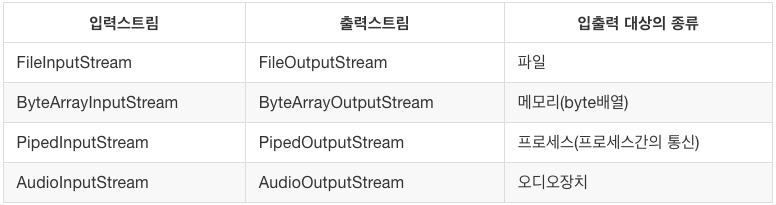

# Chapter 15. 입출력 I/O

## 1. 자바에서의 입출력

### 1. 입출력이란?

---

- 입출력: 컴퓨터 내부 또는 외부의 장치와 프로그램간의 데이터를 주고받는 것

### 2. 스트림 (stream)

---

- 스트림: 자바에서 입출력을 수행하기 위해 두 대상을 연결하고 데이터를 운반하는데 사용되는 연결통로
    - 단방향 통신만 가능

        → 입출력을 하려면 입력스트림(input stream), 출력스트림(output stream) 필요

    - 먼저 보낸 데이터를 먼저 받게 되어있으며(FIFO), 중간에 건너뜀 없이 연속적으로 데이터를 주고 받는다.
    - 블로킹(Blocking) 상태가 되어 입출력 진행 시 다른 작업을 할 수 없도록 한다.
        - 블로킹: 데이터를 읽어올 때 데이터를 기다리기 위해 멈춰있는 것
- 버퍼: 데이터를 저장할 수 있는 저장소
    - 제한된 크기 안에서 데이터를 수집하여 순서대로 데이터를 저장한다.
        - 즉, 데이터를 미리 저장하여 사용자에게 로딩없이 데이터를 제공하기 위함이다.
        - 하지만, 이외에도 데이터 통신을 할 때 저장된 데이터들을 한번에 이동시키기 위해 사용된다.
    - 버퍼는 데이터를 저장하기 위한 것이지만, 실제로는 입출력시 효과적인 이득을 갖고자 입출력에서 많이 사용한다.
    - `IO / NIO` 모두 사용되며 특히, 채널을 이용하는 `NIO`에서는 필수로 사용된다.
        - `NIO`의 채널에서 `소켓`, `파일` 등에 데이터를 전송할 때나 읽어올 때 버퍼를 사용하게 되면서 가비지량을 최소화 시키며,
        - 이는 가바지 콜렉션 회수를 줄임으로써 서버의 전체 처리량을 증가시켜준다.
- 채널: 스트림과 마찬가지로, 데이터의 입출력을 위한 연결통로
    - 단, 스트림과 달리 양방향 통신을 지원하고 있다.
        - 즉, 데이터를 전송할 때 생기는 Blocking 상태가 존재하지 않는다.
    - `NIO`에서는 채널에 직접 데이터를 쓰고 읽는 것을 허용하지 않는다.
        - `Channel`을 통한 파일 읽기 예제

            ```java
            public class ChannelReadExam {
                public static void main(String[] args) {

                    Path path = Paths.get("/Users/jenny/workspace/temp.txt");
                    // 채널 객체를 파일 읽기 모드로 생성합니다.
                    try (FileChannel ch = FileChannel.open(path, StandardOpenOption.READ)) {
                        // 1024 바이트 크기를 가진 Buffer 객체 생성
                        ByteBuffer buffer = ByteBuffer.allocate(1024);
                        ch.read(buffer);

                        buffer.flip();
                        Charset charset = Charset.defaultCharset();
                        String inputData = charset.decode(buffer).toString();
                        System.out.println("inputData: " + inputData);

                        buffer.clear();

                    } catch (Exception e) {
                        e.printStackTrace();
                        System.out.println("파일 작업 실패");
                    }
                }
            }
            ```

        - `Channel`을 통한 파일 wirte 예제 코드

            ```java
            public class ChannelWriteExam {
               public static void main(String[] args) {

                    Path path = Paths.get("/Users/limjun-young/workspace/privacy/dev/test/video/video/output.txt");

                    try (FileChannel ch = FileChannel.open(path, 
                    StandardOpenOption.WRITE, 
                    StandardOpenOption.CREATE)) {
                        
                        String data = "NIO Channel을 이용해서 파일에 데이터를 써보겠습니다.";
                        Charset charset = Charset.defaultCharset();
                        ByteBuffer buffer = charset.encode(data);
                        ch.write(buffer);
                    } catch (IOException e) {
                        e.printStackTrace();
                    }
                }
            }
            ```

    - 반드시 버퍼를 대상으로 쓰고 읽을 것을 요구한다.

        입력: 데이터 ← 버퍼 ← 채널 ← 파일   ↔️   출력: 데이터 → 버퍼 → 채널 → 파일

    - 버퍼를 통해 데이터를 읽고 쓰는 4단계
        1. 버퍼에 데이터를 쓰기
        2. `buffer.flip()` 메소드 호출 (`flip()`은 버퍼의 읽기/쓰기 모드를 전환하는 메소드)
        3. 버퍼에서 데이터를 읽기
        4. `buffer.clear()` 혹은 `buffer.compact()` 호출

            (`clear()` : 버퍼를 비우는 메소드, `compact()` : 이미 읽은 버퍼를 지우는 메소드)

→ 채널과 스트림의 가장 큰 차이는 `Non-blocking`을 지원한다는 것

- Java I/O가 느린 이유
    - OS 에서 관리하는 커널 버퍼에 직접 접근이 불가능
    - I/O 프로세스를 거치는 동안 작업을 요청한 쓰레드는 Blocking 됨
    - 자바 I/O 프로세스 과정
        1. Process(JVM)이 파일을 읽기 위해 커널(kernel)에 명령을 전달
        2. 커널은 시스템 콜(`read()`)을 사용
        3. 디스크 컨트롤러가 물리적 디스크로 부터 파일을 읽어옴
        4. DMA(Direct Memory Access)를 이용하여 커널 버퍼로 복사
        5. Process(JVM) 내부 버퍼로 복사
    - 프로세스 과정에서 발생하는 단점
        - JVM 내부 버퍼로 복사할 때, CPU 연산이 필요
        - 복사된 내부 버퍼는 작업이 끝난 후 GC 대상
        - 복사가 진행되는 동안 I/O 요청 쓰레드 Blocking
- 자바 `NIO`(new IO)
    - 기존의 자바 I/O API 를 대체하기 위해 자바 4부터 도입되었다.
        - 기존의 Java I/O는 출력 스트림이 1바이트를 쓰면, 입력 스트림에서 1바이트를 읽었다.(이런 형태는 속도가 느리다)
        - `java.io` 패키지의 성능을 보강하기 위해 `java.nio` 패키지가 추가되었다.
    - JDK 7 부터는 NIO.2 API가 `java.nio.file`에 묶여서 추가되었다.
        - Java 7부터 도입되어 NIO2라고 불리는 NIO에는 `AsynchronousFileChannel`이 Non-Blocking 모드로 동작한다.
    - NIO 에서는 스트림을 대신해서 `채널`을 생성한다.
        - NIO에서 버퍼와 채널은 연결 과정을 처지지 않으며, 각각 독립적으로 존재시킨다.
        - 데이터를 읽으면 버퍼에 저장되고 이를 채널에서 읽는 방식이다.
    - NIO는 버퍼를 사용해서 여러개의 바이트를 저장했다가 한번에 출력하는 형태로 사용하여 성능을 높인다.
    - 기본적으로 버퍼가 지원되며, 시스템 메모리를 직접 사용할 수 있는 Buffer 클래스(DirectByteBuffer)가 도입됐다.
    - I/O와 다른 NIO 대표적 특징: 채널과 버퍼, Non-Blocking IO, Selectors
- Non-Blocking IO
    - 하나의 스레드가 데이터를 버퍼로 읽어 들이거나 쓰는 동안, 해당 스레드는 다른 작업을 진행할 수 있다.
- Selector
    - 하나의 스레드를 통해 여러개의 채널을 관리할 수 있다.
    - 즉 하나의 스레드로 여러 네트워크의 연결을 관리할 수 있다.

### 3. 바이트기반 스트림 - InputStream, OutputStream

---

- 스트림은 바이트단위로 데이터를 전송, 입출력 대상에 따라 다음의 입출력 스트림이 있다.
- 모두 `InputStream` 또는 `OutputStream`의 자손들
    - 각각 읽고 쓰는데 필요한 추상메서드를 자신에 맞게 구현해 놓았다.



- 자바에서는 `java.io`패키지를 통해서 많은 종류의 입출력 관련 클래스들을 제공한다.

- `InputStream`과 `OutputStream`에 정의된 읽기/쓰기 수행 메서드

    

    - `InputStream`의 `read()`와 `OutputStream`의 `write(int b)`는 입출력 대상에 따라 읽고 쓰는 방법이 다를 것이기 때문에 각 상황에 알맞게 구현하라는 의미에서 추상메서드로 정의됨
        - `read()`와 `write(int b)` 외 나머지 메서드들도 추상메서드인 `read()`와 `write(int b)`를 이용해서 구현했기 때문에, `read()`와 `write(int b)`가 구현되어 있지 않으면 의미가 없다.
        - `InputStream` 변경한 것

            ```java
            public abstract class InputStream {
              ...
              // 입력 스트림으로부터 1byte를 읽어서 반환한다. 읽을 수 없으면 -1 반환
              abstract int read();

              // 입력 스트림으로부터 len개의 byte를 읽어서 byte배열 b의 off 위치부터 저장한다.
              int read(byte[] b, int off, int len) {
                ...
                for(int i=offl i < off + len; i++) {
                  // read()를 호출해서 데이터를 읽어서 배열을 채운다.
                  b[i] = (byte)read();
                }
                ...
            }
            // 입력 스트림으로부터 byte배열 b의 크기만큼 데이터를 읽어서 배열 b에 저장한다.
            int read(byte[] b) {
              return read(b, 0, b.length);
            }
            ...
            ```

            - `read()`없이는 `read(byte[] b, int off, int len)`, `read(byte[] b)`는 의미가 없다.

### 4. 보조스트림

---

- 실제 데이터를 주고받는 스트림이 아니기 때문에 데이터 입출력 기능은 없지만, 스트림의 기능을 향상시키거나 새 기능을 추가할 수 있다.

    ```java
    // 먼저 기반스트림을 생성한다.
    FileInputStream fis = new FileInpustStream("test.txt");

    // 기반스트림을 이용해서 보조스트림을 생성한다.
    BufferedInputStream bis = new BufferedInputStream(fis);
    bis.read(); // 보조스트림인 BufferedInputStream으로부터 데이터를 읽는다.
    ```

    - 실제 입력기능은 `FileInputStream`이 수행하고, 보조 스트림 `BufferedInputStream`은 버퍼만 제공한다.
    - 버퍼를 사용한 입출력과 사용하지 않은 입출력간의 성능차이는 상당하기 때문에 대부분의 경우에 버퍼를 이용한 보조스트림을 사용한다.
- 보조스트림의 종류

    

### 5. 문자기반 스트림 - Reader, Writer

---

- `java`에서 `char`형(한 문자를 의미): 2 byte
- 바이트기반 스트림으로 문자를 처리하기 어려움 → 문자기반 스트림 제공
    - 문자데이터 입출력 시 문자기반 스트림을 사용하자.

바이트기반 스트림 → 문자기반 스트림
InputStream       → Reader
OutputStream    → Writer


- `Reader`와 `Writer`에 정의된 읽기/쓰기 수행 메서드

    

- 문자기반 보조스트림의 종류

    


## 2. 바이트기반 스트림

### 1. InputStream과 OutputStream

---

- `InputStream`, `OutputStream`: 모든 바이트기반의 스트림의 조상, 다양한 메소드가 선언되어 있다.
    - `InputStream`의 메서드

        

        - 스트림의 종류에 따라서, `mark()`, `reset()`을 사용하여 이미 읽은 데이터를 되돌려서 다시 읽을 수 있다.
    - `OutputStream`의 메서드

        

        - `flush()`: 버퍼가 있는 출력 스트림의 경우에만 의미가 있다.
- 프로그램이 종료될 때 사용하고 닫지 않은 스트림을 JVM 이 자동적으로 닫긴 하지만, 스트림을 마치고 난 후에는 `close()`를 호출해서 반드시 닫아줘야 한다.
    - try-catch-finally 의 `finally` 블록에서 스트림을 닫아주는게 좋다.
- 그러나 `ByteArrayInputStream` 같이 메모리를 사용하는 스트림과 `System.in`, `System.out` 같은 표준 입출력 스트림은 닫아주지 않아도 된다.

### 2. ByteArrayInputStream과 ByteArrayOutputStream

---

- `ByteArrayInputStream`, `ByteArrayOutputStream`: 메모리, 즉 바이트 배열에 데이터를 입출력 하는데 사용되는 스트림

    ```java
    import java.io.*;
    import java.util.Arrays;

    class IOEx4 {
      public static void main(String[] args) {
        byte[] inSrc = {0, 1, 2, 3, 4, 5, 6, 7, 8, 9};
        byte[] outSrc = null;

        byte[] temp = new byte[4];

        ByteArrayInputStream input = null;
        ByteArrayOutputStream output = null;

        input = new ByteArrayInputStream(inSrc);
        output = new ByteArrayOutputStream();

        try {
          while(input.available() > 0) { // 읽어올 수 있는 데이터의 크기 반환
            int len = input.read(temp); // 읽어온 데이터의 개수를 반환
            output.write(temp, 0, len); // 읽어온 만큼만 write
        } catch(IOException e) {}

        outSrc = output.toByteArray();

        System.out.println("Input Source :" + Arrays.toString(inSrc));
        // Input Source :[0, 1, 2, 3, 4, 5, 6, 7, 8, 9]
        System.out.println("temp :" + Arrays.toString(temp));
        // temp :[8, 9, 6, 7]
        System.out.println("Output Source :" + Arrays.toString(outSrc));
        // Output Source :[0, 1, 2, 3, 4, 5, 6, 7, 8, 9]
      }
    }
    ```

    - 자바 서버에서는 `InputStream` 구현체를 만드는데, 이러한 구현을 할 경우 발생할 수 있는 문제
        - `InputStream`: 외부와 통신하기 위한 인터페이스이다. 기본적으로 socket 에서 가져온 `InputStream`을 사용한다. (tomcat 의 경우 `CoyoteInputStream`)

            ```java
            package org.apache.catalina.connector;

            public class Request implements HttpServletRequest {
                ...
                @Override
                public ServletInputStream getInputStream() throws IOException {

                    if (usingReader) {
                        throw new IllegalStateException(sm.getString("coyoteRequest.getInputStream.ise"));
                    }

                    usingInputStream = true;
                    if (inputStream == null) {
                        inputStream = new CoyoteInputStream(inputBuffer);
                    }
                    return inputStream;

                }
                ...
            }
            ```

            - `read` 메서드를 호출하면, 인자에 따라 1 byte를 읽거나, 정해진 양만큼 읽어오려고 시도한다.
                - 어플리케이션에서 요구한 양보다 버퍼에 있는 양이 더 적으면, 그냥 적은걸 던져준다.
                - `-1`을 리턴하는 경우는 연결이 끊겼을 때이고, 단순히 읽을 것이 없는 경우엔 `0`을 던지는 것이 아니라, blocking 된다.
            - 만약에 어플리케이션이 구현이 잘못되었다면,
                1. `read` 메서드에 의해 blocking이 될 수 있다.
                2. 읽어오고자 하는 데이터를 전부 다 읽어오지 못할 수도 있다.
    - `available()`: 블락킹 없이 읽어올 수 있는 바이트 수
        - 위 같은 위험성을 제거하기 위해 제공되는 메서드
        - 이 입력 스트림에서 읽어올 수 있는(또는 건너뛸 수 있는) 바이트 수의 추정치를 반환한다.(이 입력스트림 메서드의 다음 호출에 의해 차단되지 않고)
        - 추정치 → 이 메서드가 call 되는 시점과, 버퍼가 차오르는 시점이 다를 수 있기 때문
            - `available()`로 얼마나 읽을 수 있을지 확인하고 있는 시점에도, 새로운 데이터는 버퍼에 계속 쌓이고 있다.
            - 엄밀히 말하면, 이 메서드는 현재 확실히 읽을 수 있는 버퍼의 크기 를 제공한다.
        - 다음 (메서드) 호출에 의해 차단되지 않고 → 다른 스레드에서 blocking 하기 전까지 를 의미
    - 다음의 코드는 문제가 있다.

        ```java
        InputStream is = socket.inputStream();

        while(is.available() > 0) {}
        ```

        - 클라이언트에서 데이터를 보내도, 해당 루프를 아예 돌지 않을 수 있다.
        - `input.available()`을 호출하는 시점에는 클라이언트에서 보낸 데이터가 도착하지 않았지만, 그 이후엔 계속 클라이언트에서 보낸 데이터가 버퍼에 쌓일 수 있다.
        - 이 같은 상황을 고려하지 않으면, 데이터를 끝까지 읽지 못하거나, blocking 이 될 위험성이 있다.
        - 특히 tomcat 의 AJP 프로토콜은 `read` 메서드로 한번에 8186 바이트만 읽을 수 있기 때문에, 그보다 큰 데이터를 읽어오는 경우엔 별도의 처리를 해주는게 맞아보인다.
    - 참고로 `request#getParameter()` 메서드로 호출할 때에는, HTTP `header` 에 포함된 `content-length`만큼 데이터를 읽어 맵을 만들도록 구현하기 때문에, 이 문제에 대해 고려할 필요가 없다.

### 3. FileInputStream과 FileOutputStream

---

- `FileInputStream`, `FileOutputStream`: 파일에 입출력을 하기 위한 스트림
    - 커맨드라인으로부터 입력받은 파일의 내용을 읽어서 그대로 화면에 출력하는 예제

        ```java
        import javaj.io.*;

        class FileViewer {
          public static void main(String args[]) throws IOException {
            FileInputStream fis = new FileInputStream(args[0]);
            int data = 0;

            while((data=fis.read()) != -1) {
              char c = (char)data;
              System.out.print(c);
            }
          }
        }
        ```

- 텍스트파일을 다루는 경우에는 문자기반 스트림인 `FileReader`/`FileWriter`를 사용하는 것이 더 좋다.

- `FileInputStream`, `FileOutputStream`의 생성자

    


## 3. 바이트기반의 보조스트림

### 1. FilterInputStream과 FilterOutputStream

---

- `FilterInputStream`, `FilterOutputStream`: `InputStream`/`OutputStream`의 자손이면서, 모든 보조스트림의 조상
- 자체적으로 입출력을 수행할 수 없기 때문에 기반스트림이 필요하다.
    - 모든 메서드는 단순히 기반스트림의 메서드를 그대로 호출할 뿐이다.

    ```java
    public class FilterInputStream extends InputStream {
      protected volatile InputStream in;
      protected FilterInputStream(InputStream in) {
        this.in = in;
      }
      public int read() throws IOException {
        return in.read();
      }
      ...
    }
    ```

- 보조스트림 클래스

    FilterInputStream의 자손: BufferedInputStream, DataInputStream, PushbackInputStream 등
    FilterOutputStream의 자손: BufferedInputStream, DataOutputStream, PrintStream 등

### 2. BufferedInputStream과 BufferedOutputStream

---

- `BufferedInputStream`, `BufferedOutputStream`: 스트림의 입출력 효율을 높이기 위해 버퍼를 사용하는 보조스트림
    - 버퍼(바이트 배열)를 이용해서 한 번에 여러 바이트를 입출력하는 것이 빠르기 때문에 대부분의 입출력 작업에 사용된다.
- `BufferedInputStream`: 입력소스로부터 버퍼 크기만큼의 데이터를 읽어다 자신의 내부 버퍼에 저장한다.
    - 프로그램에서는 버퍼에 저장된 데이터를 읽으며, 다 읽고 그 다음 데이터를 읽기 위해 `read`메서드가 호출되면, `BufferedInputStream`은 입력소스로부터 다시 버퍼크기 만큼의 데이터를 읽어다 버퍼에 저장하는 작업을 반복한다.
- `BufferedOutputStream`: 버퍼를 이용해서 출력소스와 작업을 한다. 프로그램에서 `write`메서드를 이용한 출력이 `BufferedOutputStream`의 버퍼에 저장된다.
    - 버퍼가 가득 차면, 그 때 버퍼의 모든 내용을 출력소스에 출력한다.
    - 마지막 출력부분이 출력소스에 쓰이지 못하고 `BufferedOutputStream`의 버퍼에 남아있는 채로 프로그램이 종료될 수 있다는 점을 주의해야 한다.

    ```java
    import java.io.*;

    class BufferedOutputStreamEx1 {
    	public static void main(String args[]) {
    		try {
    			FileOutputStream fos = new FileOutputStream("123.txt");	
    	  	BufferedOutputStream bos = new BufferedOutputStream(fos, 5); // 버퍼 크기: 5
    			
    			for(int i=1; i <= 9; i++) {   
    				bos.write(i); // 파일 123.txt에  1 부터 9 까지 출력한다.
    			}
    			// fos.close(); // 5 까지만 출력된다.
    			bos.close();
    		} catch (IOException e) {
    		  e.printStackTrace();		
    		}
    	}
    }
    ```

    - 그래서 프로그램에서 모든 출력작업을 마친 후 `BufferedOutputStream`의 `close()`나 `flush()`를 호출해서 마지막에 버퍼에 있는 모든 내용이 출력소스에 출력되도록 해야 한다.

- `BufferedInputStream`, `BufferedOutputStream`의 생성자와 메서드

    

### 3. DataInputStream과 DataOutputStream

---

- `DataInputStream`, `DataOutputStream`: 데이터를 읽고 쓰는데 있어서 byte단위가 아닌, 8가지 기본 자료형의 단위로 읽고 쓰기 가능
    - sample.dat 를 읽어서 화면에 출력하는 예제

        ```java
        import java.io.*;

        class DataInputStreamEx1 {
          public static void main(String args[]) {
            try {
              FileInputStream fis = new FileInputStream("sample.dat");
              DataInputStream dis = new DataInputStream(fis);

              System.out.println(dis.readInt());      // 10
              System.out.println(dis.readFloat());    // 20.0
              System.out.println(dis.readBoolean());  // true
              dis.close();
            } catch (IOException e) {
              e.printStackTrace();
            }
          }
        }
        ```

        - 위 같이 여러 가지 종류의 자료형으로 출력한 경우, 읽을 때도 반드시 쓰인 순서대로 읽어야 한다.
- 데이터를 읽어올 때 아무런 변환이나 자릿수를 셀 필요없이 단순히 `readInt()`와 같이 읽어올 데이터의 타입에 맞는 메서드를 사용하기만 하면 된다.
- `DataOutputStream`이 출력하는 형식은 각 기본 자료형 값을 16진수로 표현하여 저장한다.
    - ex> `int`값을 출력한다면, 4 byte의 16진수로 출력된다.  10 → 00, 00, 00, 0a / true → 01
- JDK 1.8부터 try-with-resources문을 이용해서 `close()`를 직접 호출하지 않아도 자동 호출되도록 할 수 있다.

    ```java
    class DataInputStreamEx4 {
    	public static void main(String args[]){
    	  int sum = 0;
    	  int score = 0;
      
    	  FileArrayInputStream fis = null;
    	  DataInputStream dis = null;
      
    	  try (FileArrayInputStream fis = new FileArrayInputStream("sample.dat");
    	  	   DataInputStream dis = new DataInputStream(fis)) {
    		  while(true){
    	  		score = dis.readInt(
    	  		System.out.println(score);
    	  		sum += score;
    	  	}
      	} catch(EOFException e) {
    	  	System.out.println("점수의 총합은 " + sum + "입니다.");
      	} catch(IOException ie) {
      		ie.printStackTrace();
      	}
      }
    }
    ```

- `DataInputStream`의 생성자와 메서드

    

- `DataOutputStream`의 생성자와 메서드

    

### 4. SequenceInputStream

---

- `SequenceInputStream`: 여러 개의 입력스트림을 연속적으로 연결해서 하나의 스트림으로부터 데이터를 읽는 것과 같이 처리할 수 있도록 도와준다.
    - 다른 보조스트림들과 달리 `FilterInputStream` 의 자손이 아닌, `InputStream`을 바로 상속받아 구현했다.
    - 큰 파일을 여러개의 작은 파일로 나누었다가 하나의 파일로 합치는 것과 같은 작업을 수행할 때 사용하면 좋을 것이다.
    - 저장된 순서대로 입력되므로 주의해야 한다.

        ```java
        class SequenceInputStreamEx {
        	public static void main(String[] args){
        		byte[] arr1 = {0,1,2};
        		byte[] arr2 = {3,4,5};
        		byte[] outSrc = null;

        		Vector v = new Vector();
        		v.add(new ByteArrayInputStream(arr1));
        		v.add(new ByteArrayInputStream(arr2));

        		SequenceInputStream input = new SequenceInputStream(v.elements());
        		ByteArrayOutputStream output = new ByteArrayOutputStream();

        		int data = 0;

        		try {
        			while((data = input.read()) != -1) {
        				output.write(data);
        			}
        		} catch(IOException e) {}

        		outSrc = output.toByteArray();

        		System.out.println("Input source1: "+ Arrays.toString(arr1)); // [0,1,2]
        		System.out.println("Input source2: "+ Arrays.toString(arr2)); // [3,4,5]
        		System.out.println("Output source: "+ Arrays.toString(arr1)); // [0,1,2,3,4,5]
        	}
        }
        ```

    ```java
    [사용예1]
    Vector files = new Vector();
    files.add(new FileInputStream("file.001"));
    files.add(new FileInputStream("file.002"));
    SequenceInputStream in = new SequenceInputStream(files.elements());

    [사용예2]
    FileInputStream file1 = new FileInputStream("file.001");
    FileInputStream file2 = new FileInputStream("file.002");
    SequenceInputStream in = new SequenceInputStream(file1, file2);
    ```

- `SequenceInputStream`의 생성자

    

### 5. PrintStream

---

- `PrintStream`: 데이터를 기반스트림에 다양한 형태로 출력할 수 있는 `print`, `println`, `printf` 같은 메서드를 오버로딩하여 제공
    - `PrintStream`과 거의 같은 기능을 갖는 `PrintWriter`가 JDK 1.1 부터 추가되었는데, 보다 다양한 문자를 처리하는데 적합하기 때문에 가능하면 `PrintWriter`를 사용하는 것이 좋다.

    ```java
    import java.util.Date;

    class PrintStreamEx1 {
    	public static void main(String[] args) {
    		int i = 65;
    		float f = 1234.56789f;

    		Date d = new Date();

    		System.out.printf("문자 %c의 코드는 %d\n", i, i); // 문자 A의 코드는 65
    		System.out.printf("%d는 8진수로 %o, 16진수로 %x\n", i ,i, i); // 65는 8진수로 101, 16진수로 41
    		System.out.printf("%3d%3d%3d\n", 100, 90, 80); // 100 90 80

    		System.out.printf("123456789012345678901234567890\n"); // 123456789012345678901234567890
    		System.out.printf("%s%-5s%5s\n", "123", "123", "123"); // 123123    123

    		System.out.printf("%-8.1f%8.1f %e\n",f,f,f); // 1234.6    1234.6 1.234568e+03

    		System.out.printf("오늘은 %tY년 %tm월 %td일 입니다.\n", d,d,d,d); // 오늘은 2014년 04월 23일 입니다.
    		System.out.printf("지금은 %tH시 %tM분 %tS초 입니다.\n", d,d,d,d); // 지금은 01시 50분 29초 입니다.
    		System.out.printf("지금은 %1$tH시 %1$tM분 %1$tS초 입니다.\n", d); // 지금은 01시 50분 29초 입니다.
    	}
    }
    ```

- `PrintStream`의 생성자와 메서드

    


## 4. 문자기반 스트림

### 1. Reader와 Writer

---

- `Reader`, `Writer`: 모든 문자 기반 스트림의 최상위 클래스, 추상클래스
    - 문자기반 스트림이란 것은 단순히 2 byte로 스트림을 처리하는것 외에 문자 데이터를 다루는데 인코딩 정보를 필요로 한다.
- `byte` 배열 대신 `char` 배열을 사용한다는 것 외에는 `InputStream`, `OutputStream` 메서드와 거의 비슷. Text 의 읽기/쓰기에 특화되어있다.

- `Reader`의 메서드

    

- `Writer`의 메서드

    

### 2. FileReader와 FileWriter

---

- `FileReader`, `FileWriter`: `File`로 부터 Text 데이터를 읽고 쓰는데 사용된다.
    - `FileReader` 사용법

        ```java
        Reader reader = new FileReader("myfile.txt");

        int data = reader.read();
        while(data != -1){
            char dataChar = (char) data;
            data = reader.read();
        }
        ```

    - `FileWriter` 사용법

        ```java
        Writer writer = new FileWriter("file-output.txt");

        writer.write("Hello World Writer");
        writer.close();
        ```

    ```java
    import java.io.*;

    class FileReaderEx1 {
    	public static void main(String args[]) {
    		try {
    			String fileName = "test.txt";
    			FileInputStream fis = new FileInputStream(fileName);
    			FileReader fr = new FileReader(fileName);

    			int data = 0;
    			// FileInputStream을 이용해서 파일내용을 읽어 화면에 출력한다.
    			while((data=fis.read())!=-1) {
    				System.out.print((char)data);
    			}
    			System.out.println();
    			fis.close();

    			// FileReader를 이용해서 파일내용을 읽어 화면에 출력한다.
    			while((data=fr.read())!= -1) {
    				System.out.print((char)data);
    			}
    			System.out.println();
    			fr.close();				
    		} catch (IOException e) {
    				e.printStackTrace();		
    		}
    	}
    }
    ```

### 3. PipedReader와 PipedWriter

---

- `PipedReader`, `PipedWriter`: 주로 쓰레드 간에 데이터를 주고 받을 때 사용된다.
    - 스트림 생성 후 어느 한쪽 Thread 에서 `connect()`를 호출하여 입출력 스트림을 연결한다.

    ```java
    PipedWriter pipedWriter = new PipedWriter();

    //반드시 연결
    PipedReader pipedReader = new PipedReader(pipedWriter);

    int data = 0;
    while((data=pipedReader.read()) != -1) {
      //do something with data...
      doSomethingWithData(data);
    }
    pipedReader.close();
    ```

    - 두 쓰레드가 `PipedReader`, `PipedWriter`를 이용해서 서로 메시지를 주고받는 예제

        ```java
        import java.io.*;
         
        public class PipedReaderWriter {
            public static void main(String[] args) {
                InputThread inThread = new InputThread("InputThread");
                OutputThread outThread = new OutputThread("OutputThread");
         
                /* PipedReader와 PipedWriter을 연결한다.
                쓰레드를 시작하기 전에 PipedReader와 PipedWriter를 연결해야한다. */
                inThread.connect(outThread.getOutput());
         
                inThread.start();
                outThread.start();
            }
        }
         
        class InputThread extends Thread {
            PipedReader input = new PipedReader();
            
         /* StringWriter는 메모리를 사용하는 스트림인데 내부적으로 StringBuffer를 가지고 있어서 
            출력하는 내용이 여기에 저장된다. */
            StringWriter sw = new StringWriter();
         
            public InputThread(String name) {
                super(name); // Thread(String name);
            }
         
            public void run() {
                try {
                    int data = 0;
         
                    while ((data = input.read()) != -1) {
                        sw.write(data);
                    }
                    System.out.println(getName() + " received : " + sw.toString());
                } catch (IOException e) {
                }
            }

            public PipedReader getInput() {
                return input;
            }
         
            public void connect(PipedWriter output) {
                try {
                    input.connect(output);
                } catch (IOException e) {
                }
            }
        }
         
        class OutputThread extends Thread {
            PipedWriter output = new PipedWriter();
         
            public OutputThread(String name) {
                super(name); // Thread(String name);
            }
         
            public void run() {
                try {
                    String msg = "Hello";
                    System.out.println(getName() + " sent : " + msg);
                    output.write(msg);
                    output.close();
                } catch (Exception e) {
                }
            }
         
            public PipedWriter getOutput() {
                return output;
            }
         
            public void connect(PipedReader input) {
                try {
                    output.connect(input);
                } catch (IOException e) {
                }
            }
        }
        ```

        - 실행 결과

            ```java
            OutputThread sent : Hello
            InputThread received : Hello
            ```

- 문자기반의 스트림 형태의 `Pipe`의 내용을 읽거나 쓰는 용도이다.
    - `PipedInputStream`/`PipedOutputStream`는 Byte 기반
- `PipedReader`는 반드시 `PipedWriter`에 연결되어야 한다.
    - 입출력스트림을 하나의 스트림으로 연결(`connect`)해서 데이터를 주고받는다.

### 4. StringReader와 StringWriter

---

- `StringReader`, `StringWriter`: `CharArrayReader`/`CharArrayWriter`와 같이 입출력 대상이 메모리인 스트림이다. 내부의 `StringBuffer`에 저장된다.

    ```java
    import java.io.*;
     
    public class StringReaderWriterEx {
        public static void main(String[] args) {
            String inputData = "ABCD";
            StringReader input = new StringReader(inputData);
            
            /* StringWriter에 출력되는 데이터는 내부의 StringBuffer에 저장되며
            toString을 통해 저장된 데이터를 얻을 수 있다.*/
            StringWriter output = new StringWriter();
            
            int data = 0;        
            try {
                while ((data = input.read())!=-1) {
                    output.write(data);
                }
            } catch (IOException e) {}
            
            System.out.println("Input Data : "+ inputData); // Input Data : ABCD
            System.out.println("Output Data : "+ output.toString()); // Output Data : ABCD
        }
    }
    ```

- `StringReader`는 문자열 데이터를 `Reader` 형태로 변환해준다. 문자열 데이터를 오직 `Reader`를 기반으로 접근하게 변환이 필요할 경우 유용하다.

    ```java
    String input = "Input String... ";
    StringReader stringReader = new StringReader(input);

    int data = stringReader.read();
    while ((data = input.read())!=-1) {
      //do something with data...
      doSomethingWithData(data);
    }
    stringReader.close();
    ```

- `StringWriter`의 다음과 같은 메소드로 `StringBuffer`에 저장된 데이터를 얻을 수 있다.
    - `StringBuffer getBuffer()`: `StringWriter`에 출력한 데이터가 저장된 `StringBuffer`를 반환한다.
    - `String toString()`: `StringWriter`에 출력된 (`StringBuffer`에 저장된) 문자열을 반환한다.


## 5. 문자기반의 보조스트림

### 1. BufferedReader와 BufferedWriter

---

- `BufferedReader`, `BufferedWriter`: 버퍼를 이용해서 입출력의 효율을 높일 수 있게 해주는 역할을 한다.
    - Buffer Size: `bufferedReader`의 버퍼사이즈를 정할 수 있다.

    ```java
    int bufferSize = 8 * 1024;

    BufferedReader bufferedReader = new BufferedReader(new FileReader("input-file.txt"), bufferSize);
    String line = bufferedReader.readLine();

    BufferedWriter bufferedWriter = new BufferedWriter(new FileWriter("output-file.txt"), bufferSize);
    ```

### 2. InputStreamReader와 OutputStreamWriter

---

- `InputStreamReader`, `OutputStreamWriter`: Byte 기반 스트림을 문자기반 스트림으로 연결시켜주는 역할을 한다.

    ```java
    import java.io.*;

    class InputStreamReaderEx {
    	public static void main(String[] args) {
    		String line = "";

    		try {
    			InputStreamReader isr = new InputStreamReader(System.in);
    			BufferedReader br = new BufferedReader(isr);

    			System.out.println("사용중인 OS의 인코딩 :" + isr.getEncoding());

    			do {
    				System.out.print("문장을 입력하세요. 마치시려면 q를 입력하세요. ");
    				line = br.readLine();
    				System.out.println("입력하신 문장 : "+line);
    			} while(!line.equalsIgnoreCase("q"));

    //			br.close();   // System.in과 같은 표준입출력은 닫지 않아도 된다.
    			System.out.println("프로그램을 종료합니다.");
    		} catch(IOException e) {}
    	}
    }
    ```

- 바이트기반 스트림의 데이터를 지정된 인코딩의 문자데이터로 변환하는 작업을 수행한다.
- 주로 파일이나 네트워트 연결로부터 Byte 로 제공되는 Text 를 문자기반(char)으로 읽고 쓰기를 할 경우에 많이 쓰인다.

- `InputStreamReader`의 생성자와 메서드

    

- `OutputStreamWriter`의 생성자와 메서드

    

### 주요 IO 클래스 관계

---


## 6. 표준입출력과 File

### 1. 표준입출력 - System.in, System.out, System.err

---

- `System.in`, `System.out`, `System.err`: 입출력 대상은 콘솔화면
- 위의 세 스트림은 JVM 이 시작할때 초기화되므로 직접 초기화를 할 필요가 없다. (`System.out`을 스트림의 생성없이 사용할 수 있었던 이유)
    - `System.in`: 콘솔의 키보드 인풋에 연결된 inputStream이다.
    - `System.out`: `PrintStream`, 콘솔로 데이터를 내보는 역할을 한다.
    - `System.err`: `PrintStream`. `System.out`과 비슷하지만 일반적으로 에러메세지를 내보낼때 사용된다.
        - `System.out`과 `System.err` 사용비교

            ```java
            try {
              InputStream input = new FileInputStream("test.txt");
              System.out.println("File opened...");

            } catch (IOException e){
              System.err.println("File opening failed:");
              e.printStackTrace();
            }
            ```

### 2. 표준입출력의 대상변경 - setOut(), setErr(), setIn()

---

- `InputStream`으로 `System.in`, `OutputStream`으로 `System.out`, `System.err`의 읽기/쓰기를 새로운 스트림으로 변경할 수 있다.
    - 콘솔 외에 다른 입출력 대상으로 변경하는 것이 가능하다.
    - `System` Stream 설정

        ```java
        import java.io.*;

        public class StandardIOEx3 {
            public static void main(String[] args) {
                PrintStream ps;
                FileOutputStream fos;
                
                try {
                    fos = new FileOutputStream("test.txt");
                    ps = new PrintStream(fos);
                    System.setOut(ps);
                }catch (FileNotFoundException e) {
                    e.printStackTrace();
                }
            }
        }
        ```

        - `System.out`의 출력 소스를 `test.txt` 파일로 변경하였기 때문에 `System.out`을 이용한 출력은 모두 `test.txt`파일로 저장된다.


### 3. RandomAccessFile

---

- `RandomAccessFile`: 입력과 출력을 하나의 클래스로 파일에 대한 입력/출력을 모두 할 수 있게 설계된 클래스. 가장 큰 장점은 파일의 어느 위치에서나 읽기/쓰기가 가능하다.
    - `RandomAccessFile`클래스 내부의 파일포인터를 사용하는데, 입출력 시에 작업이 수행되는 곳이 바로 파일 포인터가 위치한 곳이 된다.

    ```java
    public class RandomAccessFileEx1 {
    	public static void main(String[] args) {
    		try {
    			RandomAccessFile raf = new RandomAccessFile("test.dat", "rw");
    			System.out.println("파일 포인터의 위치: " + raf.getFilePointer()); // 파일 포인터의 위치: 0
    			raf.writeInt(100);
    			System.out.println("파일 포인터의 위치: " + raf.getFilePointer()); // 파일 포인터의 위치: 4
    			raf.writeLong(100L);
    			System.out.println("파일 포인터의 위치: " + raf.getFilePointer()); // 파일 포인터의 위치: 12

    		} catch (IOException e) {
    			e.printStackTrace();
    		}
    	}
    }
    ```


- `RandomAccessFile` 생성

    ```java
    RandomAccessFile file = new RandomAccessFile("file.txt", "rw");
    ```

    - 생성자의 두번째 `rw`는 `RandomAccessFile`의 `mode` 값이다. `rw`는 Read/Write를 뜻한다.
    - `mode`의 값: `r`, `rw`, `rws`, `rwd`
        - `r`: 읽기만을 수행할 때
        - `rw`: 파일에 읽기와 쓰기. 지정된 파일이 없으면 새로운 파일을 생성한다.
        - `rws`, `rwd`: 기본적으로 `rw`와 같지만 출력 내용이 파일에 지연 없이 바로 쓰이게 한다. `rwd`는 파일의 내용만, `rws`는 메타정보도 포함한다.
- `RandomAccessFile` 이동

    ```java
    RandomAccessFile file = new RandomAccessFile("file.txt", "rw");

    // 단위: Byte
    file.seek(200);

    long pointer = file.getFilePointer();

    file.close();
    ```

- `RandomAccessFile` 읽기/쓰기

    ```java
    RandomAccessFile file = new RandomAccessFile("file.txt", "rw");

    int aByte = file.read();              // 읽기

    file.write("Hello World".getBytes()); // 쓰기

    file.close();
    ```

- `RandomAccessFile`의 생성자와 메서드

    

### 4. File

---

- `File`: 파일과 디렉토리를 다룰 수 있도록 제공한다. `File`인스턴스는 파일 or 디렉토리

    ```java
    import java.io.*;

    class FileEx1 {
    	public static void main(String[] args) throws IOException	{
    		File f = new File("c:\\jdk1.5\\work\\ch15\\FileEx1.java");
    		String fileName = f.getName();
    		int pos = fileName.lastIndexOf(".");

    		System.out.println("경로를 제외한 파일이름 - " + f.getName()); // FileEx1.java
    		System.out.println("확장자를 제외한 파일이름 - " + fileName.substring(0,pos)); // FileEx1
    		System.out.println("확장자 - " + fileName.substring(pos+1)); // java

    		System.out.println("경로를 포함한 파일이름 - " + f.getPath()); // c:\jdk1.5\work\ch14\FileEx1.java
    		System.out.println("파일의 절대경로 - " + f.getAbsolutePath()); // c:\jdk1.5\work\ch14\FileEx1.java
    		System.out.println("파일이 속해 있는 디렉토리 - " + f.getParent()); // c:\jdk1.5\work\ch14

    		System.out.println("File.pathSeparator - " + File.pathSeparator); // 파일 전체 path 구분자. ;
    		System.out.println("File.pathSeparatorChar - " + File.pathSeparatorChar); // ;
    		System.out.println("File.separator - " + File.separator); // 디렉터리 구분자. \
    		System.out.println("File.separatorChar - " + File.separatorChar); // \

    		System.out.println("user.dir="+System.getProperty("user.dir")); // E:\Eclipse_Source\JAVA\My_Lib
    		System.out.println("sun.boot.class.path=" + System.getProperty("sun.boot.class.path"));
    		// C:\Program Files (x86)\Java\jre6\lib\resources.jar;C:\Program Files (x86)\Java\jre6\lib\rt.jar;C:\Program Files (x86)\Java\jre6\lib\sunrsasign.jar;C:\Program Files (x86)\Java\jre6\lib\jsse.jar;C:\Program Files (x86)\Java\jre6\lib\jce.jar;C:\Program Files (x86)\Java\jre6\lib\charsets.jar;C:\Program Files (x86)\Java\jre6\lib\modules\jdk.boot.jar;C:\Program Files (x86)\Java\jre6\classes
    	}
    }
    ```

- `File`클래스는 파일과 파일의 메타데이터의 접근하는 기능만 제공한다. 만약 파일의 내용을 읽기/쓰기 기능을 원한다면 file Stream을 이용해야한다.
- 만약 NIO를 사용한다면 파일에 대한 접근은 `java.nio.FileChannel`를 사용해야한다.

- `File` 초기화

    ```java
    File file = new File("input-file.txt");
    ```

    - `File` 인스턴스를 생성했다고 해서 파일이나 디렉터리가 생성되는 것은 아니다.
    - 새로운 파일을 생성하기 위해서는 `File` 인스턴스를 생성한 다음, 출력스트림을 생성하거나 `createNewFile()`을 호출해야 한다.
    - 파일명이나 디렉터리명으로 지정된 문자열이 유효하지 않더라도 컴파일 에러나 예외를 발생시키지 않는다.
    1. 이미 존재하는 파일을 참조할 때

        ```java
        File f = new File("c:\\jdk1.8\\work\\ch15", "FileEx1.java");
        ```

    2. 기존에 없는 파일을 새로 생성할 때

        ```java
        File f = new File("c:\\jdk1.8\\work\\ch15", "NewFile.java");
        f.createNewFile();
        ```

- 존재여부 확인
    - `File` 객체 생성시 실제 파일이 없어도 예외가 나지 않고 정상적으로 생성된다.

    ```java
    boolean fileExists = file.exists();
    ```

- 디렉토리 생성
    - `mkdir()` / `mkdirs()`

    ```java
    File file = new File("c:\\users\\javastudy\\newdir");

    boolean dirCreated = file.mkdir();
    ```

- 파일 길이

    ```java
    long length = file.length();
    ```

- Rename: Move로 사용할 수도 있음

    ```java
    boolean success = file.renameTo(new File("c:\\data\\new-file.txt"));
    ```

- 파일 삭제

    ```java
    boolean success = file.delete();
    ```

- 디렉토리 여부 확인

    ```java
    boolean isDirectory = file.isDirectory();
    ```

- 파일 리스트
    - `list()` / `listFiles()`

    ```java
    File file = new File("c:\\data");

    String[] fileNames = file.list();

    File[] files = file.listFiles();
    ```

- `File`의 생성자와 경로 관련 메서드

    

- 경로와 관련된 `File`의 멤버변수

    

- `File`의 메서드
    - 생성/수정/삭제, 체크, 권한 메서드가 있다.

    


## 7. 직렬화(Serialization)

### 1. 직렬화란?

---

- 직렬화: 객체를 데이터 스트림으로 만드는 것. 객체에 저장된 데이터를 스트림에 쓰기위해 연속적인(serial) 데이터로 변환하는 것을 말한다.
    - 역직렬화: 스트림으로부터 데이터를 읽어서 객체를 만드는 것
    - 객체는 클래스에 정의된 인스턴스 변수의 집합이다.
    - 객체에는 클래스변수나 메서드가 포함되지 않는다. 오직 인스턴스 변수들로만 구성되어 있다.

    → 두 객체가 동일한지 판단하는 기준: 두 객체의 인스턴스변수 값들이 같고 다름

- 자바 오브젝트를 쓰고(`Serialization`) 읽기(`Deserialization`) 위해선 `Serializable` 인터페이스를 구현(선언)해야한다.

### 2. ObjectInputStream과 ObjectOutputStream

---

- `ObjectInputStream`, `ObjectOutputStream`: raw 한 byte를 읽는 대신, `InputStream`/`OutputStream`을 통해 자바 오브젝트를 읽을 수 있도록 해준다.

    ObjectInputStream(InputStream in)
    ObjectOutputStream(OutputStream out)

    - 각각 `InputStream`과 `OutputStream`을 직접 상속받지만 기반스트림을 필요로하는 보조스트림이다. 그래서 객체를 생성할 때 입출력(직렬화/역직렬화)할 스트림을 지정해줘야 한다.
    - `ObjectInputStream` 사용법: 역직렬화

        ```java
        ObjectInputStream objectInputStream = new ObjectInputStream(new FileInputStream("object.data"));

        MyClass object = (MyClass) objectInputStream.readObject();
        //etc.

        objectInputStream.close();
        ```

    - `ObjectOutputStream` 사용법: 직렬화

        ```java
        FileOutputStream fos = new FileOutputStream("objectfile.ser");
        ObjectOutputStream out = new ObjectOutputStream(fos);

        out.writeObject(new UserInfo());
        out.close();
        ```

- `ObjectInputStream`과 `ObjectOutputStream`의 메서드
    - 이 메서드들은 직렬화와 역직렬화를 직접 구현할 때 주로 사용된다.

    

    - `defaultReadObject()`와 `defaultWriteObject()`는 자동 직렬화를 수행한다.
    - `readObject()`와 `writeObject()`를 사용한 자동 직렬화가 편리하기는 하지만, 직렬화 작업시간을 단축시키려면 직렬화하고자 하는 객체의 클래스에 추가적으로 이 2개의 메서드를 직접 구현해줘야 한다.

        ```java
        private void writeObject(ObjectOutputStream out) throws IOException {
        }

        private void readObject(ObjectInputStream in)	throws IOException, ClassNotFoundExceaption {
        }
        ```

- 객체 전송의 3단계: 객체를 분해하여 전송하기 위해서는 직렬화(`Serialization`) 되어야 한다.
    - 1. 직렬화된 객체를 바이트 단위로 분해한다. (marshalling)
        - 마샬링: 데이터를 바이트의 덩어리로 만들어 스트림에 보낼 수 있는 형태로 바꾸는 변환 작업
        - 객체는 원시 자료형과 달리 일정한 크기를 가지지 않고 객체 내부의 멤버 변수가 다르기 때문에 크기가 천차만별로 달라진다.

            → 이런 문제점을 처리할 수 있는게 `ObjectOutputStream` 클래스이다.

    - 2. 직렬화 되어 분해된 데이터를 순서에 따라 전송한다.
        - 직렬화: 마샬링으로 바이트 분해된 객체는 스트림을 통해서 나갈 수 있는 준비가 되었다. `Serializable` 인터페이스는 아무런 메소드가 없고, 단순히 JVM 에게 정보를 전달하는 의미만을 가진다.
    - 3. 전송받은 데이터를 원래대로 복구한다. (unmarshalling)
        - 언마샬링: 객체 스트림을 통해서 전달된 바이트 덩어리를 원래의 객체로 복구하는 작업. 이 작업을 제대로 수행하기 위해서는 반드시 어떤 객체 형태로 복구할지 형 변환을 정확하게 해주어야 한다.
            - 이때 `ObjectInputStream`을 사용하여 데이터를 복구한다.

            ```java
            Vector v = (Vector)ois.readObject();
            // OutputInputStream의 객체를 읽어서 Vector 형으로 형변환 한다.
            ```

- 직렬화가 가능한 객체의 조건
    1. 기본형 타입(`boolean`, `char`, `byte`, `short`, `int`, `long`, `float`, `double`)
    2. `Serializable` 인터페이스를 구현한 객체 (ex> `Vector` 클래스)
    3. 해당 객체의 멤버들 중에 `Serializable` 인터페이스가 구현되지 않은게 존재하면 안된다.

        → `NonSerializableException` 발생한다.

    4. `transient` 가 사용된 멤버는 전송되지 않는다. (보안 변수 : `null` 전송)

### 3. 직렬화가 가능한 클래스 만들기 - Serializable, transient

---

- 직렬화 가능 클래스 만드는 방법: `Serializable` 인터페이스를 원하는 클래스에 구현(선언)한다.

    ```java
    public class UserInfo implements Serializable {
        String name;
        String password;
        int age;

        Object ob = new Object();   
        // 모든 클래스의 최고조상인 Object는 Serializable을
        // 구현하지 않았기 때문에 직렬화가 불가능하다.

        Object obj = new String("abc"); // String은 직렬화될 수 있다.

        // 직렬화 제외
        transient String weight;
        transient Object obe = new Object();
    }
    ```

    → 이 객체를 역직렬화하면 참조변수인 weight 와 obe 의 값은 `null`이 된다.

- password 같은 직렬화하지 않을 멤버변수(보안 변수) 앞에는 `transient` 를 붙이면 된다.
    - 그 타입의 기본값으로 직렬화된다.

- 직렬화되지 않는 조상을 상속받은 객체의 직렬화 구현 예제

    ```java
    import java.io.*;
    import java.util.*;

    class SuperUserInfo {
    	String name;
    	String password;
    	
    	public SuperUserInfo(){
    		this("Unknown", "1111");
    	}
    		
    	public SuperUserInfo(String name, String password){
    		this.name = name;
    		this.password = password;
    	}
    }

    public class UserInfo2 extends SuperUserInfo implements Serializable {
    	// private static final long serialVersionUID = -7739307153548748307L;
    	int age;
    	String addr;
    	
    	public UserInfo2() {
    		this("Unknown", "1111",0);
    	}
    	public UserInfo2(String name, String password, int age) {
    		super(name, password);
    		this.age = age;
    	}
    	@Override
    	public String toString() {
    		return "UserInfo2 [age=" + age + ", name=" + name + ", password=" + password + "]";
    	}
    	
    	private void writeObject(ObjectOutputStream oos) throws IOException{
    		oos.writeUTF(name);
    		oos.writeUTF(password);
    		oos.defaultWriteObject();
    	}
    	private void readObject(ObjectInputStream ois) throws Exception {
    		name = ois.readUTF();
    		password = ois.readUTF();
    		ois.defaultReadObject();
    	}

    	// main
    	public static void main(String[] args) throws Exception {
    		List<UserInfo2> list = new ArrayList<UserInfo2>();
    		list.add(new UserInfo2("1길동", "1111", 10));
    		list.add(new UserInfo2("2길동", "1212", 20));
    		
    		new ObjectOutputStream(new FileOutputStream("abcd.ser")).writeObject(list);
    		
    		List<UserInfo2> list2 = (List<UserInfo2>) new ObjectInputStream(new FileInputStream("abcd.ser")).readObject();
    		
    		list2.forEach(System.out::println);
    	}
    }
    ```

    - 조상에서 온 인스턴스변수가 직접 직렬화되도록 해야 한다.

    → `writeObject()`, `readObject()` 구현하여 직렬화/역직렬화 작업시 자동 호출되게 한다.

### 4. 직렬화가능한 클래스의 버전관리

---

- 직렬화된 객체를 역직렬화할 때는 직렬화 했을 때와 같은 클래스를 사용해야한다. 하지만 클래스의 내용이 변경된 경우 역직렬화에 실패한다. → `serialVersionUID`를 정의한다.
- `static` 변수, 상수, `trasient` 붙은 인스턴스변수의 경우, 직렬화에 영향을 미치지 않는다.
- `serialVersionUID`: 직렬화에 사용되는 고유 아이디, 선언하지 않으면 JVM에서 디폴트로 자동 생성된다.

    ```java
    public static class Person implements Serializable {
        private static final long serialVersionUID = 1234L;

        public String name = null;
        public int    age  =   0;
        // public String address = "";
    }
    ```

    - JAVA 에서는 명시적으로 `serialVersionUID`를 선언할 것을 적극 권장하고 있다.
    - JVM 에 의한 디폴트 `serialVersionUID` 계산은 클래스의 세부 사항을 매우 민감하게 반영하기 때문에 컴파일러 구현체에 따라서 달라질 수 있어 Deserialization 과정에서 예상하지 못한 `InvalidClassException`을 유발할 수 있기 때문이다.
    - 클래스 내에 `serialVersionUID`를 정의해주면, 클래스 내 내용이 바뀌어도 클래스의 버전이 자동생성된 값으로 변경되지 않는다.

- 이펙티브 자바 3판. "아이템 86. Serializable을 구현할지는 신중히 결정하라" 일부
    - 릴리즈 후에 수정이 어렵다.

        `Serializable`을 구현하면 직렬화 형태도 하나의 공개 API 가 되는 것이다. 직렬화 형태는 적용 당시 클래스의 내부 구현 방식에 종속적이게 되는 것이다. 또한 클래스의 `private`과 `package-private` 인스턴스 필드마저 API로 공개되기 때문에 캡슐화도 깨진다.

        클래스의 내부 구현을 수정한다면 원래의 직렬화 형태와 달라지게 된다. 구버전의 인스턴스를 직렬화한 후에 신버전 클래스로 역직렬화를 시도하면 오류가 발생할 것이다.

        한편 **수정을 어렵게 만드는 요소**로 `SerialVersionUID`를 뽑을 수 있다. 모든 직렬화된 클래스는 고유 식별 번호를 부여받는다. 클래스 내부에 직접 명시하지 않는 경우 시스템이 런타임에 자동으로 생성한다.

        `SUID`를 생성할 때는 클래스의 이름, 구현하도록 선언한 인터페이스들 등등이 고려된다. 따라서 나중에 수정하게 된다면 `SUID` 값도 변한다. 즉, 자동 생성되는 값에 의존하면 호환성이 쉽게 깨져버린다.

    - `Serializable`을 구현하면 안되는 경우

        상속 목적으로 설계된 클래스와 대부분의 인터페이스는 `Serializable`을 구현하면 안된다. 클래스를 확장하거나 인터페이스를 구현하는 대상에게 앞서 살펴본 위험성을 그대로 전이하는 것이다.

        하지만 `Serializable`을 구현한 클래스만 지원하는 프레임워크를 사용해야 한다면 방법이 없을 것이다. 대표적으로 `Throwable` 클래스가 있는데 서버가 RMI 를 통해 클라이언트로 예외를 보내기 위해 `Serializable`을 구현하였다.

        만일 직렬화와 확장이 모두 가능한 클래스를 만든다면, 하위 클래스에서 `finalize` 메서드를 재정의하지 못하게 해야 한다. 간단하게 자신이 재정의하고 `final` 키워드를 붙이면 된다. 인스턴스 필드 중 기본값으로 초기화되면 위배되는 불변식이 있다면 아래와 같은 메서드를 추가해야 한다.

        ```java
        private void readObjectNoData() throws InvalidObjectException {
            throw new InvalidObjectException("스트림 데이터가 필요합니다.");
        }
        ```

    - 내부 클래스는 직렬화를 구현하면 안된다.

        기본 직렬화 형태가 명확하지 않다. 내부 클래스는 바깥 인스턴스의 참조와 유효 범위에 속한 지역변수를 저장하기 위한 필드가 필요하다. 이 필드들은 컴파일러가 자동으로 추가하는데, 익명 클래스와 지역 클래스의 네이밍 규칙이 자바 명세에 없는 것처럼 이 필드들도 어떻게 추가되는지 알 수가 없다. 단, 정적 멤버 클래스는 예외다.

- `SUID` 값이 선언되면 직렬화 클래스의 멤버가 추가되더라도 역직렬화 과정에서 오류가 발생하지 않는다.
    - 사실 이러한 관점에서 직렬화를 사용할 때는 자주 변경될 소지가 있는 클래스의 객체는 사용하지 않는 것이 좋다. 프레임워크 또는 라이브러리에서 제공하는 클래스의 객체도 버전업을 통해 `SerialVersionUID`가 변경될 경우가 있으므로 예상하지 못한 오류가 발생할 수 있다.
- 직렬화를 사용할 때 오류가 발생하거나 주의해야 하는 경우
    - 멤버 변수를 추가할 때
        - `SUID` 값이 선언되면 멤버 변수가 추가되더라도 오류는 발생하지 않는다.
        - 재구성되는 클래스에 스트림에 없는 필드가 있으면 객체의 해당 필드가 기본값(예를 들어 `null`)으로 초기화된다.
    - 멤버 변수가 삭제될 때
        - 멤버 변수를 추가하는 것과 동일하게 오류는 발생하지 않으나 값 자체가 사라진다.
    - 멤버 변수의 이름이 바뀔 때
        - 멤버 변수의 이름이 바뀌게되면 역직렬화 오류는 발생하지 않으나 값이 할당되지 않는다.
    - 멤버 변수의 타입이 바뀔 때
        - 기존 멤버 변수의 타입이 변경되면 역직렬화 과정에서 `ClassCastException`이 발생할 수 있다.
        - `int` 타입을 `double` 타입 등으로 바꾸는 primitive 타입 간 변경에서도 동일하다.
    - 접근 지정자의 변경
        - `public`, `protected` 등과 같은 접근 지정자의 변경은 직렬화에 영향을 주지 않는다.
    - `static`과 `transient`
        - `static` 멤버를 직렬화 후 non-static 멤버로 변경하게 되는 경우 직렬화된 값은 무시된다.
        - `transient` 키워드는 직렬화 대상에서 제외하는 선언이므로, 역직렬화 시 `transient` 선언을 제외하더라도 값은 채워지지 않는다.

- 참고
    - [https://rebeccacho.gitbooks.io/java-study-group/content/chapter15.html](https://rebeccacho.gitbooks.io/java-study-group/content/chapter15.html)
    - [https://alreadyna.tistory.com/68](https://alreadyna.tistory.com/68)
    - [https://devbox.tistory.com/entry/Java-바이트-기반의-스트림](https://devbox.tistory.com/entry/Java-%EB%B0%94%EC%9D%B4%ED%8A%B8-%EA%B8%B0%EB%B0%98%EC%9D%98-%EC%8A%A4%ED%8A%B8%EB%A6%BC)
    - [https://m.blog.naver.com/PostView.naver?isHttpsRedirect=true&blogId=javaking75&logNo=140162324845](https://m.blog.naver.com/PostView.naver?isHttpsRedirect=true&blogId=javaking75&logNo=140162324845)
    - [https://codeahn.tistory.com/98](https://codeahn.tistory.com/98)
    - [https://parkadd.tistory.com/56](https://parkadd.tistory.com/56)
    - [https://smujihoon.tistory.com/163](https://smujihoon.tistory.com/163)
    - [https://velog.io/@sa1341/Java-NIO-채널Channel](https://velog.io/@sa1341/Java-NIO-%EC%B1%84%EB%84%90Channel)
    - [https://velog.io/@kwj1270/IO](https://velog.io/@kwj1270/IO)
    - `available()`: [https://jongqui.tistory.com/6](https://jongqui.tistory.com/6)
    - 이펙티브 자바 3판: [https://madplay.github.io/post/implement-serializable-with-great-caution](https://madplay.github.io/post/implement-serializable-with-great-caution)


- [Notion link](https://jennyuni.notion.site/Chapter-15-I-O-282ff81b795545a0807b989d6ae92e36)
