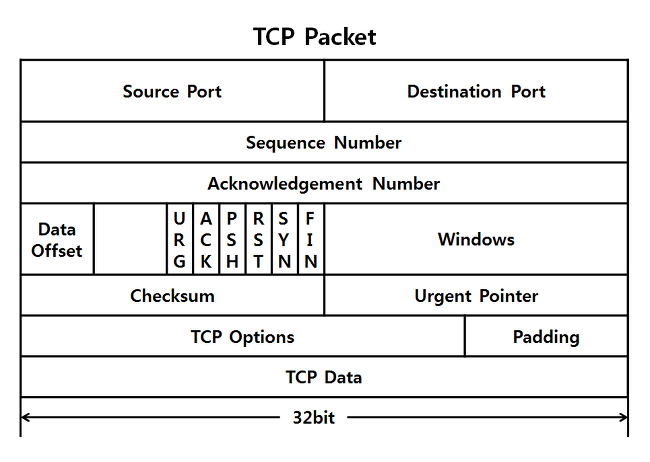
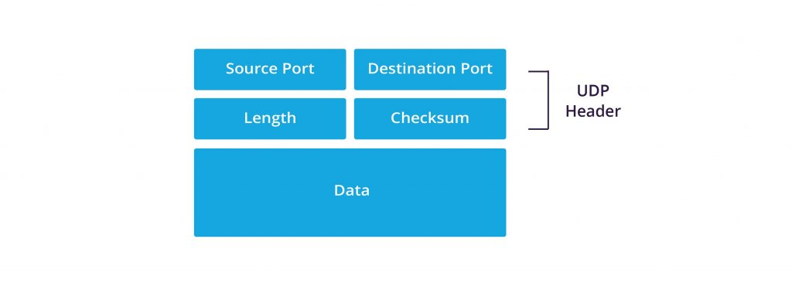
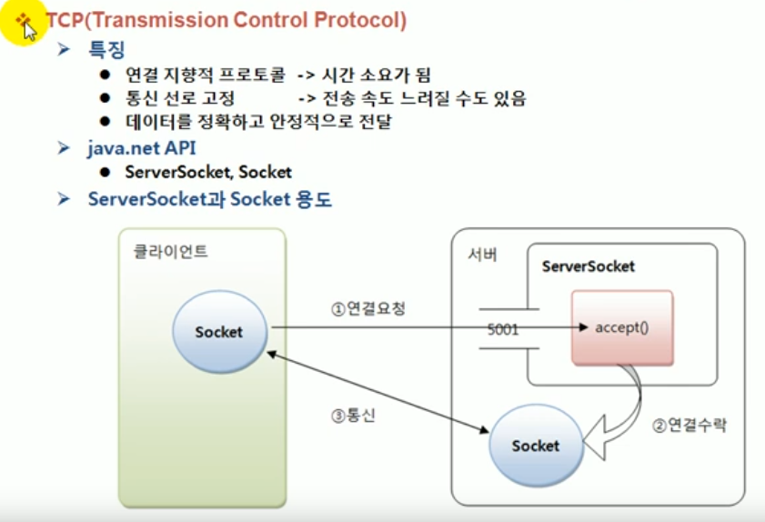
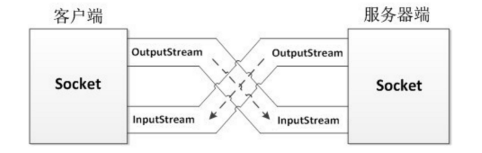
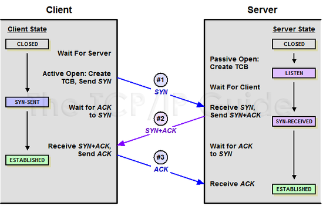
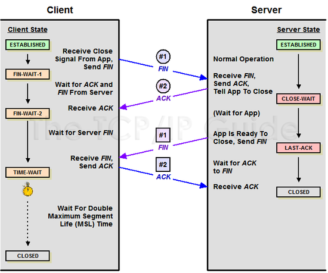

# #16 네트워킹(Networking)

## 네트워킹(Networking)

- 네트워킹이란 두 대 이상의 컴퓨터를 케이블로 연결하여 네트워크를 구성하는 것을 말함
- 네트워킹의 개념은 컴퓨터들을 서로 연결하여 데이터를 손쉽게 주고받거나 같은 주변 기기를 함께 공유하고자 하는 노력에서 시작되었음
- 초기의 네트워크는 몇 대의 컴퓨터로 구성되었으나 현재는 인터넷이라는 거대한 네트워크를 구성하고 있음
- 자바에서 제공하는 java.net 패키지를 사용하면 이러한 네트워크 앱의 데이터 통신 부분을 쉽게 작성할 수 있음

### 클라이언트/서버(client/server)

-  클라이언트/서버는 컴퓨터간의 관계를 역할로 구분하는 개념
   - 서버: 서비스를 제공하는 주체
     - 파일서버, 메일서버 등등
   - 클라이언트: 서비스를 사용하는 주체
     - 웹브라우저 등등
-  네트워크를 구성할 때 전용서버를 두는 것을 서버 기반 모델이라하고 별도의 전용 서버 없이 각 클라이언트가 서버 역할을 동시에 수행하는 것을 P2P모델이라함

| 서버 기반 모델 server-based model  | P2P 모델 peer-to-peer model             |
| ---------------------------------- | --------------------------------------- |
| 안정적인 서비스의 제공이 가능함    | 서버 구축 및 운용 비용을 절감할 수 있음 |
| 공유 데이터의 관리와 보안이 용이함 | 자원의 활용을 극대화할 수 있음          |
| 서버구축비용과 관리 비용이 듦      | 자원의 관리가 어려움                    |
|                                    | 보안이 취약함                           |


### IP주소(IP address)

- IP주소는 컴퓨터를 구별하는데 사용되는 고유한 값으로 인터넷에 연결된 모든 컴퓨터는 IP주소를 가짐
- IP주소는 4byte(32bit)의 정수로 구성되어 있고 xxx.xxx.xxx.xxx 형태로 `.` 을 구분자로 0~255 사이의 정수를 가질 수 있음
- IP주소와 서브넷 마스크를 비트연산자 `&`으로 연산하면 ip 주소에서 네트워크 주소만을 뽑아낼 수 있음
  - 11000000 10101000 00001010 01100100 (192.168.10.100) 
  - 11111111 11111111 11111111 00000000 (255.255.255.0)
  - 11000000 10101000 00001010 00000000 (192.168.10.0) <- 네트워크주소는 24bit, 호스트 주소는 마지막 8bit
  - 호스트 주소의 자리수가 8자리이기 때문에 256(2^8)개의 호스트만 이 네트워크에 포함될 수 있음
  - 호스트주소가 0인것은 네트워크 자신을 나타내고, 255는 브로드캐스트 주소로 사용되기 때문에 실제 사용 개수는 254개

> IPv6
>
> - 인터넷은 32bit의 IPv4 체계를 사용했으나 32bit라는 제한된 주소 공간때문에 인터넷 발전에 문제가 있을것이라고 예상되어 이에 대한 대안으로써 IPv6가 등장함
> - IPv6특징
>   - IP 주소의 확장 : IPv4의 기존 32 비트 주소공간에서 벗어나, IPv6는 128 비트 주소공간을 제공한다.
>   - 호스트 주소 자동 설정 : IPv6 호스트는 IPv6 네트워크에 접속하는 순간 자동적으로 네트워크 주소를 부여받는다. 이는 네트워크 관리자로부터 IP 주소를 부여받아 수동으로 설정해야 했던 IPv4에 비해 중요한 이점이다.
>   - 패킷 크기 확장 : IPv4에서 패킷 크기는 64[킬로](https://ko.wikipedia.org/wiki/킬로)[바이트](https://ko.wikipedia.org/wiki/바이트)로 제한되어 있었다. IPv6의 [정보프로그램](https://ko.wikipedia.org/w/index.php?title=정보프로그램&action=edit&redlink=1) 옵션을 사용하면 특정 호스트 사이에는 임의로 큰 크기의 패킷을 주고받을 수 있도록 제한이 없어지게 된다. 따라서 대역폭이 넓은 네트워크를 더 효율적으로 사용할 수 있다.
>   - 효율적인 라우팅 : IP 패킷의 처리를 신속하게 할 수 있도록 고정크기의 단순한 헤더를 사용하는 동시에, 확장헤더를 통해 네트워크 기능에 대한 확장 및 옵션기능의 확장이 용이한 구조로 정의하였다.
>   - 플로 레이블링(Flow Labeling) : 플로 레이블(flow label) 개념을 도입, 특정 트래픽은 별도의 특별한 처리(실시간 통신 등)를 통해 높은 품질의 서비스를 제공할 수 있도록 한다.
>   - 인증 및 보안 기능 : 패킷 출처 인증과 데이터 무결성 및 비밀 보장 기능을 IP 프로토콜 체계에 반영하였다. IPv6 확장헤더를 통해 적용할 수 있다.
>   - 이동성 : IPv6 호스트는 네트워크의 물리적 위치에 제한받지 않고 같은 주소를 유지하면서도 자유롭게 이동할 수 있다. 이와 같은 모바일 IPv6는 RFC 3775와 RFC 3776에 기술되어 있다. (IPv4에도 모바일 IP가 정의되어 있지만 아직 많이 사용되지 않는다.)
>
> [https://ko.wikipedia.org/wiki/IPv6](https://ko.wikipedia.org/wiki/IPv6)
>
> 주소 부족 문제가 있어서  IPv6가 등장했지만 이미 NAT, CIDR와 같은 프로토콜로 잘 해결되고 있지 않을까? 라는 생각 ..

### InetAddress

- 자바에서는 IP주소를 다루기 위한 클래스로 InetAddress를 제공하며 다음과 같은 메서드가 정의되어 있음

| 메서드                                         | 설명                                                        |
| ---------------------------------------------- | ----------------------------------------------------------- |
| byte[] getAddress()                            | IP주소를 byte배열로 반환                                    |
| static InetAddress[] getAllByName(String host) | 도메인명에 지정된 모든 호스트의 IP주소를 배열에 담아 반환함 |
| static InetAddress getByAddress(byte[] addr)   | byte배열을 통해 ip주소를 얻음                               |
| static InetAddress getByName(String host)      | 도메인명을통해 ip주소를 얻음                                |
| String getCanonicalHostName()                  | FQDN(full qualified domain name)을 반환함                   |
| String getHostAddress()                        | 호스트의 ip 주소를 반환함                                   |
| String getHostName()                           | 호스트의 이름을 반환함                                      |
| static inetAddress getLocalHost()              | 지역 호스트의 ip 주소를 반환함                              |
| boolean isMulticastAddress()                   | ip주소가 멀티캐스트 주소인지 알려줌                         |
| boolean isLoopbackAddress()                    | ip주소가 loopback 주소인지 알려줌                           |


### URL(Uniform Resource Location)

- URL은 인터넷에 존재하는 여러 서버들이 제공하는 자원에 접근할 수 있는 주소를 표현하기 위한 것
- 프로토콜://호스트명:포트번호/경로명/파일명?쿼리스트링#참조의 형태로 이루어져있음
  - 프로토콜: 자원에 접근하기 위해 서버와 통신하는데 사용되는 통신 규약
  - 호스트명: 자원을 제공하는 서버의 이름
  - 포트번호: 통신에 사용되는 서버의 포트 번호
  - 경로명: 접근하려는 자원이 저장된 서버상의 위치
  - 파일명: 접근하려는 자원의 이름
  - 쿼리스트링: URL에서 ?이후의 부분
  - 참조: URL에서 #이후의 부분
- http://www.codechobo.com:80/sample/hello.html?referer=codechobo#index1
- 자바에서는 URL을 다루기 위한 클래스를 제공하고 여러가지 관련 메서드들을 제공함


### URLConnection

- URLConnection은 애플리케이션과 URL간의 통신 연결을 나타내는 클래스의 최상위 추상 클래스임
- URLConnection의 구현체는 HttpURLConnection, JarURLConnection이 있음
- URLConnection을 사용해서 연결하고자하는 자원에 접근하고 읽고 쓰기를 할 수 있음

> JarURLConnection
>
> - Jar파일에 대한 URL연결에 사용함
>
> ```java
>  URL url = new URL("jar:file:/home/duke/duke.jar!/");
>  JarURLConnection jarConnection = (JarURLConnection)url.openConnection();
>  Manifest manifest = jarConnection.getManifest();
> ```
>
> - Jar파일을 읽는것만 가능하고 수정하거나 쓰기위해 OutputStream을 가져올 수 없음
>
> - [https://docs.oracle.com/en/java/javase/11/docs/api/java.base/java/net/JarURLConnection.html](https://docs.oracle.com/en/java/javase/11/docs/api/java.base/java/net/JarURLConnection.html)


## 소켓 프로그래밍

- 소켓 프로그래밍은 소켓을 이용한 통신 프로그래밍을 뜻함
- 소켓이란 프로세스간의 통신에 사용되는 양쪽 끝단을 의미함
- 자바에서는 java.net 패키지를 통해 소켓 프로그래밍을 지원함 

### TCP와 UDP

| 항목        | TCP (Transmission Control Protocol)                          | UDP (User Datagram Protocol)                                 |
| ----------- | ------------------------------------------------------------ | ------------------------------------------------------------ |
| 연결방식    | 연결기반 (connection-oriented) <br />- 연결 후 통신<br />- 1:1 통신 방식 | 비연결기반(connectionless-oriented)<br />- 연결없이 통신<br />-1:1, 1:N, N:M 통신 방식 |
| 특징        | 데이터의 경계를 구분하지 않음(byte-stream)<br />신뢰성있는 데이터 전송<br />- 데이터의 전송 순서가 보장됨<br />- 데이터의 수신여부를 확인함 (데이터가 손실되면 재송신)<br />UDP보다 전송속도가 느림 | 데이터의 경계를 구분함 (datagram)<br />신뢰성 없는 데이터 전송 <br />- 데이터의 전송 순서가 바뀔 수 있음<br />- 데이터의 순서여부를 확인하지 않음 (데이터가 손실되어도 알 수 없음 )<br />TCP보다 전송속도가 빠름 |
| 관련 클래스 | Socket<br />ServerSocket                                     | DatagramSocket<br />DatagramPackaet<br />MulticastSocket     |

- TCP는 데이터를 전송하기 전에 먼저 상대편과 연결을 한 후에 데이터를 전송하며 잘 전송되었는지를 확인하고 전송에 실패했다면 해당 데이터를 재전송하기 때문에 신뢰 있는 데이터의 전송이 요구되는 통신에 적합함
- UDP는 상대편과 연결하지 않고 데이터를 전송하며, 데이터를 전송하지만 데이터가 바르게 수신되었는지 확인하지 않기 때문에 데이터가 전송되었는지 확인할 길이 없음. 또한 데이터를 보낸 순서대로 수신한다는 보장이 없음
- 속도상으로는 TCP보다 UDP가 빠름
- 데이터의 신뢰가 중요할때 TCP를 사용해야함 ex HTTP, SSH, FTP 등등
- 데이터의 속도가 중요할때 UDP를 사용해야함 ex IPTV, VoIP 등등

> - TCP와 UDP패킷 구조
>
> 
>
> - TCP 헤더 상세 정보
> - [https://ko.wikipedia.org/wiki/%EC%A0%84%EC%86%A1_%EC%A0%9C%EC%96%B4_%ED%94%84%EB%A1%9C%ED%86%A0%EC%BD%9C](https://ko.wikipedia.org/wiki/%EC%A0%84%EC%86%A1_%EC%A0%9C%EC%96%B4_%ED%94%84%EB%A1%9C%ED%86%A0%EC%BD%9C)
>
> 


### TCP소켓 프로그래밍

- TCP소켓 프로그래밍은 클라와 서버간의 일대일 통신
- 서버와 클라의 통신 과정
  1. 서버 프로그램에서는 서버 소켓을 사용해서 서버 컴퓨터의 특정 포트에서 클라이언트의 연결요청을 처리할 준비를 함
  2. 클라 프로그램은 접속할 서버의 ip주소와 포트 정보를 가지고 소켓을 생성해서 서버에 연결을 요청함
  3. 서버 소켓은 클라의 연결 요청을 받으면 서버에 새로운 소켓을 생성해서 클라의 소켓과 연결되도록 함
  4. 클라의 소켓과 새로 생성된 서버의 소켓은 서버소켓과 관계없이 일대일 통신을 함



- 서버소켓은 포트와 결합되어 포트를 통해 원격 사용자의 연결요청을 기다리다가 연경요청이 올 때마다 새로운 소켓을 생성하여 상대편 소켓과 통신할 수 있도록 연결함
- 실제적인 데이터 통신은 서버소켓과 관계 없이 소켓과 소켓간에 이루어짐
- 여러 개의 소켓이 하나의 포트를 공유해서 사용할 수 있지만 서버소켓은 포트를 독점함
- 포트는 0~65535개의 범위에 속하는 값이고 1023번 이하의 번호는 well known port 로 FTP나 Telnet 등에서 사용중이기 때문에 사용하지 않는 범위 내에서 사용해야함
- 소켓들이 데이터를 주고받는 연결 통로는 바로 입출력 스트림
- 소켓은 입력스트림, 출력스트림을 갖고 있고 이 스트림들은 연결된 상대편 소켓의 스트림과 교차 연결됨



- 자바에서는 TCP를 이용한 소켓프로그래밍을 위해 `Socket`과 `ServerSocket`클래스를 제공함
  - `Socket`
    - 프로세스간의 통신을 담당하고 InputStream, OutputStream을 갖고 있음
    - 이 두 스트림을 통해 프로세스간의 통신이 이루어짐
  - `ServerSocket`
    - 포트와 연결되어 외부의 연결요청을 기다리다 연결요청이 들어오면 Socket을 생성해서 소켓과 소켓간의 통신이 이루어지도록 함. 한 포트에 하나의 ServerSocket을 연결할 수 있음 (프로토콜이 다르면 같은 포트를 공유할 수 있음)

> - ServerSocket 내부 구현
>
> jdk15 기준으로 ServerSocket에서 사용하는 구현체는 NioSocketImpl을 사용함 아래는 NioSocketImpl 설명 ...
>
> NIO based SocketImpl. This implementation attempts to be compatible with legacy PlainSocketImpl, including behavior and exceptions that are not specified by SocketImpl. The underlying socket used by this SocketImpl is initially configured blocking. If the connect method is used to establish a connection with a timeout then the socket is configured non-blocking for the connect attempt, and then restored to blocking mode when the connection is established. If the accept or read methods are used with a timeout then the socket is configured non-blocking and is never restored. When in non-blocking mode, operations that don't complete immediately will poll the socket and preserve the semantics of blocking operations.
>
> NIO 기반 SocketImp. 이 구현은 SocketImp에서 지정하지 않은 동작 및 예외를 포함하여 레거시 PleanSocketImp와 호환되도록 시도합니다. 이 SocketImp에서 사용하는 기본 소켓은 처음에 blocking으로 구성됩니다. 연결 방법을 사용하여 시간 초과로 연결을 설정할 경우 연결 시도에 대해 non-blocking으로 구성된 소켓이 연결이 설정되면 blocking 모드로 복원됩니다. 허용 또는 읽기 메서드가 시간 초과와 함께 사용되는 경우 소켓이 non-blocking으로 구성되고 복원되지 않습니다. non-blocking 모드에서 즉시 완료되지 않은 작업은 소켓을 폴링하고 blocking 작업의 의미론을 보존합니다.
>
> [http://gunsdevlog.blogspot.com/2020/09/java-project-loom-reactive-streams.html](http://gunsdevlog.blogspot.com/2020/09/java-project-loom-reactive-streams.html)

- 서버에 접근하는 클라의 수가 많다면 스레드를 사용해서 클라의 요청을 병렬적으로 처리하는 것이 좋음
- 서버 프로그램

```java
import java.io.DataOutputStream;
import java.io.IOException;
import java.io.OutputStream;
import java.net.ServerSocket;
import java.net.Socket;

public class Main {

    public static void main(String[] args) throws IOException {

        ServerSocket serverSocket = new ServerSocket(7777); //연결 요청을 기다리는 SocketServer

        Socket socket = serverSocket.accept(); // 연결이 수립되면 socket객체를 가져옴 실제 연결에는 JNI사용

        OutputStream os = socket.getOutputStream();
        DataOutputStream dos = new DataOutputStream(os);

      	//outputStream을 사용해 client에게 데이터전송. 클라이언트는 InputStream을 통해 데이터를 받음
        dos.writeUTF("bla bla ... ");

        dos.close();
        socket.close();
    }
}
```

- 클라이언트 프로그램

```java
import java.io.DataInputStream;
import java.io.IOException;
import java.io.InputStream;
import java.net.Socket;

public class Client {

    public static void main(String[] args) throws IOException {
        Socket socket = new Socket("127.0.0.1", 7777); //서버 ip와 port를 사용해서 Socket객체를 가져옴

        InputStream is = socket.getInputStream();
        DataInputStream dis = new DataInputStream(is);

      	//InputStream을 통해 데이터를 받음
        System.out.println(dis.readUTF());

        dis.close();
        socket.close();
    }
}
```


> - TCP 3way handshake
>
> TCP는 연결지향형이기 때문에 모든 연결에 앞서 3way handshake라는 일련의 과정을 수행함
>
> 3way handshake는 양 쪽 모두 데이터를 전송할 준비가 되었다는 것을 보장하고 실제로 데이터 전달을 시작하기 전에 확인 작업을 함
>
> 
>
> 1. Client와 Server 둘다 Closed 상태에서 시작함
> 2. Server에서 Client의 요청을 받을 수 있는 상태가 되어야함 이때 서버는 `LISTEN` 상태
> 3. Client는 Server에게 접속 요청을 위한 `SYN` 패킷을 보냄 이때 의미없는 난수 `SYN` 넘버를 보냄 이때 Client는 `SYN_SENT` 상태
> 4. Server는 Client에게 `SYN` 패킷을 받고 Client가 보낸 `SYN` 넘버에 1을 더한 값과 Server에서도 의미없는 난수 `ACK` 넘버를 보내줌 이제 서버는 `SYN_RECEIVED` 상태
> 5. Client는 Server에게 `SYN+ACK`  패킷을 받고 Server가 보낸 `ACK` 넘버에 1을 더한 값을 보내줌
> 6. Client와 Server모두 연결이 수립된 상태 `ESTABLISHED` 가 됨
>
> 의미없는 난수는 서버가 요청을 제대로 받았는지에 대한 식별값으로 사용됨 만약 10을 보냈는데 11이 오지 않았다면 신뢰할 수 있는 클라이언트가 아님
>
> - SYN Flooding 공격
>
> 악의적인 Client가 처음 `SYN` 패킷을 보내고 서버는 `SYN+ACK` 패킷을 보냈지만 마지막 `ACK` 패킷을 보내지 않는다면 서버는  `SYN_RECEIVED` 상태로 대기함. 이런 요청이 많아질수록 서버의 리소스가 늘어나고 메모리가 바닥나서 정상적인 서비스가 불가능상태가 됨
>
> **SYN Flooding 공격을 막는 방법**
>
> - 백로그 큐 늘리기
> - Anti-DDoS 기능 사용하기
> - SYN Cookie 사용하기
> - SYN Proxy 사용하기
>
> [https://blog.naver.com/agerio100/221948546623](https://blog.naver.com/agerio100/221948546623)

> - TCP 4way handshake
>
> 연결을 해제할때도 TCP는 일련의 과정을 수행하는데 이것을 4way handshake라고 함
>
> 3way handshake에서 연결 요청은 Client만 가능했지만 4way handshake에서는 Client, Server 모두 연결 해제 요청을 할 수 있음. 
>
> 
>
> 
>
> 1. Client와 Server가 연결된 상태에서 시작함 (Client에서 연결 해제한다고 가정)
> 2. Client는 `close()`를 실행하고 Server에게 연결 해제를 위한 `FIN` 패킷을 보냄 이때 Client는 `FIN_WAIT1` 상태
> 3. Server는 Client의  `FIN` 패킷을 받고 응답 `ACK` 패킷을 보냄 이때 서버는 `CLOSE_WAIT` 상태
> 4. Client는 Server의 `ACK` 을 받고 `FIN_WAIT2` 상태로 변경
> 5. Server에서 Client에게 전송할 데이터가 없다고 판단하면 `close()` 를 실행하고 Client에게 연결 해제를 위한  `FIN` 패킷을 보냄 이때 Server는 `LAST_ACK` 상태
> 6. Client는 Server의 `FIN` 패킷을 받고 응답 `ACK` 패킷을 보냄 그리고 `TIME_WAIT` 상태로 들어가고 실질적인 종료 과정에 들어가게 됨 (MSL*2 시간만큼 대기)
> 7. Server는 Client의 `ACK` 패킷을 받고 `CLOSED` 상태가 됨
>
> CLOSE_WAIT과 TIME_WAIT에 대한 자세한 이야기
>
> [https://tech.kakao.com/2016/04/21/closewait-timewait/](https://tech.kakao.com/2016/04/21/closewait-timewait/)


### UDP소켓 프로그래밍

- UDP소켓 프로그래밍에서는 DatagramSocket과 DatagramPacket을 사용함
- UDP는 비연결지향형이기때문에 TCP에서 사용하던 ServerSocket에서처럼 연결하는 과정이 없음
- 서버 프로그램

```java
import java.io.IOException;
import java.net.DatagramPacket;
import java.net.DatagramSocket;
import java.net.InetAddress;

public class Main {

    public static void main(String[] args) throws IOException {

        DatagramSocket socket = new DatagramSocket(7777);
        DatagramPacket inPacket, outPacket;

        byte[] inMsg = new byte[10];

        while (true) {
            inPacket = new DatagramPacket(inMsg, inMsg.length);
            socket.receive(inPacket);

            InetAddress address = inPacket.getAddress();
            int port = inPacket.getPort();

            String str = "received";
            outPacket = new DatagramPacket(str.getBytes(), str.length(), address, port);

            socket.send(outPacket);
        }
    }
}
```

- 클라이언트 프로그램

```java
import java.io.IOException;
import java.net.DatagramPacket;
import java.net.DatagramSocket;
import java.net.InetAddress;

public class Client {

    public static void main(String[] args) throws IOException {

        DatagramSocket socket = new DatagramSocket();
        InetAddress address = InetAddress.getByName("127.0.0.1");

        byte[] msg = new byte[50];
        DatagramPacket outPacket = new DatagramPacket(msg, 1, address, 7777);
        DatagramPacket inPacket = new DatagramPacket(msg, msg.length);

        socket.send(outPacket);
        socket.receive(inPacket);

        System.out.println(new String(inPacket.getData()));
    }
}

```


